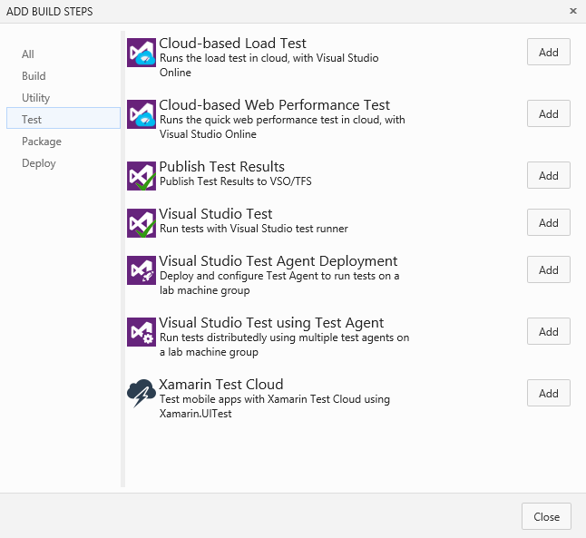
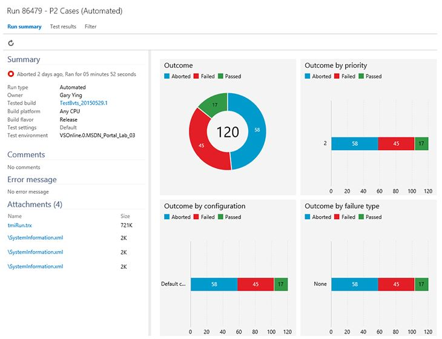

#Swim lanes, #mention, Build test steps – Jun 3

##Kanban swim lanes

Today’s update brings the ability to create swim lanes on your Kanban boards. A swim lane is a horizontal lane used to categorize work; the most common use is the creation of an “expedite lane” for emergency work that can skip queues and preempt other work. Our boards support creating as many lanes as the team needs. Just collapse them out of the way when not in use. To add a swim lane, click the gear in the top right hand corner of your board. Enjoy!

##&#35;Mention work items

Have you ever wished that you could quickly mention or provide a link to a work item related to the comments you are leaving for a pull request? This week’s deployment brings a new feature we call #mentions, making it very easy to mention a work item when leaving code comments. Simply type "#" next time you are leaving a code comment to trigger the suggestions box. You can narrow down the list of suggested work items by entering keywords or the exact work item ID.

When the mention is saved, a link to the work item form is created. This lets other users get better context for the work item you are mentioning.

Mentions are supported in changesets, shelvesets, git commit discussion comments, and pull request discussions. We’ve got a lot more planned along these lines, so stay tuned.

##Automated testing in Build vNext

In our [last deployment](may-15-team-services.md) we announced the preview of the next version of our Build system. With this deployment, we’ve turned on a bunch of related testing features. The new capabilities allow you to configure two test types: tests that run locally on the build machine (typically used for unit tests), and tests that run on remote machines in a distributed fashion. You can read more about all of this in a recent blog post: [https://aka.ms/testingblog](https://aka.ms/testingblog).

We’ve also released a new hub dedicated to browsing and analyzing test runs across both XAML Builds and Build-Deploy-Test workflows. This new page supports querying on test runs and test results, assigning owners to test failures, tracking their analysis, and filing bugs. A basic set of charts is generated for each of the test runs, and you can download test attachments (examples: trx files, code coverage files) to drill down further.

##Team settings API

And finally, our API for settings such as team subscriptions to area paths and iterations, bug behavior, and capacity, is now in public preview. Documentation can be found at [/azure/devops/integrate/](/azure/devops/integrate/).

If you have any questions, feel free to reach out on Twitter ([@aaronbjork](https://twitter.com/aaronbjork)). If you have ideas on what you’d like to see us do next, head over to UserVoice to add your idea or vote for an existing one.

Thanks,

Aaron Bjork

