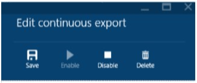
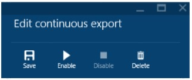
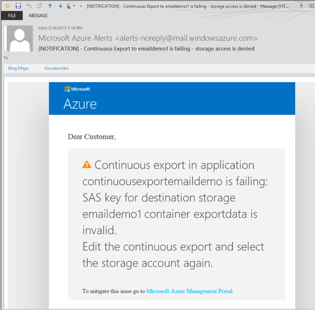

# Application Insights - save search page, pause export and alerts on export fail - Mar 27

We release updates to [Visual Studio Application Insights](/azure/azure-monitor/app/app-insights-overview) every week. You'll find these updates already in place today.

## Save search pages

After you've carefully configured a [Diagnostic Search](/azure/azure-monitor/app/diagnostic-search) page with some filters, a search string and time range, you don't want to have to go through all that every time you re-open the Search blade.

Now you can save it as a named favorite and re-open it later. And if you like, you can share it with your team.
To save the search page you made, click **Favorites** and give it a name:

To get back to the same search, click Favorites **in the Application Insights resource blade:**

If you saved the search with an absolute time range, you see the same results every time, for as long as the telemetry is stored. If you saved it with a relative time range, you always get results for that range relative to now – for example, for the last 24h.

## Stop and Start Continuous Export

You can temporarily disable Continuous Export. While export is disabled, no telemetry is saved to storage.

When you enable it again, export starts from the next telemetry that arrives. Telemetry that arrived while it was disabled is not exported.

## Continuous Export: email notification when export fails

If [Continuous Export](/azure/azure-monitor/app/export-telemetry) can’t send events to the chosen destination, Application Insights sends email notification to Subscription admins, with suggestions for fixing the problem.

## Feedback please!

That’s a wrap for Sprint 80. Next update in three weeks. If you want to let us know how we are doing, please submit bugs questions and issues to [Forums](https://stackoverflow.com/questions/tagged/ms-application-insights), bugs to [Connect](https://connect.microsoft.com/VisualStudio/Feedback/LoadSubmitFeedbackForm?FormID=6076) (select Application Insights), and suggestions to [Azure DevOps Developer Community](https://developercommunity.visualstudio.com/spaces/21/index.html).

Thanks,

David Lubash