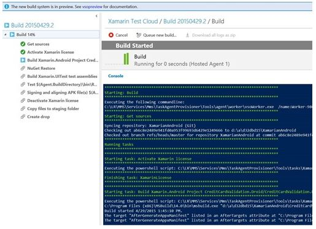

#Build preview, updated backlog navigation, branch policies, and more... – May 15

You might think that this would be a light deployment for us, given all the [announcements](http://blogs.msdn.com/b/bharry/archive/2015/04/29/visual-studio-and-team-foundation-server-at-build-2015.aspx) made over the past two weeks at [BUILD](http://buildwindows.com/) and [Ignite](http://ignite.microsoft.com/)… but you’d be wrong. :-) Let’s jump right in…

##Build Preview now publicly available

The next version of our build system is now publicly available on Visual Studio Online. In addition to all of the [new capabilities](http://blogs.msdn.com/b/visualstudioalm/archive/2015/02/12/build-futures.aspx), you also have access to the Hosted queue, enabling you to run builds on Virtual Machines running in Azure. For our initial public preview, any builds you run in the hosted pool will not count against your 60 free build minutes or subscription.

Included in the preview is support for building projects hosted in public or private GitHub repositories. You can now set up a continuous integration build in Visual Studio Online that kicks off when code is pushed to your GitHub repository. The build results page provides a link to the associated GitHub commits and the status of these commits updates based on the result of the build. You can also show the status of the build on your GitHub repository’s readme file or on your own web site. To enable, navigate to the **General** tab of your build definition and check the **Badge enabled** box. You can then embed the provided image URL onto a markdown or HTML page so users can see the latest status of the repository.

To learn more, please visit [https://msdn.microsoft.com/Library/vs/alm/Build/overview](https://msdn.microsoft.com/Library/vs/alm/Build/overview).

##Backlog navigation updates

This week’s deployment brings a major overhaul to the navigation of backlogs. There’s a lot here, so let me highlight a few things you’ll want to note.

From every backlog, you can now drill down into the levels below, all the way down to Tasks. In addition, from every backlog, you can now toggle on/off the levels above your backlog using the **Parents** filter. Items not owned by the team, but pulled in based on relationship, display with a hollowed-out color bar. This lets you at a glance differentiate items your team owns from those owned by other teams.

Finally, you can reorder and reparent in every view! Just drag and drop in any of these views to reorder items and change relationships.

##Opt-in to portfolio backlog levels

Related to the navigation updates, you can now turn off backlog levels that your team isn’t using. Prior to this update, all backlog levels were forced on every team. Each backlog level is now “opt-in” allowing you to configure the levels appropriate for your team. Click the gear at the top of the page, select the team you’re configuring, and then choose the backlog levels you need.

##SAFe support and process updates

We updated our three out-of-the-box process templates to include new fields and a new work item type, Epic, to better support the Scaled Agile Framework (SAFe).

The Epic work item is also bound to a new optional backlog level. Using the steps above, you can turn/off this new level as desired. We also made a few process updates to address some usability issues. You can read more about the process changes in a [post](http://blogs.msdn.com/b/visualstudioalm/archive/2015/05/14/scaled-agile-framework-visual-studio-online-process-template-updates.aspx) written by Gregg Boer.

##Kanban and Taskboard improvements

The Kanban board gets a bit more love this sprint with three new features.

- Custom fields added to your cards are now directly editable from the board.
- The first and last columns on your board are now collapsible.
- The first column now supports paging when filtering across long backlogs

The Taskboard gets a bunch of love as well, including things we added to the Kanban board in previous sprints:

- Adding custom fields to cards
- Custom fields added to your cards are now directly editable from the board (just like above)
- Adding tags to cards

We also tweaked the card layout a bit to optimize for smaller titles, ensuring that you can get the maximum numbers of cards on your board.

##Branch policies

To help teams using Git improve the quality of code going into their repo, we’ve added a new capability to set policies on branches. These new policies enable teams to configure requirements for their development branches that are enforced by the server when pushing or merging pull requests. Build breaks can be prevented by using the build policy to require that all changes entering a branch pass a configured build.

Code review policies can be used to set a minimum number of reviewers for pull requests, or even require specific users to review changes made to specific portions of your codebase.

##OAuth support for accessing Git repos on VSO

Third-party tools and services can now access Git repositories hosted in Visual Studio Online via the "vso.code" or "vso.code_write" OAuth scopes. This enables source code access from standard Git tools and enables clone, fetch, and push operations. Previously, enabling access was available only through our REST API. See [Authorize access with OAuth 2.0](/azure/devops/integrate/) for more details.

##New filtering options for Git service hook events

You can now filter Git Push and Git Pull Request service hook events by group membership. For example, you can now trigger a notification to HipChat or Slack only when someone on your team creates a pull request or pushes a code change. For push events, you can choose a group to which the person that pushed must belong. For pull requests, you can choose a group to which the pull request originator belongs and/or choose a group that must be included in the set of reviewers.

To learn more about all the services, see [Integrate with service hooks](https://visualstudio.microsoft.com/get-started/integrate/integrating-with-service-hooks-vs).

##Power BI & Visual Studio Online

Finally, at the [BUILD](http://buildwindows.com/) conference two weeks ago, we announced our new Power BI integration for VS Online. If you have not had a chance to see it yet, read [Jeff Levinson’s post](http://blogs.msdn.com/b/visualstudioalm/archive/2015/05/04/gain-understanding-and-insights-into-projects-in-visual-studio-online-with-power-bi.aspx) on how to get started.

That’s a wrap for sprint 82. If you have questions, feel free to reach out on Twitter ([@aaronbjork](https://twitter.com/aaronbjork)). If you have ideas on what you’d like to see us prioritize, head over to [UserVoice](http://visualstudio.uservoice.com/forums/330519-vso) to add your idea or vote for an existing one.

Thanks,

Aaron Bjork