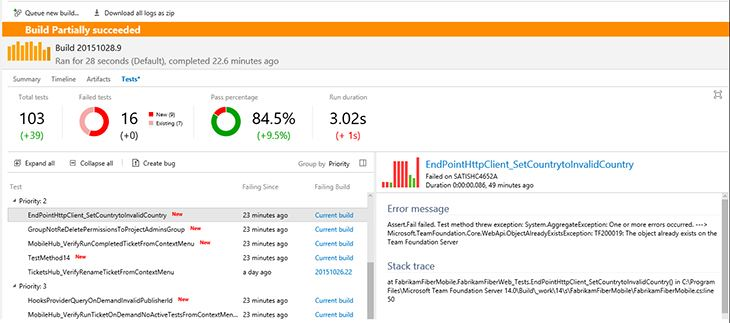

#Extensions, Previews, and more – Nov 18

Today is our [Connect(); developer event](http://connect2015.visualstudio.com/) and we have a ton of news for VS Online…

##Visual Studio Team Services

Let’s start the news with our new name! Visual Studio Online has been renamed to Visual Studio Team Services. Only the official name has changed; everything else, like your url—<account>.visualstudio.com—remains the same. We’ve seen a ton of confusion with people thinking VS Online is a browser-based IDE. Of course, it is not. The name change is part of our effort to dispel some of that confusion. It will undoubtedly take a while for all occurrences of Visual Studio Online to be changed, but expect it will gradually happen.

##Extensions and the new Marketplace

Today we are introducing a new extensions model for VSTS and a marketplace to find and install them. Extensions enable first-class, integrated experiences that extend and enhance the Team Services web experience, either by adding new capabilities or integrating with existing services. Extensions can contribute—hubs, custom controls, context menus, dashboard widgets, build and release tasks, and more.

Users can discover extensions via the new Visual Studio Marketplace. The Marketplace provides a single place for developers to find extensions for Visual Studio, Visual Studio Team Services, and Visual Studio Code. The marketplace will support both community and commercial extensions. Start browsing the Marketplace today: [https://marketplace.visualstudio.com](https://marketplace.visualstudio.com/azuredevops).

There are lots of Team Services extensions available in the marketplace today, but there’s room for a whole lot more. Developing extensions is straightforward and anyone can do it. To get started, visit [https://aka.ms/vsoextensions](https://aka.ms/vsoextensions).

##Release Management public preview

Today, we are announcing the public preview of Release Management service in Team Services. Using Release Management, you can automate the delivery of your software all the way to production. You can define multiple environments to stage your releases through to manage testing, sign-off and exposure. It is an essential element of DevOps that helps your team continuously deliver software to your customers at a faster pace and with lower risk.

To use Release Management, create release definitions, in which you specify the automation steps that should be run in each environment. These automation steps deploy your software and run tests against it. You can group multiple environments in each definition to model your software lifecycle. You can then set up the deployment in each environment to be automatically triggered upon completion of a build, or on successful deployment to a previous environment.

This Release Management update has a number of improvements over our previous version:

- Manage releases from the Team Services Web UI rather than installing a desktop app.
- Use the same agents, task model, and extensibility model as the new Build system, enabling seamless migration from continuous delivery to staged release practices.
- It has fewer concepts and is easier to get started.

For more information, and to get started, see the full documentation at [https://aka.ms/rmpreview](https://aka.ms/rmpreview).

##Package Management public preview

Today, we are announcing the public preview of a [new package management service](http://blogs.msdn.com/b/visualstudioalm/archive/2015/08/27/announcing-package-management-for-vso-tfs.aspx) on Visual Studio Team Services. This initial preview supports NuGet, but we’ll be adding support additional packaging systems over time.

This new package management service allows you to create and host Nuget feeds for your organization with no effort. You can use the feeds to publish/manage OSS packages you use, or to publish private packages that you want to share within your organization. The Team Services build-and-release system has tasks that will both publish and restore any Nuget packages you host.

##Code Search public preview

Today, we are announcing the public preview of Code Search in Visual Studio Team Services. With this release you can search for code across all of your TFVC and Git projects in your VSTS account. Not only can you perform full text matching, but for C#, C and C++, you can search for specific contexts, like class definitions, comments, properties, etc. You can enable this preview feature on your VSTS account by installing the Code Search extension. [Learn more about Code Search extension](https://marketplace.visualstudio.com/items/ms.vss-code-search).

##Test results in Build

Testing is an important part of a DevOps process. Today we showed a new set of test experiences integrated into the CI/CD experience in Team Services that allows you to get actionable information about your test results. You can try out this new experience by opening the Tests tab on the Build summary page. The first thing you’ll notice is an aggregate summary of test results across all test runs in the build. Tests that were passing in the previous build, but have failed in the current build are flagged as “New failures,” helping you identify possible regressions. For tests that are continuing to fail, you can see how stale the failures are and navigate to the build in which the tests first failed. We have an improved experience to browse failed tests—you can group by different pivots like container, priority, and more. To help you debug a failed test, we show you the error message, stack trace, attachments, and bugs associated with the test in the details pane. Finally, you can find out if a test is flaky by looking at the trend of last ten outcomes of the test. We are releasing this experience as a preview feature on Visual Studio Team Services, and plan to add new features like trend charts, historical results, and more in the upcoming months. You can read more about this experience on the [Visual Studio devops blog](http://blogs.msdn.com/b/visualstudioalm/archive/2015/11/13/test-results-in-build.aspx).

##Exploratory Testing extension

Since 2010, we’ve had a very nice exploratory testing tool that enables you to do manual exploratory testing, capture and mark up screen shots, collect diagnostic information, file bugs, etc. Today we are announcing the preview of a new browser-based exploratory testing extension. You can now perform exploratory testing of your web applications at any time, right from your Chrome browser, on any platform (Linux, macOS, or Windows)—no need for predefined test cases or test steps. Support for other browsers, like Edge, Firefox, etc., is coming soon.

Learn more about the Exploratory Testing extension [here](https://marketplace.visualstudio.com/items/ms.vss-exploratorytesting-web) or this [blog](http://blogs.msdn.com/b/visualstudioalm/archive/2015/11/19/announcing-easy-to-use-web-based-exploratory-test-for-visual-studio-team-services.aspx).

##Test Manager extension

We’re changing the way you purchase test case management capabilities with Visual Studio Team Services. Until, now, the way you purchased them (assuming you didn’t have a qualifying MSDN subscription) was to buy an Advanced user license for VS Online. Now, with the introduction of the marketplace and Team Services Extensions, we’re eliminating the Advanced License and providing those same capabilities in the Test Manager extension. So now VS Team Services customers, rather than buying an Advanced user license, buy a user license (formerly known as a “Basic user”) and the Test Manager extension. Other than the way it is packaged/named, there’s no change in price or capability. Existing Advanced Users will be seamlessly transitioned to the new model. Learn more about the [Test Manager extension](https://marketplace.visualstudio.com/items/ms.vss-testmanager-web).

Thanks,

Brian Harry

