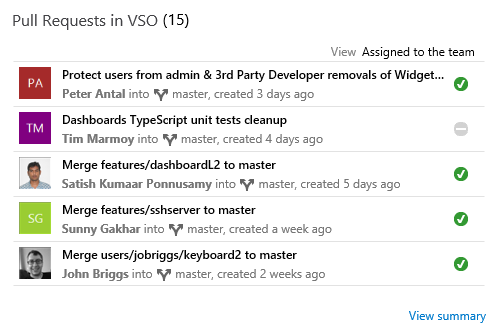
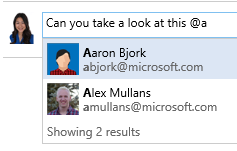

#Git and TFVC together, Package Management build tasks, and more – Nov 24

##Git and TFVC in the same team project
 
Big news! In this sprint, we’ve added the ability to add Git repositories to a team project that was created with TFVC or vice versa. This makes it easier for you to migrate some or all of your code to Git while keeping all the important data in your team project, such as build definitions and work items.
 

##Package Management build tasks

At [Connect()](https://channel9.msdn.com/Events/Visual-Studio/Connect-event-2015/) last week, we launched the new [Package Management](http://blogs.msdn.com/b/visualstudioalm/archive/2015/08/27/announcing-package-management-for-vso-tfs.aspx) preview for VSTS that enables you to share, host, secure, and release binary components across teams. You can get the preview from the [Visual Studio Marketplace](https://marketplace.visualstudio.com/items?itemName=ms.feed).

Package management is an important part of your continuous delivery workflow, and we’ve made it even easier to work with your Team Builds and releases. The NuGet Installer and NuGet Publisher build tasks have been updated to work seamlessly with the new Team Services feeds. You can now publish to any authenticated NuGet feed or package source using a service connection, and you’ll see an option to use an internal feed.

##Implement a task once for multiple platforms

Many build and release tasks are simple wrappers around command line tools that run across multiple platforms. You now have the option to implement a task in JavaScript using the NodeHandler, and it can run on the Linux, macOS, and Windows agent.

##Pull Request Widget for Dashboards

Last sprint, we launched the new Dashboards feature that replaces your existing team homepage. We continue to expand the widget catalog and are excited to announce the new pull request widget. With the new widget, you can see pull requests assigned to the team, assigned to you, or created by you in a specified repository. The widget also allows users to navigate quickly to an individual pull request or see the summary of pull requests in the repository.

##@mention and #ID in code

With this release, you now have the ability to send a direct notification to anyone on your team by using the ‘@’ symbol to mention people. The @mention feature works in pull request discussions in commit comments, changeset comments, and shelveset comments, and we’ll be bringing to it more places across the entire product. The person you @mention will receive an email alert with your comment and a link to the commit, changeset, or shelveset.

Also, you can now mention work items by using the ‘#’ symbol in pull request discussions in commit comments, changeset comments, and shelveset comments. You’ll see an auto-complete list of your most recently used work items, so it’s easy to find what you need. Mentioned work items are clickable and open a new tab to the work item experience.

##Reordering cards on boards

With this sprint, you can now specify how cards will be reordered on boards to optimize for how your team works. You can choose between two card reordering behaviors: freely reorder on the board, or strictly follow the backlog order when changing columns.

##Global shortcut keys

For all those keyboard users out there, you’ll love this announcement! Today, we are launching the first set of keyboard shortcuts for the Code and Work hubs to enable easy navigation without ever taking your hands off your keyboard.

Please reach out on Twitter ([@karenkayliu](https://twitter.com/karenkayliu)) if you have thoughts, comments, or questions about anything described here. And please help us prioritize by heading over to [UserVoice](http://visualstudio.uservoice.com/forums/330519-vso) to add your idea or vote for an existing one.

Thanks,

Karen Ng

