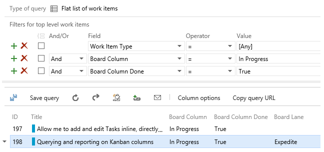

# Kanban Updates, new Branch Policies, and more... – Sep 18

## Inline tasks on the Kanban board

This sprint we’ve enabled a new feature that lets you break down stories on your Kanban board, without having to leave the board. Tasks can now be added, edited, and marked as done directly from the parent card on your board. A summary of the roll-up status indicates how many Tasks have been completed and how many remain.

## Query and display of Kanban fields

Data from your Kanban board, including the board column, column done indicator, and board swim lane, are all now available, enabling you to create queries, charts, and styling rules based on them. These fields show up in all column option pickers, and can be exported as read-only fields in Excel. You’ll see three new fields in work item experiences:

1. Board Column: current Kanban board column the work item is in.
2. Board Column Done: False (Doing) or True (Done) value depending on whether the work item is in the Doing or Done split column on the Kanban board.
3. Board Lane: current Kanban board swim lane.

I’m happy to report that [UserVoice item #121579](http://visualstudio.uservoice.com/forums/121579-visual-studio/suggestions/6590592-enable-kanban-column-field-to-be-used-in-work-item) has been marked as completed.

## Multi-select items on the backlog

[Last month](aug-07-team-services.md) we enabled multi-select on the product backlog… we’re back this sprint with some additional capabilities including:

- Drag-and-drop reordering and re-parenting
- Dragging items to an iteration
- Dragging items to the mapping pane
- Support for "move to top" and "move to position" on the context menu

## Branch policy to require linked work items

We now have a branch policy to require associated work items for any pull request. Like the code reviewer and build policies, any code submitted to the branch must be submitted via pull request. When a pull request is created, the associated commits will be inspected for work item links, and if there is at least one link, the policy will be fulfilled. Also, you can now link work items to pull requests directly, and if the pull request is directly linked to at least one work item, the policy will be fulfilled. If no work items are linked to the pull request or the associated commits, the policy will fail.

## Export test outcomes

The Export Test Plan feature in Test Hub lets you email or print a test plan in a review-friendly format. Until now, you could export test authoring–centric information such as test plan, test suite hierarchy, test configurations and test cases. We are now enabling support for exporting test execution information, allowing you to share detailed status of test execution progress with stakeholders.

In the export selection dialog, you can choose to export the latest test outcome, which will export the latest test result for all tests of a test case, including fields like the time when the test was run, the build that was tested, the configuration that was tested, the tester who was assigned the test and the identity who actually ran the test. 

## Work item trend and rollup reporting in Power BI

Earlier this month we blogged about improvements in the Visual Studio Online Power BI Connector to support trend and rollup reporting. Have a look at [Jeff’s blog post](http://blogs.msdn.com/b/visualstudioalm/archive/2015/09/04/general-availability-of-work-item-trend-and-rollup-reporting-in-power-bi.aspx) for more details.

## Support for publishing xUnit results

And finally, we’ve added the ability to publish xUnit results natively through the **Publish Test Results** task.

That’s it for sprint 88. Please reach out on [Twitter](https://twitter.com/AzureDevOps). If you have ideas on things you’d like to see us prioritize, head over to [UserVoice](http://visualstudio.uservoice.com/forums/330519-vso) to add your idea or vote for an existing one.

Thanks,

Aaron Bjork

