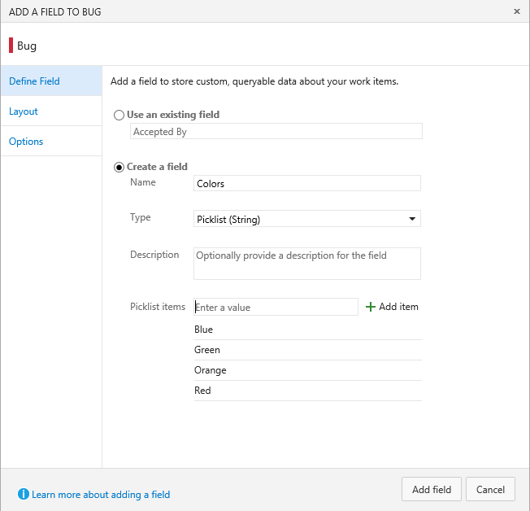
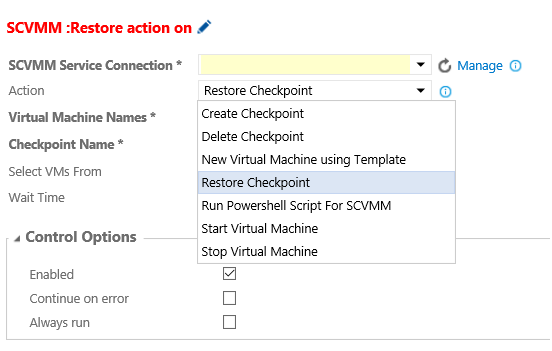

#Work item follow, move & change type - April 13

Let’s start by walking through some of the improvements we’ve made in the Work hub…

##Follow a work item

You can now setup an alert for tracking changes to a single work item just by clicking on the new "Follow" button in the form. When you follow a work item, you'll be notified any time the work item changes – including field updates, links, attachments, and comments. Here is a work item that I’m following closely and * **almost*** made it into these release notes.

This is the first feature in a set of personal notifications improvements we are continuing to update. Stay tuned for more updates here.

For details, see [Follow a work item](https://msdn.microsoft.com/Library/vs/alm/work/track/follow-work-items).

##Change work item type

You can now easily change the type of a work item, or multiple work items. Simply select your preferred type, add a comment, and hit change. The form will update as a result of the selected type and you will have a chance to review before saving to commit the change.

Change type is also an option during a work item move if the type you are moving does not exist in the destination team project.

For details see [Move, change, and delete work items](https://msdn.microsoft.com/Library/vs/alm/work/backlogs/remove-delete-work-items) or [Bulk modify work items](https://msdn.microsoft.com/Library/vs/alm/work/backlogs/bulk-modify-work-items).

##Work Item move (single or bulk)

Users may now move a work item(s) between team projects. The work item ID remains the same and all of the work item's revisions are moved. Users may also change type during a move and add a comment to be included as part of the work item's discussion section.

##Kanban board live updates 

Your Kanban board is now Live

Have you been hitting F5 to figure out what's going on throughout the day with your Kanban board? Try the icon below.

What is Live Updates?

When anyone in your team creates, updates, or deletes a work item on the board, you will receive live updates on your board immediately. Also, if the administrator makes board or team level updates such as adding a new column or enabling bugs on backlog, you will be notified to refresh the board to update your board layout.

All you need to do now is, enable the tower icon on your Kanban board and start collaborating with your team.

##Pick lists for work Items 

The biggest ask since we opened up process changes has been to add fields with lists of values – we call these picklists. In TFS, we have rules (AllowedValues/SuggestedValue/ProhibitedValue) as well as global lists that help provide this functionality, but they’re fairly complex and can be difficult to configure. Instead of thinking about picklists as a set of rules, we’ve made lists a first class concept. You can define items in a list and then back a picklist field with a list.

##Checklist improvements

We’ve made a number of improvements to how Checklists work.

Checklists titles now appear as hyperlinks. You can click on the title to open the work item form.

Checklists now also support context menu that allows to open, edit, or delete checklist items.

##Build to Line number

Have you ever wished you could just jump from a build error to the line of code that caused it? Now you can. Looking at the latest error (thanks Scott!) on the primary build we use as a pull request policy internally, I see this:

Clicking on the error link, opens up the source file causing the build error:

##Build log view supports much larger logs

The previous log view only supported logs up to 10,000 lines. The new viewer is based on the Monaco editor used in VS Code and will support logs up to 150,000 lines.

##Java Build templates 

We’ve made it even easier for Java developers to get started with build by adding build templates for Ant, Maven and Gradle.

Xamarin Build Tasks

We made some significant improvements to our Xamarin support: 

-The [Xamarin.Android](https://msdn.microsoft.com/library/vs/alm/build/steps/build/xamarin-android) step now supports macOS and Linux
-The [Xamarin.iOS](https://msdn.microsoft.com/library/vs/alm/build/steps/build/xamarin-ios) step now supports signing and packaging
-[Xamarin Test Cloud](https://msdn.microsoft.com/library/vs/alm/build/steps/test/xamarin-test-cloud) results can be displayed on the build summary page
-A new [Xamarin component restore](https://msdn.microsoft.com/library/vs/alm/build/steps/package/xamarin-component-restore) step
-The [NuGet Installer](https://msdn.microsoft.com/library/vs/alm/build/steps/package/nuget-installer) step now supports macOS

Finally, the Xamarin build definition templates were enhanced to use these new tasks. [Build your Xamarin app](https://msdn.microsoft.com/Library/vs/alm/Build/apps/xamarin).

##Widget SDK: Reusable CSS and DOM templates

When building widgets for the Dashboard, developers can now use the same CSS that we apply to our widgets. This helps developers get started using great widget styles that have a consistent look and feel with VSTS. You can learn how to incorporate these styles in your widget by visiting our [integration docs](https://aka.ms/widgetSDKStyles).

##Adding users from the team members widget

It’s never been easier to add somebody to your team.

##Collection in the domain

Your Team Services account URL just got 18 characters shorter. We’ve removed “/DefaultCollection” from the path. While it’s small, but welcome change. It’s the beginning of a larger journey to how we structure accounts. [Learn more here](https://blogs.msdn.microsoft.com/visualstudioalm/2016/04/09/merging-the-concepts-of-account-and-collection/).

Note that existing accounts will still give out the longer URL for Git Clones in the Code hub. This is because to use the new shorter URL in VS, you will need to reconnect Team Explorer using the shorter URL. Today you either need to use the long or the short URL for an account in VS, you can’t intermingle. Once we have enough clients updated such that they just work seamlessly with either type, we’ll change the default Git Clone URL to the shorter one as well.

Last but not least, we have a set of Release Management improvements.

##Release Management - Email release summary

Send the details of a release including all the sections (deployment status, work items, commits, build details, etc) to email recipients.

[video]

##Release Management – Dashboard widget for release definition summary

Pin a release definition to the dashboard, and have a summary of releases for that definition easily visible to your team.

[video]

##Release Management - Deploy based on conditions in multiple environments

Until now, you could do parallel deployments (fork deployments), but could not start a deployment to an environment based on status in multiple environments (join deployments). Now, you can.

[video]

##Release Management - Provision VMs or run a PS script using SCVMM extension

Additional features have been added to the SCVMM extension in the Visual Studio Marketplace to provision a virtual machine from a template in SCVMM library or to run a SCVMM Powershell script.

As always, any ideas on things you’d like to see us prioritize, head over to [UserVoice](http://visualstudio.uservoice.com/forums/121579-visual-studio) to add your idea or vote for an existing one.

Thanks,

Jamie Cool