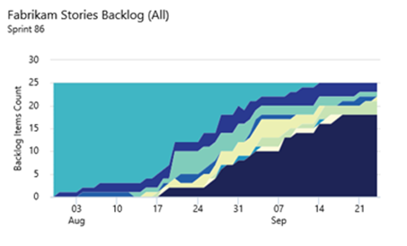

#Search extensions on Marketplace, Flexible build policy for Git, SCVMM Support and more – Feb 16

We have lot to cover with this week’s deployment. So let’s jump right in ...

##Package management is now available in Europe and Australia

You can download the Package management extension from the [Visual Studio Marketplace](https://marketplace.visualstudio.com/items?itemName=ms.feed).

##Search on Visual Studio Marketplace

Search has been a highly requested feature for Visual Studio Marketplace. With this release we are bringing in basic search support for Visual Studio Marketplace in VSTS and Visual Studio Code extensions. Integrated search is currently not supported for the Visual Studio extensions; searching for the same will currently redirect you to a new tab with results shown from the Visual Studio Gallery.

##Work item query charts in the dashboard catalog

You can now add charts for work item queries to the dashboard from the widget catalog. These charts are configurable. You can choose a query, a chart type, and visualization options while staying in the dashboard context. Chart types include pie, bar, column, stacked bar, line, area, and stacked area. You can also display data in a pivot table. And, you can still add charts from the Charts tab in the Work hub and configure them just like you've always done.

##Cumulative flow diagram widget

Using a cumulative flow diagram can help visualize your work in progress to diagnose any bottlenecks happening in your software development process. In this sprint, we’ve added a cumulative flow widget to the dashboard to look at the flow of work in your backlog for a rolling period or a specific iteration.

##Build retention

TFS Administrators can optionally specify a maximum amount of time to keep build records in the database after they have been deleted before they are permanently destroyed. You can find this setting under the Build section of the Collection admin page. Setting the value to 0 will prevent builds from being automatically destroyed.

For VSTS this setting is fixed at 30 days.

##Flexible build policy for Git

The build policy for Git repos has been updated to provide a more flexible experience for assessing build quality of a pull request. These are especially useful for larger teams or applications with longer builds. Teams now have three options to adjust the criteria that must be met in order to fulfill the policy. The only option that existed until this deployment is a strict option that requires a new build any time the target branch changes. While this effectively eliminates build breaks, it can be tedious to remerge and rebuild changes in a repo with a lot of activity.

The first new option is more relaxed: new builds are not required if the target changes. Builds are still required if the source branch changes, as is the case with all of the policy options. This option is like a buddy-build: it provides an assessment of build quality outside of the developer's environment, but it doesn't prevent build breaks.

The second new option is the ability to provide a window of time in which a successful build is considered valid. For example, once a pull request has been built successfully, updating the target branch won't immediately invalidate that build result. Instead, a timer will begin, and the user will have until that timer expires to complete their pull request. If the time expires, they must remerge and rebuild their changes to fulfill the policy. This option is a good middle ground between the other two it won't eliminate build breaks, but it reduces the likelihood without making it tedious to merge PRs.

##SonarQube Quality Gates in Build

When doing a SonarQube analysis with SonarQube 5.3 or later, you can now specify to fail the build if the Quality Gates for the analyzed SonarQube project are not respected.

##RM: UI extensibility

By simply logging from your tasks in a special way, you can publish new sections into Release summary. For example, having the following line in your task will produce a new section called "Attachments".

Write-Verbose ##vso[Task.UploadSummary] Attachments.md

You can also add new sections or new tabs in Release summary using UI contribution points. Documentation and contracts for these contribution pointes will be found [here](/azure/devops/integrate/) soon.

##SCVMM support

Using the [SCVMM Integration](https://marketplace.visualstudio.com/items?itemName=ms-vscs-rm.scvmmapp) extension for System Center Virtual Machine Manager (SCVMM), you can now connect to a SCVMM server and easily provision VMs, and perform actions on them like create snapshot, revert snapshot, start, stop etc. These VMs can then be used in Build/RM workflows just like standard and Azure environments.

##Exploratory Testing improvements

The [Exploratory Testing](https://marketplace.visualstudio.com/items?itemName=ms.vss-exploratorytesting-web) extension can be found in the Visual Studio Marketplace.

##Standalone Mode

In this mode, you can jot down notes, take screenshots (optionally annotate them) and create bugs without connecting to VSTS/TFS. Share your findings with your team in the form of a report containing details of all the bugs created.

Avoid duplicate bugs

You can now search and view similar bugs: as you create a bug, the extension will automatically search and list existing bugs based on the Title match. You can optionally update an existing bug with the new information you have collected, thereby avoiding creation of duplicate bugs.

##Web-based reports for load tests

This has been a long-requested feature. You can now view reports for your load tests on the web and analyze load test runs to identify any performance issues in your app.

You can view key performance metrics such as the Avg. response time, RPS, failed requests, etc., along with application performance charts that indicate key metrics over the entire duration of the load test run.

Important diagnostics information such as test errors and status messages from the load test run is available in the diagnostics tab.

##Other Improvements

####Azure SQL Database Deployment task

Deploy an Azure SQL Database to an existing Azure SQL Server. The Azure SQL Database deployment task now supports both Azure Classic and Azure Resource Manager connection. You can find more details at the [GitHub project](https://github.com/Microsoft/vso-agent-tasks/blob/master/Tasks/SqlAzureDacpacDeploymentV1/README.md).

####Delete Test Plan

You can now delete test plans directly from the Test Hub, which has been one of the top [UserVoice](https://visualstudio.uservoice.com/forums/330519-vso/suggestions/5875605-visual-studio-online-add-ability-to-delete-a-tes) items for Test.

#####mention

When a user adds a comment with a #mention, the mentioned work item will be added as a related link to the work item. We did this to let you quickly get an overview all related work and to easily create a bidirectional link.

####Keyboard shortcuts for Kanban board

You can now click a work item on the Kanban board and use keyboard shortcut keys for common tasks. Here's a sample of what you can do:

-Create new work items
-Move work items within or across columns and swimlanes
-Expand and collapse work items

That’s all :-)

As always, we welcome your feedback. For problems, let us know via Send-a-Smile in Visual Studio Team Services. For suggestions, let us know at the [User Voice site](http://visualstudio.uservoice.com/forums/330519-vso).

Thanks

Anand Kamat

