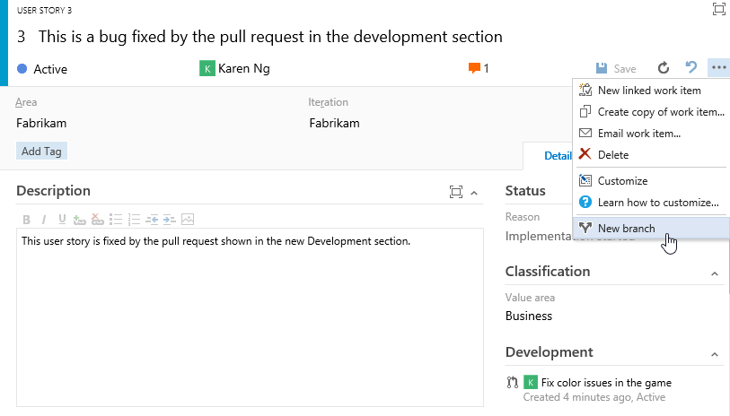
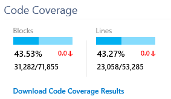
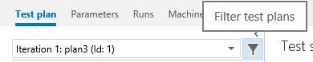
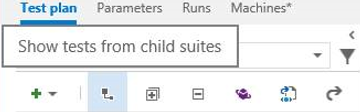
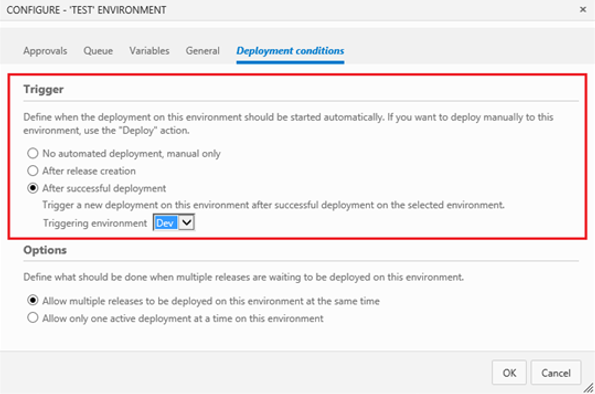
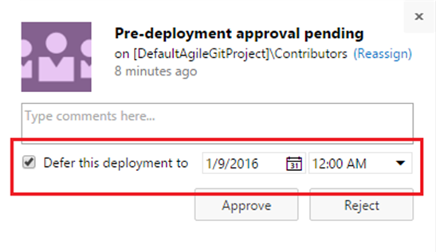
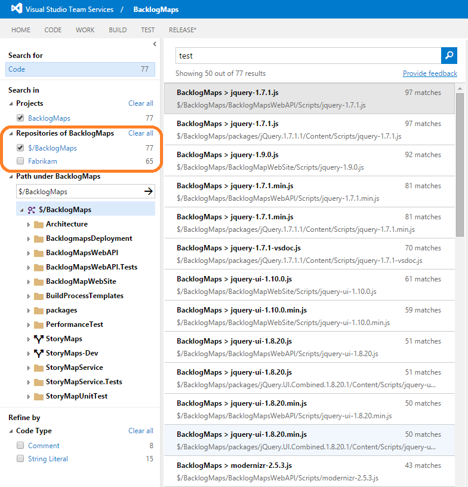

#Dashboard widget SDK, create branch from work item, test visualizations and so much more – Jan 25

Happy New Year! Because of the holidays, we skipped our December deployment, so we have a ton of exciting things to announce this week. There’s a long list, so let’s jump in…

##Public preview of the dashboard widget SDK

It’s here! When we launched dashboards, we mentioned that our widgets are written as [extensions](/azure/devops/integrate/), which would also allow you to write and share your own widgets in time. Today, we’re releasing a public preview of our widget SDK. You can get started at [Add a dashboard widget](/azure/devops/integrate/).

As a reminder, widgets are implemented as a [contribution point](/azure/devops/integrate/) in the extension framework. You’ll need some knowledge of JavaScript, HTML, CSS, and a good idea to build a widget. If you run into issues or have feedback, feel free reach out to us at vsointegration@microsoft<dot>com.

##Create branch and links to related artifacts

I’m excited to announce that you can now create a branch directly from a work item! The work item form has a new development section that displays linked branches, commits, and pull requests, and helps users take the next steps in their development workflow by providing context-aware links such as "Create a branch". When a branch is created this way, links will automatically be created to the related work item, enabling faster and simpler workflows.

You will also be able to create a branch directly from the Kanban board.

In the same way as the work item form, the pull request details view has been updated to include a Related Work Items section. The Related Work Items section lists all of the work items that are linked to a given pull request and provides a simple experience for adding links to more work items.

##Build widgets in the catalog

As I wrote about in the [dashboards futures blog](http://blogs.msdn.com/b/visualstudioalm/archive/2016/01/11/dashboards-futures-january-2016.aspx), one area we’re focusing on is improving the discoverability and ease in bringing different charts to your dashboard. With this update, you’ll see a new option to add a build history chart from the dashboard catalog, and you’ll be able to configure the build definition displayed directly from the dashboard.

##Markdown widget with file from repository

The first version of the markdown widget allowed custom markdown stored inside the widget. You can now choose to display any markdown file in your existing repository.

Or add the file to any dashboard in your team project directly from the Code Explorer.

##Auto-refresh dashboards

With today’s update, we’re enabling an option to auto-refresh a specific dashboard every 5 minutes. This is a great way to put the dashboard on your TV monitor or hallway screen and keep it updated.

##Richer visualizations in the build summary page

####Code coverage

You’ll now see a graphical representation of the code coverage charts on the build summary page.

####Quality trend chart and test duration trend chart

With this update, we’ve added two new trend charts to the Tests tab on the build summary page. The first chart shows the count of test failures over pass percentage, and the second chart shows test duration over the count of tests.

Clicking each chart will open up a detailed information view, and you can also add them to your dashboard.

##View passed test results and file bugs in build summary page

One of the top asks that we’ve heard is to view passed test results, in addition to failed tests in the Tests tab on the build summary page. We have added the outcome filter that lets you view passed, failed or all test results. If multiple tests are failing for the same reason, you can now file a single bug for those multiple test failures.

##Test summary in build status notification email

You can now find the number of tests that were run, and how many of them passed or failed in the build notification email itself, without opening the build summary page in Team Web Access.

##Support for editing tags in the bulk edit dialog

We’re heard your feedback on working with tags, and with this update, you’ll now able to add and remove tags from multiple work items using the bulk edit dialog.

##Deleting a custom field

In the last [deployment](https://visualstudio.microsoft.com/articles/news/2015/dec-10-team-services), we introduced the ability to customize work items and add new fields. With this update, users with process editing permissions can now delete custom fields created within their process. This action will delete all data associated with the field, including current values and revision history, and free up the field name for reuse. You can delete a field from the Fields tab on the process administration page. To delete a field, it must first be removed from all work item types that reference it.

##Keyboard shortcuts

Following our trend from the last few sprints, we are continuing to add more keyboard shortcuts across the product. Today we’re releasing a set for the Code hub.

##Test plan improvements

####Filter test plans

You can now set a filter for test plans that is backed by a query. This allows you to customize the set of test plans you want to work with in the Test hub.

####Tests from child suites

You can now see all tests from the current suite and its child suites with one click—this lets you perform certain operations spanning the suite hierarchy from one place.

These operations include:

-Assign testers
-Estimate test planning based on prior test execution (new fields LastRunBy, LastRunDuration, and Build have now been added to Column Options)
-Launch tests for manual testing from the selected suite.

##Exploratory testing improvements

The exploratory testing extension can be found in the marketplace: [https://marketplace.visualstudio.com/items/ms.vss-exploratorytesting-web](https://marketplace.visualstudio.com/items/ms.vss-exploratorytesting-web)

####Search on teams within projects

You can now search for your team in the search box without needing to browse the project hierarchy tree. This is useful for quick discovery when there is a large number of projects or teams.

####**Explore work item**

You can now search for a work item from within the exploratory testing session and then associate it with the session. This enables you to refer to the acceptance criteria/description during your exploratory testing and allows end-to-end traceability between any bugs you file during your exploratory session and the selected work item.

####**Create tasks**

You can now capture the issues found during the exploratory testing either as bugs or as tasks, depending on the process followed by the team (agile, scrum or CMMI).

##Release orchestration improvements

We have made a number of improvements to give you better control in managing your release processes.

####**Better control over order of environments in a release**

On each environment in a release definition, you will now have the flexibility to model a trigger/deployment condition. You will no longer be constrained to have a linear pipeline.

For example, these scenarios now light up:

1.Once a build is completed, you can deploy and run automated tests in parallel on multiple environments/configurations.
2.Once the release is successfully deployed on a Dev environment, you can deploy and test it on multiple QA environments in parallel.
3.You can set the deployment to production to be always triggered manually.
You will also be able to skip environments and manually promote the release to a selected environment.

####**Better control over order of environments**

To have better control on how multiple pending releases get deployed into a given environment, we have introduced queuing policies for environments. Your CI pipeline may produce builds faster than they can be deployed onto environments in a release management process. Or, multiple releases may be queued up on Prod waiting for an approval after they have passed QA, and it may be desirable to just deploy the last one.

####**Better control over time of deployment into an environment**

You may want to approve a release to be deployed to Prod environment now, but in fact, want that deployment to happen at midnight. We have introduced the ability to defer the deployment at the time of approval.

####**Better control over approvals**

You may want to configure multiple approvers for an environment, and control whether those approvers can approve in parallel or require an order. We added approval options to help you control this.

##Retention policies for releases

With this update, you can now control how long releases are retained. You can set a retention policy for each release definition.

The default retention policy for all release definitions is 60 days. By default, releases that have not been deployed or modified for 60 days will be automatically deleted. For releases created prior to this change, they will be retained for 365 days. This policy comes into effect only for new releases that you create after this deployment.

At this point, the retention policies for release management are independent from builds. In a future version, we will help you retain builds based on their usage in release management.

For more information, see [documentation](https://aka.ms/rmpreview) for release management. You can track all of the new features as and when they get deployed in the [What's new section](/azure/devops/release/getting-started/release-notes). Have a question? Follow us on Twitter (@vsreleasemgmt).

##UI extensibility for release management

You can now publish new sections into the release summary by using a specific syntax. For example, having the following line in your task will produce a new section called "Attachments":

Write-Verbose ##vso[Task.UploadSummary] Attachments.md

You can also add new sections or new tabs in the release summary using UI contribution points. Learn more about these contacts here:

[/azure/devops/integrate/](/azure/devops/integrate/)

##Search scope selector

With this update, we’ve added the ability to choose what to search for—code or work item—directly from the search box. Your last search target is persisted for a given hub.

If you don’t code search in your account, make sure to grab the extension from the marketplace: [https://marketplace.visualstudio.com/items/ms.vss-code-search](https://marketplace.visualstudio.com/items/ms.vss-code-search)

##Search across Git and TFVC projects

You can now search for code in Git repositories added to your existing team project created with TFVC. Similarly, you can also search for code in TFVC repositories added to an existing team project created with Git repositories.

Whew! That was a long list of improvements.

Feel free to reach me on Twitter ([@karenkayliu](https://twitter.com/karenkayliu)) if you have thoughts, comments, or questions about anything described here. And please help us prioritize by heading over to [UserVoice](http://visualstudio.uservoice.com/forums/330519-vso) to add your idea or vote for an existing one.

Enjoy!

Thanks,

Karen Ng

