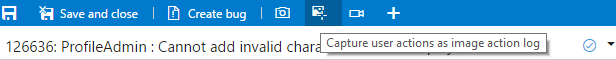
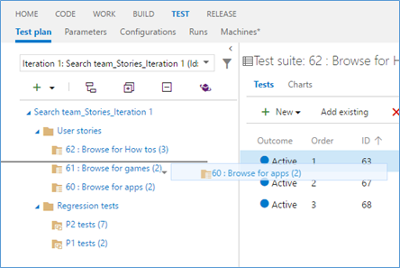

# Resize charts, PR comment tracking, RM updates and more – Jul 7

## Work

### Resizable WIT charts on dashboards

We've gotten a lot of requests from customers to provide larger charts that show more information. By making the WIT chart widgets resizable, we've done just that. In addition, users can open the chart in a lightbox. This allows users to see an expanded view of any WIT chart on the dashboard regardless of its original size.

### Filter boards to a parent work item

Team members can now filter their boards to view progress accruing to a specific parent work item. For example, a user can view user stories that are linked to a feature, or view work across two or more features that roll up to an epic. This feature, much like Checklists, is one more step in our effort to bring visibility through to the different backlog levels.

### Links front and center

The work item form has been updated to include a new Related Work links control. Now, you'll be able to create, modify, and link work items from the front page of the form.

### Test settings configuration for Kanban board

Using the new Tests page in the common settings configuration dialog on the Kanban board, you can now control the test plan under which the inline tests are created. Prior to this, any tests created on a card would automatically be added to a newly created test plan, provided no test plans existed that matched the area and iteration paths of the card. Now, you can override this behavior by configuring an existing test plan of your choice: all the tests will then be added to the selected test plan going forward. Note that this functionality is only enabled if the Test annotation feature is turned on.

You can easily traverse to the underlying test plan and test suite under which the tests are created, directly from a card on the Kanban board. Clicking this link will take you to the Test hub, open the right test plan, and then select the specific suite that controls those inline tests.

## Code

### Comment tracking for pull requests

Pull requests in VSTS have been improved to show comments left in files on the proper line, even if those files have been changed since the comments were added. Previously, comments were always shown on the line of the file where they were originally added, even if the file contents changed—in other words, a comment on line 10 would always be shown on line 10. With the latest improvements, the comments follow the code to show what the user expects—if a comment was added on line 10, and two new lines were subsequently added to the beginning of the file, the comment will be shown on line 12.

Here's an example change with a comment on line 13.

Even after the code has changed to shift the line with the original comment from 13 to 14, the comment is appearing in the expected place (line 14).

We think this improvement is a big step forward for improving the code commenting experience in pull requests. In the near future we have even more improvements coming, including improved comment placement for renamed or moved files.

## Continuous integration

### Browse Code Coverage reports in the web

A new Code Coverage tab has been enabled on the Build summary page. Users uploading Code Coverage data in Jacoco or Cobertura formats will be able to browse the HTML report generated by the tool in the Code Coverage tab.

### Maven and Gradle tasks produce a build summary when running a SonarQube analysis

When you enable the Run SonarQube Analysis option in the Maven or Gradle build tasks, you will now get a link on the SonarQube project. This is a first step. We are working on a richer build summary showing quality gate results.

## Release

### Agent queue role-based security

To control permissions for users and groups on agent pools and queues, you had to add them into two predefined groups for the pools and queues without any further control. You can now choose a user or group as being a reader, user, or administrator for the agent pool or queue, and get clarity on what permissions are assigned.

### Task-level time-outs

This feature enables users to set a time-out on an individual task (in addition to a time-out that can be already set on the entire deployment). The same feature works for tasks both in Build and Release.

### Import/Export/Clone release definition

Based on popular demand, we have now incorporated the ability to clone, export, and import release definitions within the Release hub in Team Services without requiring you to install an extension. If you are using Team Foundation Server 2015 U2 or higher, you can still download and install the extension from the [marketplace](https://marketplace.visualstudio.com/items?itemName=ms-devlabs.rm-import-export).

### Web app deployment using ARM

This is a new version of the Azure Web App deployment task using the MSDeploy & Azure Resource Manager service connection. This enables new functionality that the existing one doesn’t have. For example, users can deploy Azure web jobs and Azure API apps in addition to ASPNET 4, Node.js, and Python-based web apps. We have also enabled support for common publish options, the ability to "Retain App Data", taking "App Offline" and the ability to "Remove additional files at destination". We have more work planned in future sprints such as supporting configuration transformations.

### Partially successful deployments

This feature enables a deployment to be partially successful when a task marked with “Continue on error” flag fails. When a deployment to an environment succeeds partially, it can still trigger subsequent deployments to other environments.

### View and download attachments associated with releases

Would you like to upload additional logs or diagnostics or images when running tasks in a release? This feature enables users to upload additional files during deployments. To upload a new file, use the following agent command in your script:

Write-host "##vso[task.uploadfile]<filename>"

The file is then available as part of the release logs. When you download all the logs associated with the release, you will be able to retrieve this file as well.

### GitHub artifacts for RM

Continuing with the work we started last sprint on using Git and TFVC as artifact sources directly in RM, for this Sprint, we enabled the same for GitHub. If you need to deploy Node.js, JS, or PHP applications, where an explicit build step is not needed, and if you are using GitHub for managing your code, then you can now directly configure a GitHub artifact source in a release definition.

### .NET SQL Extension

The [IIS Web App deployment using WinRM extension](https://marketplace.visualstudio.com/items?itemName=ms-vscs-rm.iiswebapp) in Marketplace has been extended to support database DACPAC deployments. With this, users can deploy and manage IIS web app and databases, both from TFS and Team Services.

## Test

### Image action log in Web Test runner

In the Web runner when using Chrome, in addition to screenshots and screen recordings, you can now capture on-demand image action logs from your web apps. You specify the browser window on which to capture your actions—all actions on that window (any existing or new tabs you open in that window), or any new child browser windows you launch, will automatically be captured and correlated against the test steps being tested in the Web runner. These image action logs are then added to any bugs you file during the run and also attached to the current test result. This leverages the capability from the Chrome-based [Exploratory testing extension](https://marketplace.visualstudio.com/items?itemName=ms.vss-exploratorytesting-web).

### Order tests in Test hub

Test teams can now order the test suites as per their needs. Prior to this capability, the suites were only ordered alphabetically. Now, using the drag-and-drop capability in Test hub, suites can be reordered among the peer suites or moved to another suite in the hierarchy. This addresses the following [User Voice](https://visualstudio.uservoice.com/forums/330519-vso/suggestions/2726830-add-ability-to-order-test-suites) item under manual testing/test case management.

### Pick a build to test with

You can now pick the build you want to test with and then launch the Web runner, using “Run with options” in Test hub. Any bug filed during the run will be automatically associated with the build selected. In addition, the test outcome is also published against that specific build. Once we release the Microsoft Test Manager 2016 (MTM) client, you can use the same mechanism to specify the build and the data collectors to use with the Microsoft Test Runner (MTR) client, without having to configure them in MTM first. Stay tuned for more on this.

That’s it for this sprint. If you have ideas on things you’d like to see us prioritize, head over to [UserVoice](https://visualstudio.uservoice.com/forums/330519-vso) to add your idea or vote for an existing one.

Thanks,

Jamie Cool