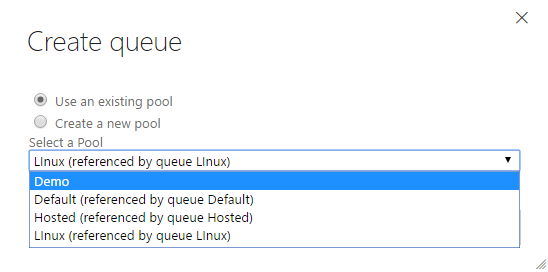
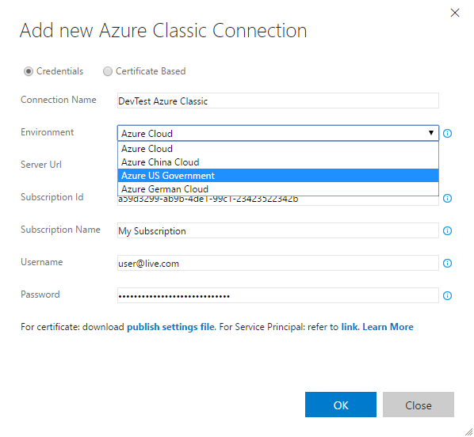
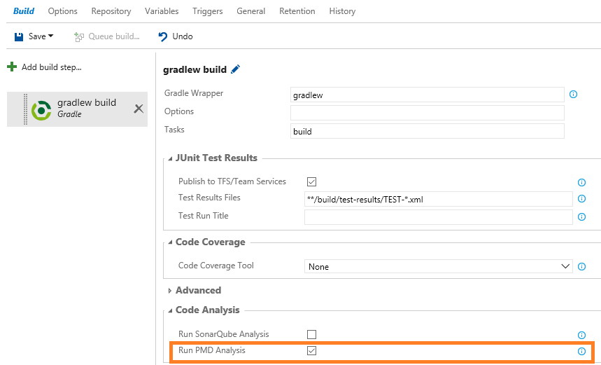
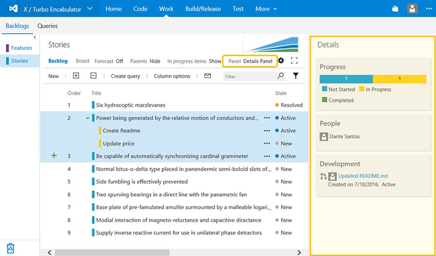

#Release, test and Git/TFVC history view improvements – Jul 29

##Git & TFVC – History view and diff view updates

The history view for commits, change sets, shelve sets, and branch updates gets a more modern avatar.

You will also see the modern path explorer on the top of the commit history view, letting you now browse files from within the history view rather than switching contexts to the explorer view.

The summary diff view has been improved to emphasize which parts of a line were modified, making it easier to review changes to files.

The new Git repository creation dialog has been improved by letting users add a ReadMe file. Adding a ReadMe to the repository not only helps others understand the purpose of the codebase, but also lets you clone the repository immediately.

##Restrict Package Management feed creation

Project Collection Administrators can now restrict the permission to create feeds to selected users using the new Package Management settings dialog.

##Release management improvements – Azure deployments, release policies

###Agent queue management

Now you can create queues from within a team project by selecting a pool which is not referenced by any other queue in the team project or create a queue with a new pool.

###Azure deployments

Now, setting up an Azure Service endpoint is easy: you just need to select the subscription on which to create a service endpoint, and you are ready to deploy to Azure.

-Users can now automatically set up an ARM service connection by selecting the subscriptions linked with the Azure Active Directory that is backing the VSTS account.
-Note: A new Azure Service Principal will be created and assigned the Contributor role, having access to all the resources in the selected subscription. You can modify the Service Principal access from [Azure portal](http://portal.azure.com/) > Subscriptions > Users > Roles.

-Prerequisites:
-The VSTS account should be backed by an Azure Active Directory. For more info, see the Visual Studio article [Team Services: Access with Azure Active Directory (Azure AD)](https://visualstudio.microsoft.com/docs/setup-admin/team-services/manage-organization-access-for-your-account-vs).
-Note: Only Azure subscriptions that are linked with the Active Directory are listed.

You can now deploy to **Azure National Cloud environments**. While setting up an Azure Classic service connection:

-You can select the Environment option to target the desired Azure National Clouds, namely, Azure Cloud (default), Azure China Cloud, Azure US Government, and Azure German Cloud.
-You can set up the service connection with either the Certificate or the Credentials option. Once it’s configured, you can use the service connection with the tasks that deploy to Azure Classic endpoints: for example, Azure Web App Deployment, Azure Cloud Service deployment, and Azure tasks that take an Azure Connection Type of ”Classic.”

###Policies – Soft delete releases

When you delete a release (or if a release is deleted by the retention policy), it will now be added to the Deleted tab. Deleted releases stay in this area for a fixed period of time (two weeks), and are then deleted permanently. During this period, you can undelete a release and reset its retention period.

###Policies – Retention of releases and builds

You may often want to retain releases that have been deployed to your production environment longer than those that were just deployed to QA environments. This feature allows you to configure retention setting based on the environments to which a release has been deployed. Furthermore, you can now retain builds that are part of releases as long as the releases are present in the system. A release will hold onto the builds that are associated with it until the release is deleted. Such builds will be retained irrespective of the retention policy on the builds themselves. Once you delete a release, or once the retention policy deletes a release, the associated builds are released, and the builds’ own retention policies kick in (which in turn might cause those builds to be deleted).

###Release definition authoring improvements – linked artifacts improvements

We have improved certain experiences associated with linking multiple artifact sources to a release definition. First, each of the artifacts is downloaded into a folder on the agent called the “source alias.” You can now edit the source alias of a linked artifact. You can do this, for instance, when you change the name of the build definition, and you want to use a source alias that reflects the name of the build definition. Second, a number of variables of the format Build.* (e.g., Build.BuildId, Build.BuildNumber) are made available to tasks. When multiple sources are associated with a release, these variables are populated based on the build that triggered the release, or based on some random build. Now, this has been made more predictable. You can mark a certain artifact source as primary, and the information pertaining to that source is used to populate the Build.* variables.

You can also filter releases by branch (of the build that got deployed) on the Release Explorer page.

###Release – redeploy after success

When a deployment to an environment fails, you may want to be able to redeploy an older release that already succeeded once in that environment. This feature lets you do just that. When you try to redeploy an older release, you will be shown the list of commits as well as the list of work items that will be rolled back. You just need to make sure that the automation scripts for deployment can really handle the rollback scenario. That is still on you.

##Test traceability and release environments support in Test History

Users can now track the quality of their requirements right on their Dashboard. We already have a solution for requirements quality for our Planned Testing users, and we are bringing it to users who follow Continuous Testing. Link your automated tests directly to requirements, and then use Dashboard widgets to track the quality of requirements you are interested in tracking, pulling the quality data from build or release.

A few weeks back, we enabled [viewing history of an automated test](jun-17-team-services.md) grouped by various branches against which the test was run. In this deployment, we are adding support for viewing the history of an automated test grouped by various release environments in which the test is run. If you are modelling release environments as release pipelines or test environments, and running tests across such environments, you can find out if a test is passing in, say, the dev environment, but failing in the Integration environment, or passing with an environment that has English locale, but failing in an environment that has Turkish locale. For each environment, you will find the status of the latest test result, and if the test has failed on that environment, you will also find the release since which the test has been failing.

##Exploratory testing improvements – view unexplored work items, capture web page load data

In addition to seeing the details of all the explored work items in the Recent exploratory sessions view, filtered by All or My sessions for a given date range, we have now added the ability to also see a list of all work items that have ***not*** been explored, in the same view. You start by specifying a shared query for work items in which you are interested, and the sessions page shows a list of all the work items from the query with a breakdown of both explored and unexplored items in the summary section. In addition, using the “Unexplored Work Item” group by pivot, you can see the list of items that have not been explored yet. This is extremely useful to track down how many stories have not been explored or gone through a bug-bash yet.

We have added a new background capture capability to the [exploratory testing extension](https://chrome.google.com/webstore/detail/exploratory-testing-previ/gnldpbnocfnlkkicnaplmkaphfdnlplb) – capturing of web page load data. Just as the image action log captured your actions performed on a web app being explored, in the form of images in the background, the page load functionality automatically captures details for a web page to complete the load operation. Instead of relying on subjective, perceived slowness of web page load, you can objectively quantify the slowness in the bug now. Once the bug is filed, in addition to the tile view, a detailed report is also attached to the bug, which can help the developer with the initial set of investigations.

##Dashboard improvements

You can now copy widgets, with configuration, to other dashboards from the widget's menu.

You can also now drag widgets from the catalog onto their dashboards.

##Java PMD analysis in Gradle build task

You can now request a PMD analysis in the Gradle build task and see the number of issues in the build summary. The Artefact tab of the build summary contains the results of the PMD static analysis. Multiple pom files are supported. For the moment, this only works with the Linux agent.

##User management – export users and licenses

Finally, you can now easily export users and their licenses to excel. Simply go to the Users hub, under All Users, and select "Export users" on the toolbar.

##Backlog extension points

We have exposed a new extension point on the backlog. With this deployment, extensions can target the pane on the right side, where mapping and work details are today.

That’s a lot for this sprint! If you have comments or questions, please reach out on Twitter ([@gopinach](https://twitter.com/gopinach)). If you have ideas for things you’d like to see us prioritize, head over to [UserVoice](http://visualstudio.uservoice.com/forums/121579-visual-studio) to add your idea or vote for an existing one.

Thanks,

Gopinath Chigakkagari