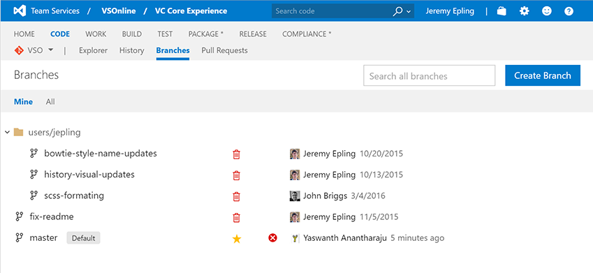
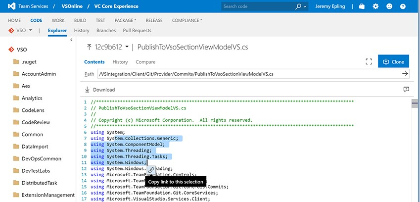
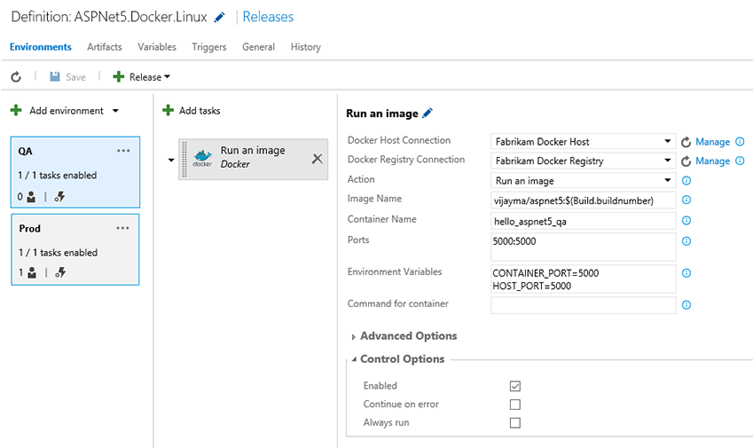

# SSH connections to Git repos, Docker integration, and more – June 1

With this release we’re introducing new agile features as well as enhancements to dashboards, coding, package management, test, and build and release management.

## Agile

### Filtering in Kanban board

Personalize your Kanban boards by setting filters on users, iterations, work item types, and tags. These filters will persist so that you can view your personalized board, even when you connect from multiple devices.

### Process configuration REST APIs

This public API allows users to get the process configuration of a given project. The process configuration contains the following settings:

-**TypeFields:** abstractions of customizable fields that are used in the agile tooling. For example, the type of the "Story points" field is "Effort". 
-**Backlog definitions:** define what work item types are on each of the backlogs.

This is a frequently requested API from customers building extensions. With this data, an extension can know how to leverage process-specific fields to enable common scenarios in the agile tools (such as changing the activity or effort of a work item, knowing what work items are included at a given backlog level, or determining whether teams are identified by area path or a custom field). The documentation is available here: [/azure/devops/integrate/](/azure/devops/integrate/)

### Default iteration path for new work items

When you create a new work item from the Queries tab or from the New Work Item dashboard widget, the iteration path of that work item is always set to the current iteration. This is not what all teams want, because it will mean that bugs could show up on the task board immediately. With this improvement, teams can choose the default iteration path (a specific one or the current iteration) that should be used for new work items. Navigate to the administration area for your team to choose a default iteration.

## Code

### SSH clients can connect to Git repos

Team Services Git repos now support SSH connections. This makes it easy for many development tools, build systems, and other services to connect, especially if you develop on macOS or Linux. You can get the SSH clone URL for your repo from the Clone button on the web, and also manage SSH keys on your profile page.

SSH has been enabled on all existing accounts. For the next sprint, SSH won't be enabled on new accounts until a few hours after the account is created. That restriction will go away shortly.

### Redesigned Branches page

The Branches page has been completely redesigned. It has a "mine" pivot that shows the branches I created, pushed to, or favorited. Each branch shows its build and pull requests status, as well as other commands like Delete. If there is a slash in a branch name, like "features/jeremy/fix-bug", it's shown as a tree, so it's easy to browse through a large list of branches. If you know the name of your branch, you can search to find the one you want quickly.

### Create and send links to specific sections of code

Share code references easily with code links. Just select text in a file and click the Link icon. It will copy a link to the selected code. When someone views that link, the code you highlighted will have a gold background. It even works for partial line selections.

## Package

### API updates for package management

We’re shipping two updates to our API to help you understand and manage the contents of your feeds.

1. New additions to the [Packages API](/azure/devops/integrate/) enable you to get details about all the packages in a feed, about a particular package, and about all the versions of a package. This means you can now retrieve your packages programmatically without using NuGet.
2. A new [Polling API](/azure/devops/integrate/) lets you check for updates to feeds and the packages in them. This can help you keep tabs on frequently-updated feeds and react to newly-added packages.

## Test

### Screenshot and system info support in Chrome Web runner

In the Web runner when using Chrome, you can now take screenshots and annotate them inline. These screenshots are automatically added to the current Test step and also show up as part of any bugs you file. Similarly, the system information data is automatically captured and included as part of any bugs you file from the Web runner. It leverages the capability from the Chrome-based [Exploratory testing extension](https://marketplace.visualstudio.com/items?itemName=ms.vss-exploratorytesting-web) for capturing both screenshots and system info.

### Ordering of tests in Test Hub

You can now order manual tests from within the Test Hub, irrespective of the type of suite in which they’re included. You can simply drag and drop one or more tests or use the context menu to reorder tests. Once the ordering is completed, you can sort your tests by the Order field and then run them in that order from the Web runner. You can also order the tests directly on a user story card on the Kanban board. This completes one of the long-pending [user voice items](https://visualstudio.uservoice.com/forums/330519-vso/suggestions/4147125-enable-changing-the-order-of-test-cases-on-the-web) (with 495 votes) under manual testing.

## Build and Release

### Docker integration for build and release management

Take advantage of the VS Team Services cloud-based build capabilities to build your Docker images and upload them to the Docker Hub as part of your continuous integration flow. Then, deploy those images to a number of Docker hosts as part of Release Management. The [Marketplace extension](https://marketplace.visualstudio.com/items?itemName=ms-vscs-rm.docker) adds all the service endpoint types and tasks necessary for you to work with Docker from VS Team Services.

### SonarQube results in pull request view

If the build run to merge a pull request contains SonarQube MSBuild tasks, you will now see new code analysis issues as discussion comments in the pull request. This experience works for any language for which a plug-in is installed on the SonarQube server. For more information, see this blog post.

### Test results trend for build

We have added a new ”Test result trend” widget to the Widget Gallery. Use this widget to add a test result trend chart to the dashboard of up to the 30 most recent builds for a build definition. Widget configuration options can help you customize the chart to include pivots like passed test count, failed test count, total test count, pass percentage and test duration.

### Service hooks for release management

Send release notifications when new releases are created, when deployments are started or completed, or when approvals are pending or completed. Integrate with third-party tools such as Slack to receive such notifications.

### TeamCity artifacts for release management

If you are a TeamCity user, you can now consume TeamCity builds as artifacts in Release Management. Install the TeamCity artifacts extension from Visual Studio Marketplace to setup a TeamCity service endpoint. Then, configure your release definitions to deploy artifacts produced by TeamCity builds.

### Release Management Client SDK

If you need to work with Release Management REST APIs, we now have a [C# client SDK](https://www.nuget.org/packages/Microsoft.VisualStudio.Services.Release.Client/) available as a nuget package. A sample usage can be found here: [http://blogs.msdn.com/b/chandananjani/archive/2016/04/28/using-releasehttpclient-for-interacting-with-releasemanagement-service.aspx](http://blogs.msdn.com/b/chandananjani/archive/2016/04/28/using-releasehttpclient-for-interacting-with-releasemanagement-service.aspx)

## Dashboards

### Dashboards REST APIs

You can now use REST APIs to programmatically add, delete and get information on a dashboard. The APIs also let you add, remove, update, replace, and get information on a widget or a list of widgets on a dashboard. The documentation is available on [Visual Studio online docs](https://aka.ms/dashboardapi).

A number of features in this release are directly based on feedback that you submitted. If have ideas on things you’d like to see us prioritize, head over to [UserVoice](https://visualstudio.uservoice.com/forums/330519-vso) to add your idea or vote for an existing one.

Thanks,

Vijay Machiraju
