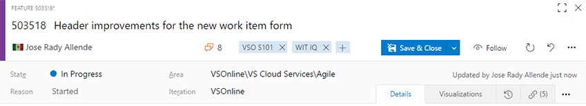
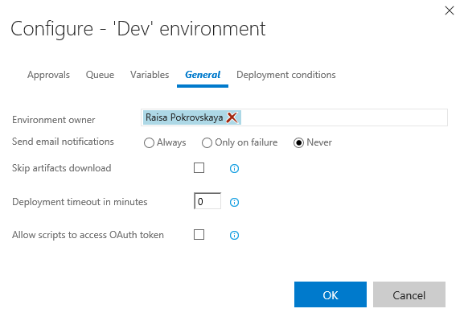

#Git & TFVC updates plus improved test traceability … – June 20

##Git & TFVC – Browsing branches

The branches page scales to massive repos with thousands of branches. If there are more than 100 branches at the root or in a folder, it only shows the first 100, which is what the vast majority of people use. If you don't want to browse thousands of branches, the search box—with substring matching—will quickly find the branch you want.

##Git & TFVC – Ahead/behind

Ahead/behind has returned! This was a sorely-missed feature that didn't make it into the initial redesign of the branches page. It shows the number of commits that a branch is ahead or behind when compared to the repo's default branch.

##Git & TFVC – Branch picker includes “Mine”

Now it's easy to quickly switch to the branches you care about. The branch picker defaults to "Mine," which shows the branches you created, pushed to, and favorited. This is the same experience as the Branches page. To favorite a branch go to the Branches page, and search or browse for the branches you care about, and click the star.

##Git & TFVC – Path control

The new path control in Explorer makes it easier to navigate files in your repo, even if you close the tree control. It's one click to jump to a parent folder, and you can click in the control to copy or type a new path. Since the new control is next to the branch picker, you get even more vertical space to view a folder or file.

##Git & TFVC – File type icons

You will see new file icons matching the extension of the file in the explorer, pull requests, commit details, shelveset, changeset, or any other view that shows a list of files.

##Work Items – An improved header

Let's take a look at a few updates to the work item header that you'll want to be aware of. First, the amount of space that the header takes up has been optimized, improving your experience on devices with lower resolutions. We've made "Save" and "Save and Close" the clear CTA (call to action) on the form and increased their clickable area significantly. No more wondering around where the save icon is located. And, we made a small change to move the State and Reason fields closer together.

##Work Items – Custom states

The first milestone in bringing states customization to Team Services is here. With this deployment, you can customize the states on your inherited work item types. We have added a new states node to the work item type process administrator page where you can view and modify the workflow for that work item type. More information is available at this [blog post](https://blogs.msdn.microsoft.com/visualstudioalm/?p=17495).

##Exploratory Testing – Insights

You can now view the completed exploratory testing sessions, either at a team or individual level, for a given time period created using the [exploratory testing extension](https://marketplace.visualstudio.com/items?itemName=ms.vss-exploratorytesting-web). You can get to this insights page by clicking the “Recent exploratory sessions” link in the Runs hub within the Test Hub group in web access. This new view helps you derive meaningful insights, including:

-The summary view that shows a breakdown of the work items explored, the work items created, and the session owners, along with the total time spent on these sessions.
-The group-by view that can be pivoted by either explored work-items or sessions or session owners or none. For any pivot, you can either view the list of all work items (bugs, tasks, test cases) created or scope the list down to a specific work item type.
-The details pane view that displays information based on selection in the group-by view. For a selected pivot row (say explored work items), you can view its summary information in the details pane, such as the total number of sessions, the total time spent across these sessions, the session owners who explored it, and the bugs/tasks/test cases created against it, along with their state and priority. For a selected work item row, you can view its work item form inline and make changes as appropriate.

##Exploratory Testing – Auto stop screen recordings

We have now added the ability to automatically stop a screen recording and attach it to a bug being filed in the exploratory testing extension. Prior to this, there was no indication that the ongoing screen recording would be discarded unless it is explicitly stopped prior to filing the bug.

With this deployment, the exploratory testing extension also supports localized versions of TFS 2015 RTM and above.

##Screen recording support in Web runner (for Chrome)

In the Web runner when using Chrome, you can now capture on-demand screen recordings of not just the web apps, but also your desktop apps. These screen recordings are automatically added to the current test result and show up as part of any bugs you file. This leverages the capability from the Chrome-based [exploratory testing extension](https://marketplace.visualstudio.com/items?itemName=ms.vss-exploratorytesting-web).

##Bugs filed as children – Web runner/Exploratory testing extension

When running tests in Web runner, launched either from a card on the board or from a requirement-based suite in Test hub, any new bugs filed will now be automatically created as a child to that user story. Similarly, if you are exploring a user story from the [exploratory testing extension](https://marketplace.visualstudio.com/items?itemName=ms.vss-exploratorytesting-web), any new bugs you file will also be created as a child to that user story. This new behavior allows for simpler traceability across stories and bugs. In certain scenarios, such as adding to an existing bug that already has a parent defined, a Related link will be created instead.

##Test – History across branches

It’s a common scenario for an individual test to run on multiple branches, environments and configurations. When such a test fails, it’s important to identify whether the failure is contained to development branches such as the master branch, or release branches that deploy to production environments. You can now visualize the history of a test across various branches by looking at the History tab in result summary page. Navigate to the first build in which the failure was introduced for additional context: commits and build logs. We plan to add support for visualizing history across additional pivots (environments and configurations) in upcoming sprints.

##Test – Automated testing for SCVMM and VMWare

Users can dynamically set up test machines in the cloud with Azure, or on premises using SCVMM or VMWare, and use these machines to run their tests in a distributed manner. Users can use one of the machine provisioning tasks— [Azure, SCVMM or VMWare](https://marketplace.visualstudio.com/items?itemname=ms-vscs-rm.vmwareapp)—followed by the [Run Functional Tests task](https://visualstudio.microsoft.com/docs/build/steps/test/run-functional-tests) to run tests. For more information, please see the [Visual Studio docs](http://go.microsoft.com/fwlink/?LinkId=799813).

##Release – Test status visibility

It’s a recommended practice to use Release Environments to deploy applications and run tests. With this deployment, we have integrated test pass rates of Release Environments in the environments section of the release summary page. As shown in the screenshot below, if an environment has failed, you can quickly infer if the failure is because of failing tests by looking at the Tests column. Click on the pass rate to navigate to the tests tab and investigate the failing tests for that environment.

##Release – Support Java PMD analysis in Maven build task

You can now request a PMD analysis in the Maven build task and see the number of issues in the build summary. The Artefact tab of the build summary contains the results of the PMD static analysis. Multiple pom files are supported. For the moment, this only works with the Linux agent. More information is available at this [blog post](https://blogs.msdn.microsoft.com/visualstudioalm/2016/06/15/the-maven-build-task-now-supports-pmd-analysis-out-of-the-box).

##Build – SonarQube with a Gradle build task

You can now trigger a SonarQube analysis in the Gradle build task by checking **Run SonarQube Analysis**, and providing the endpoint, the SonarQube project name, the project key and the version. More information is available at this [blog post](https://blogs.msdn.microsoft.com/visualstudioalm/2016/06/15/the-gradle-build-task-now-supports-sonarqube-analysis). 

##Release – Passing oauth tokens to scripts

You might often need to run custom PS scripts in Release Management, which invoke REST APIs to create work items or query for more information about a build. You can now check an option in the environment to make a VSTS OAuth token available to such scripts.

Here is a simple example on how to get a build definition:

$url = "$($env:SYSTEM_TEAMFOUNDATIONCOLLECTIONURI)$env:SYSTEM_TEAMPROJECTID/_apis/build/definitions/$($env:SYSTEM_DEFINITIONID)?api-version=2.0"
 Write-Host "URL: $url"
 $definition = Invoke-RestMethod -Uri $url -Headers @{
 Authorization = "Bearer $env:SYSTEM_ACCESSTOKEN"
 }
 Write-Host "Definition = $($definition | ConvertTo-Json -Depth 1000)"
 
##Build – Enable path filters for Git CI triggers

CI triggers for hosted Git repositories can include or exclude certain paths. This enables you to configure a build definition to run only when files in specific paths have changed.

##Build – Updated hosted pool software

We’ve updated the software available in our hosted build pool to include:

-.NET Core RC2 Tooling
-Service Fabric runtime, SDK, and tools for Visual Studio 2015

For a full list of software, see [https://visualstudio.microsoft.com/docs/build/agents/hosted-pool](https://visualstudio.microsoft.com/docs/build/agents/hosted-pool).

##Dashboards – Resizable query results widget

Teams can now configure the size of the dashboard's Query Results widget, allowing it to display more results.

##Third-party plugins – Jenkins plug-in to RM

Users of Jenkins CI can now create releases more easily using the [Team Services Continuous Deployment](https://wiki.jenkins-ci.org/display/JENKINS/VS+Team+Services+Continuous+Deployment+Plugin) plugin. Add post-build steps right into your Jenkins CI project to create a new release. This, along with the ability for Release Management to understand and download Jenkins artifacts, provides a great end-to-end integration between these two tools.

##Marketplace – Publisher review responses

Signed-in users who have Owner/Creator/Contributor permissions on a publisher will see an additional reply option next to a review. Clicking it will open a dialog box that will allow them to respond to a review. The response will show up under the existing review with the extension icon and publisher display name.

##Team Rooms – Build vNext support

And finally, it has been always possible to add notifications of XAML builds in the team room. In this latest deployment we added the ability to receive notifications from Build vNext as well.

As always, if you have comments or questions, please reach out on Twitter ([@aaronbjork](https://twitter.com/aaronbjork)). If you have ideas on things you’d like to see us prioritize, head over to [UserVoice](https://visualstudio.uservoice.com/forums/330519-vso) to add your idea or vote for an existing one.

Thanks,

Aaron Bjork

