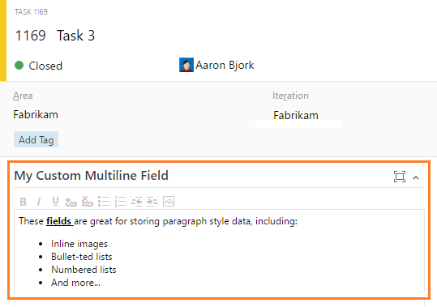

#Improved commit traceability, custom multiline fields, and board/test integration - Mar 24

Let’s start by walking through some of the improvements we’ve made in the Code hub…

##Commit traceability

Build status (success or failure) is now clearly visible in the Code Explorer and Commit Details views. More details are just a click away, so you’ll always know if the changes in the commit passed the build or not. You can also customize which builds post status in the repository options for the build definition.

Additionally, the latest changes to the Commit Details view provide deeper insights about your changes. If you’re using pull requests to merge your changes, you’ll see the link to the pull request that introduced the changes into the master branch (or in the case of a merge commit, the PR that created it). When your changes have reached master, the branch link will appear to confirm that the changes have been included.

On a related note, it’s also now easier to add and remove reviewers from your pull requests. To add a reviewer or group to your pull request, simply enter their name into the search box in the Reviewers section. To remove a reviewer, hover over their tile in the reviewers’ section and click the X to remove them.

##View Git LFS files in the web

If you’re already working with large files in Git (audio, video, datasets, etc.), then you know that Git Large File Storage (LFS) replaces these files with pointers inside Git, while storing the file contents in a remote server, like Team Services. This deployment now makes it possible to view the full contents of these large files by simply clicking the file in the repo of your Team Services account.

##Git for Windows now includes Team Services authentication by default

[Git for Windows 2.7.4](https://git-scm.com/download/win) now installs the [Windows Credential Helper](https://github.com/Microsoft/Git-Credential-Manager-for-Windows). This means that Windows users can now simply install the latest version of Git and start working against Team Services. If the user needs to authenticate, they will get an interactive prompt—no need for alternate credentials or personal access tokens. For Linux and Mac users, they can achieve the same experience using the [Git Credential Manager for Mac and Linux](https://github.com/Microsoft/Git-Credential-Manager-for-Mac-and-Linux).

##Custom multiline text fields

We’ve added multiline text fields to the list of types available when customizing your work items. These fields allow rich formatting (bold, underline, bullets, inline images, etc.), and are great for capturing data about your work that needs a bit more space. For now, you can only place these fields in the first column of your work items. Support for more layout options will come later.

##Test progress from your cards

Over the past few months you’ve seen us adding more and more functionality to cards on your boards. Our latest deployment brings the capability to add, view, and interact with test cases directly from your stories. Use the new **Add Test** menu option to create a linked Test case, and then monitor status directly from the card as things progress.

With this new capability, you can now perform the following actions directly from a card on your board.

-Add tests
-Open tests
-Reparent a test by dragging/dropping from one user story to another
-Copy the same test to another user story using CTRL+Drag/Drop (for scenarios where the same test case tests more than one user story)
-Update the test status by quickly marking it Pass/Fail/etc.
-Run the test by launching it in the Web Test Runner, from which you can pass or fail individual steps, file bugs, etc.
-View a summary of the roll-up status indicating how many tests have passed and how many remain for that story

If you need advanced test management capabilities (like assign testers, assign configurations, centralized parameters, exporting test results, etc.), you can then switch over to Test Hub and start using the default test plan/requirement-based suites that have been auto-created for you. You can learn about this capability [here](https://msdn.microsoft.com/Library/vs/alm/Work/kanban/add-run-update-tests).

##Capture screen recordings

Building on all the recent improvements to the [Exploratory Testing](https://marketplace.visualstudio.com/items/ms.vss-exploratorytesting-web) extension, this deployment brings the ability to perform on-demand screen recordings that are automatically attached to the task or bug being filed. Support for audio is coming next.

##Queue a Run by specifying your test suite

Test plans and test suites can now trigger automated runs in builds using the “Run Functional Tests” task. Results will appear in the Tests tab on your Build Summary pages, as well as in the Test Hub. Use the new Test Suite group to get a quick view of all suites run and their quality.

##Configuration management in the Test Hub

We’ve brought test configuration management to the web UI by adding a new Configurations tab within the Test Hub. Here you’ll find all your configurations, ready for you to configure as needed.

##Enable build result extensions to specify order and column

Build result section extensions can now specify which column and the order in which they appear. The result view has two columns, and all extensions will be in the first column by default. **Note**: All third-party extensions will appear after the build result sections we include.

##Configure status API reporting for a build definition

You can now choose which build definitions report their status back to the Git status API. This is particularly useful if you have many definitions that build a given repository or branch, but only have one that represents the real health.

##Tab contribution point

And finally, for those of you writing extensions, we’ve added a new contribution point on the board and backlog pages to allow you to write extensions as a pivot tab next to Board/Backlog/[Capacity] tabs.

Feel free to reach out on Twitter ([@aaronbjork](https://twitter.com/aaronbjork)) if you have questions. As always, any ideas on things you’d like to see us prioritize, head over to UserVoice to add your idea or vote for an existing one.

Thanks,

Aaron Bjork