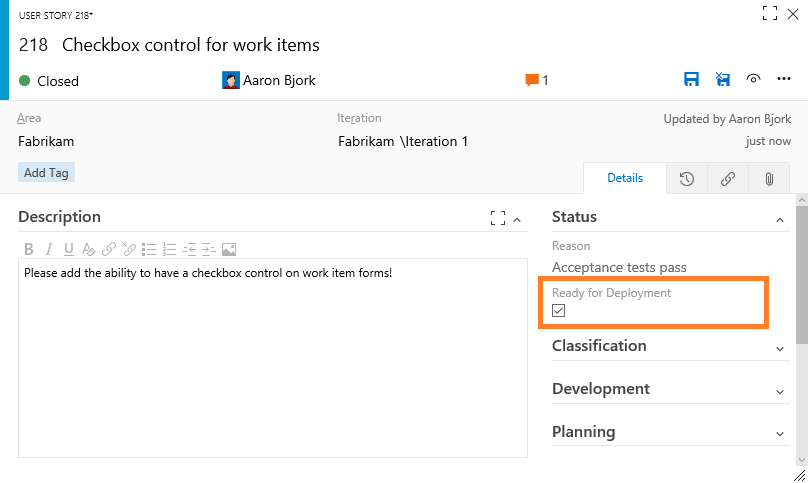
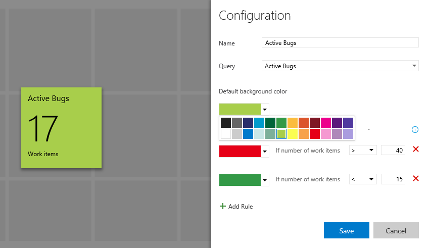
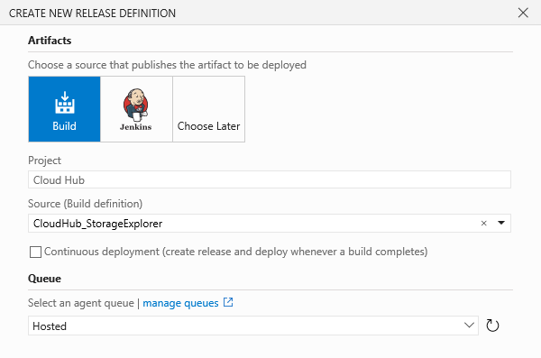

#RM updates, email formatting, a checkbox control, and more – May 6

There’s so much in our deployment this week that I really don’t know where to begin. I’m going to start with a few items that I’m thrilled we’re knocking off our list...

##Email improvements

First, we’ve significantly improved the formatting and usability of emails sent by Team Services. You may have noticed some of this already, but we’re completely overhauling the format of emails sent by the service. Emails now include a consistent header, a clear call to action, and improved formatting to make sure the information in the mail is easier to consume and understand. Additionally, all these emails are being designed to ensure they render well on mobile devices.

##Checkbox control

Moving on to another long overdue item… with this deployment, you can now add a checkbox control to your work items. This new field type (Boolean) has all the properties of normal fields and can be added to any type in your process. When displayed on cards or in a query result, the value is shown as True/False. For guidance on how to add a Boolean field to your process, please see [Customize a field for a process](https://msdn.microsoft.com/Library/vs/alm/Work/process/customize-process-field) in our documentation.

##Work Item page management

On a related note, project admins can now add new completely custom pages to a work item layout. These pages support all the field types that exist, and can be configured with groups as needed. We’re still working on additional layouts (coming soon), but for now you can add pages that have the standard 50% - 25% - 25% columns. With this feature also comes the ability to place long text fields (HTML fields) in any column on the form.

##Turning board annotations on/off

We are giving you more control of the additional information that shows on the cards on your boards. You can now select annotations that you want to view on your Kanban cards. Simply unselect an annotation and it will disappear from the cards on your Kanban board. The first two annotations to show up here are child work items (tasks in this example) and the Test annotation.

##Clear Formatting command

We’ve added a new command to all rich text controls on work items that lets you clear all formatting from selected text. If you’re like me, you’ve probably been burned in the past by copying and pasting formatted text into this field that you can’t undo (or clear). Now you can simply highlight any text, select the **Clear Formatting** toolbar button (or press CTRL+Spacebar), and you'll see the text return to its default format.

##Dashboard updates

Let’s look at a few updates to dashboards that you’ll want to be aware of. First, the Query Tile widget now supports up to 10 conditional rules and has selectable colors. This is extremely handy when you want to use these tiles as KPIs to identify health and/or action that may be needed.

We’ve also redesigned our widget catalog to accommodate the growing set of widgets and deliver a better overall experience. The new design includes an improved search experience and has been restyled to match the design of our widget configuration panels.

The Pull Request widget now supports multiple sizes, allowing users to control the height of the widget. We’re working on making most of the widgets we ship resizable, so look for more here. Finally, the New Work Item widget now allows you to select the default work item type, instead of forcing you to select the most common type you’re creating over and over from the drop-down list.

##Adding attachments during manual testing

We’ve updated the Web test runner to give you the ability to add test step attachments during manual testing. These step result attachments automatically show up in any bugs you file in the session and subsequently in the Test results pane.

##Test plan/suite columns

We’ve added new columns to the Test results pane that show you the test plan and test suite under which the test results were executed in. These columns provide much-needed context when drilling into results for your tests.

##Build and release summary updates

There are two new bits of information that will show up on your build and release summaries. First, you’ll notice that console logs are now available in the Test pivot. Console logs are published as test result attachments and can be previewed in the Tests tab in the Build summary and Release summary panes.

Second, it’s very common to need to understand and identify test cases or containers that take the most time to run. You can now find this information by sorting the Duration column in the Tests tab in the Build/Release summary panes. In addition to the duration of individual tests, you can also look at aggregate duration of test containers or test runs by grouping by the respective pivots.

##Release Management improvements

This release brings with it quite a few Release Management (RM) improvements. Let’s walk through the new capabilities…

First, Release Management now supports linking repositories (both Git and Team Foundation Version Control) as artifact sources directly to a release definition, enabling you to consume resources in your repos without having to publish build artifacts with the same files. **Note:** There is no support yet for auto-triggering new releases when a commit is made into these repositories, but that work is in flight, so stay tuned.

Additionally, you’ll find these new features:

-**Copy, Export, Import.** We’ve published a [new extension](https://marketplace.visualstudio.com/items?itemName=ms-devlabs.rm-clone-rd) in the Marketplace that lets you copy, import, and export release definitions. These features will be available in the product soon, but this extension should help fill the gap until they show up natively. 

-**Schedule Based Deployment Condition.** You can now configure a condition on an environment to pick up the successful deployments (or the latest one) from another environment and promote them at the selected time. This capability allows you to have time-based deployments that happen on a repeatable schedule. Chose the Deployment Condition tab in your environment to configure the schedule.

-**Release Management REST APIs.** You can now use the REST APIs for Release Management service. They are published at: [/azure/devops/integrate/](/azure/devops/integrate/). Most of these APIs work with the on-premises releases of RM features in TFS 2015 Update 2 as well (changes between TFS and Team Services versions are indicated in the API docs). You can find some basic examples on how to use these APIs in this [blog post](http://blogs.msdn.com/b/chandananjani/archive/2016/04/15/using-releasemanagement-rest-api-s.aspx).

-**Simplified Release Definition Wizard.** We’ve simplified the wizard to create release definitions. You can enter most of the inputs to setup a definition with a single environment in this wizard. We have also simplified the process for adding more environments into a definition or to clone an environment. 
 

-**New Job Execution Variables.** Below are a set of variables now available that let you access information about artifact sources when executing deployment jobs. These variables are available in the format: RELEASE_ARTIFACTS_<Alias>_<VariableName>. <Alias> represents the artifact source that is included in the release definition. You can find the name of the alias in the Artifacts tab of a release definition. <VariableName> will be one of the following: 
 
DEFINITIONID
BUILDNUMBER
BUILDID
REPOSITORY_NAME
SOURCEBRANCH
SOURCEBRANCHNAME
SOURCEVERSION
BUILDURI
REQUESTEDFORID
REPOSITORY_PROVIDER
REQUESTEDFOR
TYPE
Note: For scripts, replace the underscore with a period.

##Improved build and pull request traceability

The traceability between builds and pull requests has improved, making it easy to navigate from a PR to a build and back. In the build details view for a build triggered by a pull request, the source will now show a link to the pull request that queued the build. In the Build Definitions view, any build triggered by a pull request will provide a link to the pull request in the "Triggered By" column. Finally, the Build Explorer view will list pull requests in the source column.

##Team Project rename permission

The permission controlling which users can rename a team project has changed. Previously, users with **Edit project-level information** permission for a team project could rename it. Now users can be granted or denied the ability to rename a team project through the new **Rename team project** permission.

##Admin settings Work hub

We've introduced a new "Work" hub in the Admin settings page that combines general settings, Iterations, and Areas in a single tab.

With this change, users will see clear differences between project-level settings and team settings. For team settings, users will only see areas and iterations that are relevant to their team. At a project level, the settings page will enable admins to manage areas and iterations for the entire project. Additionally, for project area paths, a new column called "Teams" has been added to make it convenient for admins to tell quickly and easily which teams have selected a specific area path.

##UX improvements

The final thing I want to point out is that you might be noticing some subtle changes to our UX and visual style across the product—larger font ramp, high DPI icons, cleaner visuals, etc. This deployment brings additional changes, most notably we’ve restyled the majority of the dialogs with a cleaner look and feel. This is part of a continued commitment to improving the visual presentation of Team Services, and you can expect each of the areas of the product to improve gradually over the coming deployments.

There’s a lot here, so I hope you made it to the end. As always, free to reach out on Twitter ([@aaronbjork](https://twitter.com/aaronbjork)) if you have questions. If you have ideas on things you’d like to see us prioritize, head over to [UserVoice](http://visualstudio.uservoice.com/forums/121579-visual-studio) to add your idea or vote for an existing one.

Thanks,

Aaron Bjork