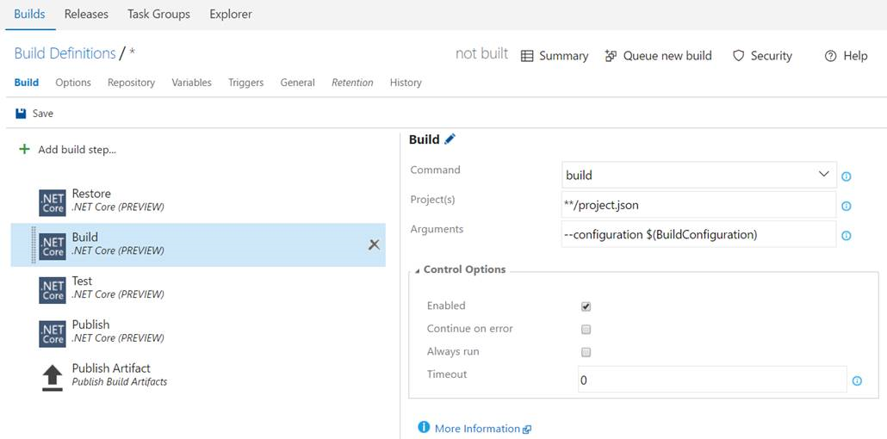
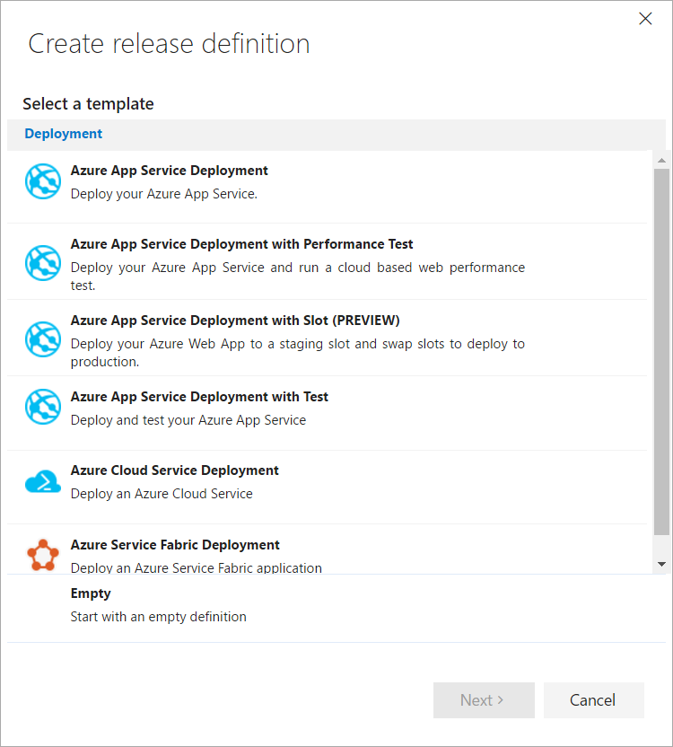
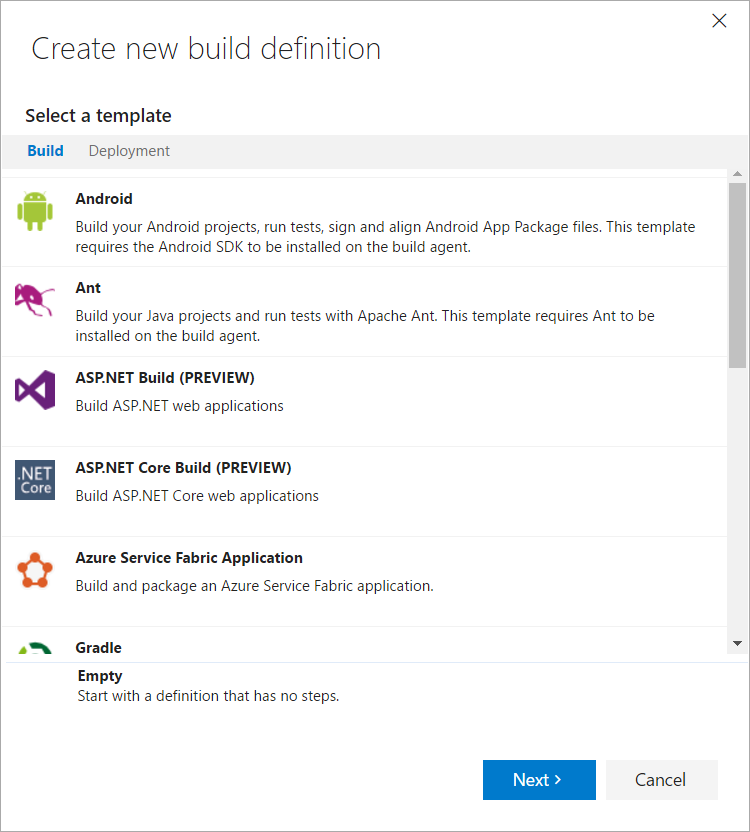
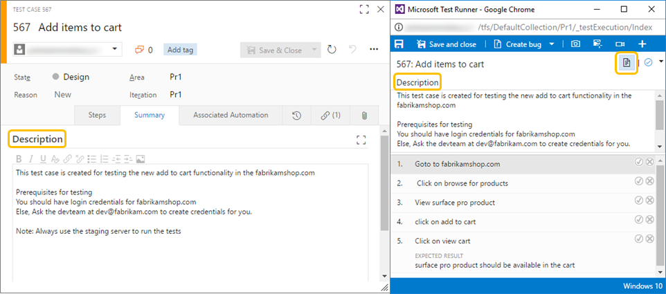

# Microsoft Teams integration, repo favorites, and new package management and release management regions – Nov 2

There are some exciting new features this sprint.

## Package Management in India and Brazil
Package Management is now available to Team Services accounts hosted in the South India and Brazil South Azure regions. To get started, [install the extension from the Marketplace](https://marketplace.visualstudio.com/items?itemName=ms.feed).

## Microsoft Teams integration
Microsoft Teams is a new chat-based workspace in Office365 that makes collaborating on software projects with Team Services a breeze. Team Services users can stay up to date with alerts for work items, pull requests, commits, and builds using the Connectors within Microsoft Teams. Starting November 9, users will also be able to bring their Kanban boards right into Microsoft Teams. For more information, see our [blog](https://blogs.msdn.microsoft.com/visualstudioalm/2016/11/02/microsoft-teams-integration-with-team-services/).

## Repo favorites
You can now favorite the repos you work with most frequently. In the repo picker, you will see tabs for __All repositories__ and your __Favorites__. Click the star to add a repository to your list of Favorites. 

## Rollback build definitions
You can roll a build definition back to a previous version by going to the __History__ tab when editing a build definition.

## Disable the sync and checkout of sources in a build
Starting with the 2.108 agent, you can optionally disable the automatic source sync and checkout for Git. This will enable you to handle the source operations in a task or script instead of relying on the agent&rsquo;s built-in behavior. All standard source-related variables like Source.Version, Source.Branch and Build.SourcesDirectory are set.

## Docker extension enhancements 
There have been a number of enhancements to the [Docker extension in the marketplace](https://marketplace.visualstudio.com/items?itemName=ms-vscs-rm.docker):
* Docker Compose run action
* Restart policy for Docker run
* Ensuring the registry host is specified on logout
* Bug fixes

## .NET Core build task
We added support for building, testing and publishing .NET core applications with a dedicated .NET Core task for project.json templates. 

## Build and release management templates 
We have added support for new templates in Build and Release for building ASP.NET/ASP.NET core and deploying to Azure web applications.

## ASP.NET Core and NodeJs deployments
The Azure Web App task now supports ASP.NET Core and NodeJs applications. You just specify the folder with all application contents for deployment. This task can run on Linux platforms for deploying ASP.NET Core or Node-based applications.

## Azure Web App Service manage task
We added a new task for managing Azure Web App services. Currently, this task has support for swapping any slot to production. 

## Release Management available in multiple regions
The Release Management service is now available in Europe, Australia, Brazil, and India regions in addition to the US. All of your Release Management data is now co-located with the rest of your Team Services account data.

## REST client helpers for Test Step operations
Users will now be able to create, modify and delete test steps and test step attachments in Test Case work items using the helper classes we have added to the REST client  (see the [RestApi-Sample](https://github.com/pankagar/RESTApi-Sample)).

## Test case description in Web runner
Customers often use the test case description field for capturing the prerequisites that must be met before the test case execution can start. With this update, users will now be able to view the test case description information in the Web runner by using the __Show description__ option.

As always, if you have ideas on things you’d like to see us prioritize, head over to [UserVoice](https://visualstudio.uservoice.com/forums/330519-vso) to add your idea or vote for an existing one.

Thanks,

Jamie Cool