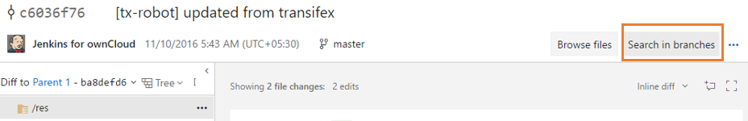
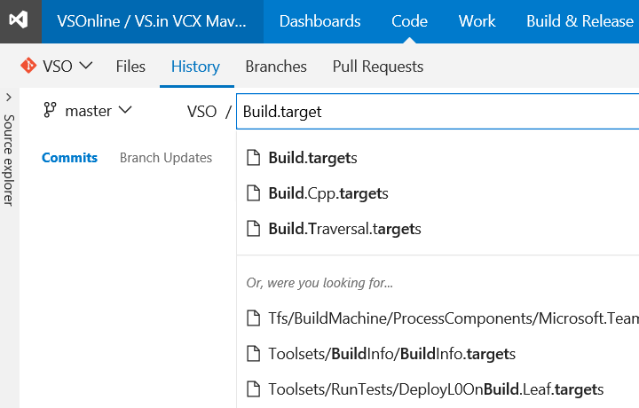

#Follow a PR, task versioning, and search for commits in branches – Nov 23

We have a bunch of new features rolling out this sprint.

##Search for commits in branches
You can now search for a commit in a specified branch or a tag by clicking on the __Search in branches__ button on the commit details page.

You can select tags and branches in the window to view whether these branches and tags contain the particular commit.

##Search for a file or folder in commit history
Similar to the files tab, users can now search for a file or folder in a repository and see the history of commits for that file or folder. For any Git repository, go to the path control box on the History tab and start typing to initiate a history search experience for the file or folder you are looking for.

##Follow a pull request
You can now follow a pull request to stay notified of any changes via email alerts. The option to __Follow__ is available in the context menu.

##Restart pull request merge
Another option has been added to re-attempt the merge for a pull request where the target branch has been updated. This __Restart merge__ option is useful when you want to verify that recent changes to the target branch haven’t created conflicts or broken your PR build.

##Completion blocked on rejected pull requests
Branches that have the code review policy set will notice that the PR is unable to be completed if it is rejected by one or more reviewers. Many users expect this behavior, so we’ve changed the default behavior. For teams that want the original behavior, there is a new option in the branch policy setting page.

##Markdown in pull request description
Spice up your pull request description with Markdown. The same Markdown support you know and love in pull request comments is now available in the pull request description.

##Task versioning for Build and Release definitions
By popular request, we’re giving you control over the major version of a task that you run in your build or release. We expect this change to result in fewer unpredictable errors that were caused by automatic updates to the agent and task version. You now specify the major version of the task on the __Build__ tab of your definition, or on the __Environments__ tab of your release definition. 

When a minor version is released (for example, 1.2 to 1.3), you get that change automatically in your build. But if a new major version is released (for example 2.0), then your build stays locked to version 1.3 until you edit the definition and manually change to the new major version. A flag in the build definition alerts you to new major versions.

If you select a version named something such as __1.* (preview)__, keep in mind that this version is still under development and might have known problems.

> __Tip:__ In a build definition you’ve got a few options to test a new major version of a task:
 * If you change the version and have problems, you can revert the change from the history tab.
 * Clone the build definition and test the cloned definition with the new major task version.

##Hosted Linux pool preview
We’re offering a preview of our new hosted Linux pool to enable you to build and release on Linux machines without having to configure a private agent.

The agents in the hosted Linux pool run on an Ubuntu Linux host inside the [vsts-agent-docker container](https://github.com/Microsoft/vsts-agent-docker). This container includes all the standard Java, Node, Docker and .NET Core tooling. When we start the container we map in the Docker socket from the host VM and the working folder from /opt/vsts/work. This enables you to create or spawn other Docker containers as part of your build or release process using either a script or the [Docker extension](https://marketplace.visualstudio.com/items?itemName=ms-vscs-rm.docker) in the Visual Studio Marketplace.

To use the Hosted Linux pool:
* In your build definition, go to the **General** tab, open the **Default agent queue** menu, and then select **Hosted Linux**.
* In your release definition, go to the **Environments** tab, select your **Run on agent** task, open the **Deployment queue** menu, and then select **Hosted Linux**.

If you don’t see the option yet, just give it a little time. We’re rolling this option out to accounts over the next few weeks.

##Build and deploy Docker apps to Azure more easily
To make continuous integration and deployment (CI/CD) of Docker apps a whole lot simpler for you, we’ve:
* Updated the [Docker extension](https://marketplace.visualstudio.com/items?itemName=ms-vscs-rm.docker) with support for Azure Container Service and Azure Container Registry. 
* Begun a preview of the Hosted Linux pool preview so that you don’t have to set up your own Docker hosts.
* Released [Visual Studio 2017 RC](https://visualstudio.microsoft.com/vs/visual-studio-2017-rc/) and included [new continuous delivery tools](/azure/devops/pipelines/archive/apps/aspnet/aspnetcore-docker-to-azure?view=azure-devops) for ASP.NET Core Preview apps. You can use these tools to configure a CI/CD process quickly in Team Services. Any ASP.NET Core project with Docker support enabled can be set up to run an automated build and deployment to Azure Container Service with every Git push.

##New licensing model for Build and Release Management
Over the next two weeks, Build and Release Management will move from the current agent-based licensing model to a concurrent pipeline based licensing model. Each pipeline lets you run one build or deploy one release at a time. The maximum number of concurrent builds that you can run and releases that you can deploy at the same time is limited only by the number of pipelines that you have.

Your Team Services account includes these free amounts:
* __One free Hosted Pipeline:__ With this free hosted pipeline, you get 4 hours (240 minutes) per month and a maximum duration of 30 minutes per build or deployment. If you just need more build time for once concurrent build or release, [buy another hosted pipeline](https://marketplace.visualstudio.com/items?itemName=ms.build-release-hosted-pipelines) without the 4-hour limit to increase your maximum duration per build or deployment up to 6 hours. For more concurrent builds or releases, [buy more hosted pipelines](https://marketplace.visualstudio.com/items?itemName=ms.build-release-hosted-pipelines).
* __One free Private Pipeline:__ With this free private pipeline, run unlimited concurrent builds or deploy one release at a time in Team Foundation Server 2017, or run one build or deploy one release at a time in Team Services on agent software from Microsoft. Private agents are now free and unlimited. In TFS, each Visual Studio Enterprise subscriber also contributes a private pipeline that you can use. You can also [buy more private pipelines](https://marketplace.visualstudio.com/items?itemName=ms.build-release-private-pipelines). 

For more information, see [Concurrent build and release pipelines in Team Services](/azure/devops/pipelines/licensing/concurrent-jobs-vsts) and [Concurrent release pipelines in TFS](/azure/devops/pipelines/licensing/concurrent-pipelines-tfs).

If you previously bought private agents in the Azure portal, they’ll automatically roll into private pipelines. Similarly, any hosted agents that you purchased become Hosted pipelines. With the new licensing model, you can register any number of private agents with your account. In effect, the new model gives you more than what the previous model did, for the same price.

##NuGet + Credential Provider Bundle updated
We’ve updated the NuGet + Credential Provider Bundle to NuGet 3.5. NuGet 3.5 contains many [performance improvements and bug fixes](https://docs.nuget.org/ndocs/release-notes/nuget-3.5-rtm), and we recommend updating to it at your convenience.

##Delete test artifacts
Customers already had the ability to delete work items, except for test artifacts and any work items which are linked to test artifacts. With this update, users will now have the ability to permanently delete test artifacts&mdash;test plans, test suites, test cases, shared parameters and shared steps&mdash;both from the __Test__ hub and the __Work__ hub by using the __Permanently delete__ option in the work item form context menu. 

Deletion of a test artifact not only deletes the selected artifact but also all the child items like child test suites, tests across all configurations and testers, their test result history and other associated history that fall in its hierarchy. In the confirmation dialog box, users can view the impact of their delete operation to help them make an informed decision. 

##Inline service connections in Build and Release
With this feature, you can create service connections right in the build/release definition without having to navigate to the __Services__ tab. This will be auto-enabled for all extensions which are defined declaratively, such as Docker, Jenkins, VMWare, and SCVMM. 

##Link build artifacts from another team project
Until now, release definitions could only link artifact sources from the current project. Now, you can now link build artifacts from another project as well. While linking an artifact, the project drop down will list all the projects in the account.

As always, if you have ideas on things you’d like to see us prioritize, head over to [UserVoice](https://visualstudio.uservoice.com/forums/330519-vso) to add your idea or vote for an existing one.

Thanks,

Erin Dormier