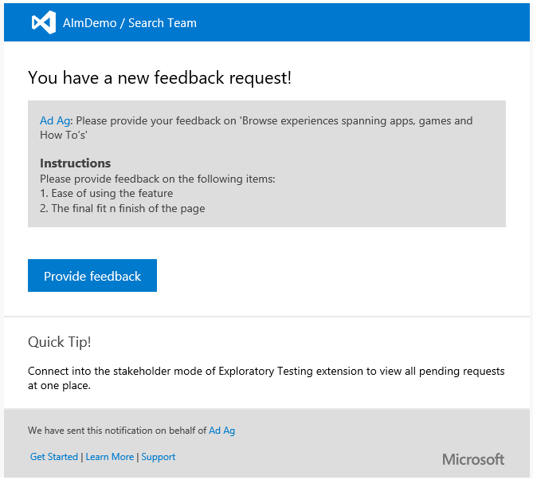
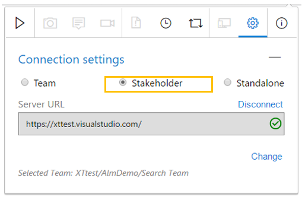
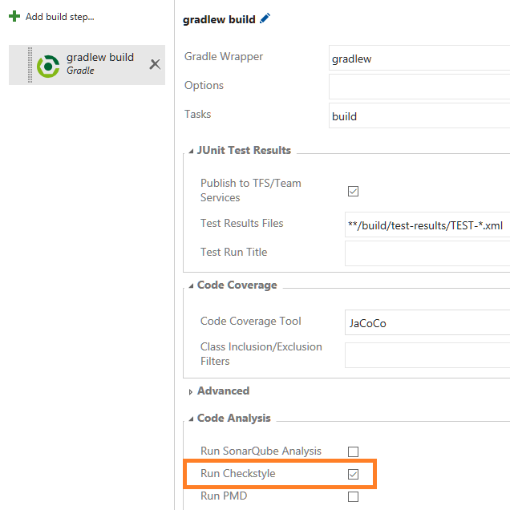

# Custom work item types and stakeholder support for exploratory testing – Sept 2

We have some exciting new features this sprint!

## Custom work item types

I’m very happy to roll out in this latest sprint the ability to create custom work item types (WITs) and place them on the backlog and board level of your choice. Choose the fields, layout, and color for each custom type you add, and then use them in your projects as needed. For more information about all the capabilities here, see [Custom work item types on Team Services](https://blogs.msdn.microsoft.com/visualstudioalm/?p=20935).

## Work item history tab

The work item history tab has been redesigned to provide a better experience for exploring changes made to work items. Individual revisions are now grouped by date buckets and summarized in a left pane, complete with adornment icons that help you quickly identify changes. Quickly scan the history pane to spot the revisions with comments, work item state changes, assignment changes, attachments, and links. We’ve also made quite a few “under the hood” changes to ensure better performance for work items with lots of revisions.

## Managing a NuGet package's lifecycle

It's now easier to deprecate and remove NuGet packages you’re not using. Look for the new **Unlist** and **Delete** buttons next to a package's name. Unlisting a package hides it from search results and prevents it from being restored except when the exact version is requested by the NuGet client. This operation is equivalent to running nuget.exe delete on the command line, and is reversible by clicking the Relist button. Deleting a package is a permanent operation that prevents restoration of the package. This option will break builds that depend on this package. In addition, at present feeds are immutable, so they will not accept a new package with the same version as a deleted package.

Note: You must be a feed contributor to unlist and a feed owner to delete a package.

## Build queue tab

We've implemented a new design for the Queued builds page that shows a longer list of queued and running builds, and in a more intuitive fashion. Let us know what you think.

## Hosted build pool build agent

The Hosted Build Pool is migrating to the 2.x build agent. We expect this migration to be a non-event for the vast majority of users. However, we have seen a few cases where custom build tasks are not compatible due to reflection across internal APIs or reliance to specific agent folder layout. If you run into any issues, please let us know.

## Xamarin License step removed

The Xamarin License step is no longer necessary and has been removed from the build templates shipped with VSTS and TFS 15. As part of this effort we will also deprecate the task. All build definitions that use this task should be updated to remove it in order to prevent any disruption when the task is finally removed.

## Jenkins with untrusted SSL certificates

Jenkins connections can now be configured to accept untrusted SSL certificates of Jenkins servers. This is useful when Team Services service hooks or build/release processes integrate with Jenkins. For example, if a Jenkins server is configured to use SSL with a self-signed certificate or a certificate that cannot be verified by a Certificate Authority (CA), this setting will allow administrators to deliberately trust the certificate anyway. For more information about Jenkins integration capabilities, see [Team Services Integration with Jenkins Jobs, Pipelines, and Artifacts](https://blogs.msdn.microsoft.com/visualstudioalm/2016/08/18/tfs-integration-jenkins-jobs-pipelines-artifacts/).

## Apple App Store extension

We’ve released a new extension in our marketplace with deployment tasks for automating the release and promotion of app updates to the Apple App Store, including releasing updates to TestFlight for Beta Testing. This reduces the effort needed to keep your deployments up-to-date, since you can simply push changes to the configured source control branches and let your CI or CD processes take care of the rest. For more information, see [https://marketplace.visualstudio.com/items?itemName=ms-vsclient.app-store](https://marketplace.visualstudio.com/items?itemName=ms-vsclient.app-store).

## Request feedback

You can now request feedback from stakeholders directly from features/stories using the **Request Feedback** option in the work item menu. Provide a simple set of instructions that are sent to them directly, prompting for the areas of the product you’d like input.

Stakeholders can respond to the feedback request by clicking the **Provide feedback** link, which automatically configures the Exploratory testing extension with the selected feedback request (it will prompt to install the extension, if not already installed). Stakeholders can then use the full capture capabilities of the extension to capture their findings and submit their feedback in the form of feedback response/bug/task work-items.

In addition to the solicited flow mentioned above, stakeholders can also use the extension to provide voluntary feedback. They can invoke the extension, select the **Stakeholder** mode in the Connection settings page, and connect to the account and Project/Team to whom they wish to provide feedback. They can then use the extension to capture their findings and submit their feedback in the form of feedback response/bug/task work-items.

## Checkstyle static analysis

You can now request a [CheckStyle](https://docs.gradle.org/current/userguide/checkstyle_plugin.html) standalone analysis based on the [Sun Java rules](https://raw.githubusercontent.com/checkstyle/checkstyle/checkstyle-6.1.1/sun_checks.xml) in the Gradle build task. The Artifact tab of the build summary contains the results of the CheckStyle static analysis. This now works in every agent (including the Hosted agent).

## Deployment manual intervention

You can now pause execution during deployment to an environment. Including a **Manual Intervention** task enables you to pause a deployment, perform manual steps, and then resume further automated steps. You can also reject the deployment and prevent further steps from executing after a manual intervention.

You should note that a manual intervention task splits the overall execution into three phases. The first phase runs on an agent, and after it is done, the agent is released. The manual intervention phase does not require any agent. After it is completed, any tasks following the manual intervention task are run in the third phase, possibly on a different agent. The artifacts are downloaded during both the agent phases, since different agents may be used for both of them. You should not assume that the state from the first phase is available during subsequent phases.

## Service endpoint improvements

A **Test** option has been added to all the endpoint creation dialogs so that users can first test that the entered values are accurate. The **Test** link makes a REST call to the external service using the information entered, and returns success when the REST call passes.

Another enhancement to the endpoints is the introduction of icons. Endpoint type authors can specify the icon to be displayed for each endpoint of their new type.

## SQL database deployment task

The Azure SQL Database Deployment task has been enhanced to run SQL scripts against an Azure SQL DB. The scripts can be provided as a file or inline within the task.

## User lifecycle management improvements

We made changes to better support securing access to your Team Service. Check out this [blog post](https://blogs.msdn.microsoft.com/visualstudioalm/2016/08/23/user-lifecycle-management-improvements-in-visual-studio-team-services/) for all the details.

As always, if you have ideas on things you’d like to see us prioritize, head over to [UserVoice](https://visualstudio.uservoice.com/forums/330519-vso) to add your idea or vote for an existing one.

Thanks,

Aaron Bjork
