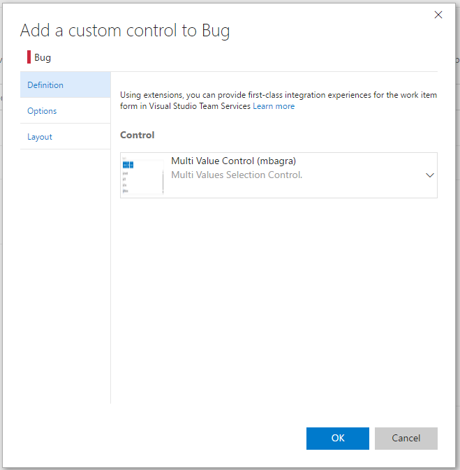
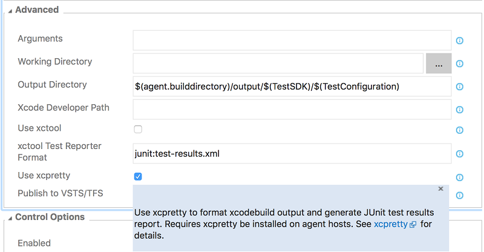

# Import Git repos and view work item attachments – Sept 21

We have some exciting new features this sprint!

## View work item attachments

Continuing to improve the work item attachment experience, you can now view attached images without leaving the work item. When you click an image in the attachment grid, we will create a lightbox to view the image. 

## Work item type layout improvements

Our layout admin page for work item types has been improved so that group and page contributions can be managed at a work item type level. You can now hide group and page contributions from particular work items and control their positioning in the new form to optimize your process.

Another improvement in this area is the ability to add custom controls to your work item form. Developers can target this contribution and you will be able to add and configure them for your different work item types. 

## Disable work item types

With this release, you can disable both inherited and custom work item types. Disabling a work item type will prevent creation of new work items of that type. Existing work items will continue to appear on the backlog/board and query results, and can still be modified.

To disable a work item type, go to the work item type’s **Overview** tab on the **Process** administration page and check the disable box.

## Import repository

Customers can now import a Git repository from GitHub, Bitbucket, GitLab, or other locations. You can import into either a new or an existing empty repository.

### Import into a new repository
From the repository selector drop-down, click **Import repository**. 

If the source repository is a publicly available repository, then simply provide the clone URL of the source repository and you are good to go.

However, if the source repository is a private repository and can be accessed using basic authentication (username-password, personal access token, etc.), then check the “Requires authorization” check-box to provide the corresponding credentials.

### Import into an existing empty repository

On the **Files page**, click the **Import repository** button and provide the clone URL. You will need to provide credentials if the source repository is private and requires authentication. 

## Markdown preview button

When viewing a diff of a markdown file in a commit, push, or pull request, you can now easily toggle to see the resulting rendered view.

## Confirmation for deleting repos

To prevent accidental repository deletions, you now have to type the name of the repository that you wish to delete to confirm the action.

## Add .gitignore during repo creation

While creating a new Git repository, customers can now add and associate a .gitignore file with their repository. A .gitignore file specifies files that Git should ignore while performing a commit. 

The dialog allows users to select one of the many available .gitignore templates. 

## Verify bugs from work item

You can now verify a bug by re-running the tests which identified the bug. You can invoke the **Verify** option from the bug work item form context menu to launch the relevant test case in the web runner. Perform your validation using the web runner and update the bug work item directly within the web runner.

## Xcode task xcpretty formatting

You can now format your xcodebuild output with [xcpretty](https://github.com/supermarin/xcpretty). You can also publish JUnit test results to Team Services with xcodebuild. Previously, [xctool](https://github.com/facebook/xctool) had to be used as the build tool to publish test results. Now, to enable xcpretty, check **Use xcpretty** and uncheck **Use xctool** in the **Advanced** section of the Xcode task.

## Publish Jenkins test and code coverage results 

The **Jenkins Queue Job** build and release task can now retrieve test and code coverage results from a Jenkins job or pipeline. This requires installation of the TFS Plugin for Jenkins 5.2.0 or later on your Jenkins server and configuring the post-build action **Collect Results for TFS/Team Services**. After results are retrieved from Jenkins, they can be published to Team Services with the **Publish Test Results** or **Publish Code Coverage** build tasks.

## Build summary for Maven and Gradle tasks

When you enable the **Run SonarQube Analysis** option in the Maven or Gradle build tasks, you get a link on the SonarQube project. You can request a full analysis to see the quality gates details, and choose to break the build if they are not met.

## FindBugs and CheckStyle in Maven build tasks

You can now request FindBugs and CheckStyle standalone static analysis in the Maven build task (in addition to the PMD analysis). The results of the static analysis appear in the build summary, and resulting files are available from the Artifact tab of the build result.

## Deployment status widget

A build can be deployed and tested in different release environments across multiple release definitions. In such a scenario, the **Deployment status** widget shows you a consolidated status of the deployment and test pass rate across multiple environments for a recent set of builds from a build definition.

If you have ideas on things you’d like to see, head over to [UserVoice](https://visualstudio.uservoice.com/forums/330519-vso) to add your idea or vote for an existing one.

Thanks,

Jamie Cool
