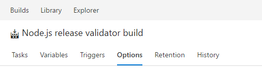
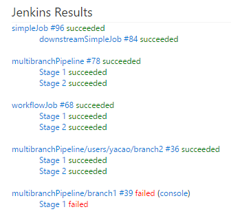

#Delivery timeline markers, git graph, and build and release improvements – Apr 19

This deployment, we introduce the git graph. We’ve also updated many build and release tasks and extensions, as well as made improvements to the Marketplace.

##Delivery timeline markers
Have you been looking for a way to highlight key dates on your [Delivery Plan](https://blogs.msdn.microsoft.com/visualstudioalm/2017/01/23/new-feature-delivery-plans-for-visual-studio-team-services/)? Now you can with plan markers. Plan markers let you visualize key dates for teams directly on your deliver plan. Markers have an associated color and label. The label shows up when you click the marker dot.

##Visualize your git repository
Team Services now supports showing a graph while showing commit history for repositories or files. Now you can easily create a mental model of all your branches and commits for your git repositories using git graph. The graph shows all your commits in topological order. 

The key elements of the git graph include:
1. The git graph is right-aligned, so commits associated with the default branch or the selected branch appear on the right while the rest of the graph grows on the left.
2. Merge commits are represented by grey dots connected to their first parent and second parent. 
3. Normal commits are represented by blue dots.
4. If the parent commit of a commit is not visible in the view port on the next 50 commits, then we excise the commit connection. Once you click the arrow, the commit is connected to its parent commit.

##Git commit comments use the new discussion control
Like we added for TFVC last sprint, lightweight comments left on git commits has been updated to use the new discussion control. This brings support for Markdown in those comments, and rounds out all of the code-commenting features in the web for both git and TFVC to use the latest experience.

##Improved package list
As part of moving the updated Package Management web experience to an on-by-default preview, we made a few final tweaks. Most visibly, we’ve added more metadata (source and release views) to the package list and also made the columns resizable.

##Build tool installers

> **Preview feature**
>
> To use this capability you must enable the **Task tool installers** [preview feature](/azure/devops/project/navigation/preview-features) for your account.

Have you been wishing you could install a tool or runtime on the fly (even on a hosted agent) just in time for your CI build? Do you need to validate your app or library against multiple versions of a dependency such as Node.js? Today we're announcing tool installers that enable you to install one or more versions of tools sets on the fly.

For example, you could set up your build process to run and validate your app for multiple versions of Node.js. First specify a comma-delimited list of versions in a variable that you can modify at queue time.

Next enable multi-configuration. If you've got enough agents and concurrent pipelines, you can even run the builds in parallel.

And last, add the Node.js tool installer task.

Save and queue the build, to see your app validated with multiple versions of Node.js.

At the moment we've got the Node Tool Installer task. We don't yet have runtime environments like Java, or tools like NuGet or cURL.

Want to try it? See [Tool installers](/azure/devops/build-release/concepts/process/tasks#tool-installers).

##SSH deployment improvements
The __Copy Files Over SSH__ build/release task now supports tildes(~) in the destination path to simplify copying files to a remote user’s home directory.  Also, a new option allows causing the build/release to fail when no files are found to copy.

The SSH build/release task now supports running scripts with Windows line endings on remote Linux or macOS machines.

##Deploy to Azure Government Cloud
Customers with Azure subscriptions in Government clouds can now configure [Azure Resource Manager service endpoint](/azure/devops/build-release/concepts/library/service-endpoints#sep-azure-rm) to target national clouds.

With this, you can now use Release Management to deploy any application to Azure resources hosted in government clouds, using the same deployment tasks.

##Timeout enhancements for the Manual Intervention task 
The __Manual Intervention__ task can now be automatically rejected or resumed after it is pending for the specified timeout or 60 days, whichever is earlier. The timeout value can be specified in the control options section of the task. 

##Release Logs Page Improvements
In this deployment, we have improved the release logs page experience:
* You can directly click the URLs in the log viewer.
* You can search for keywords in the logs.
* You can view large log files without downloading them.

##Azure App Service task enhancements and templates for Python and PHP applications
New __Azure App Service__ release definition templates have been added for deploying Python (Bottle, Django, Flask) and PHP applications. The new template contains the updated __App Service Deploy__ task. 

When the Python release definition template is used, the __App Service Deploy__ task gets prepopulated with an inline deployment script which makes pip (dependency manager) install the applications dependencies. The correct web.config gets generated based on the Python framework used.

When the PHP release definition template is used, the __App Service Deploy__ task gets pre-populated with a deployment script which makes Composer (dependency manager) install the application’s dependencies.

##Deploy Java to Azure Web Apps
The __Azure App Service Deploy__ build/release task now supports deployment of Java WAR files to an Azure Web App.  When creating a new build definition, you can choose to begin with a new build template: __Java Deploy to Azure Web App.__ This simplifies getting started by building your project with Ant, Gradle, or Maven, and deploying the results to Azure.  An Azure Web App slot can be specified to allow uploading to a staging slot before swapping that deployment with a production slot.

##Java code coverage enhancements

The __Publish Code Coverage Results__ build task reports Cobertura or JaCoCo code coverage as part of a build.  It now supports specifying wildcards and minimatch patterns in __Summary File__ and __Report Directory__ fields, allowing the files and directories to be resolved on a per-build basis for paths that change between builds.

##Maven and SonarQube improvements
The Maven build task now allows specifying a SonarQube project for analysis results in cases where it differs from what is specified in the Maven pom.xml file.

##Improved Jenkins integration
The __Jenkins Queue Job__ build/release task now supports running Jenkins multibranch pipeline jobs while displaying the Jenkins console output in Team Services.  Pipeline results are published to the Team Services build summary.

##Google Play extension enhancements
The [Google Play extension](https://marketplace.visualstudio.com/items?itemName=ms-vsclient.google-play) now supports simultaneously releasing and replacing multiple APK version codes at a time, replacing registered screenshots with a new set to avoid accumulation, and explicitly specifying the locale of a change log.

##iOS DevOps enhancements
The [Apple App Store extension](https://marketplace.visualstudio.com/items?itemName=ms-vsclient.app-store) now supports two-step verification (two-factor authentication) and releasing builds to external testers.

__Install Apple Certificate (Preview)__ is a new build task that installs a P12 signing certificate on the agent for use by a subsequent Xcode or Xamarin.iOS build.

__Install Apple Profile (Preview)__ is a new build task for installing provisioning profiles on the agent for use by a subsequent Xcode or Xamarin.iOS build.

MSBuild, Xamarin.Android, and Xamarin.iOS build tasks now support building with the Visual Studio for Mac tool set.

##Extension hub for Marketplace Publishers
We are launching a new feature for our publishers in Marketplace to help track and analyze how the extension is performing and take required actions from the new extension hub. To view the extension's hub, visit your [publisher page](https://marketplace.visualstudio.com/manage) and select the extension.

###Uninstall
Now you will have access to how many users have uninstalled your extension, what are they sharing as feedback, top reasons of uninstall and daily trend of uninstall to take the required actions. You can use search for text and dates to analyze and draw more insights from the detailed feedback. If your extension is paid you can also use Contact feature to reach out to your users for transactional communication. Marketplace will broker the first communication with the user as our privacy policy doesn’t allow direct sharing of customer email address. Refer the [Marketplace Publisher Agreement](https://aka.ms/vsmarketplace-agreement) for guidance on communication with customers.  

###Ratings and Review
This tab will give you the information of the average rating for the selected time period, the average rating by number of reviewers, and the daily trend of average rating. The details section provides all the reviews and your responses in transactional view. You can take actions of **Reply** or **Edit** of a previous response and better manage engagement with your extension users.  You can also **Appeal** to void a review from this tab if the issue reported is due to Marketplace or the underlying platform. If the issue is valid, we shall void the rating. 

###Export to Excel
Uninstall, Rating and Review, and Acquisition data are also available for download in XLS format to aid creating your own custom reports. Acquisition data in the user experience will be available shortly. 

##Contact extension customers
Publishers of paid extensions can now reach out to the customers for transactional communication. This can be done via the contact action in the new Publisher stats reports page. 

##Request Marketplace feedback to be excluded from ratings
You can now appeal to void a rating from the publishers hub if it the issue reported is due to the Marketplace or the underlying platform. Visit the extension report __Rating and Review__ tab and select the __Appeal__ action and write to the Marketplace admin team for review. If the issue is valid, we will void the rating. 

We think these features will help improve your workflows while addressing feedback, but we would love to hear what you think. Please don’t hesitate to send a smile or frown through the web portal, or send other comments through the [Team Services Developer Community](https://developercommunity.visualstudio.com/spaces/21/index.html). As always, if you have ideas on things you’d like to see us prioritize, head over to [UserVoice](https://visualstudio.uservoice.com/forums/330519-vso) to add your idea or vote for an existing one.

Thanks,

Jamie Cool
