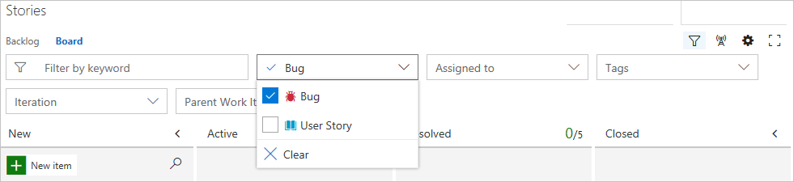
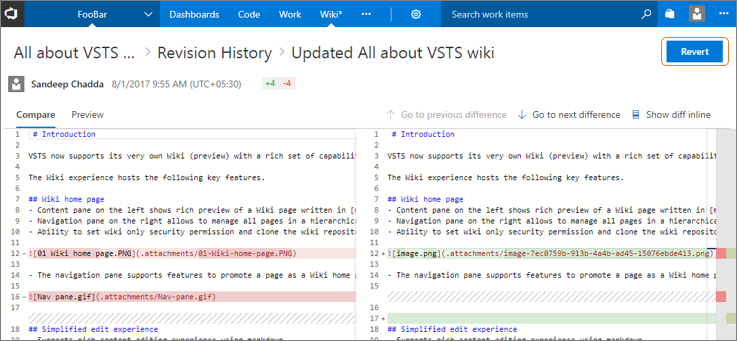
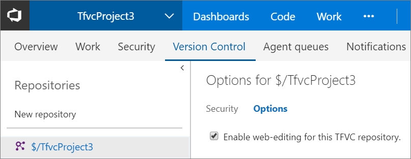
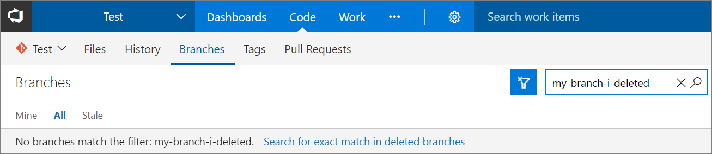
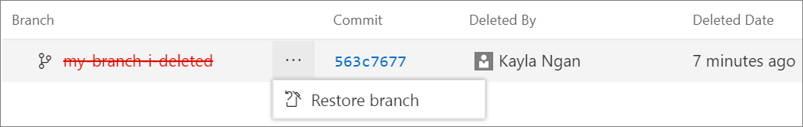
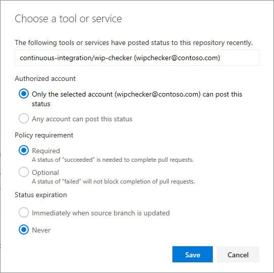

#Visual Studio Team Services (VSTS) Sprint 121 Update

In the __Sprint 121 Update__ we’re introducing the native Wiki in Visual Studio Team Services (VSTS) and a number of features to make VSTS better integrated and more consistent across your workflow. Some feature highlights include:
- [Wiki in Public Preview](#wiki-in-public-preview) - Help your team members understand, use, and contribute to your project.
- [Ansible integration for Release](#ansible-extension-on-marketplace) - Execute a playbook on inventory nodes with Ansible.
- [Branch management (stale, re-create, pushes page)](#identify-stale-branches) - Identify stale branches, re-create deleted branches, and view pushes.
- [Pull Request extensibility in Public Preview](#pull-request-status-extensibility-in-public-preview) - Use the new API to extend the Pull Request workflow.
- [Improved exploratory testing traceability](#exploratory-testing-traceability-improvements-for-work-item-links-iterations-and-area-paths) - Improved testing work item defaults and linking
- Filter consistency across [boards](#filtering-on-kanban-board) and [test cases](#filters-for-test-case-work-items-in-test-plans-and-suites-in-test-hub) - Find the work items you care about quickly.

We will also start asking a few of you for feedback from within VSTS to help us make the product better. Read more about in-product feedback in the [Feedback](#feedback) section below.

##Work
###Copy work item processes
You can now create a copy of an inherited process to use as a starting point for a new process, or to prepare and test process changes.

If you make a change to the process that is used by one or more team projects, each of these team projects will see these changes immediately. Often, that is not what you want. Instead, you want to bundle the changes to your process and test your changes before they are rolled out to all team projects. You can do this by following these steps:
1. Create a copy of the process that you want to change.
2. Make your changes to the duplicated process. Since no team project is using this process, these changes are not affecting anyone.
3. To test your changes, create a test project based on this duplicated process if you don't have any yet. If you have already created a test project before, you can change the process of the test project using the __Change team project to use \<process name\>__ option from the context menu.
4. Now it is time to deploy the changes. To do this, you change the process of the team projects which need the new changes. Select the __Change team project to use \<process name\>__ option from the context menu.
5. Optionally, you can disable or delete the original process.

###Updated order of the last column in the Kanban board
If you added a custom state to your work item type, you might have noticed that the last column on the Kanban board always presented the card that was closed earliest. We’ve found that seeing the card closed most recently is often more helpful. 

The root cause of this behavior is that the last column of the Kanban board is ordered descending on the __Closed Date__ field. In our processes (Scrum, Agile, CMMI), each work item type includes rules to set this field when it is transitioned to the __Closed__ or __Done__ state (depending on the process and work item type). However, if you add a custom state we didn't automatically add rules to set the __Closed Date__ field to support the new state. If you’d move a work item from the __New__ state to the __Closed__ or __Done__ state, the __Closed Date__ would have an empty value. Our query engine puts empty values on top when ordering descending. So on the Kanban board, you would see the cards on top that were closed earliest.

We first made sure that we are adding the right set of rules to the work items in case you are adding a custom state. You will not see an empty __Closed Date__ anymore when closing a work item.
We will not backfill existing closed work items. To ensure that you will see the most recently closed cards on the top in the Kanban board, we have also updated the ordering logic on the last column of the Kanban board to put cards with empty values for the __Closed Date__ field at the bottom.

###See the projects using a process
If you want to know the team projects which use your process, you can now navigate to the new page to show all projects that are using your process.

###Filtering on Kanban board
Our Kanban board experiences now makes use of our common filtering component and is consistent with our grid filtering experience for work items. This new filtering control brings improved usability and a consistent interface to all members of your team.

With the move to the common filtering component here and in other experiences, the search interaction in our command bar has changed its position and now appears with the rest of our filters. To access it simply click the filter icon. Searching for your work items is still one click away and clicking on this icon immediately sets focus on the keyword filter. In the upcoming sprint we will enable a keyword shortcut (Ctrl + F) that will allow members of your team to bring the filter in view by only using their keyboard. Note how the search interaction was previously next to the filter button.

##Code
###Wiki in Public Preview
Each project in VSTS now supports its own Wiki. Now you can conveniently write pages that help your team members understand, use, and contribute to your project. 

Some of the key features of the new Wiki include:
- Simplified editing experience using [markdown syntax](https://visualstudio.microsoft.com/docs/reference/markdown-guidance).

- Powerful page management pane that allows to reorder, re-parent, and manage pages. 
- Ability to filter pages by title for large wikis.

- [Offline updates](/azure/devops/project/wiki/add-edit-wiki#clone-your-wiki-repo-and-edit-wiki-pages-offline) of Wiki for power users.

Learn more about [getting started with Wiki](/azure/devops/project/wiki/add-edit-wiki#create-your-wiki-and-first-wiki-page). 

The [Wiki extension](https://marketplace.visualstudio.com/items?itemName=ms-devlabs.wiki) on the Marketplace is now deprecated. If you are an existing Wiki extension user, then you can migrate your wiki pages to the new wiki using an this [migration tool](https://github.com/Microsoft/vsts-wikiTools). Learn more to [migrate your existing wiki pages to the new Wiki](/azure/devops/project/wiki/migrate-extension-wiki-pages).

###Improvements in Wiki edit experience
The new Wiki edit experience now supports HTML tags in markdown. 

You can also conveniently resize images in the markdown folder.

###Revert a Wiki revision
As you use Wiki more, there is a chance you’ll save unintended changes. Now you can revert a revision to a Wiki page by going to the revision details and clicking on the __Revert__ button.

###Create a Wiki page from a broken link
During Wiki creation, we’ve observed a pattern that people create a table of contents on a Wiki page that includes non-existent links. Then people would click on these links to create the actual pages. In our earlier experience, we were handling this scenario by giving a warning suggesting that the link was broken, or that the page did not exist. Now, we are handling this as a mainstream scenario for Wiki by allowing you to create pages instead.

###Setting to turn off web editing for TFVC repos
Teams that use TFVC often use check-in policies in Visual Studio to ensure code quality. However, because check-in policies are enforced on the client, code that is edited on the web isn’t subjected to the same policies.

Several people have asked for a way to disable web-editing to protect against changes that bypass check-in policies. We’ve enabled a way for you to turn off web-editing (adding, deleting, renaming, and editing) for TFVC on a project/repository basis.

To disallow web-editing from the **Files** page go to __Settings__, then __Version Control__. Click on the TFVC repo in the tree, navigate to the Options pivot, and uncheck **Enable web-editing for this TFVC repository.** By default, web-editing is enabled. Note: Editing the README from the __Project Overview page__ is unaffected.

If you attempt a web-edit in a project with web-editing disabled, you will be notified that web-editing is not allowed.

This has been developed based on a [related suggestion](https://visualstudio.uservoice.com/forums/330519-team-services/suggestions/9699246-quick-code-editing-switch-or-warning).

###Identify stale branches
Keeping your repository clean by deleting branches you no longer need enables teams to find branches they care about and set favorites at the right granularity. However, if you have lots of branches in your repo, it can be hard to figure out which are inactive and can be deleted. We’ve now made it easier to identify “stale” branches (branches that point to commits older than 3 months). To see your stale branches, go to the **Stale** pivot on the **Branches** page.

###Search for a deleted branch and re-create it
When a branch is accidentally deleted from the server, it can be difficult to figure out what happened to it. Now you can search for a deleted branch, see who deleted it and when, and re-create it if you wish.

To search for a deleted branch, enter the full branch name into the branch search box. It will return any existing branches that match that text. You will also see an option to search for an exact match in the list of deleted branches. Click the link to search deleted branches.

If a match is found, you will see who deleted it and when. You can also restore the branch.

Restoring the branch will re-create it at the commit to which is last pointed. However, it will not restore policies and permissions.

###Branch updates page is now Pushes
The **Branch Updates** page has tremendous value. However, it was hidden as a pivot under the **History** hub. Now the branch updates page will be visible as a hub called **Pushes** under **Code**, alongside **Commits**, **Branches**, **Tags**, and **Pull Requests**. The new URL for the pushes page is: https://\<accountname\>/\<projectname\>/_git/\<reponame\>/pushes. The old URLs will continue to function.

At the same time, the **History** hub is now renamed to **Commits** since the hub only shows commits. We received feedback that people were finding it difficult to troubleshoot commit related issues because the commit list view only showed detailed time on-hover. Now the commit list view across VSTS will show date and time in dd/mm/yy hh:mm format. The new URL for commits page is: https://\<accountname\>/\<projectname\>/_git/\<reponame\>/commits. The old URLs will continue to function.

###Retain filename when moving from Files to Commits
We heard feedback from people that when they filter the directory to a particular file in the **Files** pivot of the **Code** hub and later flip to the **History** pivot, the filename doesn’t persisted if the commit changed more than 1,000 files. This resulted in people having to load more files and filter content to find the file and was impacting productivity. Developers normally work in the same directory and want to persist to the directories they work in as they trace changes. Now, we persist the filename as you move between **Code** hub pivots regardless of the number of files changed in a commit. This means that you do not have to click on **Load More** to find the file you want.

###Pull Request Status Extensibility in Public Preview
Using branch policies can be a great way to increase the quality of your code. However, those policies have been limited to only the integrations provided natively by VSTS. Using the new PR Status API and the corresponding branch policy, 3rd party services can participate in the PR workflow just like native VSTS features.  

When a service posts to the Status API for a pull request, it will immediately appear in the __PR details__ view in a new __Status__ section. The status section shows the description and creates a link to the URL provided by the service. Status entries also support an action menu (...) that is extensible for new actions to be added by web extensions.  

Status alone does not block completion of a PR - that’s where the policy comes in. Once PR status has been posted, a policy can then be configured. From the branch policies experience, a new policy is available to **Require approval from external services**. Select **+ Add service** to begin the process.

In the dialog, select the service that’s posting the status from the list and select the desired policy options.  

Once the policy is active, the status will be shown in the __Policies__ section, under __Required__ or __Optional__ as appropriate, and the PR completion will be enforced as appropriate. 

To learn more about the status API, and to try it out for yourself, check out the [documentation](https://go.microsoft.com/fwlink/?linkid=854107) and [samples](https://go.microsoft.com/fwlink/?linkid=854108).

##Build
###Let contributed build sections control section visibility
Previously if you were using an extension that had build tasks and build summary sections, you’d see the build summary section even if you weren’t using the build task in that build. Now, you can choose to hide or show that section in the build summary page by adding the following line in your extension code and setting the value to true or false: 

`VSS.getConfiguration().setSectionVisibility("$(publisherId).$(extensionId).$(sectionId)", false);`

View the sample included in the [Microsoft vsts-extension-samples repository](https://github.com/Microsoft/vsts-extension-samples/blob/master/build-results-enhancer/src/enhancer/status.ts).

###Variable group support
Variable groups have been available to use in release definitions, and now they are ready to be used in build definitions too. Learn more about [creating a variable group](https://visualstudio.microsoft.com/docs/build/concepts/library/variable-groups). This has been developed and prioritized based on related suggestions for [project-level build/release variables](https://visualstudio.uservoice.com/forums/330519-team-services/suggestions/14515326-project-level-build-release-variables) and [variable groups in build definitions](https://visualstudio.uservoice.com/forums/330519-team-services/suggestions/17646697-make-library-variable-groups-available-for-use-in).

###dotnet task supports authenticated feeds, web projects
The next major version of the __dotnet__ task (2.x) addresses many of your feedback requests and fixes a set of bugs we’ve tracked for a while.
1. First, __dotnet__ now supports authenticated package sources like Package Management, so you don’t need to use the __NuGet__ task anymore to restore packages from private package sources.
2. The behavior of __Path to project(s)__ field has changed in the 2.0 version of the task. In previous versions of the task, if the project file(s) matching the specified pattern were not found, the task used to log a warning and then succeed. In such scenarios it can sometimes be challenging to understand why the build succeeded but dependencies were not restored. Now the task will fail if the project file(s) matching the specified pattern are not found. This is in line with the behavior of other tasks and is easy to understand and use.
3. In previous versions of the task’s publish command, the task modified the output path by putting all the files in a folder that was named after the project file name, even when you passed an explicit output path. This makes it hard to chain commands together. Now you have control over the output path file.

We’ve also released a new **dotnet Tool Installer** task that controls the version of dotnet available on the PATH and used by the new dotnet task. So, to use a newer version of __dotnet__, just add a __dotnet Tool Installer__ task at the beginning of your build. 

##Release
###Ansible Extension on Marketplace 
We have released a new [extension](https://marketplace.visualstudio.com/items?itemName=ms-vscs-rm.vss-services-ansible) that includes a build/release task to integrate with [Ansible](http://docs.ansible.com/ansible/latest/index.html) and execute a given **Playbook** on a specified list of **Inventory** nodes via command line interface.
Ansible uses **[Playbooks](http://docs.ansible.com/ansible/latest/playbooks.html)** which express configurations, deployment, and orchestration steps in YAML format. Each **Playbook** maps a group of hosts to a set of roles. Each role is represented by calls to Ansible tasks.
An **[Inventory](http://docs.ansible.com/ansible/latest/intro_inventory.html)** file is a description of the host nodes that can be accessed by Ansible. 

The task requires that the **Playbook** and **Inventory** files be located either on a private Linux agent or on a remote machine where an Ansible automation engine has been installed. An SSH endpoint needs to be set up if the Ansible is located on a remote machine. **Inventory** can also be specified inline, as **Dynamic Inventory**, or as a **Host** list. 

###Variable groups, Retention, and Options tab now available in the new Release Definition Editor
The new Release Definition Editor continues to move toward feature parity with the old editor. With this deployment, you can now link/unlink to variable groups, set retention policy for individual environments, and modify release definition-level settings such as release number format from the **Options** tab. You can also save an environment as a deployment template, set environment level permissions, and re-order phases within the **Tasks** tab. The ability to filter/compare process variables across environments is just a couple of sprints away.

Use environment level operations to save as template and set security.

###Release status badge in Code hub
Today, if you want to know whether a commit is deployed to your customer production environment, you first identify which build consumes the commit and then check all the release environments where this build is deployed. Now this experience is much easier with the integration of the deployment status in the **Code** hub status badge to show the list of environments that your code is deployed to. For every deployment, status is posted to the latest commit that was part of the deployment. If a commit is deployed to multiple release definitions (with multiple environments) then each has an entry in the badge, with status shown for each environment. This improves the traceability of code commit to deployments.

By default, when you create a release definition, deployment status is posted for all environments. However, you can selectively choose the environments whose deployment status should be displayed in the status badge (e.g. only show production environments).

###Enhancements to Build definition menu when adding artifacts
When adding build artifacts to a release definition, you can now view the definitions with their folder organization information and simplify choosing the desired definition. This makes it easy to differentiate the same build definition name but in different folders.

The list of definitions is filtered based on those that contain the filter term.

###Revert your release definition to older version
Today, if a release definition is updated, you can’t directly revert to a previous version. The only way is to look into the release definition history to find the diff of the changes, and then manually edit the release definition.
Now, using the **Revert Definition** feature, you can choose, and revert back to any older version of a release definition from the release definition **History** tab.

##Test
###Exploratory testing traceability improvements for work item links, iterations, and area paths
Based on the feedback we received from teams doing exploratory testing, we are improving traceability links while filing bugs, tasks, or test cases from the [Test & Feedback extension](https://marketplace.visualstudio.com/items?itemName=ms.vss-exploratorytesting-web). Bugs and tasks created while exploring requirements will now be created with the same area path and iteration as that of the requirement instead of team defaults. Test cases created while exploring requirements will now be linked with a __Tests <-> Tested By__ link instead of the __Parent <-> Child__ link so that the test cases you create are automatically added to requirement based test suites. Finally, work items created while not specifically exploring any requirement will be filed in the team’s default iteration instead of the current iteration so that no new work items come into the current iteration after the sprint planning is complete.

###Screenshot and annotation support for desktop apps with Chrome browser for manual tests
We are adding support for one of the top suggestions from manual testing - capturing screenshots of desktop applications from the **Web Test Runner** in **Test** hub. Until now, you had to use **Test Runner** in **Microsoft Test Manager** to capture screenshots of desktop apps. You need to install the [Test & Feedback extension](https://marketplace.visualstudio.com/items?itemName=ms.vss-exploratorytesting-web) to use this functionality. We are rolling out support for Chrome browser, and Firefox will follow shortly thereafter. 

###Filters for Test Case work items in Test Plans and Suites in Test Hub
In addition to the filters on **Test** fields like __Outcome__, __Configuration__, and __Tester__, you can now filter on Test Case work item fields like __Title__, __State__, and __Assigned To__. 

###Test trend charts for Release Environments and Test Runs
We are adding support for **Release Environments** in the **Test Result Trend** widget so that you can track status of test environments on VSTS dashboards. Like the way you to do for test results in **Build**, you can now create trend charts showing test pass rate, count of total, passed or failed tests, and test duration for **Release Environments**. You can also filer the charts to a specific test run within an environment with the **Test Run** title filter. 

###Markdown formatting support for Test Run and Test Result comments
We are adding support for formatting **Test Run** and **Test Result** comments with [markdown syntax](https://visualstudio.microsoft.com/docs/reference/markdown-guidance). You can use this feature to create formatted text or quick links to URLs in your comments. You can update **Test Result** comments in the **Result Summary** page with **Update analysis** and **Test Run** comments in the **Run Summary** page with **Update comments** in **Test** hub.

###Add link to existing bug for a failing test
While analyzing the test result in the **Build** or **Release** summary page, or in the **Test** hub, you can now associate an existing bug to a failed test. This is helpful when a test is failing for a known reason that has a bug already filed.

##Insights
###Re-order favorite groups
You can now re-order the groups on the account **My favorites** page using the up and down arrows in each group header. 

##Marketplace
###Enable Visual Studio Code direct install option in Marketplace
To install an extension, you had to copy install command and then browse to **Visual Studio Code** and execute it. Now you can directly install the extension from the Marketplace with a single click. For those using **Visual Studio Code** in the enterprise, a VSIX package download option is also available now. Here is an example with the [PowerShell extension](https://marketplace.visualstudio.com/items?itemName=ms-vscode.PowerShell).

##Feedback
With this release, we will begin asking a small subset of you for feedback on VSTS using the industry standard “how likely are you to recommend” question, followed by an optional explanation. We expect this will give us insight into how you are feeling about VSTS overall on a regular basis so that we can learn quickly from both encouraging and critical feedback. We expect this will be a more accurate and timely approach than the email surveys we’ve relied on thus far to collect this type of feedback. 

As we roll this out, we are extremely mindful to guard against this becoming too annoying or getting in the way of your use of VSTS. We will only prompt the minimum number of people necessary to collect statistically relevant results for each major release. To further minimize interruptions, we’ll only ask people who visit the account and project home pages. Also, if you dismiss or click out of the dialog, we’ll prompt only a couple more times before we stop prompting you. We promise to ask you for feedback only once every 3 months and likely even less frequently, based on overall response rates. We also promise to read all the feedback, look for trends, and share the high-level insights with you from time to time.  

Thank you in advance for participating in this feedback channel as we continue to find ways to learn about you and improve our service to better meet your needs.  

###Problems, suggestions, or questions
We would love to hear what you think about these features. Report a problem or provide a suggestion if you have ideas on things you’d like to see us prioritize through the new feedback menu. 

You can also get advice and your questions answers by the community on [Stack Overflow](https://stackoverflow.com/questions/tagged/vs-team-services). 

Thanks,

Anand Kamat