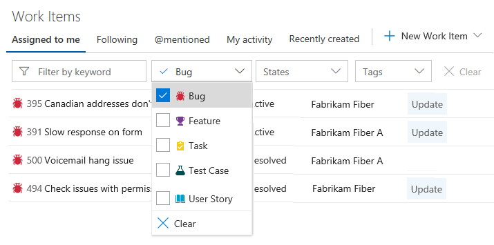
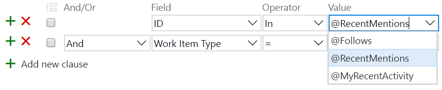
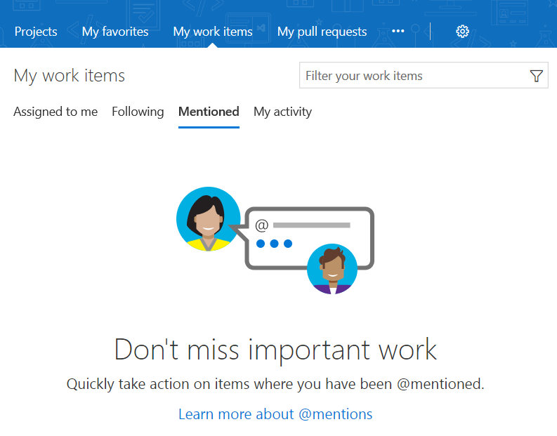
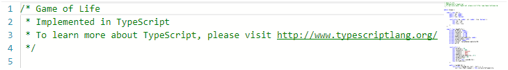
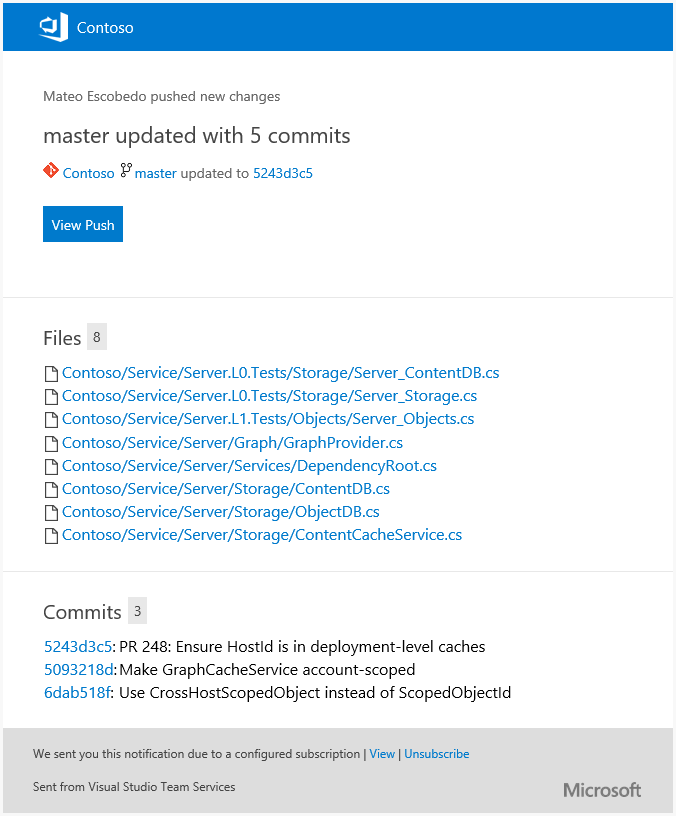
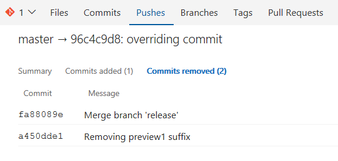
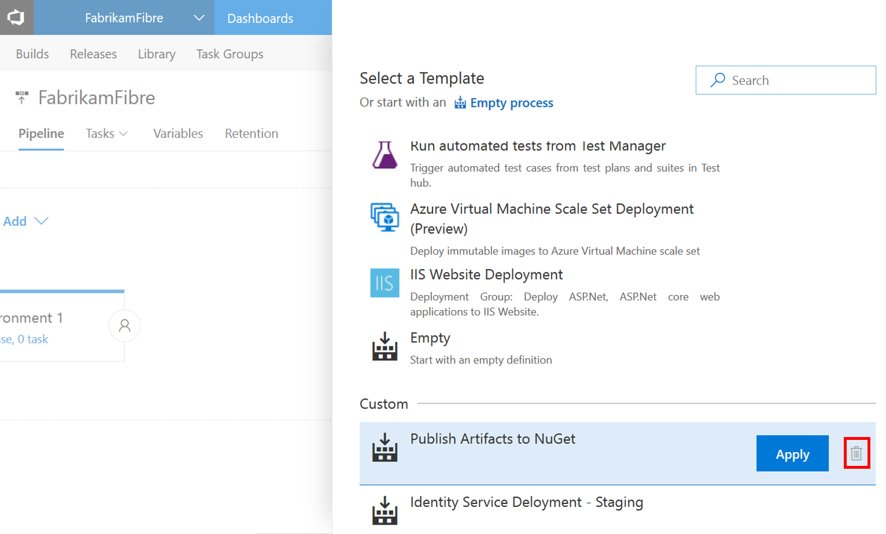
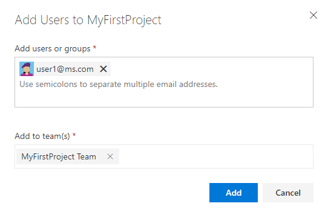

# Customizable work item rules – VSTS Sprint 122 Update

In the __Sprint 122 Update__ of Visual Studio Team Services (VSTS) we’re announcing the general availability of customizable work item rules to automate work item behavior. This is key to leveraging the simplicity of the Inheritance process model. Read more about [Customizable work item rules](#customizable-work-item-rules) below.

Some of the other key feature highlights include:

- [Forks](#fork-a-repo) - Enable broader contributions within an account.
- [Work Items hub](#work-items-hub) - Use personalized pivots to find and interact with work items important to you.
- [File minimap](#file-minimap), [Bracket matching](#bracket-matching), and [Toggle white space](#toggle-white-space) - Get a quick overview of the code and edit with ease.
- [CI builds for Bitbucket repos](#ci-builds-for-bitbucket-repositories) - If Bitbucket is your repo platform of choice, we’ve got you covered.
- [New Release Definition Editor](#new-release-definition-editor) - Rich release definition editing preview feature now turned on and generally available.
- [Streamlined user management](#streamlined-user-management) - Preview feature now turned on and generally available.

## Work

### Work Items hub

> **Preview feature**
>
> To use this capability you must have the **New Work Items Hub** [preview feature](/azure/devops/project/navigation/preview-features) enabled on your profile and/or account.

The **Work Items** hub allows you to focus on relevant items inside a team project via 5 pivots:

- Assigned to me - All work items assigned to you in the project in the order they’re last updated. To open or update a work item, click its title.
- Following - All work items you’re following.
- Mentioned - All work items you’ve been mentioned in, for the last 30 days.
- My activity - All work items that you have recently viewed or updated.
- Recently created - All work items recently created in the project.

> [!div class="mx-imgBorder"]

Creating a work item from within the hub is just one click away:

> [!div class="mx-imgBorder"]

Work items can be filtered by typing a keyword, or using different fields such as work item type, assigned to, state, and tags. These filters are remembered and you can create truly personal views for each pivot.

> [!div class="mx-imgBorder"]

While developing the new **Work Items** hub, we wanted to ensure that you could re-create each one of the pivots via the **Query Editor**. Previously, we supported querying on items that you’re following and that were assigned to you but this sprint we created two new macros: @RecentMentions and @MyRecentActivity. With these, you can now create a query and obtain the work items where you’ve been mentioned in the last 30 days or create a query that returns your latest activity. Here’s a sneak peek of how these macros can be used:

> [!div class="mx-imgBorder"]

See the [documentation for the Work Items hub](https://visualstudio.microsoft.com/docs/work/work-items/view-add-work-items) for more information.

### Customizable work item rules

Whether it be automatically setting the value of certain work item fields or defining the behavior of those fields in specific states, project admins can now use rules to automate the behavior of work item fields and ease the burden on their teams. Here are just a few examples of the key scenarios you will be able to configure using rules.

- When a work item state changes to **Active**, make **Remaining Work** a required field
- When a work item is **Proposed** and the **Original Estimate** is changed, copy the value of **Original Estimate** to the **Remaining Work** field
- When you add a custom state, with its own by/date field types, you can use rules to automatically set those fields’ values on state transitions
- When a work item state changes, set the value of custom by/date fields

> [!div class="mx-imgBorder"]

To get started with rules, simply follow these steps:

> [!div class="mx-imgBorder"]

1. Select **Customize** from the work item’s context menu
1. Create or select an existing inherited process
1. Select the work item type you would like to add rules on, click **Rules**, and click **New rule**

Check out the [documentation for custom rules](https://visualstudio.microsoft.com/docs/work/process/custom-rules) for more information.

### Mentioned support for the My work items page

We’ve added a new **Mentioned** pivot under the **My work items** page. Inside this pivot, you can review the work items where you have been mentioned in the last 30 days. With this new view, you can quickly take action on items that require your input and stay up to date on conversations that are relevant to you.

> [!div class="mx-imgBorder"]

This same pivot is also available via our mobile experience, bringing consistency between both mobile and desktop.

> [!div class="mx-imgBorder"]

### Custom Fields and Tags in Notifications

Notifications can now be defined using conditions on custom fields and tags; not only when they change but when certain values are met. This has been a top customer suggestion in UserVoice (see [6059328](https://visualstudio.uservoice.com/forums/330519-visual-studio-team-services/suggestions/6059328-use-tags-in-alerts) and [2436843](https://visualstudio.uservoice.com/forums/330519-visual-studio-team-services/suggestions/2436843-custom-fields-in-work-item-alerts)), and will allow for a more robust set of notifications that can be set for work items.

> [!div class="mx-imgBorder"]

### Inline add on Delivery Plans

New feature ideas can arrive at any moment, so we’ve made it easier to add new features directly to your **Delivery Plans**. Simply click the **New item** button available on hover, enter a name, and hit enter. A new feature will be created with the area path and iteration path you’d expect.

> [!div class="mx-imgBorder"]

## Code

### Fork a repo

> **Preview feature**
>
> This capability is enabled through the **Git Forks** [preview feature](/azure/devops/project/navigation/preview-features) on your account.
>
> With this update you can fork and push changes back **within an account**. This is the 1st step on our journey with forks. The next step will be to enable you to fork a repository into a different VSTS account.

A fork is a complete, server-side copy of a repository, including all files, commits, and (optionally) branches. Forks are a great way to isolate experimental, risky, or confidential changes from the original codebase. Once you’re ready to share those changes, it’s easy to use pull requests to push the changes back to the original repository.

Using forks, you can also allow a broad range of people to contribute to your repository without giving them direct commit access. Instead, they commit their work to their own fork of the repository. This gives you the opportunity to review their changes in a pull request before accepting those changes into the central repository.

> [!div class="mx-imgBorder"]

#### What’s in a fork

A fork starts with all the contents of its upstream (original) repository. When you create a fork, you can choose whether to include all branches or limit to only the default branch. None of the permissions, policies, or build definitions are applied. The new fork acts as if someone cloned the original repository, then pushed to a new, empty repository. After a fork has been created, new files, folders, and branches are not shared between the repositories unless a PR carries them along.

#### Sharing code between forks

You can create PRs in either direction: from fork to upstream, or upstream to fork. The most common direction will be from fork to upstream. The destination repository’s permissions, policies, builds, and work items will apply to the PR.

Read the [documentation for forks](https://visualstudio.microsoft.com/docs/git/concepts/forks) for more information.

### File minimap

You can now view a minimap of a file as you view or edit to give you a quick overview of the code. To turn on the minimap, open the **Command Palette** (F1 or right-click) and select **Toggle Minimap**.

> [!div class="mx-imgBorder"]

### Bracket matching

When editing or viewing a file, there are now guidelines on the left side to make it easy to match your brackets.

> [!div class="mx-imgBorder"]

### Toggle white space

You can now toggle white space on and off when viewing or editing a file. We are still developing a feature that will allow you to toggle white space when diff’ing. To view white space, open the **Command Palette** (F1 or right-click) and select **Toggle White Space**, which allows you to differentiate between spaces and tabs.

> [!div class="mx-imgBorder"]

### Updated email templates for push notification

Push notifications have been updated to match the new email templates that are optimized to be clear, concise, and actionable. The subject line helps you clearly distinguish push emails, identify the branch, repo, and author, and summarize the number of commits included in the push. These changes also make it easier to create rules and filters to help manage these email notifications.

The email body is consistent with other emails, emphasizing why the email was sent, who initiated the action, and exactly what happened. Specific to push alerts, the details about the repo, branch, files, and commits are all included to help inform the recipients about the scope of the changes. The main call to action for push alerts is **View Push**, which will open the pushes view for the specific push that generated the alert.

> [!div class="mx-imgBorder"]

### Complete Work Items settings

The feature to [complete work items when completing pull requests](https://visualstudio.microsoft.com/articles/news/2017/jul-14-team-services#automatically-complete-work-items-when-completing-pull-requests) now has a new repository setting to control the default behavior. The new setting to **Remember user preferences for completing work items with pull requests** is enabled by default, and will honor the user’s last state when completing future PRs in the repo. If the new setting is disabled, then the **Complete linked work items after merging** option will default to disabled for all PRs in the repository. Users can still choose to transition linked work items when completing PRs, but they will need to opt-in each time.

### Find lost commits due to a Force Push

You can perform a git force push and update a remote ref even if it is not an ancestor of the local ref. This may cause others to lose commits and it can be very hard to identify the root cause. In the new pushes view, we have made force pushes noticeable in order to help troubleshoot issues related to missing commits.

> [!div class="mx-imgBorder"]

Clicking on the force push tag takes you to the removed commit.

> [!div class="mx-imgBorder"]

### Update default repo permissions for admins

For new repositories and new projects, administrators will no longer be granted git force push permission by default. This helps prevent unintentional force pushes, such as when you forget to change branches. (**Bypass Policy** already works this way for the same reason). Administrators who need to perform a force push can update their permissions at the branch, repo, or **All Repositories** level to allow force push.

## Build

### CI builds for Bitbucket repositories

It's now possible to run CI builds from connected Bitbucket repositories. To get started, set up a [service endpoint to connect to Bitbucket](/azure/devops/pipelines/library/service-endpoints). Then in your build definition, on the Tasks tab select the Bitbucket source.

> [!div class="mx-imgBorder"]

After that, enable CI on the **Triggers** tab, and you’re good to go.

This feature works only for builds in VSTS accounts and with cloud-hosted Bitbucket repositories.

### Pause build definitions

You can now pause or disable build definitions. If you plan to make changes to your build definition and you want to avoid queuing any new builds until you are done simply disable the build definition. Similarly, if you plan to upgrade agent machines, you can choose to pause a build definition, which enables VSTS to still accept new build requests but hold them in queue without running until you resume the definition.

### Task input validations support

Typing the parameters in build definition tasks can sometimes be error prone. With task input validation, task authors can ensure appropriate values are specified. Validation expressions follow the familiar expression syntax used for task conditions and can use any of the supported functions besides the general functions supported by task conditions, including URL, IPV4, email, number range, sha1, length, or match.

Read more about the goals and usage on the [vsts-tasks repo page](https://github.com/Microsoft/vsts-tasks/blob/master/docs/taskinputvalidation.md).

## Release

### New Release Definition Editor

> **Preview feature**
>
> This capability is enabled through the **New Release Definition Editor** [preview feature](/azure/devops/project/navigation/preview-features) on your profile and/or account.

Earlier last month we announced a [preview of the new release definition editor](https://visualstudio.microsoft.com/articles/news/2017/jul-14-team-services#new-release-definition-editor-preview). Thank you to all who have been using it and giving us feedback! With this release, we have turned on the [new release definition editor](/azure/devops/pipelines/preview/new-release-landing-page) for everyone by default. An administrator can disable it from the [Preview features option](/azure/devops/project/navigation/preview-features) in their account profile menu.

### Enhancements in new Release Definition editor

#### Delete custom templates

You can now delete custom templates in the new release definition editor.

> [!div class="mx-imgBorder"]

#### Visually handle permissions on the editor

The new release definition editor now has specific in context messages to handle the various [permissions](https://visualstudio.microsoft.com/docs/build/concepts/policies/permissions#release-permissions).

#### Drag and drop tasks across phases

Using the drag/drop gesture, you can easily reorder phases or tasks within or across similar phases. Additionally you can also clone tasks using Ctrl+drag/drop.

### Release Template Extensibility

Release templates let you create a baseline for you to get started when defining a release process. Previously, you could upload new ones to your account, but now authors can include release templates in their extensions. You can find an [example on the GitHub repo](https://github.com/Microsoft/vsts-rm-extensions/tree/master/Extensions/EnvironmentTemplateSample).

### Conditional release tasks and phases

Similar to [conditional build tasks](https://visualstudio.microsoft.com/docs/build/concepts/process/conditions), you can now run a task or phase only if specific conditions are met. This will help you in modeling rollback scenarios.

If the built-in conditions don’t meet your needs, or if you need more fine-grained control over when the task or phase runs, you can specify custom conditions. Express the condition as a nested set of functions. The agent evaluates the innermost function and works its way outwards. The final result is a boolean value that determines if the task to be run.

> [!div class="mx-imgBorder"]

### Approve multiple environments

Managing approvals with releases is now simpler. For pipelines having the same approver for multiple environments that deploy in parallel, the approver currently need to act on each of the approvals separately. With this feature, you can now complete multiple pending approvals at the same time.

> [!div class="mx-imgBorder"]

### Requests history for service endpoints

Service endpoints enable connection to external and remote services to execute tasks for a build or deployment. The endpoints are configured in project scope and shared between multiple build and release definitions. Service endpoint owners can now get a consolidated view of builds and deployments using an endpoint, which can help to improve auditing and governance.

> [!div class="mx-imgBorder"]

## Test

### Upload attachments to test runs and test results

You can now attach files such as screenshots and log files to test runs or test results as additional information. Up to this point, this capability was only available through the Microsoft Test Manager (MTM) client, forcing you to switch context between the **Test** hub in VSTS/TFS and the MTM client.

### Test batching

In the Visual Studio test task in Build/Release management, options are available to control how tests should be grouped (batched) for efficient execution. Tests can be grouped in two ways:

1. Based on the number of tests and agents participating in the run, which simply groups tests into a number of batches of a specified size.
1. Based on past running time of tests, which considers past running time to create batches of tests such that each batch has approximately equal running time. Quick running tests get batched together while longer running tests may belong to a separate batch. This option can be combined with the multi-agent phase setting to reduce the total test time to a minimum.

> [!div class="mx-imgBorder"]

### JMeter 3.2 for load testing

Cloud load testing agents are now able to run the JMeter 3.2 engine. Load tests can now leverage the improved HTTP Sampler.

## Users and authentication

### Streamlined user management

> **Preview feature**
>
> This capability is enabled through the **Streamlined User Management** [preview feature](/azure/devops/project/navigation/preview-features) on your profile and/or account.

Effective user management helps administrators ensure they are paying for the right resources and enabling the right access in their projects. We’ve repeatedly heard in support calls, and from our customers that they want capabilities to simplify this process in VSTS. This sprint, we are releasing an experience to general availability, which begins to address these issues. See the [documentation for the User hub](https://visualstudio.microsoft.com/docs/setup-admin/team-services/manage-users-and-access-user-hub-team-services) for more information. Here are some of the changes that you’ll see light up:

#### Invite people to the account in one easy step

Administrators can now add users to an account, with the proper extensions, access level, and group memberships at the same time, enabling their users to hit the ground running. You can also invite up to 50 users at once through the new invitation experience.

> [!div class="mx-imgBorder"]

#### More information when managing users

The **Manage users** page now shows you more information to help you understand users in your account at a glance. The table of users includes a new column called **Extensions** that lists the extensions each user has access to.

> [!div class="mx-imgBorder"]

#### Detailed view of individual users

Additionally, you can view and change the access level, extensions, and group memberships that a specific user has access to through the context menu provided for each selected user – a one-stop shop to understand and adjust everything a user has access to.

> [!div class="mx-imgBorder"]

### Adding User to Projects and Teams

We want to make sure each of your administrators has the tools they need to easily get your team up and running. As part of this effort, we are releasing an improved project invitation dialog. This new dialog enables your project administrators to easily add users to the teams which they should be a member of. If you are a project or team administrator, you can access this dialog by clicking the **Add** button on your project home page or the **Team Members** widget.

> [!div class="mx-imgBorder"]

### Graph REST APIs in Public Preview

The **Graph REST API** resources allow developers to write applications that manage users, groups and group memberships in VSTS. The API set covers key user management scenarios including adding an MSA or AAD user to VSTS, creating a VSTS group, and adding/removing members from a VSTS group. Learn more about the API in our [documentation and samples](https://visualstudio.microsoft.com/docs/integrate/api/graph/overview).

### Profile Card

We want to promote better connections between users within VSTS. As a part of this effort, we’re updating the user profile card, which allows you to interact with, and learn more about others within your VSTS account. Through integration with your default email and IM client, you can send emails and start chats directly from the profile card. Profile cards can be activated within work items, pull requests, and security settings by clicking on the contact card icon, profile picture, or a user’s name within comments.

Azure Active Directory (Azure AD) users will be able to see a users **Reports to** hierarchy as well as direct reports.

> [!div class="mx-imgBorder"]

### Improved authentication documentation and samples

In the past, our REST documentation has been focused solely on using PATs for access to our REST APIs. We’ve updated our documentation for extensions and integrations to give guidance on how best to authenticate given your application scenario. Whether you’re developing a native client application, interactive web app, or simply calling an API via Powershell, we have clear sample on how best to authenticate with VSTS. For more information see the [documentation](https://visualstudio.microsoft.com/docs/integrate/get-started/authentication/authentication_guidance).

## Feedback

We would love to hear what you think about these features. Report a problem or provide a suggestion if you have ideas on things you’d like to see us prioritize through the new feedback menu.

> [!div class="mx-imgBorder"]

You can also get advice and your questions answers by the community on [Stack Overflow](https://stackoverflow.com/questions/tagged/vs-team-services).

Thanks,

Aaron Bjork