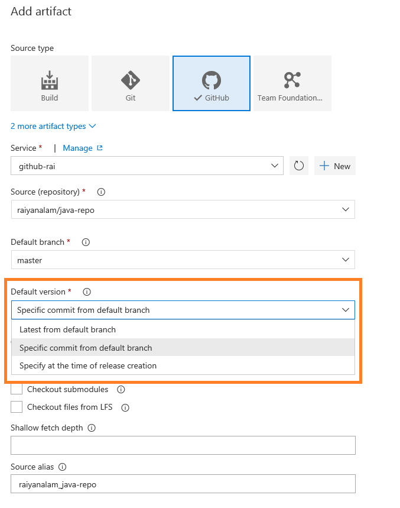
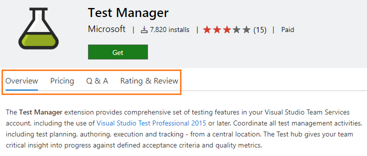
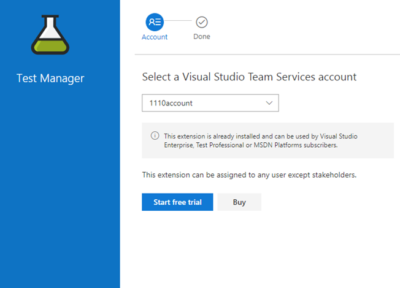
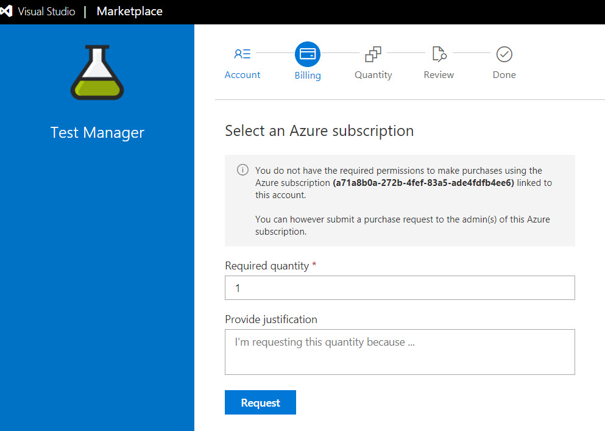

# Identify flaky tests and improved extension install experience – VSTS Sprint 127 Update

In the **Sprint 127 Update** of Visual Studio Team Services (VSTS), you’ll find new features to help you manage your test results and execution, plus a set of new Marketplace experiences to help you get even more value out of the ecosystem. Read more about the [Test](#test) and [Marketplace](#marketplace) improvements below.

Other key feature highlights include:

* [Generate YAML templates from existing build definitions](#generate-yaml-templates-from-existing-build-definitions) - Generate the corresponding YAML build logic from builds in the build definition editor.
* [Enhancements to multi-phase builds](#enhancements-to-multi-phase-builds) - Different agents, parallel tests, and conditional execution for better builds.
* [Skip scheduled builds if nothing has changed in the repo](#skip-scheduled-builds-if-nothing-has-changed-in-the-repo) - Conserve resources and avoid noise of extra builds.
* [Cloud Solution Provider (CSP) purchasing now generally available](#cloud-solution-provider-purchasing-now-generally-available) - Enable the deeper engagement that comes by working through the CSP program.

## What’s new in VSTS

> [!VIDEO https://www.youtube.com/embed/jWuRMAc0wm4?rel=0]

## Code

### Track code pushes to a Git repo to builds and releases

Now you can view the build and release status of merge commits in the **Pushes** page. By clicking the status next to the push, you’ll find the specific build or release that the push is included in so that you can verify success or investigate failure.

> [!div class="mx-imgBorder"]

### Blame now has history

The **Blame** view is great for identifying the last person to change a line of code. However, sometimes you need to know who made the *previous* change to a line of code. The newest improvement in blame can help - **View blame prior to this commit**. As the name suggests, this feature allows you to jump back in time to the version of the file prior to the version which changed a particular line, and view the blame info for that version. You can continue to drill back in time looking at each version of the file that changed the selected line of code.

> [!div class="mx-imgBorder"]

### SSH URLs are changing

> [!IMPORTANT]
> If you are using SSH with VSTS, read this section carefully. You need to update your SSH URLs if you haven’t recently.

We are moving our SSH implementation to use Azure Traffic Manager for more efficient routing. In our tests, we have found that this new approach can yield up to 5X performance improvements on many Git operations when accessing a distant VSTS instance. It does this by relying on Azure Traffic Manager to route connections to a nearby VSTS instance and then use the high-speed Azure backbone to get to distant data centers. We [added support for the new SSH URLs](https://blogs.msdn.microsoft.com/devops/2017/10/23/vsts-ssh-on-azure-global-network/) that support Azure Traffic Manager some time ago and this sprint, we are removing support for the older URLs - hence the urgent need for you to update your SSH remotes. You can read the [docs on updating your SSH URLs](/azure/devops/git/use-ssh-keys-to-authenticate) for more detail.

## Build and Release

### Generate YAML templates from existing build definitions

Last month at the [Connect(); 2017 event](https://www.microsoft.com/connectevent) we announced the public preview of [YAML builds](/azure/devops/build-release/actions/build-yaml-get-started) that enable you to configure your build process as a YAML file checked in with your code rather than with the graphical build definition editor. We’ve now made it simpler for you to convert your build definitions in the web UI into a YAML file. In the build definition editor for your build, you can select the **Process** tab on the left and then click the **View YAML** link in the pane on the right. Copy the text to the clipboard and check in a file with the contents into your repo. Then configure a new build YAML based build definition that references the checked in file.

This can also be used as a good way to learn YAML quickly. You can create a new build definition using the appropriate template for your app and examine the YAML to understand the mapping between what you’re used to and the new YAML constructs.

### Enhancements to multi-phase builds

> [!IMPORTANT]
> To use this capability, you must have the **Build with multiple queues** [preview feature](/azure/devops/project/navigation/preview-features) enabled on your account.

A few weeks ago, we added phases to build definitions. You’ve been able to use phases to organize your build steps and to target different agents using different demands for each phase. In this Update, we’ve added several capabilities to build phases so that you can now:

* Specify a different agent queue for each phase. This means you can, for example:
  * Run one phase of a build on a macOS agent and another phase on a Windows agent. To see a cool example of how useful this can be, see this Connect(); 2017 video: [CI/CD DevOps Pipeline for mobile apps and services](https://channel9.msdn.com/events/Connect/2017/B102).
  * Run build steps on a build agent pool and test steps on a test agent pool.

* Run tests faster by running them in parallel. Any phase that has parallelism configured as “Multi-agent” and contains a “VSTest” task will now automatically parallelize test execution across the configured agent count.

* Permit or deny scripts to access the OAuth token each phase. This means, for example, you can now allow scripts running in your build phase to communicate with VSTS over REST APIs, and in the same build definition block the scripts running in your test phase.

* Run a phase only under specific conditions. For example, you can configure a phase to run only when previous phases succeed, or only when you are building code in the master branch.

To learn more, see [Phases in Build and Release Management](/azure/devops/pipelines/process/phases).

### Hide empty contributed sections in build results page

VSTS extensions can contribute sections to a build report in order to add useful information to the build report. Until now, once an extension that does so is installed in a VSTS account, the build report section shows up regardless of whether or not a given build definition actually makes use of the build tasks that populate the section - resulting in a lot of empty sections in build reports. With this sprint, we rolled out changes so that build extension authors can specify which build tasks populate a build report section and the section will only appear for build definitions that use one or more of those tasks - no more empty an irrelevant build report sections.

For an example, see how the **supportsTasks** property is used in this [sample extension](https://github.com/Microsoft/vsts-extension-samples/tree/master/build-results-enhancer).

### Skip scheduled builds if nothing has changed in the repo

By [popular request on UserVoice](http://visualstudio.uservoice.com/forums/330519-visual-studio-team-services/suggestions/9378558-tfbuild-2015-run-sheduled-build-only-when-source), you can now specify that a scheduled build not run when nothing has changed in your code. You can control this behavior using an option on the schedule. By default, we will not schedule a new build if your last scheduled build (from the same schedule) has passed and no further changes have been checked in to your repo.

### Run UI tests and install software on Hosted VS2017 agents

If you’re using the **Hosted VS2017** queue, your build and release tasks now run as administrator, in interactive mode. This means you can now use this hosted pool to run UI tests and install whatever software you need.

### ASP.NET Core 2.0 agents

Agents of version 125 or newer are based on ASP.NET Core 2.0. Previously you could install a private agent only on Ubuntu and Red Hat/CentOS machines. Now you can also run your builds and releases on Oracle Linux 7, Fedora, Debian, and other distributions. See [Linux System Prerequisites]( https://github.com/Microsoft/vsts-agent/blob/master/docs/start/envlinux.md) for more information.

### Release trigger for a Package Management artifact

Now you can set a trigger on a **Package Management** artifact in a Release definition so that a new release is automatically created when a new version of the package has been published. See the [documentation for triggers in Release Management](/azure/devops/pipelines/release/triggers#release-triggers) for more information.

### Default artifact versions

There are now several default version options when linking version control artifacts to a release definition. You can configure a specific commit/changeset or simply configure the latest version to be picked from the default branch. Normally you configure it to pick up the latest version, but this is especially useful in some environments where a golden artifact version needs to be specified for all future continuous deployments.

> [!div class="mx-imgBorder"]

### Release triggers branch enhancements

You can now configure a release trigger filter based on the default branch specified in the build definition. This is particularly helpful if your default build branch changes every sprint and the release trigger filters needs to be updated across all the release definitions. Now you just need to change the default branch in build definition and all the release definitions automatically use this branch. For example, if your team is creating release branches for each sprint release payload, you update it in the build definition to point to a new sprint release branch and release will pick this up automatically.

> [!div class="mx-imgBorder"]

## Test

### Filter large test results

Over time test assets accrue and, for large applications, can easily grow to 10’s of thousands of tests. For these large applications with lots of tests, it can be hard to manage all of the test results - identifying test failures, associated root cause or ownership of issues. To improve this, we have added 2 new filters to the test results view - Container (DLLs) and Owner (Container Owner), under **Tests** tab in **Build and Release**. This makes it easy to filter the test results to the portion that is relevant to you.

> [!div class="mx-imgBorder"]

Additionally, the existing Outcome filter will now provide the ability to filter for multiple outcomes. As a user when I want to see the outcome of my tests for a change I just committed, I can filter on the Container (DLL name) or Owner (DLL owner) or both to get to the results relevant to me. We also plan to add a filter based on Test Name.

> [!div class="mx-imgBorder"]

### Identify flaky tests

Sometimes tests are flaky - they fail on one run and pass on another without any changes. Flaky tests can be frustrating and will undermine confidence in test effectiveness - causing failures to be ignored and bugs to slip through. With this Update, we’ve deployed the first piece of a solution to help tackle the problem of flaky tests. You can now configure the **Visual Studio Test** task to re-run failed tests. The test results then indicate which tests initially failed and then passed on re-run. Support for re-run of data driven and ordered tests will be coming later.

The **Visual Studio Test** task can be configured to control the maximum number of attempts to re-run failed tests and a threshold percentage for failures (e.g. only re-run tests if less than 20% of all tests failed) to avoid re-running tests in event of wide spread failures.

> [!div class="mx-imgBorder"]

In the **Tests** tab under **Build and Release**, you can filter the test results with Outcome as “Passed on rerun” to identify the tests that had an unreliable behavior during the run. This will currently show the last attempt for each test that passed on re-run. The Summary view is also modified to show “Passed on rerun (n/m)” under Total tests, where n is the count of tests passed on re-run and m is total passed tests. A hierarchical view of all attempts is coming in next few sprints.

> [!div class="mx-imgBorder"]

### Pass parameters to your test run using .testsettings file

When running automated tests using a .testsettings file, you can now pass parameters to the test, such as appURL. This information can be accessed via the TestContext object in the test code. 
You can also override these parameters in the CI/CD pipeline using the test tasks.
To use this, you need Visual Studio 2017.5 or higher.

1. In Visual Studio, open your .testsettings file using the XML editor and add the parameters you need in the “Properties” node as follows:
`<Properties><Property name="appURL" value="http://www.bing.com"/><Property name="browser" value="Edge"/></Properties>`
2. Access the parameters using the TestContext object. For e.g.
`string appURL = TestContext.Properties["appURL"].ToString();`

### Access information pertinent to test cases in your automated tests when running in the CI/CD pipeline

When running automated tests in the CI/CD pipeline using Test Plan/Test Suite or when running automated tests from the **Test** hub, crucial TCM properties can now be accessed using the TestContext object.
To use this, you need Visual Studio 2017.5 or higher.
This includes:

- \_\_Tfs_TestPlanId__
- \_\_Tfs_TestCaseId__
- \_\_Tfs_TestPointId__
- \_\_Tfs_TestConfigurationId__
- \_\_Tfs_TestConfigurationName__
- \_\_Tfs_TfsServerCollectionUrl__
- \_\_Tfs_TeamProject__

### Automated tests that use TestCase as a data source can now be run using the VSTest task

The following pre-requisites are needed:

1. Visual Studio 2017.6 or higher. If you are using the [Test Platform Installer](/azure/devops/release-notes/2017/nov-28-vsts#test) task to run tests using the VSTest task, make sure you pick the appropriate version of the package.
2. Create a [PAT](/azure/devops/accounts/use-personal-access-tokens-to-authenticate?toc=/azure/devops/organizations/security/toc.json&bc=/azure/devops/organizations/security/breadcrumb/toc.json) that is authorized for the scope “Work Items (full)”.
3. Add a secure Build or Release variable called Test.TestCaseAccessToken with the value set to the PAT created in step 2.

Note that tests that use TestCase as a data source cannot be used with the **Run Functional Tests** task.

## Marketplace

### Improved Marketplace experience

We have enabled tabs on extension description pages in the [Visual Studio Marketplace](https://marketplace.visualstudio.com/azuredevops) to make it easier to find the information you want. Now, getting to Pricing, Q&A, or Rating & Review information is easier. Even when you scroll down the page, the tabs and single call to action are always within view.

> [!div class="mx-imgBorder"]

We have also revamped how you acquire (or purchase) VSTS extensions and Visual Studio Subscriptions from the Marketplace.

* The install/purchase wizard now better adjusts the actions available to you as you progress - login, select a VSTS account, etc. We believe this will make acquiring extensions easier and more intuitive.

> [!div class="mx-imgBorder"]

* All relevant information required to change paid quantity and its billing implication is presented within the flow to make an informed purchase.

> [!div class="mx-imgBorder"]

* A progress bar displays acquisition progress and allows navigation across steps.
* We’ve made it easier for people who don’t have permission to purchase by submitting a request that will go to the account administrator.

> [!div class="mx-imgBorder"]

* An Account Administrator can now change the Azure subscription associated with a VSTS account when they do not have required permissions on the existing associated Azure subscription.

### Refreshed publisher management portal

The publisher management portal is being refreshed on the Marketplace, making it easy to view all the publishers under a login across various directories/tenants. It also shows the associated role (owner, contributor, etc). Managing members and accessing publisher details is now more accessible to aid publisher management.

As a first step in improving the publisher onboarding experience, publishers can now choose which directory/tenant the publisher is created in.

> [!div class="mx-imgBorder"]

### Virus scan of all public extensions on Marketplace

In Marketplace, we have enforced an additional gate for all public extensions: virus scan. Only after a successful scan, the extension is listed in Marketplace and available for consumers to use. This spans existing and new extensions, and all their updates. The publishers are notified via email after completion of the extension validation.

### TFX CLI changes for extension publish

TFX CLI has been amended to include virus scan in the extension validation. Extension validation time is largely dependent on the size of the extension package and can take up to 20 minutes. A new parameter, **--nowait-validation**, is added to the extension publish command so that the publisher or the automated pipeline doesn’t have to wait for the CLI tool to complete. The extension is published and available in the Marketplace only after successful validation. The publishers are notified via email after completion of the extension validation or can use the extension **show** command to know the status of validation.

## Administration

### Cloud Solution Provider purchasing now generally available

Purchasing from Visual Studio Marketplace via the Cloud Solution Provider (CSP) program is available for all offers/markets where CSP is supported today. CSP partners across those markets can now purchase Visual Studio subscriptions, Visual Studio Team Services Users, 1st party extensions (e.g. Test Manager, Hosted Pipelines, Package Management) from Visual Studio Marketplace for their customers. Visual Studio Marketplace will now recognize and accept Azure CSP subscriptions for all 1st party purchases now. In addition, CSPs can also manage Visual Studio subscriptions they purchased for their customers through our subscription management portal, setup VSTS accounts from Azure portal, and link existing VSTS accounts to Azure CSP subscriptions to take over the billing from their customers.

## Next steps and Feedback

> [!div class="nextstepaction"]
> [Go to VSTS](http://go.microsoft.com/fwlink/?LinkId=307137&campaign=o~msft~docs~product-vsts~release-notes)

We would love to hear what you think about these features. Report a problem or provide a suggestion if you have ideas on things you’d like to see us prioritize, through the feedback menu.

> [!div class="mx-imgBorder"]

You can also get advice and your questions answered by the community on [Stack Overflow](https://stackoverflow.com/questions/tagged/vsts).

Thanks,

Ravi Shanker