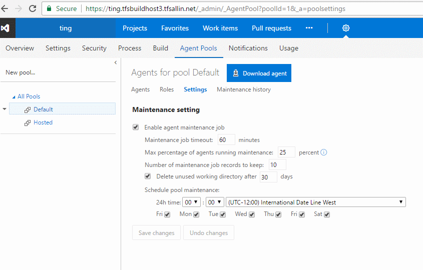
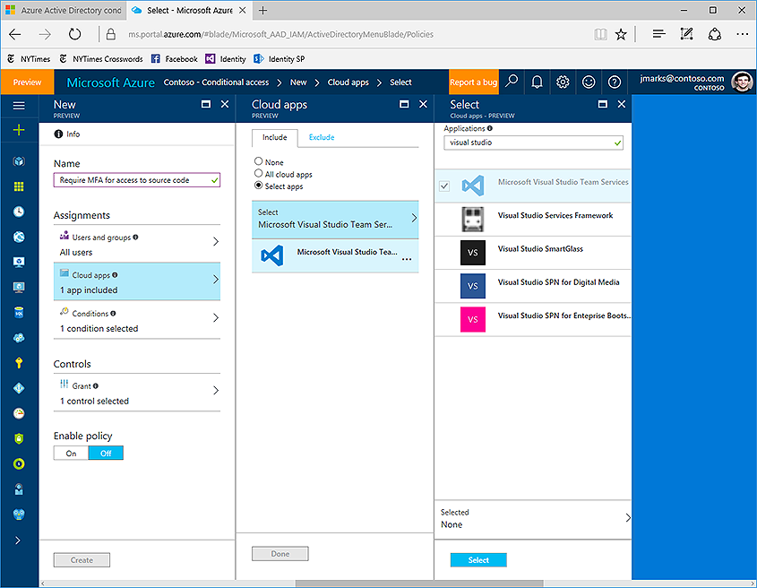

#PR usability improvements & richer GitHub build integration – Feb 15

We have a few feature improvements this sprint. Let’s get right into it...

##Improved support for team PR notifications
Working with pull requests that are assigned to teams is getting a lot easier. When a PR is created or updated, email alerts will now be sent to all members of all teams that are assigned to the PR.

This feature is in preview and requires an account admin to enable it from the __Preview features__ panel (available under the profile menu).

After selecting __for this account__, switch on the __Team expansion for notifications__ feature.

In a future release, we’ll be adding support for PRs assigned to Azure Active Directory (Azure AD) groups and teams containing AAD groups.

##Improved CTAs for PR author and reviewers
For teams using branch policies, it can sometimes be hard to know exactly what action is required when you view a pull request. If the main call to action is the __Complete__ button, does that mean it’s ready to complete? Using information about the person viewing the page and the state of configured branch policies, the PR view will now present the call to action that makes the most sense for that user.

When policies are configured, but aren’t yet passing, the __Complete__ button will now encourage the use of the __Auto-complete__ feature. It’s not likely that you’ll be able to complete the PR successfully if policies are blocking, so we offer an option that will complete the PR when those policies eventually pass.

For reviewers, it’s more likely that you’ll want to approve a PR than complete it, so reviewers will see the __Approve__ button highlighted as the main CTA if you haven’t approved yet.

Once approved, reviewers will see the __Complete__ (or __Auto-complete__) button highlighted as the CTA for those cases where a reviewer is also the person completing the PR.

##Actionable comments
In a PR with more than a few comments, it can be hard to keep track of all of the conversations. To help users better manage comments, we’ve simplified the process of resolving items that have been addressed with a number of enhancements:
 
* In the header for every PR, you’ll now see a count of the comments that have been resolved.

* When a comment has been addressed, you can resolve it with a single click. 

* If you have comments to add while you’re resolving, you can reply and resolve in a single gesture.

* As comments are resolved, you’ll see the count go up until everything has been addressed.

* The filter in the Overview has been improved to enable filtering by various comment states and to show the count of comments for each filter option.

##Updates view shows rebase and force push
In the __Pull Request details__ view, the __Updates__ tab has been improved to show when a force push has occurred and if the base commit has changed. These two features are really useful if you rebase changes in your topic branches before completing your PRs. Reviewers will now have enough info to know exactly what’s happened.

##Improved commit filtering
You can now filter the commit history results by [advanced filtering options](https://www.git-scm.com/docs/git-log). You can filter commits by:
* full history
* full history with simplified merges
* first parent
* simple history (This is the default filter setting)

##Maintenance for working directories
You can now configure agent pools to periodically clean up stale working directories and repositories. This should reduce the potential for the agents to run out of disk space. The maintenance is done per agent, not per machine; so if you have multiple agents on a single machine, you may still run into disk space issues.

##Agent selection improvement
The agent selection now takes machine activity into account when allocating an agent for a build or release. This will cause a build or release to be sent to an agent on an idle machine before selecting agents on a machine with other agents that are currently busy.

##Run tests using Agent Phases  
Using the __Visual Studio Test task__, you can now run automated tests using agent phases.

We now have a unified automation agent across build, release and test. This brings in the following benefits:
1.	You can leverage an agent pool for your testing needs.
2.	Run tests in different modes using the same __Visual Studio Test task__, based on your needs&mdash;single agent&ndash;based run, multi-agent&ndash;based distributed test run or a multi-configuration run to run tests on, say, different browsers.

For more information, refer to the [this post](https://aka.ms/testingwithphases).

##Multiple versions of Extension tasks
Extension authors can now create extensions with multiple versions of a given task, which enables them to ship patches for each major version they have in production.

See [Reference for creating custom build tasks within extensions](https://visualstudio.microsoft.com/docs/integrate/extensions/develop/build-task-schema).

##Extension management permissions and new email notifications
Any user or group can be given permission to manage extensions for the account. Previously, only account administrators could review extension requests or install, disable, or uninstall extensions. To grant this permission, an administrator can navigate to the __Extensions__ admin hub by opening the __Marketplace__ menu, selecting __Manage extensions__, and then click the __Security button__.

Also new this sprint, a user who requests an extension is now notified via email when that request is approved or rejected.

##Updated Package Management experience
We’ve updated the Package Management user experience to make it faster, address common user-reported issues, and make room for upcoming package lifecycle features. [Learn more about the update here](https://visualstudio.microsoft.com/docs/package/preview/updated-experience), or turn it on using the toggle in the __Packages__ hub.

##Support for AAD conditional access
Team Services can now be explicitly selected as the target for Azure Active Directory (Azure AD) conditional access policy. This lets enterprises control where and how their users can access VSTS. Visit the [Microsoft Azure documentation site](/azure/active-directory/active-directory-conditional-access) to learn more about conditional access policy (CAP).

NOTE: CAP is enforced when a user signs into VSTS with their AAD credentials. Therefore, subsequent accesses to VSTS via mechanisms including personal access tokens, alternate authentication, OAuth and SSH keys do not fall under conditional access policy.

##Pipelines queue
We have now moved all the Team Services accounts from the agent-based pricing model to [pipeline-based pricing model](/azure/devops/pipelines/licensing/concurrent-jobs-vsts). In this new model, users can run as many builds or releases concurrently as the number of pipelines configured in their account. Additional builds and releases beyond this limit are queued and wait for earlier builds and releases to complete. The __Pipelines queue__ feature provides users with more visibility into where their builds or releases are.

On launching the __Pipelines queue__, you can see the following information:
1. Builds and releases waiting for a pipeline to execute and their position in the waiting queue.
2. Builds and releases currently running using available pipelines.

While your build/release is waiting for a pipeline, you can also directly launch this view from inside the build/release logs page and find its current position in the pipeline queue and other details.

We think these features will help improve your workflows while addressing feedback, but we would love to hear what you think. Please don’t hesitate to send a smile or frown through the web portal, or send other comments through the [Team Services Developer Community](https://developercommunity.visualstudio.com/spaces/21/index.html). As always, if you have ideas on things you’d like to see us prioritize, head over to [UserVoice](https://visualstudio.uservoice.com/forums/330519-vso) to add your idea or vote for an existing one.

Thanks,

Jamie Cool
