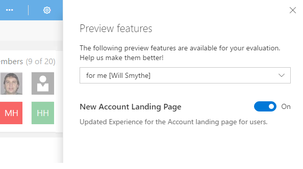
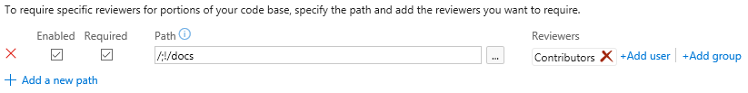
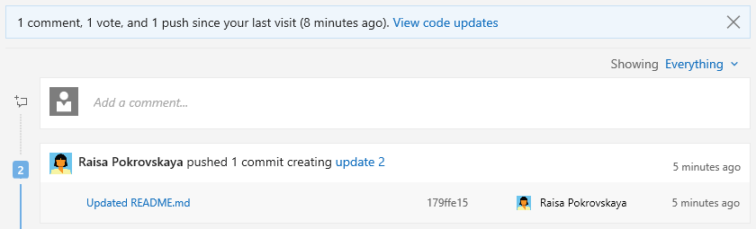

#Getting personal – Jan 5

Happy new year! You may have noticed we skipped our last deployment due to the holidays, so this deployment comes with two sprints of goodies. One of the key themes across the team is to bring more social and personal experiences into the product. You’re going to see a steady stream of those new experiences throughout the year. We’re starting the year with the first collection of these.

##Try out new features we are working on
Your feedback is super important to us, and getting this feedback while we are still developing a feature helps ensure we create something that you and our other customers will love. At the same time, we know new features can be disruptive. Therefore, starting with this release, select features we are working on will be made available for you to opt in and try early. Opt in when you are ready and opt out at anytime.

To see the features available for you to try, go to __Preview features__ in the profile menu.

Switch the toggle to opt in or out of a feature.

Note that some features are only available to account administrators to turn on or off for all users in the account.

##Your Team Services is even more personalized 
With this release, it is super easy for you to access artifacts that are most important for you. The redesigned account page has a personalized experience that shows the Projects, Favorites, Work, and Pull Requests you care about. This makes it a great way to start your day. You can go to one place and quickly find everything you need to do and care about. 

###Projects
The __Projects__ page is the one stop for you to access your recently visited projects and teams. You can also browse or look up all projects and teams within your account and then quickly navigate to the relevant hub for that project. 

###My Favorites
The __Favorites__ page allows you to view all your favorite artifacts in one place. So the next time you visit a project, team, repo, branch, build definition, or query of your interest, simply favorite it so that you can quickly navigate to it from the favorites page. 

###My Work
Start your day at the __My work items__ page to access easily all the work items assigned to you across all projects. It also lets you check and access the status of all the work items that you are following or those that you recently viewed.  

###My Pull Requests
If you work on a lot of repos across multiple projects, it’s a pain to get to the pull requests that you created or those that require your review. Not anymore! The __My Pull Requests__ page shows all pull requests that require your attention in one place. 

###How do I get there?
You can easily navigate to your personalized account page in Team Services by clicking the Visual Studio logo on the top left of the navigation bar. You can also hover over the logo and directly navigate to your recent project or one of the account home page pivots. We’ve also promoted Dashboards up as a top-level menu item.

###How to opt in
Like most major changes to the user experience, we are phasing this change in gradually to minimize the disruption of the change. To try out the feature, hover over your avatar image then click __Preview features__. Set the toggle for __New Account Landing Page__ to __On__. If you want to revert to the current experience, click on the avatar image, click __Preview features__, then toggle __New Account Landing Page__ to __Off__ . In a future sprint we will switch this to on by default and then remove the ability to revert to the old experience.

##Your project gets an identity
There’s now one place to get an overview of your project. The new project page makes it easy to view and edit the project description, view and add members, and check up on the latest activity. It’s even easier to get started with a new project and leverage all the built-in DevOps functionality of Team Services. 

###Improved getting started experience 
The new project page guides you to get started quickly by adding code to your repository when you choose one of the options to clone, push, import, or simply initialize a repo. You can easily get started by adding members, setting up builds, or adding work from this page.

###Talk about your project 
Create an identity and describe the vision and objectives of your project. The new project home page pulls data from the various hubs to give visitors a bird’s-eye view of your project activity.

##Attachments in PR discussions
You can now add attachments to your pull request comments. Attachments can be added by drag-and-drop or by browsing. For images, attachments can be added by simply pasting from the clipboard. Adding an attachment automatically updates the comment to include a Markdown reference to the new attachment. 

##Support file exclusions in the required reviewer policy
When specifying required reviewers for specific file paths, you can now exclude paths by using a “!” prefix to the path you want to exclude. For example, you can use this to exclude a docs folder from your normally required signoff.

##Highlight the PRs that have updates
It’s now easier than ever to see the updates to your pull requests. In the PR list view, PRs with changes since you've last seen them are shown with a new updates column that shows a roll-up of the changes.

When you view a PR that has changes, you’ll see a similar summary message in the overview, where new pushes and comment threads are highlighted in blue. Clicking the __View code updates__ link will navigate to the __Files__ view, where a diff of the new changes since you last viewed the pull request is shown. This feature makes it easy to follow up on a PR where the author made changes in response to feedback.  

##Branch policy for PR merge strategy
We’ve added a new branch policy that lets you define a strategy for merging pull requests for each branch. Previously, the decision to either merge or squash was chosen by each user at the time a PR was completed. If enabled, this policy will override the user’s preferences, enforcing the requirement set by the policy.

##Expose merge conflict information
If there are any files with conflicts in a pull request, the details about those conflicts will now be visible in the overview. Each conflicting file will be listed along with a short summary of the type of conflict between the source and target branches.  

##Team Room deprecation
With so many good solutions available that integrate well with TFS and Team Services, such as [Slack](https://slack.com/) and [Microsoft Teams](https://products.office.com/microsoft-teams/group-chat-software), we have made a decision to deprecate our Team Room feature from both TFS and Team Services. If you are working in Team Services, you will see a new yellow banner appear that communicates our plan. Later this year, we plan to turn off the Team Room feature completely.  

There are several alternatives you can use. The Team room is used both for a notification hub as well as for chat. TFS and Team Services already integrate with many other collaboration products including [Microsoft Teams](https://products.office.com/microsoft-teams/group-chat-software), [Slack](https://slack.com/), [HipChat](https://www.hipchat.com/), [Campfire](https://campfirenow.com/) and [Flowdock](https://www.flowdock.com/). You can also use [Zapier](https://zapier.com/) to create your own integrations, or get very granular control over the notifications that show up.

More information is available in this [blog post](https://blogs.msdn.microsoft.com/visualstudioalm/2017/01/04/deprecation-of-the-team-rooms-in-team-services-and-tfs/).

##New notification settings experience
Notifications help you and your teams stay informed about activity in your Team Services projects. With this update, it’s now easier to manage what notifications you and your teams receive. 

Users now have their own account-level experience for managing notification settings (available via the profile menu).

This view lets users manage personal subscriptions they have created. It also shows subscriptions created by team administrators for all projects in the account.

Learn more about [managing personal notification settings](https://aka.ms/vstsmanagenotifications).

##New delivery options for team subscriptions
Team administrators can manage subscriptions shared by all members of the team in the __Notifications__ hub under team settings. Two new delivery options are now available when configuring a team subscription: send the email notification to a specific email address (like the team’s distribution list), or send the notification to only team members associated with the activity.

Learn more about [managing team subscriptions](https://aka.ms/vststeamnotifications).

##Out of the box notifications (preview)
Prior to this feature, users would need to manually opt in to any notifications they wanted to receive. With out-of-the-box notifications (which currently must be enabled by an account administrator), users automatically receive notifications for events such as:

* The user is assigned a work item
* The user is added or removed as a reviewer to a pull request
* The user has a pull request that is updated
* The user has a build that completes

These subscriptions appear in the new user notifications experience, and users can easily choose to opt out of any of them.

To enable this feature for the account, an account administrator needs to go to __Preview features__ under the profile menu, select __From this account__ from the drop-down, then toggle on the __Out of the box notifications__ feature.

Learn more about [out of the box subscriptions](https://aka.ms/vstsoobnotifications).

##New hosted build image
We have deployed a new hosted build image with the following updates:
* .NET Core 1.1
* Android SDK v25
* Azure CLI 0.10.7
* Azure PS 3.1.0
* Azure SDK 2.9.6
* Cmake 3.7.1
* Git for Windows 2.10.2
* Git LFS 1.5.2
* Node 6.9.1
* Service Fabric SDK 2.3.311
* Service Fabric 5.3.311
* Typescript 2.0.6 for Visual Studio 2015
* Permissions changes to allow building of .NET 3.5 ASP.NET Web Forms projects

##Firefox support for Test & Feedback extension
We are happy to announce the General Availability of the Test &amp; Feedback extension for Firefox. You can download the Firefox add-on from our [marketplace](https://marketplace.visualstudio.com/items?itemName=ms.vss-exploratorytesting-web) site. 

__Note:__ Support for Edge browser is also in the works; stay tuned for more updates

##Favorites for Test Plans
You can now favorite the Test Plans you work with most frequently. In the __Test Plans__ picker, you will see tabs for __All__ your Test Plans and __Favorites__. Click the star icon to add a Test Plan to your list of favorites. The favorited Test Plans are accessible in the Test Plans picker and from the __Favorites__ tab in the new account home page. You can also filter Test Plans by searching on the title field. 

##Test Impact Analysis for managed automated tests
Test Impact Analysis for managed automated tests is now available via a checkbox in the __2.* preview__ version of the VSTest task.

If enabled, only the relevant set of managed automated tests that need to be run to validate a given code change will run. Test Impact Analysis requires the latest version of Visual Studio, and is presently supported in CI for managed automated tests.

##SonarQube MSBuild tasks
SonarQube MSBuild tasks are now available from an extension provided by SonarSource. For more details, please read [SonarSource have announced their own SonarQube Team Services / TFS integration](https://blogs.msdn.microsoft.com/visualstudioalm/2016/12/13/sonarsource-have-announced-their-own-sonarqube-team-services-tfs-integration/).

##Improved experience for Code Search results
There have been improvements to the Code Search results pane:

* The filename is more prominent and clickable
* We've added contextual actions:
  * Browse file
  * Download
  * Copy path
  * Get link to file

##Release Management parallel execution
Release Management now supports a parallel execution option for a phase. Select this option to fan out a phase by using either __Multi-configuration__ or __Multi-agent__ as a phase multiplier option.

* __Multi-configuration__: Select this option to run the phase for each multi-configuration value. For example, if you wanted to deploy to two different geos at the same time, using a variable __ReleasePlatform__ defined on the Variables tab with values "east-US, west-US" would run the phase in parallel, one with a value of "east-US" and the other "west-US”.
* __Multi-agent__: Select this option to run the phase with one or more tasks on multiple agents in parallel.

##Inline service endpoints
You can now create an endpoint within a build or release definition without having to switch to the __Services__ tab. To do so, click the __Add__ link next to the endpoint field.

##Multiple release triggers with branch and tag filters
Release management now supports setting up CD triggers on multiple Build artifact sources. When added, a new release is created automatically when a new artifact version is available for any of the specified artifact sources.

You can also specify the source branch for the new build to trigger a release. Additionally, tag filters can be set to further filter the builds that should trigger a release.

##Set defaults for artifact sources in RM
Users can define the default artifact version to deploy in a release when linking an artifact source in a definition. When a release is created automatically, the default version for all the artifact sources will be deployed. 

##Variable groups support in RM
Variable groups are used to group your variables and their values that you want to make available across multiple release definitions. You can also manage security for variable groups and chose who can view, edit and consume the variables from the variable groups in your release definitions.

Open __Library__ tab in __Build &amp; Release__ hub and choose __+ Variable group__ in the toolbar. Find more information about variable groups under [Release definitions in Microsoft Release Management](https://visualstudio.microsoft.com/docs/release/author-release-definition/more-release-definition#var-groups) in the Visual Studio documentation.

As always, if you have ideas on things you’d like to see us prioritize, head over to [UserVoice](https://visualstudio.uservoice.com/forums/330519-vso) to add your idea or vote for an existing one.

Thanks,

Jamie Cool