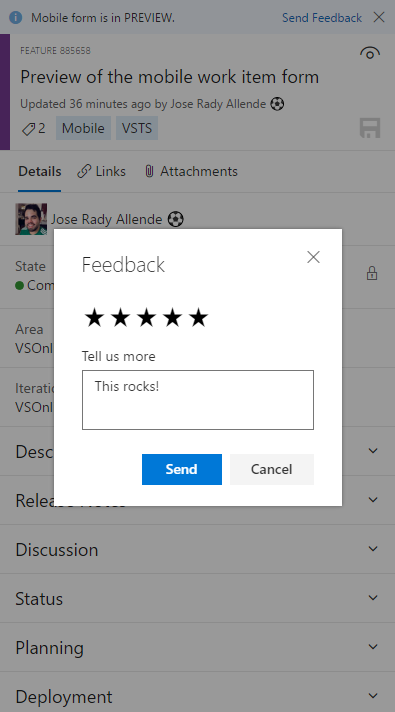
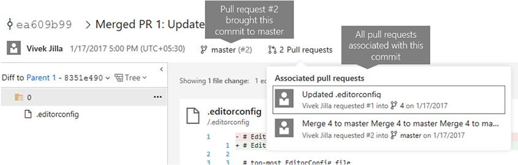
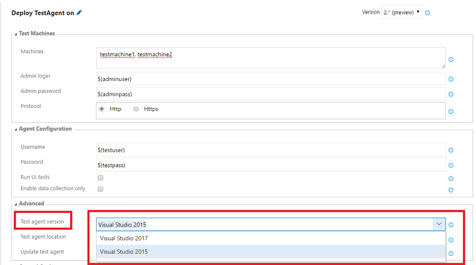

#Delivery Plans and mobile work item form – Jan 25

We have some big new features to introduce this sprint! Let’s get right into it...

##Delivery plans
We are excited to announce the preview of Delivery Plans! Delivery Plans help you drive alignment across teams by overlaying several backlogs onto your delivery schedule (iterations). Tailor plans to include the backlogs, teams, and work items you want to view. 100% interactive plans allow you to make adjustments as you go. Head over to the marketplace to install the new [Delivery Plans extension](https://marketplace.visualstudio.com/items?itemName=ms.vss-plans).

For more information, see our [blog post](https://blogs.msdn.microsoft.com/visualstudioalm/2017/01/23/new-feature-delivery-plans-for-visual-studio-team-services/).

##Mobile work item form preview
We’re releasing a preview of our mobile-friendly work item form for Visual Studio Team Services! This mobile work item form brings an optimized look and feel that’s both modern and useful. 

You can access the mobile form on your mobile device via the link contained within your @mentions and follows emails, or by accessing work items from within the new account pages. Along with the good looks, this preview already supports optimized controls like the state picker, area and iteration selectors, multi-line text fields, tag creation/removal, history, and more. 

In future sprints, we will be working to make discussions mobile-friendly, so stay tuned. If you want to provide some feedback, please use the __Send Feedback__ experience in the banner at the top of the form. We look forward to hearing from you!

See our [blog post](https://blogs.msdn.microsoft.com/visualstudioalm/2017/01/24/the-mobile-work-item-form/) for more information.

##Build editor preview

This month we’re offering a preview of a new design aimed at making it easier for you to create and edit build definitions. Click the switch to give it a try.

If you change your mind, you can toggle it off. However, eventually after we feel it’s ready for prime time, the preview editor will replace the current editor. So please give it a try and [give us feedback](https://visualstudio.uservoice.com/forums/330519-team-services).

The new editor has all the capabilities of the old editor along with several new capabilities and enhancements to existing features:

**Search for a template**

Search for the template you want and then apply it, or start with an empty process.

**Quickly find and add a task right where you want it**

Search for the task you want to use, and then after you’ve found it, you can add it after the currently selected task on the left side, or drag and drop it where you want it to go.

You can also drag and drop a task to move it, or drag and drop while holding the Ctrl key to copy the task.

**Use process parameters to pass key arguments to your tasks**

You can now use process parameters to make it easier for users of your build definition or template to specify the most important bits of data without having to go deep into your tasks. 

If you create a new build from some of the built-in templates (for example, **Visual Studio** and **Maven**), you can see examples of how these work.

**Learn more**

The new editor includes a few other enhancements, such as giving you quicker access to your sources settings. For more details, see [Preview of our new build editor](https://visualstudio.microsoft.com/docs/build/preview/2017-user-experience).

##Repo admin permission changes
For Git repos, we’ve divided the __Administer__ permission into several more granular permissions. This gives you more flexibility to decide who can perform what actions. For instance, you may allow anyone in your account to create new repositories, but disallow them from deleting repos or adding new users to a repo. The new permissions are:
* Administer: add/remove users and permissions
* Create: create a new repo
* Delete: delete a repo
* Rename: rename a repo
* Edit policies: configure branch policies
* Remove others’ locks: remove branch locks set by another user

These permissions can be applied to all repositories in a project or to individual repositories.

##Branch policy improvements
This sprint, we have a few improvements for branch policies. In the __Policies__ section, the required and optional policies are now grouped into sections, clarifying exactly which policies are required in order to complete a PR. Required reviewers are also summarized in the required section, and will only be marked as passing when all required reviewers have approved.

For users that need to bypass policies (and have the required permissions), a new experience will be shown on the __Complete__ dialog. Any policies that are not met will be shown in a warning message, and a new explicit option to opt-in to override policies will be presented. Checking the override option will enable the __Override & Complete__ action, which will complete the PR, overriding any failing policies.

##PR comment improvements
To help users better identify the new comments in their PR, we’ve added some additional decoration to the new replies in existing discussion threads. Comments in the files view will also highlight threads that have new comments.

##Discussion control toolbar
Markdown is a powerful tool when adding comments to pull requests, but it can be hard to remember the syntax. To make this easier, we’ve added a toolbar to the discussion control that will insert the appropriate Markdown syntax to add common formatting. Headings, boldface, italics, links, code, and lists can all be added using the new toolbar controls, and features like @ and # mentions can be entered using the toolbar as well. Keyboard shortcuts are available for boldface (CTRL + B), italics (CTRL + I), and creating links (CTRL + K).  

##View PRs for a commit
You can now view all associated pull requests for a commit on the __commit details__ page. From the image below, you can see that:

* In the associated pull request drop-down, there are two pull requests associated with this commit.
* Pull request #2 brought this commit to master.
* The same commit was brought into branch 4 via pull request #1.

##Release views in Package Management
We’ve added a new feature to Package Management called __release views.__ Release views represent a subset of package-versions in your feed that you’ve __promoted__ into that release view. Creating a release view and sharing it with your package’s consumers enables you to control which versions they take a dependency on. This is particularly useful in continuous integration scenarios where you’re frequently publishing updated package versions, but may not want to announce or support each published version.

[Check out the docs](/azure/devops/artifacts/feeds/views?view=azure-devops) to get started.

##npmjs.com upstream now caches packages
npm feeds in Package Management now support npmjs.com as an __upstream source with caching.__ By enabling this option, your feed will transparently proxy and cache packages from npmjs.com, which means that you’ll only need to get a particular package@version from npmjs.com once. Future requests for that package will be served directly from your Team Services account. If a package is removed from npmjs.com, you’ll still be able to get the cached version of it from Team Services. See [Use packages from npmjs.com](https://visualstudio.microsoft.com/docs/package/npm/upstream-sources) for more information.

##Run tests built using Visual Studio 2017
Using the __Deploy Test Agent__ and __Run Functional Tests__ tasks in CI/CD pipeline, you can now install Test Agents for Visual Studio 2017 RC and run tests that were built using Visual Studio 2017. 

##Track changes to test steps
In the past, it was difficult to understand which test steps had changed in test case work items because work item history did not format the changes. With this deployment, we have added formatting for test steps in work item history that shows which exact steps were edited, added, or deleted. For steps that were edited, you can compare the changes by looking at the updated step and the previous step. Converting existing steps to shared steps and adding new shared steps are also captured in the new history view. 

##Sorting on work item search results
Until now, work item search results were always ordered by relevance. You can now sort the results by Assigned To, Changed Date, Created Date, ID, Relevance, State, Tags, Title, and Work Item Type. Note that relevance remains the default mode of sorting for work item search results. 

##Linking to changelog on the Marketplace
Publishers can now create and link to a changelog for their extensions on the Marketplace. 

###For Team Services extensions:
You can now include a __changelog__ object in the content section of the manifest with a path property that points to the Changelog Markdown file within the extension.

###For VS Code extensions:
If CHANGELOG.md is placed in the extension’s workspace root, it will be automatically included by the vsce publishing tool. More details can be found within [VS Code documentation](http://code.visualstudio.com/updates/v1_7#_extension-authoring).

##Release action in Build summary
We are now supporting a __Release__ action, available in the __Build__ summary action bar, so it is easy for you to create a release for a build.

##Security for variable groups 
Security for variable groups is now governed through a set of roles such as __Creator__ and __Administrator__. 

By default, the below roles are assigned. 
* Creator role to Contributors
* Administrator role to Project Collection Administrators, Project Administrators, Build Administrators, and Release Administrators
* Reader role to Valid Project Users

The defaults can be overridden for all variable groups or for a specific one. 

##Web app deployment history in Azure portal
Release management now updates the deployment logs of Azure App Service when a deployment is done by using the App Service deployment task. Users can view deployment history in the Azure portal by selecting the __Continuous delivery__ option in the __App Service__ blade.

As always, if you have ideas on things you’d like to see us prioritize, head over to [UserVoice](https://visualstudio.uservoice.com/forums/330519-vso) to add your idea or vote for an existing one.

Thanks,

Aaron Bjork
