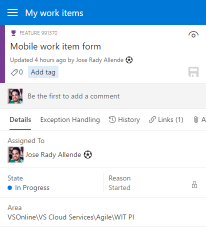
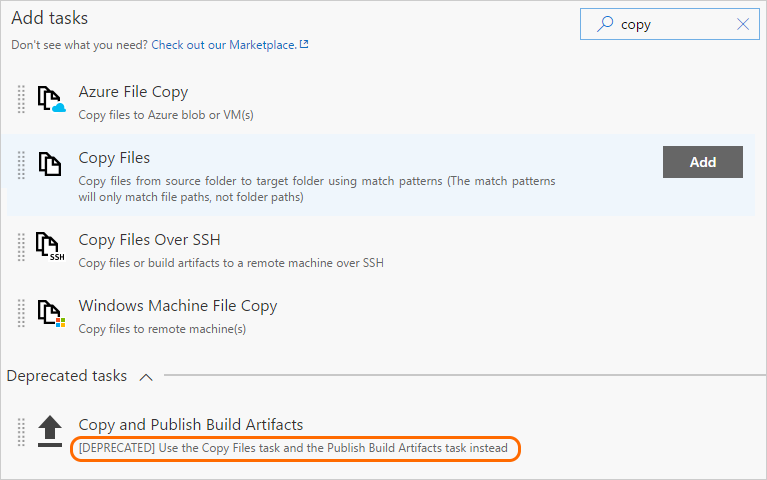
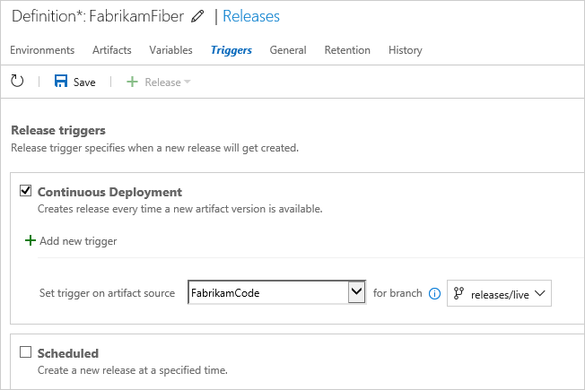
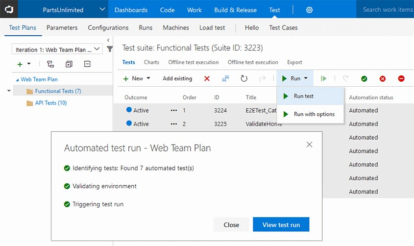

# New Visual Studio Enterprise pipeline benefit, mobile work item form GA, and source based release triggers – June 1

This week we have something for just about everyone, with a broad set of changes across the entire product:
* Our WIT mobile forms have GA’d and the first experiences on our new analytics services are here.
* Build and Release have a host of new improvements from our customer request list and VS Enterprise users got a nice new benefit.
* We also continue on our journey to make notifications great and customizable across the entire product.

##Mobile work item form general availability
The mobile experience for work items in VSTS is now out of preview! We have a full end-to-end experience that includes an optimized look and feel for work items and provides an easy way to interact with items that are assigned to you, that you’re following, or that you have visited or edited recently from your phone.


Along with the good looks, this experience supports optimized controls for all field types.



With the new mobile navigation, users can reach any other mobile-ready parts of VSTS and get back to the full desktop site in case they need to interact with other hubs. We hope you’ll enjoy the upgraded experience. If you want to provide some feedback, please use the __Send Feedback__ experience in the navigation sidebar.


##New widgets for Analytics extension
The [Marketplace Extension for Analytics](https://marketplace.visualstudio.com/items?itemName=ms.vss-analytics) enables three new dashboard widgets for Visual Studio Team Services (VSTS). The __Cycle Time,__ __Lead Time,__ and __Cumulative Flow Diagram__ widgets are designed to provide additional insight beyond what’s currently available in VSTS. 


##Path filtering support for Git notifications
Instead of getting notifications for all folders in a repo, you can now choose to get notified when team members create pull requests or push code in only the folders that you care about. When creating custom Git push or Git pull requests email notification subscriptions, you will see a new option to filter these notifications by folder path.


##More pull request comments filtering options
Comments in both the pull request overview and the files view now have the same options. You can also filter to see only the discussions you participated in.


##Search for a commit in branches starting with a prefix
If you have branch structure in a hierarchical format where all branches are prefixed with a text, then this feature will help you to find a commit in all the branches starting with that prefix text. For example, if you want to see whether a commit made its way to all branches that are prefixed with "dev" then simply type "dev" in the search box and select __Search in branches starting with "dev"__.


## Visual Studio Enterprise benefit for pipelines in Team Services

Until now, you were able to get a free private pipeline for every Visual Studio Enterprise subscription added to your on-premises TFS server. The same benefit was not available in Team Services. 

Sometime in the next few weeks, we’ll add the Visual Studio Enterprise subscriptions pipeline benefit to your Team Services account. The more Enterprise users you have in your account, the more concurrent builds and releases you can run on your private agents without having to pay anything extra.


## Work with secure files such as Apple certificates

We’ve added a general-purpose [secure files library](https://visualstudio.microsoft.com/docs/build/concepts/library/secure-files).


Use the secure files library to store files such as signing certificates, Apple Provisioning Profiles, Android Keystore files, and SSH keys on the server without having to commit them to your source repository. 

The contents of secure files are encrypted and can only be used during build or release processes by referencing them from a task. Secure files are available across multiple build and release definitions in the team project based on security settings. Secure files follow the Library security model.

We’ve also added some Apple tasks that leverage this new feature:

* [Utility: Install Apple Certificate](https://visualstudio.microsoft.com/docs/build/steps/utility/install-apple-certificate)

* [Utility: Install Apple Provisioning Profile](https://visualstudio.microsoft.com/docs/build/steps/utility/install-apple-provisioning-profile)

## Extensions with build templates

Build templates let you create a baseline for users to get started with defining their build process. We ship a number of them in the box today and while you could upload new ones to your account, it was never possible for extension authors to include new templates as part of an extension. You can now include build templates in your extensions. For example:

```json
{  "id": "Template1", 
   "type": "ms.vss-build.template", 
   "targets": [ "ms.vss-build.templates" ], 
   "properties": { "name": "Template1" } }
```

For the full example, see https://github.com/Microsoft/vsts-extension-samples/tree/master/fabrikam-build-extension.

> [!TIP]
> You can use this capability to offer and share the same custom template across all your team projects.

## Deprecate a task in an extension

You can now deprecate a task in your extension. To make it work, you must add the following variable to the latest version of your task:

```json
"deprecated": true
```

When the user searches for deprecated tasks, we push these tasks to the end and group them under a collapsible section that’s collapsed by default. If a definition is already using a deprecated task, we show a deprecated task badge to encourage users to switch to the replacement.


You can help your users learn about the replacement task by mentioning it in the task description. The description will then point folks using the task in the right direction from both the task catalog and the existing build/release definitions.   



## Task group references

Task groups let you define a set of tasks that you can add to your build or release definitions. This is handy if you need to use the same grouping of tasks in multiple builds or releases. To help you track the consumers of a task group, you now have a view into the build definitions, release definitions, and task groups that reference your task group.

)

When you try to delete a task group that’s still referenced, we warn you and give you a link to this page.

##Variables Support in Manual Intervention task
The __Manual Intervention__ task now supports the use of variables within the instruction text shown to users when the task runs, at the point where the user can resume execution of the release process or reject it. Any variables defined and available in the release can be included, and the values will be used in the notifications as well as in the email sent to users. 


##Control releases to an environment based on the source branch
A release definition can be configured to trigger a deployment automatically when a new release is created, typically after a build of the source succeeds. However, you may want to deploy only builds from specific branches of the source, rather than when any build succeeds.

For example, you may want all builds to be deployed to Dev and Test environments, but only specific builds deployed to Production. Previously you were required to maintain two release pipelines for this purpose, one for the Dev and Test environments and another for the Production environment.

Release Management now supports the use of artifact filters for each environment. This means you can specify the releases that will be deployed to each environment when the deployment trigger conditions (such as a build succeeding and creating a new release) are met. In the __Trigger__ section of the environment __Deployment conditions__ dialog, select the artifact conditions such as the source branch and tags for builds that will trigger a new deployment to that environment.


In addition, the __Release Summary__ page now contains a pop-up tip that indicates the reason for all “not started” deployments to be in that state, and suggests how or when the deployment will start.


##Release Triggers for Git repositories as an artifact source
Release Management now supports configuring a continuous deployment trigger for Git repositories linked to a release definition in any of the team projects in the same account. This lets you trigger a release automatically when a new commit is made to the repository. You can also specify a branch in the Git repository for which commits will trigger a release.



##On-demand triggering of automated tests 
The __Test__ hub now supports triggering automated test cases from test plans and test suites. Running automated tests from the __Test__ hub can be set up similarly to the way you run tests in a scheduled fashion in __Release Environments__. You will need to setup an environment in the release definition using the __Run automated tests from test plans__ template and associate it with the test plan to run the automated tests. See the [documentation](https://visualstudio.microsoft.com/docs/test/continuous-testing/run-automated-tests-from-test-hub) for step by step guidance on how to set up environments and run automated tests from the __Test__ hub.



##Acquisition data in Extension Hub for Marketplace publishers 
Publishers of free extensions will now have access to aggregated acquisition data in the selected time period, daily trend on extension page views with acquisition, uptake on VSTS and TFS connected, and conversion from page views to acquisition. This data is also available for download in XLS format to aid creating your own custom reports. 

##Q&A for Marketplace publishers
The __Q&A__ tab will give the publisher a snapshot of all questions by your users with the nonresponded queries on the top. You can reply or edit a previous response and manage engagement better with your extension users.  

##GitHub and Custom Q&A support for marketplace extensions
Publishers can choose between __Marketplace Q&A__, __GitHub issues__ or custom __Q&A__, as their support system for the Q&A section in the marketplace. If you use GitHub repo, the marketplace will link users in the Q&A section to your GitHub issues. You can use the marketplace for custom Q&A or choose to disable the Q&A section on your extension using the __CustomerQnASupport__ property in the manifest for VS/VSTS extensions or the __qna__ field for VSCode extensions.  

##Retain VSTS identity when navigating to Marketplace from VSTS
Marketplace users will now be able to retain their identity and will be automatically signed in when navigating to the Marketplace from the VSTS/TFS marketplace icon. 

##AAD sign-in address rename
We have updated the way we resolve identities in VSTS. Users can now freely change their sign-in addresses through AAD without losing access to their VSTS resources.

We would love to hear what you think about these features. Please don’t hesitate to send a smile or frown through the web portal, or send other comments through the [Team Services Developer Community](https://developercommunity.visualstudio.com/spaces/21/index.html). As always, if you have ideas on things you’d like to see us prioritize, head over to [UserVoice](https://visualstudio.uservoice.com/forums/330519-vso) to add your idea or vote for an existing one.

Thanks,

Jamie Cool