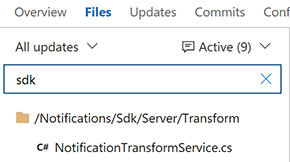
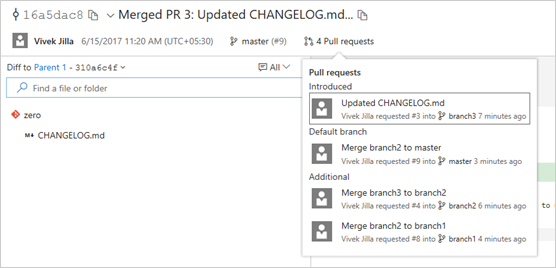
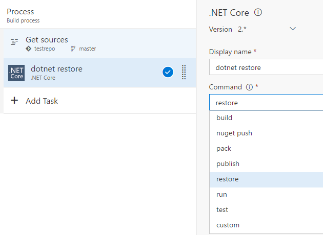
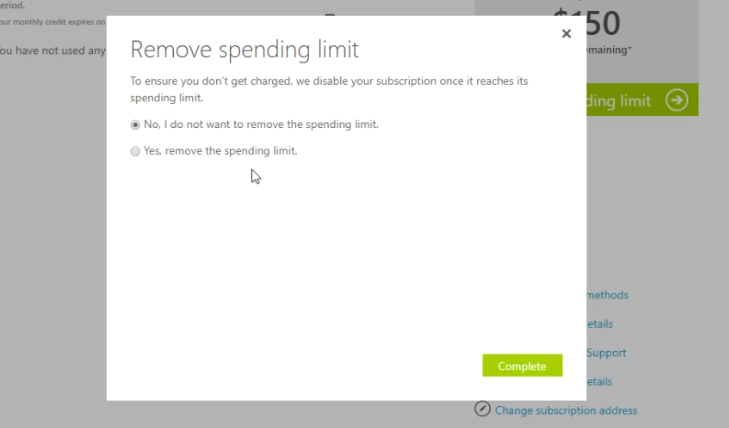

# Git Tags web view, build definition import/export, and improved user management – June 22

Relax, sit back, and get comfortable. You’re going to be here for a while. We’ve got lots of updates this sprint across the entire product.  

You’ve probably noticed that we’ve been continuing to evolve our web portal for a while now. We know it’s the primary way folks interact with the product. We want to have a great overall web experience and we’ve been working to get there in incremental steps. Having a great web experience means multiple things to us. It means you can accomplish the work you need to do with ease. It means that it’s an accessible experience, so everyone on your team can use it. It also means an experience that is visually appealing and a pleasant place to do your work.

In addition to plenty of just-plain-new features, you’ll find numerous examples of us continuing to take steps to improve the web portal across all of those goals this sprint. So let’s dive in!

##Shared fields across processes
When you create a field, you can choose to create a new field or use an existing one. With this deployment, we have made it possible for you to use an existing field from a different process. This should help your organization to query across team projects that use a different process.

If you change the description or the picklist values of a shared field, it will affect all work item types where the field is used.

##Work item type icons
We have made a global commitment to make our products fully accessible to our customers. As part of that commitment, we have been working to find and address many accessibility issues&mdash;anywhere from keyboard patterns to visual design and layout. 

Work item tracking has relied solely on color in many experiences to convey work item type. However, this is problematic for our color-blind or low-vision users who may not be able to distinguish between items due to similarities in color. To increase the scanability of work item types for all our customers, we have introduced icons to our visual language of work item types. You can [customize your work item types](https://visualstudio.microsoft.com/docs/work/process/customize-process-wit#change-description-icon-or-color-of-a-custom-wit) by choosing from our icon library.

Color bars conveying type on the backlog and queries grids have been replaced with colored icons.

Cards on the board now include a type icon.

##Show/hide work item field borders
Over the last couple of months, we’ve discovered that, for some of our more traditional users, not having field borders in our work item form leads to confusion and is too far away from home. To alleviate this confusion, this sprint we’ve enabled a profile setting to show/hide work item field borders. This will help give the form a more traditional look and will give users the choice of what works best for them. 

Change the setting through your Visual Studio profile.

##Extensions block work item save
Work item form custom controls, groups, and pages can now [block work item save](https://visualstudio.microsoft.com/docs/integrate/extensions/reference/client/api/tfs/workitemtracking/services/workitemformservice#seterror) to validate data and ensure the user fills out any required information before saving the work item form. 

##Collapsible pull request comments
Reviewing code is a critical part of the pull request experience, so we’ve added new features to make it easier for reviewers to focus on the code. Code reviewers can easily hide comments to get them out of the way when reviewing new code for the first time.  

Hiding comments hides them from the tree view and collapses the comment threads in the file view:

When comments are collapsed, they can be expanded easily by clicking the icon in the margin, and then collapsed again with another click. Tooltips make it easy to peek at a comment without seeing the entire thread.

##Improved workflow when approving with suggestions
Using the __auto-complete__ option with pull requests is a great way to improve your productivity, but it shouldn’t cut short any active discussions with code reviewers. To better facilitate those discussions, the __Approve with suggestions__ vote will now prompt when a pull request is set to complete automatically. The user will have the option to cancel the auto-complete so that their feedback can be read, or keep the auto-complete set and allow the pull request to be completed automatically when all policies are fulfilled.  

##Filter pull request tree by file name
Finding a specific file in a pull request is easier than ever. The new filter box in the Files view lets users filter down the list of files in the tree view.  

The filter matches any part of the path of the files in the pull request, so you can search by folder names, partial paths, file names, or extensions.

 

##Richer pull request callout on commit details page 
The pull request callout on the commit details page shows more relevant information to help you diagnose better. Now we also show the **first pull request** that introduced the commit to any branch and the **pull request associated with the default branch** in the callout.

##Filter tree view in Code
Now you don’t need to scroll through all the files that a commit may have modified to just get to your files. The tree view on commit details, pull requests, shelveset details, and changeset details page now supports file and folder filtering. This is a smart filter that shows child files of a folder when you filter by folder name and shows a collapsed tree view of a file to show the file hierarchy when you filter by file name. 

Find a file or folder filter on commit tree:

Filtered view on commit tree:

##Git tags web view
###View tags
You can view all the tags on your repository on the **Tags** page. If you manage all your tags as releases, then a user can visit the tags page to get a bird’s-eye view of all the product releases. 

 
You can easily differentiate between a lightweight and an annotated tag here, as annotated tags show the tagger and the creation date alongside the associated commit, while lightweight tags only show the commit information.

###Delete tags
There can be times when you want to delete a tag from your remote repo. It could be due to a typo in the tag name, or you might have tagged the wrong commit. You can easily delete tags from the VSTS UI by clicking the context menu of a tag on the __Tags__ page and selecting __Delete tag__. 

**Note:** Deleting tags on remote repos should be exercised with caution.

###Filtering tags
For old repositories, the number of tags can grow significantly with time; there can also be repositories that have tags created in hierarchies, which can make finding tags difficult. 

If you are unable to find the tag that you were looking for on the tag page, then you can simply search for the tag name using the filter on top of the Tags page.

 
###Tags security
Now you can grant granular permissions to users of the repo to manage tags. You can give users the permission to delete tags or manage tags from this interface,

Read more about git tags at the [Microsoft DevOps blog](https://blogs.msdn.microsoft.com/visualstudioalm/2017/06/14/view-tags-for-git-repositories/).

## Export and import build definitions

Build definitions are implemented internally as .json files, so you can see details on changes in the file’s history. You can already clone and make templates from your build definitions, but many users have wanted to take a copy of their CI build logic and reuse it in another team project. In fact it’s been a [top-ten request on UserVoice](https://visualstudio.uservoice.com/forums/330519-team-services/category/145254-ci-build).

We’re pleased to announce that now you can do it!

## Visual Studio latest and hosted agent pools

We’re changing the model for how you deal with hosted agents and different versions of Visual Studio. Due to architectural, storage, and performance limitations, we’re no longer going to offer multiple versions of Visual Studio on a single hosted agent pool. For details on the history and rationale for these changes, see [Visual Studio Services VS Hosted Pools](https://github.com/Microsoft/vsts-tasks/blob/master/docs/vshostedpools.md) on GitHub. 

In this release you’ll see the following changes:

* You must now explicitly select a queue when you create a build definition (no default).

* To make it easier, we’re moving the default queue to the **Tasks** tab, in the **Process** section.

* The [Visual Studio Build](https://visualstudio.microsoft.com/docs/build/steps/build/visual-studio-build) and [MSBuild](https://visualstudio.microsoft.com/docs/build/steps/build/msbuild) tasks now default to the **Latest** setting for the version argument.

Coming soon you’ll see more changes. For example, the following hosted pools (and corresponding queues) will be:

* Hosted VS2017

* Hosted VS2015

* Hosted Deprecated (previously called “Hosted Pool”)

* Hosted Linux Preview

## Reminder: The hosted XAML controller is going away

> [!IMPORTANT]
> We’re going to shut down the deprecated hosted XAML build controller on July 1st, 2017. After this shutdown, you’ll no longer be able to use hosted agents to run your XAML builds.

We recommend that you migrate to our new task-based build system, which includes access to hosted agents to run your builds. See our recently published guide to [migrate from XAML builds to new builds](https://visualstudio.microsoft.com/docs/pipelines/build/migrate-from-xaml-builds).

However, if you still need to run XAML builds during the migration, then you should set up a private XAML build controller now. To use private XAML controllers and agents, you need to have sufficient private pipelines in your account. For details, see [I’m looking for the hosted XAML build controller. Where did it go?](https://visualstudio.microsoft.com/docs/build/concepts/agents/hosted#im-looking-for-the-hosted-xaml-build-controller-where-did-it-go)

## Build definition menu on build summary page

From the build summary page, you can now navigate to the build summary for other definitions.

This control is also available on the history page.

##Release Triggers: Continuous deployment for changes pushed to a Git repository
Release Management has always provided the capability to configure continuous deployment when a build completes. However, now you can also configure continuous deployment on Git Push. This means that you can link GitHub and Team Foundation Git repositories as artifact sources to a release definition, and then trigger releases automatically for applications such as Node.JS and PHP that are not generated from a build and so do not need a build action for continuous deployment.

##Enhancements to server-side tasks
We have made two enhancements to server-side tasks (tasks that run within a server phase).

We have added a new task that can be used to invoke any generic HTTP REST API as part of the automated pipeline. For example, it can be used to invoke specific processing with an Azure function, and wait for it to be completed.

 
We have also added a __Control options__ section to all server-side tasks. Task behavior now includes setting the __Enabled__, __Continue on error__, __Always run__, and __Timeout__ options.

##Consume Secrets from an Azure Key Vault as variables
We have added first-class support for integrating with Azure Key Vault in Team Services by linking variable groups to Key Vault secrets. This means you can consume secret variables in Team Services and manage secret values completely within Azure Key Vault, without changing anything on the Team Services side (for example, password rotation).

To enable this feature in the __Variable Groups__ page, use the toggle button __Link secrets from an Azure key vault as variables__. After configuring the vault details, choose __+Add__ and select the specific secrets from your vault that are to be mapped to this variable group. 

After you have created a variable group mapped to Azure Key Vault, you can link it to your release definitions, as documented in [Variable groups](https://visualstudio.microsoft.com/docs/build/concepts/library/variable-groups).

Note that it’s just the secret names that are mapped to the variable group variables, not the values. The actual values (the latest version) of each secret will be fetched and consumed during the release.  
 
##Package Management experience updates
We got some great feedback on the updated __Package Management__ experience when we turned it on by default, so we have made a few more updates.

Package URLs now work with the package name and version, rather than using GUIDs. This makes it easier to hand-craft package URLs. The format is: https://\<account\>.visualstudio.com/\<project|team\>/_packaging?feed=\<feed\>&package=\<package\>&version=\<version\>&protocolType=\<NuGet|Npm\>&_a=package.

You can now hide deleted package versions from all feed users (no more strikethrough packages!), in response to [this UserVoice suggestion](https://visualstudio.uservoice.com/forums/330519-team-services/suggestions/17719306-add-ui-toggle-to-hide-show-packages-that-have-been).

Any action that you could perform on the package details page can now be performed from the context menu in the list of packages.

The package list contains a new __Last pushed__ column with humanized dates so you can easily find recently-updated packages. 

##Package build task updates
We’ve made comprehensive updates to the __NuGet__, __npm__, __Maven__, and __dotnet__ build tasks, including fixes to most of the issues logged in the [vsts-tasks repo on GitHub](https://github.com/microsoft/vsts-tasks).

###New unified NuGet task
We’ve combined the __NuGet Restore__, __NuGet Packager__, and __NuGet Publisher__ task into a unified __NuGet__ build task to align better with the rest of the build task library; the new task uses NuGet 4.0.0 by default. Accordingly, we’ve deprecated the old tasks, and we recommend moving to the new NuGet task as you have time. This change coincides with a wave of improvements outlined below that you’ll only be able to access by using the combined task.

As part of this work, we’ve also released a new __NuGet Tool Installer__ task that controls the version of NuGet available on the PATH and used by the new NuGet task. So, to use a newer version of NuGet, just add a __NuGet Tool Installer__ task at the beginning of your build. 

###npm build task updates
Whether you’re building your npm project on Linux, macOS, or Windows, the new __NPM__ build task will accommodate. We have also reorganized the task to make both __npm install__ and __npm publish__ easier. For __install__ and __publish__, we have simplified credential acquisition so that credentials for registries listed in your project’s .npmrc file can be safely stored in a [service endpoint](https://visualstudio.microsoft.com/docs/build/concepts/library/service-endpoints). Alternatively, if you’re using a VSTS feed, we have a picker that will let you select a feed, and then we will generate a .npmrc with requisite credentials that are used by the build agent.

###Working outside your account/collection
It’s now easier to work with feeds outside your VSTS account, whether they’re __Package Management__ feeds in another VSTS account or TFS server or non-Package Management feeds like NuGet.org/npmjs.com, Artifactory, or MyGet. Dedicated __Service Endpoint__ types for NuGet, npm, and Maven make it easy to enter the correct credentials and enable the build tasks to work seamlessly across package download and package push operations.

###Feed picker for VSTS/TFS feeds
We always recommend checking in a configuration file (e.g. NuGet.Config, .npmrc, etc.) so that your source repository has a record of where your packages came from. However, we’ve heard a set of scenarios where this isn’t ideal, so we’ve added a new __Use packages from this VSTS/TFS feed__ option that allows you to select a feed and automatically generate a configuration file that will be used for that build step.

###NuGet “Allow duplicates to be skipped” option
We heard from many NuGet customers that they generate a set of packages, only some of which may have updates (and therefore updated version numbers). The __NuGet__ build task has a new __Allow duplicates to be skipped__ option that will enable the task to continue if it tries to push packages to a VSTS/TFS feed where the version is already in use.

###Maven and dotnet now support authenticated feeds
Unlike __NuGet__ and __npm__, the __Maven__ and __dotnet__ build tasks did not previously work with authenticated feeds. We’ve added all the same goodness outlined above (feed picker, working outside your account improvements) to the __Maven__ and __dotnet__ tasks so you can work easily with VSTS/TFS and external feeds/repositories and have a consistent experience across all the package types supported by __Package Management__.

##Project Collection Administrators can link/make initial purchase
Now any Project Collect Administrator, not just the account owner, can make the first Marketplace purchase. This makes it easier for accounts with multiple Project Collection Administrators to pay for VSTS.

##Deep link to remove your spending limit easily during a Marketplace purchase
If you want to use the Azure subscription that came with your Visual Studio or MSDN subscription to pay for Marketplace purchases, you need to remove your spending limit and add a credit card. With this release, we’ve added a deep link to make it easy to remove the spending limit for your subscription. We also check to make sure you remove the limit indefinitely, so your Marketplace purchases won’t be interrupted. For more information, see [How to set up billing Q&A](https://visualstudio.microsoft.com/docs/setup-admin/team-services/set-up-billing-for-your-account-vs#q-which-azure-subscriptions-can-i-link-to-my-team-services-account-and-use-for-billing).

##Improvements to OAuth permissions page
The OAuth permissions page has been updated to make it easy for a user to see which identity they are authorizing permissions to prior to deciding whether to authorize the application.

##Streamlined user management (preview)

> **Preview feature**
>
> To use this capability, you must be a Project Collection Administrator and enable **Streamlined User Management** [preview feature](/azure/devops/project/navigation/preview-features) for yourself or your account. 

Based on feedback from you, we’re releasing a set of updates to our new user management experiences that continue to make your life easier when trying to get your teammates up and running. 

###Bulk remove users
Have you ever needed to remove multiple users from an account at once and found it cumbersome? Now, it is as easy as selecting multiple users and choosing __Remove user__ from the drop down.

###Optionally add users to projects
We’ve kept the ability to add users to projects in the new account-level Users page, but have made it optional so administrators don’t have to deal with project membership up front unless they need to.

###Easily view subscriptions
We heard confusion over building subscription detection to __Basic__ access levels in the new experience loud and clear, and have brought back the ability to explicitly choose Visual Studio Subscription detection from the add users dialog. 

Administrators can now also easily see and filter the users who have subscriptions in the account by selecting the subscription from the **Summary** pane, as well as see what resources a user is receiving from the subscription.

##Enhanced Publisher experience with Sales Transactions for Paid extensions
###Acquisition and sales data in Extension Hub for paid extension publishers on the Marketplace
Publishers of paid extensions will now have access to aggregated acquisition data in the selected period or overall. This includes daily trends on extension page views, trials, and buys for VSTS and TFS Connected. A conversion from page views to acquisition funnel is also included. This data is also available for download in XLS format to aid creating your own custom reports. 

###Sales transactions
This tab gives the publisher aggregated counts of all transactions (New, upgrade, downgrade and cancel) for users such as quantities of licenses and accounts with trends to understand the uptake of the extension. 

Both acquisition and sales tab also share the transaction details which gives publishers access to details of each transaction with date, account, changed quantity and trial end dates. This data can be searched and download in XLS to perform custom reporting. They can also now reach out to the customers for transactional communication using the contact action in the new __Publisher stats__ reports page. 

###Setup Power BI Content Pack
Publishers can also use the __Extension Statistics Power BI__ content pack to gain insight and analyze the progress of the extension. All data elements available in the extension hub are also available in the Power BI content pack. The content pack contains a complete analytic data model (tables, relationships and measures), a set of default reports, and a default dashboard. Reports and dashboards are fully customizable, but the data model is not. More details are available at [docs.microsoft.com](/azure/devops/extend/extension-statistics-powerbi-contentpack). 

We would love to hear what you think about these features. Report any problems through [Team Services Developer Community](https://developercommunity.visualstudio.com/spaces/21/index.html) and get advice on [Stack Overflow](https://stackoverflow.com/questions/tagged/vs-team-services). As always, if you have ideas on things you’d like to see us prioritize, head over to [UserVoice](https://visualstudio.uservoice.com/forums/330519-team-services) to add your idea or vote for an existing one.

Thanks,

Jamie Cool
