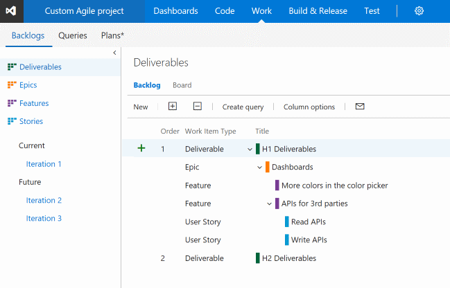
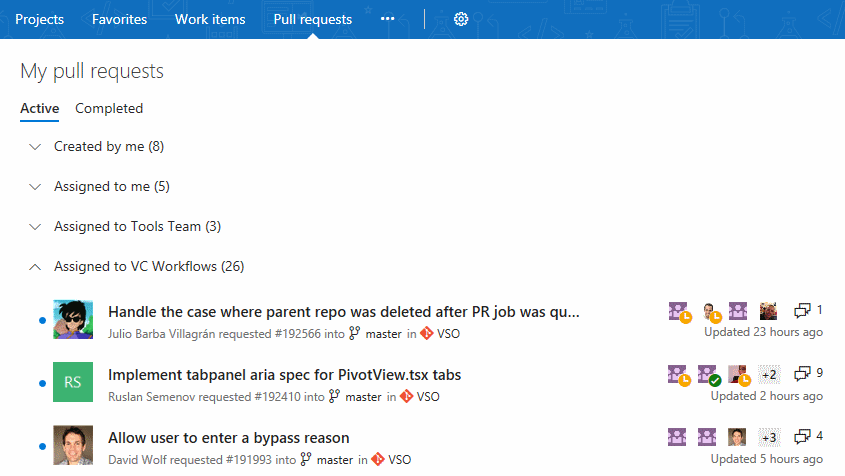

#Customized backlog levels, mobile work item form improvements, notifications for extensions – Mar 8

We have been focusing on improving your Team Services experience. This sprint includes several items, such as mobile work item form improvements and custom backlog levels. Let’s get into these features!

##Delivery Plans field criteria
Delivery Plans have become more customizable with the addition of field criteria. This will give you greater control of which work items appear on your plans. Because field criteria is part of the plan, everyone will always see this same view of work. You can see in the example below that we are using field criteria to show only a certain work item type (bug) that contains a tag value (Argo).

##New mobile discussion experience
Our mobile discussion experience has been optimized to provide a mobile-friendly, streamlined experience for submitting a comment. Discussion is the most common action that takes place in a mobile device. We look forward to hearing what you think about our new experience!

##Optimized mobile identity picker
It is now extremely easy to assign a work item to a different user from your phone. The control has been optimized to provide a great mobile experience when filtering, searching, and selecting a user.

##Customized backlog levels
Users can now add new backlog levels to manage the hierarchy of their work items and name them in a way that makes sense for their work item types. Users can also rename and recolor existing backlog levels, such as Stories or Features. See [Customize your backlogs or boards for a process](https://visualstudio.microsoft.com/docs/work/process/customize-process-backlogs-boards) for details on how to get started.

##Custom work item identity fields
Users can now add custom identity fields to their projects. This allows users to define additional fields like “Assigned To”, which will give users a people-picker experience to select people as the field value. In this initial release, all users in the Team Services account will be valid values for each identity field.

##Pull Request improvements for teams
If you’re a member of multiple teams, you will now see all of the PRs assigned to those teams listed in the __My Pull Requests__ view. This makes the __My Pull Requests__ view the one stop you need to visit to see all the PRs on your plate.

In a future release, we’ll add teams to the __Pull Requests__ hub under __Code__ to make it easier to see all of your PRs for a single project.

##New policy for no active comments
Ensure that all comments in your pull requests are being addressed with the new __Comments__ policy. With this policy enabled, active comments will block completion of the PR, forcing all comments to be resolved. Reviewers that leave comments for the PR author but optimistically approve the pull request can be sure that an author that’s eager to merge won’t miss any comments.

##Build agent upgrade status
When an agent is being upgraded, it now indicates the status of the upgrade in the queue and pool management portal.

##GitHub pull request builds
For a while, we’ve provided CI builds from your GitHub repo. Now we’re adding a new trigger so you can build your GitHub pull requests automatically. After the build is done, we report back with a comment in your GitHub pull request.

For security, we only build pull requests when both the source and target are within the same repo. We don’t build pull requests from a forked repo.

##Keep track of your free hosted agent minutes
You can now see how many free hosted agent minutes you've used.

##Out-of-the-box notifications enabled by default - coming soon
For your awareness, we are planning to enable [out-of-the-box notifications](https://visualstudio.microsoft.com/articles/news/2017/jan-05-team-services#out-of-the-box-notifications-preview) by default in our next update in about three weeks. If this feature is already enabled in your account, there will be no impact. If you haven’t enabled this feature, it will be enabled by default in our next update. Account admins will still have the option to opt out of this feature.

##Getting notified when extensions are installed, require attention, and more
Admins, or those with the ability to manage extensions for an account, are now automatically notified when an extension is installed, uninstalled, enabled, disabled, or requires attention in the account. This is especially useful in larger accounts where multiple people have the responsibility of managing extensions. Admins can turn off these notifications by navigating to __Notification__ settings under the profile menu and switching off the extensions toggle.

Admins can also define custom subscriptions for extension-related events in the account. For example, an admin can get notified whenever any extension is updated in the account.

Users can also now turn off automatic notifications about their extension requests.

##Release level approvals
You can now choose to automatically approve deployments that were automatically triggered after successful deployment to another environment. Approving a chain of deployments (which have the same approvers) can be done at one go if you choose to not approve every deployment. 

Let’s say you have two environments Dev and Test, with the predeployment approvers set to “userA” and “userB,” with both of them required to approve the deployment. If the policy on Test is set as shown below, during deployment time it will be sufficient for userA and userB to approve only Dev. Deployment to Test will get auto-approved. If the deployment to Test is triggered manually, the approvals will be required before deployment to ensure correct approvals.

##.NET Core tasks support project files
With the current update, we are enhancing .NET core tasks to support *.csproj files in addition to project.json. You can now use Visual Studio 2017 on your build agents to build .NET core applications using csproj files.

We think these features will help improve your workflows while addressing feedback, but we would love to hear what you think. Please don’t hesitate to send a smile or frown through the web portal, or send other comments through the [Team Services Developer Community](https://developercommunity.visualstudio.com/spaces/21/index.html). As always, if you have ideas on things you’d like to see us prioritize, head over to [UserVoice](https://visualstudio.uservoice.com/forums/330519-vso) to add your idea or vote for an existing one.

Thanks,

Aaron Bjork
