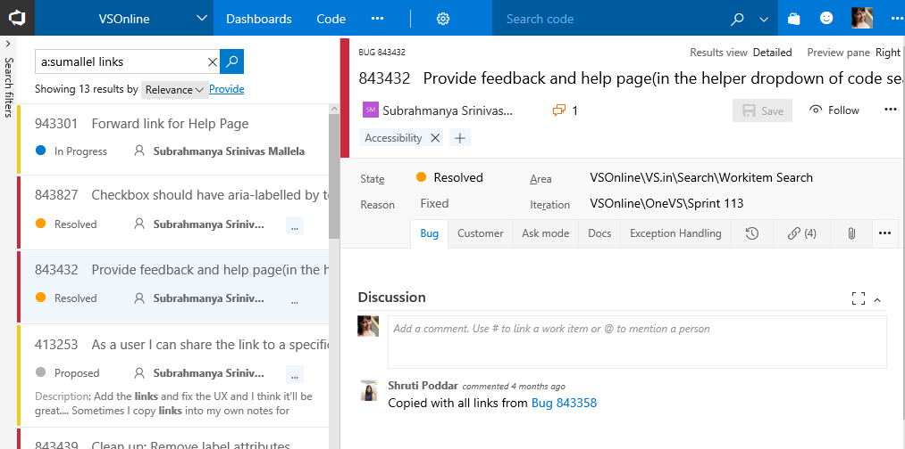
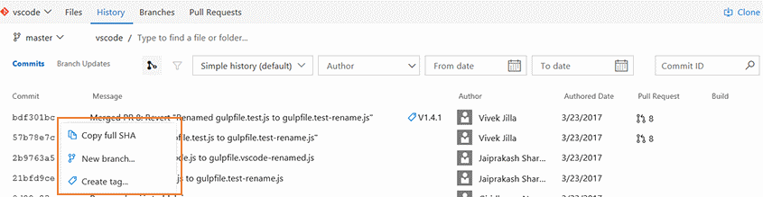
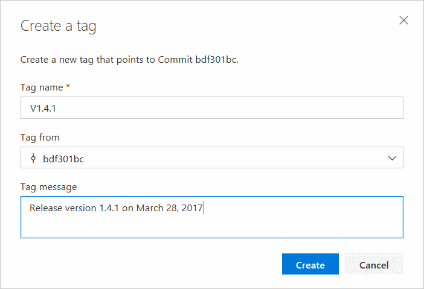
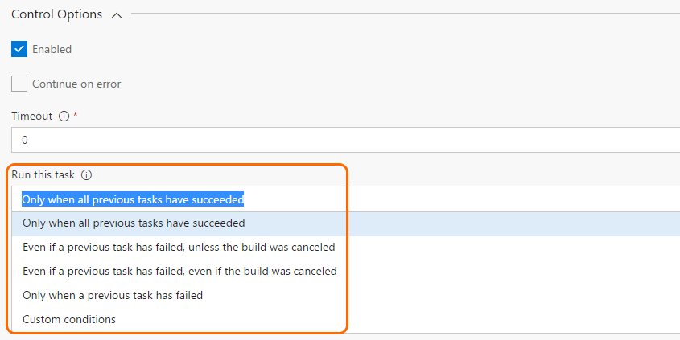
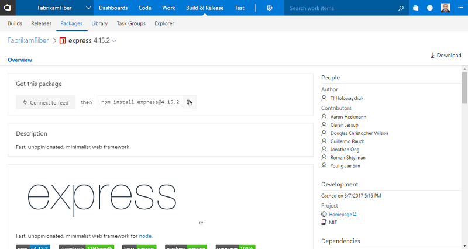

#PR filtering by people and improved Azure resource group template parameter experience – Mar 29

We have several exciting new features this sprint, including Pull Request and Release Management improvements. Let’s get into the details!

##Work item search for discussions
Work item search now supports searching the __discussion__ field. Users can discover relevant content in __discussions__ both by full text search and by applying the discussion filter (discussion:) to the search query.



##Pull Request filtering by people
It’s now easier to find pull requests! We’ve added new filtering options to allow you to find PRs created by a specific author or assigned to a specific reviewer.


Simply select a user from the author or reviewer filter, and the list will be updated to show only the PRs that match the filter. 


##Reason required when bypassing pull request policies
Users that are bypassing pull request policies must now specify a reason. In the __Complete pull request__ dialog, users will see a new __Reason__ field, if they choose to bypass.


After entering the reason and completing the pull request, the message will be displayed in the __Overview__.


##Add and view Git tags
###View git tags on commits
If your team has been using Git tags to mark a specific point in the history of your repository, then your commits will now show the tags that you have created. You will be able view tags for a specific commit in the __commit list__ view and the __details__ page.


###Add tags to commits
Instead of creating tags from the command line and pushing the tags to the repository, you can now simply go to a commit and add a tag. The tag creation dialog will also let you tag any other ref on the repo.


The commit list view also supports a context menu. No need to go to the __commit details__ page to create tags and create new branches.





Coming soon:
* __Tags__ page that shows all tags in a repository
* Ability to delete tags

##Updated Changeset and Shelveset pages
We have modernized the changeset and shelveset pages in TFVC. Both pages are made more accessible for our customers who use assistive technologies. The new pages also have a new header that contains the changeset title and associated information about the changeset, such as author details.


Both changeset and shelveset pages also host the a new markdown discussion control that will allow to type comments in markdown, @mention users, associate work items using #, and easily attach files and images.


##Import repositories from TFVC to Git
Users can migrate code from their TFVC repositories to Git repositories in the same account. To start migration, select __Import Repository__ from the repository selector drop-down.


Individual folders or branches can be imported to the Git repository, or the entire TFVC repository can be imported (minus the branches). Users can also import up to 180 days of history.  


## Multiple recipients included on the same email (preview)
With this feature enabled, the recipients of an email notification are combined on the TO line of a single email. Previously, individual emails were sent to each recipient. This made it difficult to know who else received the notification and to have a conversation about the activity over email. Also, if you are a member of multiple groups that receive a notification, you will now only get one email, instead of one per group.

This feature applies to default (out of the box) and team subscriptions that are capable of targeting multiple recipients. For example, with this and the __Out of the box notifications__ feature enabled, all reviewers (except for those that have opt’d out) of an updated pull request will be included on a single email.

This feature can be enabled by an account admin by switching on the account-level __Combine email recipients__ via the __Preview features__ panel under the user menu.

## Conditional build tasks
If you’re looking for more control over your build tasks, such as a task to clean things up or send a message when something goes wrong, we’re now offering four built-in choices for you to control when a task is run:



If you are looking for more flexibility, such as a task to run only for certain branches, with certain triggers, under certain conditions, you can express your own **custom conditions**:

```
and(failed(), eq(variables['Build.Reason'], 'PullRequest'))
```

See [Specify conditions for running a task](https://visualstudio.microsoft.com/docs/build/concepts/process/conditions).

##Package Management adds npm READMEs and download button
You can now see the README of any npm package that includes a README.md in the package. READMEs can help your team document and share knowledge about your packages.

You can also download any npm package using the __Download__ button in the command bar.



##Updated Package Management experience available to all accounts
After some additional tuning and some bug fixes, we’ve made the [updated __Package Management__ experience](https://visualstudio.microsoft.com/articles/news/2017/feb-15-team-services#updated-package-management-experience) available to all accounts. Learn more about the update [here](https://visualstudio.microsoft.com/docs/package/preview/updated-experience), or turn it on using the toggle in the __Packages__ hub.


##Override template parameters in Azure resource group deployments
Currently in Azure resource group deployment tasks, users select the template.json and the parameters.json and provide the override parameter values in a text box, following a specific syntax. This experience is now enhanced so the template parameters are rendered in a grid which allows them to be edited and overridden. Users can access this feature by clicking the __...__ next to the override parameters field, which opens a dialog with the template parameters along with their default values and allowed values (if defined in the template and parameter .json files). This feature requires that CORS rules are enabled at the source. If template and parameter json files are in Azure storage blob, refer to [this documentation](/rest/api/storageservices/fileservices/Cross-Origin-Resource-Sharing--CORS--Support-for-the-Azure-Storage-Services?redirectedfrom=MSDN#understanding-cors-requests) to enable CORS.


##Continuous Delivery in the Azure portal supports any Git repo
You can now configure a continuous delivery (CD) workflow for the __Azure App Service__ no matter which Git repository you use to manage your code. Until now, you could select an App Service in the Azure Portal and setup continuous delivery for that service in just a few clicks, but only if you managed your code either in a VSTS Git repository or in GitHub. You can now get the same simple experience for any public or private Git repository, provided that repository is accessible from the Internet. With a few clicks in the Azure portal, you can set up a build and release definition in Team Services that will periodically check your Git repository for any changes, sync those changes, run an automated build and test, followed by a deployment to Azure App Service. As your needs evolve, you can customize these definitions to support multiple environments, more complex testing, or deployment upon manual approval.

##Separation of duties for deployment requester and approvers
Previously, environment owners could restrict release creators from approving deployments of the release to an environment. Users could, however, manually start deployment of a release created by another user, and approve it themselves.

We have now filled this gap by considering the deployment creator as a separate user role for deployments. Either the release creator or deployment creator can be restricted from approving the deployments.

##Set maximum number of parallel deployments
This feature gives you control on how multiple pending releases are deployed into a given environment. For example, if your release pipeline performs validation of builds in a QA environment and the rate of generation of builds is faster than the rate of completion of the deployments, you may configure multiple agents and as many builds to get validated in parallel. That means each of the builds generated gets validated, and the wait time is dependent in the number of available agents.

With this feature, we let you optimize validations by enabling you to perform validation on the _n_ most recent builds in parallel and cancel the older deployment requests.


##Q&A support for Marketplace extensions
Users can now post questions for any extension on the [__Marketplace__](https://marketplace.visualstudio.com/) from the __item details__ page and have one-on-one public conversations with publishers of that extension. Email notifications are sent to publishers (owners and contributor roles) and users when a question is posted or responded to. With this, users now have two distinct feedback channels: one to rate or review an extension and the other to ask questions and receive answers from publishers.


##Enhancements to display publisher’s terms, license, and privacy policy in Marketplace
It is now mandatory for all paid extensions on [__Marketplace__](https://marketplace.visualstudio.com/) to have a License and Privacy Policy. The License and Privacy Policy can be defined in the manifest file under the links property. More details are available at https://visualstudio.microsoft.com/docs/integrate/extensions/develop/manifest.

The License and Privacy Policy is also available in the __extension details__ page and presented when the user downloads the extension.

##Improved sign-out
In the past, users have been unable to completely Sign out of their account when clicking __Sign out__. With these changes, users will be able to globally sign out from all Visual Studio resources. The vast majority of users should see no impact from this change, but we have found that some customers may experience issues signing into the product due to group policy&ndash;based security settings around trusted sites. This only affects sign in/out using Edge and Internet Explorer. Other browsers will be unaffected.

During sign-in, if you are redirected back to the sign-in page again, you are likely encountering this problem and you can either switch browsers or add an entry into your __Internet Options trusted sites zone__. In addition, organizations experiencing this can correct the group policy for their entire organization in a similar manner. More information can be found in the [KB article](https://support.microsoft.com/help/4013279/can-t-sign-in-to-visual-studio-team-services-through-internet-explorer).

We think these features will help improve your workflows while addressing feedback, but we would love to hear what you think. Please don’t hesitate to send a smile or frown through the web portal, or send other comments through the [Team Services Developer Community](https://developercommunity.visualstudio.com/spaces/21/index.html). As always, if you have ideas on things you’d like to see us prioritize, head over to [UserVoice](https://visualstudio.uservoice.com/forums/330519-vso) to add your idea or vote for an existing one.

Thanks,

Jamie Cool
