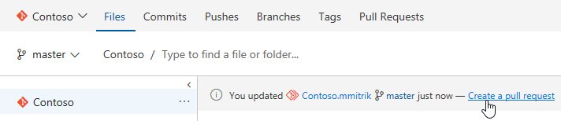
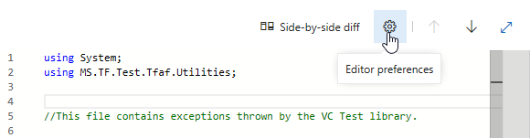
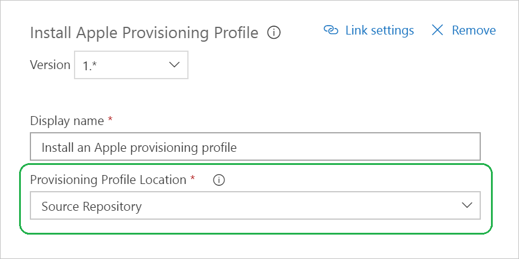
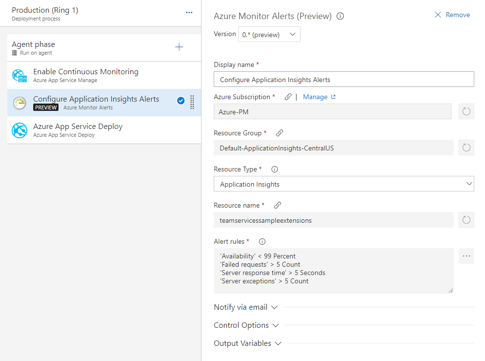
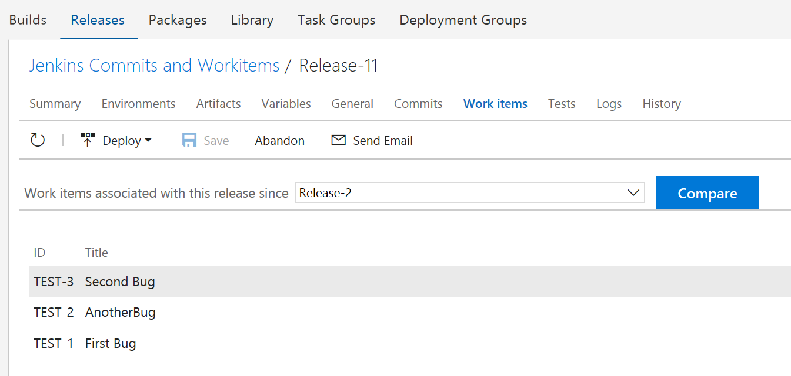
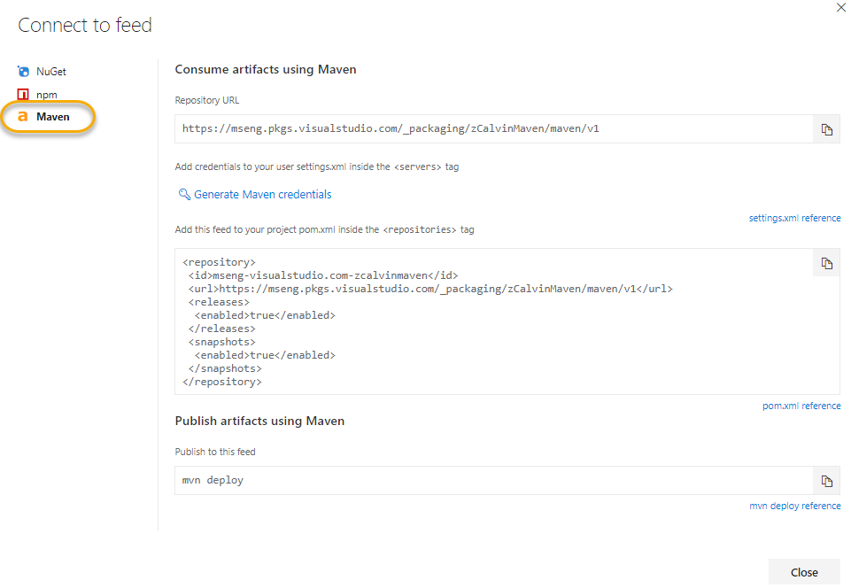
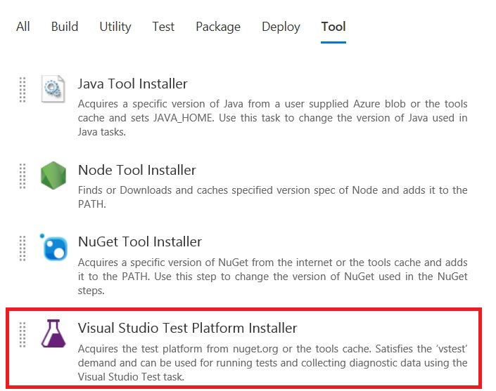
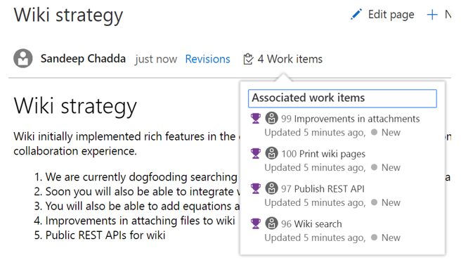
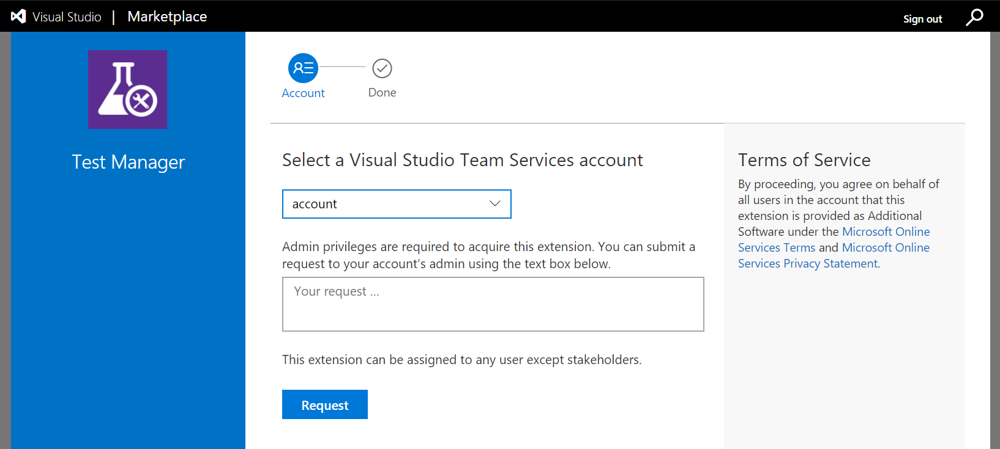

# Azure DevOps Project, YAML builds, Gated releases, and Hosted Mac agents – VSTS Sprint 126 Update

In the **Sprint 126 Update** of Visual Studio Team Services (VSTS), we debut many of the features we announced at the [Microsoft Connect(); 2017](https://www.microsoft.com/connectevent) event. This could be considered our largest release to date, not only in terms of volume of features but also in impact we believe this will have to help you progress on your DevOps journey with the languages and platforms you depend on.

## What’s new in VSTS

> [!VIDEO https://www.youtube.com/embed/29vtC79g25k?rel=0]

## New feature highlights

### Azure DevOps Project 

DevOps Project makes it easy to get started on Azure. It helps you launch an app on the Azure service of your choice in a few quick steps. DevOps Project sets you up with everything you need for developing, deploying and monitoring your app.

Creating a DevOps Project provisions Azure resources and comes with a Git code repository, Application Insights integration, and a continuous delivery pipeline set up to deploy to Azure. The DevOps Project dashboard lets you monitor code commits, builds, and deployments from a single view in the Azure portal.

Key benefits of a DevOps Project:

- Get up and running with a new app and a full DevOps pipeline in just a few minutes
- Support for a wide range of popular frameworks such as .NET, Java, PHP, Node, and Python
- Start fresh or bring your own application from GitHub
- Built-in Application Insights integration for instant analytics and actionable insights
- Cloud-powered CI/CD using Visual Studio Team Services (VSTS)

DevOps Projects are powered by VSTS and gives you a head start in developing and deploying your applications.

> [!div class="mx-imgBorder"]


See the [documentation for deploying to Azure](/azure/devops/deploy-azure/) for more information.

### Configuration as code (YAML) builds in Public Preview 

> [!IMPORTANT]
> To use this capability, you must have the **Build Yaml definitions** [preview feature](/azure/devops/project/navigation/preview-features) enabled on both your profile and account.

When you define a CI build on VSTS, you’ve now got a fundamental choice: use a web-based interface or configure your CI process as code in a YAML build. YAML build definitions give you the advantages of _configuration as code_.

Why should you care? Have you ever run into build breaks or unexpected outcomes caused, not by changes to your app, but by changes in your build process?

A YAML build definition follows the same branching structure as your code. So you get validation of your changes through code reviews in pull requests and branch build policies. This way you can much more easily identify and fix (or avoid) this kind of problem because the change is in version control with the rest of your code base.

See [Chris Patterson’s blog post](https://blogs.msdn.microsoft.com/devops/2017/11/15/pipeline-as-code-yaml-preview/) for his perspective on YAML builds, including how we went about making decisions on how this feature works.

You can try it right now. Just add a new file called **.vsts-ci.yml** to the root of your Git repo in VSTS. Then put this in the file:

```YAML
queue: Hosted VS2017 
steps:
- script: echo hello world 
```

After you commit the changes, a build definition is automatically created and queued! Ready to go beyond “hello world”?

- [Get started configuring your CI Build in code using YAML](/azure/devops/build-release/actions/build-yaml-get-started)
- [How to use YAML builds](/azure/devops/build-release/actions/build-yaml)

### Release gates in Public Preview 

> [!IMPORTANT]
> To use this capability, you must have the **Approval gates in releases** [preview feature](/azure/devops/project/navigation/preview-features) enabled on your profile.

Continuous monitoring is an integral part of DevOps pipelines. Ensuring the app in a release is healthy after deployment is as critical as the success of the deployment process. Enterprises adopt various tools for automatic detection of app health in production and for keeping track of customer reported incidents.
Until now, approvers had to manually monitor the health of the apps from all the systems before promoting the release. However, Release Management now supports integrating continuous monitoring into release pipelines. Use this to ensure the system repeatedly queries all the health signals for the app until all of them are successful at the same time, before continuing the release.

You start by defining pre-deployment or post-deployment gates in the release definition. Each gate can monitor one or more health signals corresponding to a monitoring system of the app. Built-in gates are available for “Azure monitor (application insight) alerts” and “Work items”. You can integrate with other systems using the flexibility offered through Azure functions.

> [!div class="mx-imgBorder"]


At the time of execution, the **Release** starts to sample all the gates and collect health signals from each of them. It repeats the sampling at each interval until signals collected from all the gates in the same interval are successful.

> [!div class="mx-imgBorder"]


Initial samples from the monitoring systems may not be accurate, as not enough information may be available for the new deployment. The “Delay before evaluation” option ensures the **Release** does not progress during this period, even if all samples are successful.

No agents or pipelines are consumed during sampling of gates. See the [documentation for release gates](/azure/devops/pipelines/release/approvals/gates) for more information.

### Hosted Mac agents for CI/CD pipelines in Public Preview 

VSTS now has cloud-hosted CI/CD agents running on macOS. This allows building and releasing Apple apps in the cloud (including iOS, macOS, tvOS, and watchOS), eliminating the need for providing and maintaining your own dedicated Mac hardware. VSTS now offers hosted CI/CD agents running on three operating systems – Linux, macOS, and Windows. For more information, see [Hosted agents](/azure/devops/pipelines/agents/hosted).

To use the hosted macOS agents, select **Hosted macOS Preview** for your build or release pipeline:

> [!div class="mx-imgBorder"]


### TFS Database Import Service now Generally Available

We’re announcing the general availability of the TFS Database Import Service. The Import Service enables customers to migrate from their on-premises Team Foundation Server (TFS) and into our cloud hosted SaaS service Visual Studio Team Services (VSTS).

Customers now no longer require approval from Microsoft to onboard and begin their migrations. To find out more information and get started visit https://aka.ms/tfsimport.

### VSTS CLI in Public Preview

VSTS CLI is a new command line interface for working with and managing your VSTS and TFS projects from Windows, Linux, and Mac. This new open source CLI lets you work with pull requests, work items, builds, and more from the comfort of a command prompt or terminal. You can also use the new CLI to automate interactions with VSTS or TFS using scripts written in Bash, PowerShell, or your favorite scripting language.

Here are just some of the things you can do with VSTS CLI:

- Queue a build
- Show the details of a build
- Create a pull request
- Add a reviewer to a pull request
- Create a new project or Git repo
- Update a work item

To learn more, see the [VSTS CLI docs](https://aka.ms/vsts-cli). To view the source, visit the [vsts-cli repo](https://aka.ms/vsts-cli-source).

## Work

### Query last run by information

As your project’s **Shared Queries** tree grows, it can be difficult to determine that a query is no longer being used and can be deleted. To help you manage your **Shared Queries**, we have added two new pieces of metadata to our [query REST APIs](https://visualstudio.microsoft.com/docs/integrate/api/wit/queries#get-a-query-or-folder), last executed by and last executed date, so that you can write clean-up scripts to delete stale queries.

### Create work items from the Queries hub

> [!IMPORTANT]
> To use this capability, you must have the **[New Queries Experience](/azure/devops/work/track/view-run-query)** [preview feature](/azure/devops/project/navigation/preview-features) enabled on your profile.

Easily create work items from the **Queries** hub with the addition of a **+ New** command bar action.

> [!div class="mx-imgBorder"]


This feature was prioritized based on a [suggestion](http://visualstudio.uservoice.com/forums/330519-visual-studio-team-services/suggestions/31964836-add-a-work-item-from-the-queries-view).

### Expand/collapse requirements/people on the Task board

You can now expand or collapse all the items on the sprint **Task board** with just a single click.

> [!div class="mx-imgBorder"]


### Grant the bypassrule permission to specific users

Often, when migrating work items from another source, organizations want to retain all the original properties of the work item. For example, you may want to create a bug that retains the original created date and created by values from the system where it originated.

The API to [update a work item](https://visualstudio.microsoft.com/docs/integrate/api/wit/work-items#make-an-update-bypassing-rules) has a bypassrule flag to enable that scenario. Previously the identity who made that API request had to be member of the Project Collection Administrators group. With this deployment we have added a permission at the project level to execute the API with the bypassrule flag.

> [!div class="mx-imgBorder"]


## Code

### Rendered markdown in email notifications

Markdown is great for adding rich formatting, links, and images in pull request (PR) descriptions and comments. Email notifications for PRs now display the rendered markdown instead of the raw contents, which improves readability.

Inline images aren’t yet rendered inline (they’re just shown as links), but we’ve got that on our backlog to add in a future Update.

> [!div class="mx-imgBorder"]


### Pull request comment notifications include the thread context

Many times, replies to pull request (PR) comments are pretty brief, acknowledging that a change will be or has been made. This isn’t a problem when viewing these comments in the web view, but if you’re reading a comment in an email notification, the context of the original comment is lost. A simple “I’ll fix it” has no meaning.

Now, whenever a reply is made to a PR comment, the comment emails will include the prior replies in the body of the email message. This allows the thread participants to see the full context of the comment right from their inbox - no need to open the web view.

> [!div class="mx-imgBorder"]


### Pull request service hooks merge events

Extensions using pull request service hooks now have more details and filtering options for merge events. Any time a merge is attempted, the event will be fired regardless of the success or failure of the merge. When a merge attempt results in a failure, details about the reason for the failure will be included.

> [!div class="mx-imgBorder"]


### Improved error messages for work items completing with a pull request

When attempting to complete work items with a pull request, it’s possible that the associated work item cannot be transitioned to the completed state. For example, a specific field might be required and needs user input before the state can be transitioned. We’ve improved the experience to inform you when something is blocking the work item transition, enabling you to take action to make the necessary changes.

> [!div class="mx-imgBorder"]


### Improved Azure Active Directory integration for pull requests

Adding Azure AD groups as reviewers for your pull requests just got a lot easier. Previously, before any AAD group could be added as a reviewer, that group needed to be granted explicit access to VSTS.

Now, AAD groups can be added as reviewers to PRs and both email notifications and voting rollups will work as expected -- without any additional configuration.

### Path filters for pull request policies

Many times, a single repository will contain code that’s built by multiple continuous integration (CI) pipelines to validate the build and run tests. The integrated build policy now supports a path filtering option that makes it easy to configure multiple PR builds that can be required and automatically triggered for each PR. Just specify a path for each build to require, and set, the trigger and requirement options as desired.

> [!div class="mx-imgBorder"]


In addition to build, status policies also have the path filtering option available. This will allow any custom or 3rd party policies to configure policy enforcement for specific paths.

This feature was prioritized based on a [suggestion](http://visualstudio.uservoice.com/forums/330519-visual-studio-team-services/suggestions/17780509-define-multiple-builds-with-path-filters-on-pre-me).

### Pull request suggestions for forks

Whenever a topic branch is updated in a repository, a “suggestion” to create a new pull request (PR) for the topic branch is shown. This is very useful for creating new PRs, and we’ve now enabled it for those working in a forked repo too. If you update a branch in a fork, the next time you visit the **Code** hub for either the fork or the upstream repo, you’ll see the suggestion to create a PR. If you select the “Create a pull request” link, you’ll be directed to the create PR experience, with the source and target branches and repos pre-selected.

> [!div class="mx-imgBorder"]


### Editor settings

Last Update we exposed [new editor settings for word wrap and white space](/azure/devops/release-notes/2017/oct-30-vsts#toggle-word-wrap-and-white-space-in-diff-views). This Update we’re making it easier to manage those settings and persist them with other editor preferences. Click on the editor preferences gear in the pull request editor or diff view. In the Files view, select the User Preferences option on the right-click menu.

> [!div class="mx-imgBorder"]


Select the various editor features including **Show and diff white space**, **Enable word wrap**, **Enable code folding**, and **Show minimap**.

> [!div class="mx-imgBorder"]


Code folding (called “outlining” in some editors) is also being enabled for the web view. When code folding is enabled, click on the minus signs to collapse sections of code -- click on plus signs to expand collapsed sections. The F1 command palette also exposes options for folding various indentation levels across an entire file, making it easier to read and review large files.

> [!div class="mx-imgBorder"]


### Recently used reviewers

If you frequently have your code reviewed by the same individuals, you’ll find it easier than ever to add reviewers. When adding reviewers to your pull requests, a list of your recently added reviewers will be automatically displayed when you put focus into the reviewers input box -- no need to search by name. Select them as you would any reviewer.

> [!div class="mx-imgBorder"]


### SSH: Support additional ciphers/keys and deprecate outdated ciphers

To improve security and compatibility, we’ve updated the list of ciphers supported for SSH. We’ve added 2 new ciphers and deprecated 3, matching OpenSSH’s direction. The deprecated ciphers continue to work in this release. They will be removed in the future as usage falls off.

Added:

- AES128 CTR
- AES256 CTR

Deprecated:

- AES128
- AES192
- AES256

### Improved repository settings performance

Within **Version Control** administration, if you want to merely edit the repository-level settings now you can quickly perform your edits thanks to a new **Branches** node added underneath each repository. Now the potentially long list of hundreds or thousands of branches only needs to be loaded if it needs to be.

> [!div class="mx-imgBorder"]


## Build

### Use VSTS as a symbol server

> [!IMPORTANT]
> To use this capability, you must have the **Symbol server** [preview feature](/azure/devops/project/navigation/preview-features) enabled on your account.

VSTS Symbol Server enables you to host and share symbols with your organization. Symbols provide additional information that makes it easier to debug executables, especially those written in native languages like C and C++. See the [documentation for publishing symbols for debugging](/azure/devops/pipelines/symbols/) for more information.

> [!div class="mx-imgBorder"]


This feature was prioritized based on a top [suggestion](http://visualstudio.uservoice.com/forums/330519-visual-studio-team-services/suggestions/2564053-treat-tfs-as-an-enterprise-symbol-server).

### Agentless build tasks

Your build process is defined by the tasks it performs. Until now, all these tasks were running on an agent, either a hosted agent we provide or on your own private agent. There are some common tasks where an agent is not needed. For example, when you want to call a REST API, or to have the build pause for a period of time.

We’ve added some agentless build tasks to the catalog:

- [Delay](/azure/devops/pipelines/tasks/utility/delay)
- [Invoke REST API](/azure/devops/pipelines/tasks/utility/http-rest-api)
- [Publish to Azure Service Bus](/azure/devops/pipelines/tasks/utility/publish-to-azure-service-bus)

You can add an agentless phase to your build definition and then add one of these tasks to run it on VSTS.

You can also extend and add your own agentless tasks, but there are some restrictions:

- Agentless tasks cannot run scripts.
- You must select one of the pre-defined execution handlers: HttpRequest handler to call an HTTP endpoint, or ServiceBus handler to post a message on the Azure service bus.

For examples on how to create such tasks, see the [InvokeRestAPI](https://github.com/Microsoft/vsts-tasks/tree/master/Tasks/InvokeRestApiV1) and [PublishToAzureServiceBus](https://github.com/Microsoft/vsts-tasks/tree/master/Tasks/PublishToAzureServiceBusV1) tasks.

### Apple provisioning profiles can be installed from source repositories

The **Install Apple Provisioning Profile** task already supports installing (on agent machines) provisioning profiles that are stored in the **VSTS Secure Files** library. Provisioning profiles are used by Xcode to sign and package Apple apps, such as for iOS, macOS, tvOS, and watchOS. Now, provisioning profiles can be installed from source code repositories. Though use of the Secure Files library is recommended for greater security of these files, this improvement addresses provisioning profiles already stored in source control.

> [!div class="mx-imgBorder"]


### Secure files can be downloaded to agents during build or release

The new **Download Secure File** task supports downloading (to agent machines) encrypted files from the **VSTS Secure Files** library. As the file is downloaded, it is decrypted and stored on the agent’s disk. When the build or release completes, the file is deleted from the agent. This allows your build or release to use sensitive files, such as certificates or private keys, that are otherwise securely encrypted and stored in VSTS. For more information, see [Secure files documentation](/azure/devops/pipelines/library/secure-files).

### Specific Java Development Kits (JDKs) can be installed during builds and releases

For building certain Java projects, specific JDKs may be required but unavailable on agent machines. For example, VSTS hosted agents have recent JDK versions preinstalled, but projects may require older or different versions of IBM, Oracle, or open-source JDKs. The **Java Tool Installer** task downloads and installs the JDK needed by your project during a build or release. The JAVA_HOME environment variable is set accordingly for the duration of the build or release. Specific JDKs can be made available to the **Java Tool Installer** using a file share, a source code repository, or Azure Blob Storage.

### Improved Xcode build configuration

The Xcode task has been updated with a new major version (4.\*) that improves configuration of Xcode building, testing, and packaging. If your Xcode project has a single, shared scheme, it will be automatically used. Additional inline help was added. Deprecated features, such as xcrun packaging, were removed from the Xcode task’s properties. Existing build and release definitions must be modified to use this latest 4.* version of the Xcode task. For new definitions, if you need a previous Xcode task version’s deprecated capabilities, you can select that version in your definition.

### Updates to the Hosted VS2017 pool

Updates to the Hosted VS2017 pool include Visual Studio 15.4.0, as well as updates to the Azure Service Fabric SDK, Maven, and the Android SDK.

## Release

### Docker Hub or Azure Container Registry as an artifact source

This feature enables releases to use images stored in a Docker Hub registry or an Azure Container Registry (ACR). This is a first step towards supporting scenarios such as rolling out new changes region-by-region by using the geo-replication feature of ACR or deploying to an environment (such as production) from a container registry that has images for only the production environment.

You can now configure Docker Hub or ACR as a first-class artifact in the **+ Add** artifact experience of a release definition. For now the release has to be triggered manually or by another artifact but we look forward to adding a trigger based on the push of a new image to the registry soon.

> [!div class="mx-imgBorder"]


### Enable Continuous Monitoring on Azure web apps

Performance issues in your cloud app can impact your business. With multiple interconnected components and frequent releases, degradation can happen at any time. And if you’re developing an app, your users may discover issues that you didn’t find in testing.

What if your release pipeline could help you quickly get started with the recommended alerts to help you diagnose and fix problems?

We have added a new release definition template and enhanced our tasks that can enable continuous monitoring of your Azure web apps directly from within a release. You can now set up your Azure app service deployments using the template “Azure app service deployment with continuous monitoring” to enable Application Insights and configure the recommended alerts for your Azure Web Apps.

> [!div class="mx-imgBorder"]


### Jenkins multi-branch pipeline support and link jobs organized in folders

Consuming projects from Jenkins just got even better.

First, you can now consume Jenkins multi-branch pipeline projects as artifact sources in a release definition.

Second, while previously you could link Jenkins projects as artifacts only from the root folder of a Jenkins server, now Jenkins projects can be consumed when organized at folder level. You see the list of Jenkins projects, along with folder paths, in the list of sources from which you select the project to be consumed as artifact source.

> [!div class="mx-imgBorder"]


### Jenkins work items in release for JIRA and VSTS Work Items

When comparing releases, you can now see JIRA work items associated with the Jenkins builds in the Work items tab of the release page.

> [!div class="mx-imgBorder"]


You can also now see the GitHub commits associated with the Jenkins builds in the Commits tab of the release page.

> [!div class="mx-imgBorder"]


## Package

### Save packages from NuGet.org in your feed

NuGet.org as an upstream source is now available, which enables you to use packages from NuGet.org through your VSTS feed. Check out the [announcement blog post](https://blogs.msdn.microsoft.com/devops/?p=37276) to learn more.

> [!div class="mx-imgBorder"]


### Maven support now generally available

Maven packages enable Java developers to easily share code and components. Check out our [getting started guide](https://go.microsoft.com/fwlink/?linkid=848427) for how to share Maven artifacts using Package Management.

> [!div class="mx-imgBorder"]


### Easier feed creation and editing

Creating a new feed is now a full-page experience that’s very similar to the “New project” screen. We’ve also streamlined the defaults, particularly around feed permissions, to match what the vast majority of customers were selecting in the old experience.

> [!div class="mx-imgBorder"]


Editing a feed is now also a full-page experience. In making this move, we’ve aligned permissions management to be more like other areas of the product and made it easier to manage feeds with many users and groups.

> [!div class="mx-imgBorder"]


### Previous package versions are now a full-page list

We received a lot of feedback on the updated Package Management experience, where we moved the list of previous package versions into a breadcrumb picker on the package details page. This Update, we’ve added a new **Versions** pivot that brings more information about prior versions and makes it easier to copy the version number or get a link to an old version.

> [!div class="mx-imgBorder"]


### Promote, unlist, and deprecate multiple packages

It is now possible to manage multiple packages, and multiple versions of a single package, in bulk. On the package list, you can now promote, unlist, and deprecate multiple packages by selecting them. On the package details, you can use the new **Versions** pivot to select multiple versions and promote or unlist/deprecate them. Support for delete of multiple packages and multiple versions of a package is coming in a future Update.

This feature was prioritized based on a [suggestion](http://visualstudio.uservoice.com/forums/330519-visual-studio-team-services/suggestions/20082451-make-it-easier-unlist-multiple-versions-of-a-packa).

## Test

The **Visual Studio Test** task in build/release requires Visual Studio on the agent to run tests. Rather than installing Visual Studio to run tests in production environments or for merely distributing tests over multiple agents, use the new **Visual Studio Test Platform Installer** task. This task that acquires the [test platform from nuget.org](https://www.nuget.org/packages/Microsoft.TestPlatform) and adds it to the tools cache. The installer task satisfies the **vstest** demand and a subsequent **Visual Studio Test** task in the definition can run without needing a full Visual Studio install on the agent.

From the task catalog, add the installer task in your definition.

> [!div class="mx-imgBorder"]


Configure the subsequent **Visual Studio Test** task to use the bits acquired via the installer.

> [!div class="mx-imgBorder"]


Limitations: The Test Platform package on nuget currently does not support running Coded UI test. Enabling support for Coded UI test is on the backlog. 
The Test Platform package on nuget is cross-platform, but VSTest task currently does not support running .NET core tests. To run .NET core tests, use the 'dot net' task. 

## Wiki

### Wiki Search

> [!IMPORTANT]
> To use this capability, you must have the **New experience in Code & Work Item search and new Wiki search** [preview feature](/azure/devops/project/navigation/preview-features) enabled on your profile.

Over time as teams document more content in wiki pages across multiple projects in VSTS, finding relevant content becomes increasingly difficult. To maximize collaboration, you need the ability to easily discover content across all your projects. Now you can use **Wiki Search** to quickly find relevant wiki pages by title or page content across all projects in your VSTS account.

> [!div class="mx-imgBorder"]


This feature was prioritized based on a [suggestion](http://visualstudio.uservoice.com/forums/330519-visual-studio-team-services/suggestions/19952845-wiki-fulltextsearch).

### Link work items and Wiki pages

Earlier you were able to [reference work items to a wiki page](/azure/devops/release-notes/2017/oct-06-vsts#reference-work-items-in-wiki). Now you can link a work item to a wiki and vice versa. You can link work items to wiki to create epic pages, release notes, and planning content that will help you track the work items associated with a wiki page and validate what % of your epic page is complete.

> [!div class="mx-imgBorder"]


Linked work items then show up on the wiki page.

> [!div class="mx-imgBorder"]


Add a link to a wiki page from a work item through the new “Wiki page” link type.

> [!div class="mx-imgBorder"]


### Rich markdown rendering in code repo markdown

You can now create rich README.MD files in the code repositories. The markdown rendering of the MD files in code repositories now supports HTML tags, Block quotes, Emojis, image resizing, and mathematical formulas. There is parity in [markdown rendering](https://go.microsoft.com/fwlink/?linkid=851652) in Wiki and MD files in code.

### Wiki supports mathematical formulas

If your application deals with mathematical formulas and equations, you can now put them in Wiki using the [LaTeX format](https://en.wikibooks.org/wiki/LaTeX/Mathematics).

> [!div class="mx-imgBorder"]


## Reporting

### Analytics OData in Public Preview

Analytics OData is now in full public preview and available to everyone. OData provides developers access to Analytics data, to build their own widgets and tools. Also launching is [documentation](/azure/devops/report/analytics/what-is-analytics) which includes: an overview of Analytics, OData API guidance, and a working example of a widget built upon Analytics.

### Deprecating the PowerBI.com Content Pack

The Visual Studio Team Services (VSTS) Content Pack in PowerBI.com was deprecated on Nov. 15th, 2017. Existing PowerBI.com data sets based on the Content Pack will continue to be supported, however, it will no longer be possible to create any new data sets.

The VSTS Content Pack was deprecated because of the load it introduced to the VSTS service, which impacted end user experiences in the product. This often resulted in throttling end users access to the account. The new [Analytics extension](https://marketplace.visualstudio.com/items?itemName=ms.vss-analytics) and the [Analytics OData endpoint](#analytics-odata-in-public-preview) are intended to replace and improve on the capabilities of the Content Pack.

## Marketplace

Don’t have the right permissions to purchase something for your account? That’s fine, just request what you need from the Marketplace and account administrators with the permission to purchase will be able to review and accept your request. Just start by going to the [Marketplace](https://marketplace.visualstudio.com/), select the extensions you need and continue to checkout. From there, you’ll be able to provide a justification.

> [!div class="mx-imgBorder"]


## Administration

### Inviting directory guests to Azure AD-backed VSTS accounts

You can now easily invite people from outside of your Azure Active Directory (Azure AD), without ever leaving Visual Studio Team Services (VSTS). If your VSTS account is backed by Azure AD and you have the necessary permissions, then you can simply invite any email address and VSTS will take care of the rest, including adding them to your Azure AD as a guest.

> [!div class="mx-imgBorder"]


## Next steps and Feedback

> [!div class="nextstepaction"]
> [Go to VSTS](http://go.microsoft.com/fwlink/?LinkId=307137&campaign=o~msft~docs~product-vsts~release-notes)

We would love to hear what you think about these features. Report a problem or provide a suggestion if you have ideas on things you’d like to see us prioritize, through the feedback menu.

> [!div class="mx-imgBorder"]


You can also get advice and your questions answered by the community on [Stack Overflow](https://stackoverflow.com/questions/tagged/vsts).

Thanks,

Jamie Cool