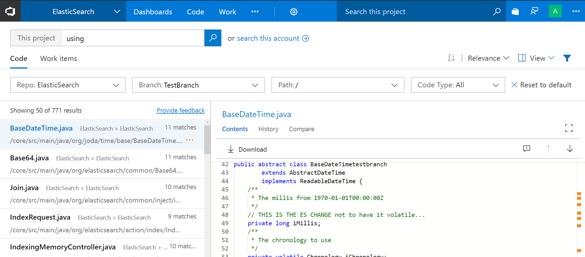
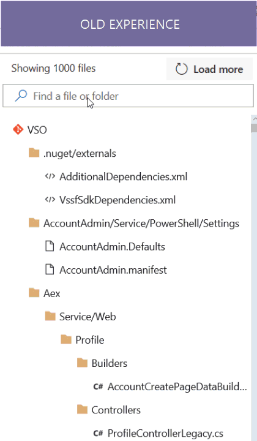
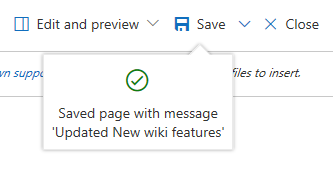
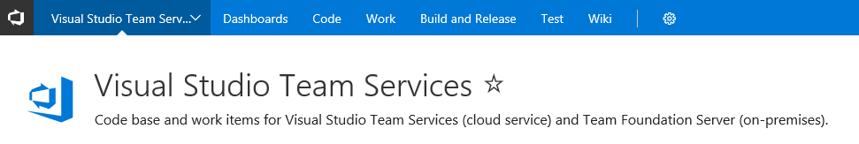
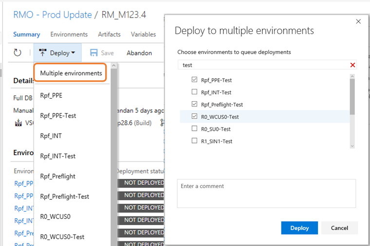

# Streamlined code and work items search – VSTS Sprint 124 Update

In the **Sprint 124 Update** of Visual Studio Team Services (VSTS) we’re happy to announce the preview of an updated experience for search that gives more real estate for the search results, and makes it easier and more intuitive to filter. Read more about the [updated experience for search](#updated-experience-for-code-and-work-items-search) below.

Some of the other key feature highlights include:

* [Pull request comments follow renamed files](#pull-request-comments-follow-renamed-files) - Comments now follow renames.
* [Reference work items in Wiki](#reference-work-items-in-wiki) - Add a link to a work item in a Wiki.
* [Use Azure Key Vault secrets in your CI build](#use-azure-key-vault-secrets-in-your-ci-build) - Stay secure in your build process by referencing Azure Key Vault secrets.
* [Bulk Deploy environments manually from Release view](#bulk-deploy-environments-manually-from-release-view) - Go broad across environments with a single Deploy action.
* [Process parameters for deployment templates](#process-parameters-for-deployment-templates) - Configuring release made easy with process parameters.

## What’s new in VSTS

> [!VIDEO https://channel9.msdn.com/Shows/Visual-Studio-Toolbox/Visual-Studio-Team-Services-VSTS-Sprint-124--whats-new/player]

## Code

### Updated experience for code and work items search

> [!TIP]
> To use this capability you must have the [Code Search extension](https://marketplace.visualstudio.com/items?itemName=ms.vss-code-search) installed and **New User Experience in Code & Work Item Search** [preview feature](/azure/devops/project/navigation/preview-features) enabled on your profile.

The new **Search** experience for both **Code** and **Work items** is now available in preview. Thank you to everyone who provided feedback on the search experience and helped us make the product better.

The updated experience reflects this feedback, and brings a host of improvements:

* A streamlined layout of the search box, code and work item results pivots, filter controls and two pane results pane makes search a breeze.
* When you start a search from within a project, search defaults to results from that project; you can easily now navigate up to the account level to broaden your search.
* The new filtering controls are designed based on extensive feedback on the previous experience.
  * You can easily see the filters that influence the search results.
  * It's easier to work with filters; we have made many usability tweaks, e.g. gone are the filters that move up as you select them.
  * You can easily hide the filters to liberate more space for results.
  * Based on where in VSTS you’re coming from, certain defaults are applied to make it easier to find things.
* You can now sort by filename and filepath in code.
* You can now filter by branch in code using the branch filter. See [Search for code in multiple branches](#search-for-code-in-multiple-branches) below.

Try out the new experience and let us know your feedback.

> [!div class="mx-imgBorder"]
> 

#### Search for code in multiple branches

In code search we have enabled support to index multi-branches. This will allow you to search in branches other than the default branch. You can now have 5 more branches per repository indexed for searching. Your Project Admin can configure the additional branches from the **Version Control** settings page:

> [!div class="mx-imgBorder"]
> 

Note that search across multiple repositories automatically uses the default branch.

### Pull request comments follow renamed files

Sometimes files are renamed or moved while a pull request is active. Previously, if there were comments on those renamed files, the latest view of the code wouldn’t display the comments. We’ve now improved comment tracking to follow the renames, displaying comments on the latest version of renamed or moved files.

### Enhanced filter capability for commits with more than 1000 files changed

Searching for a file in commits or pull requests that have modified more than 1000 files was inefficient; you would need to click on **Load more** link several times to find the file that you interested in. Now, when you filter content in the tree view, the search for that file is done across all files in the commit instead of just looking at the top 1000 files loaded. The performance of the commit details page is also improved when there are more than 1000 files modified.

> [!div class="mx-imgBorder"]
> 

### Ctrl+S to save Wiki page

We heard you wanted a quicker and easier way to save a Wiki page. Now you can simply press Ctrl+S keyboard shortcut to save a page with a default revision message and continue editing. If you'd like to add a custom revision message just click on the chevron next to the save button.

> [!div class="mx-imgBorder"]
> 

### Reference work items in Wiki

Now you can reference work items in wiki pages by pressing the '#' key to get a list of the most recently accessed work items and selecting the work item of interest. This is particularly useful while writing release notes, epics, specs, or other pages that require referring to a work item.

> [!div class="mx-imgBorder"]
> 

### Enable Wiki home page to show on the Project description page

**Wiki** has rich formatting and layout capabilities, like HTML support and inline videos. You can now leverage these capabilities to create beautiful project description pages by choosing to show the wiki home page on the **Project** description page.

See the [documentation for add and edit wiki pages](/azure/devops/project/wiki/add-edit-wiki) for more information.

### Custom Project image on Project description page

VSTS has allowed you to upload a custom image for your **Project** (and default team) for some time. However, this image was only visible on the settings page. With this update, you will see the customized image on the description page, which helps to give a unique identity to a **Project**. If not customized, you will see an auto-generated image based on the Project's name.

> [!div class="mx-imgBorder"]
> 

## Work

### Updated Plans navigation

Many of you care about a specific plan or set of plans and use favorites for quick access to the content. First, we’ve updated the **Plans** hub to navigate to your most recently visited plan instead of the directory page. Second, once there, you can use the favorites picker to quickly switch to another plan or use the breadcrumb to navigate back to the directory page. As always, your favorite plans will appear on the **Account Home** page along with other favorites from across projects.

> [!div class="mx-imgBorder"]
> 

## Build

### Use Azure Key Vault secrets in your CI build

You can now leverage Azure’s highly secure storage to manage the secrets you use in your build process. Simply create a variable group that points to the key vault and use that variable group in your build definition.

See the [Azure Key Vault page](https://azure.microsoft.com/services/key-vault/) and [Link secrets from an Azure Key vault as variables documentation](/azure/devops/pipelines/library/variable-groups) for more information.

### New software updates available on hosted VS2017 agents

Software updates added to the Hosted VS2017 pool includes: Visual Studio 2017 version 15.3.5, Azure Service Fabric SDK 2.7, and Docker version 17.10.0. See the [VSTS Hosted VS2017 image page](https://github.com/Microsoft/vsts-image-generation/blob/master/images/win/Vs2017-Server2016-Readme.md) for more information.

## Release

### Bulk Deploy environments manually from Release view

You can now manually trigger a **Deploy** action to multiple environments of a release at the same time. This allows you to select multiple environments in a release with failed configurations or deployments, and re-deploy to all of the environments in one operation.

> [!div class="mx-imgBorder"]
> 

### Process parameters for deployment templates

The process parameters that existed in build templates is now available for all release templates. The most important fields across all tasks in the template are now promoted to the process view. You can now quickly configure and successfully deploy by providing values for these minimal set of process parameters.

> [!div class="mx-imgBorder"]
> 

See the [documentation for the new build editor](/azure/devops/pipelines/archive/preview/2017-user-experience#parameters) for more information.

### Default properties for Git and GitHub artifact types are now editable

You can now edit the default properties of Git and GitHub artifact types even after the artifact has been linked. This is particularly useful in scenarios where the branch for the stable version of the artifact has changed, and future continuous delivery releases should use this branch to obtain newer versions of the artifact.

> [!div class="mx-imgBorder"]
> 

## Next steps and Feedback

> [!div class="nextstepaction"]
> [Go to VSTS](http://go.microsoft.com/fwlink/?LinkId=307137&campaign=o~msft~docs~product-vsts~release-notes)

We would love to hear what you think about these features. Report a problem or provide a suggestion if you have ideas on things you’d like to see us prioritize, through the feedback menu.

> [!div class="mx-imgBorder"]
> 

You can also get advice and your questions answered by the community on [Stack Overflow](https://stackoverflow.com/questions/tagged/vsts).

Thanks,

Biju Venugopal
