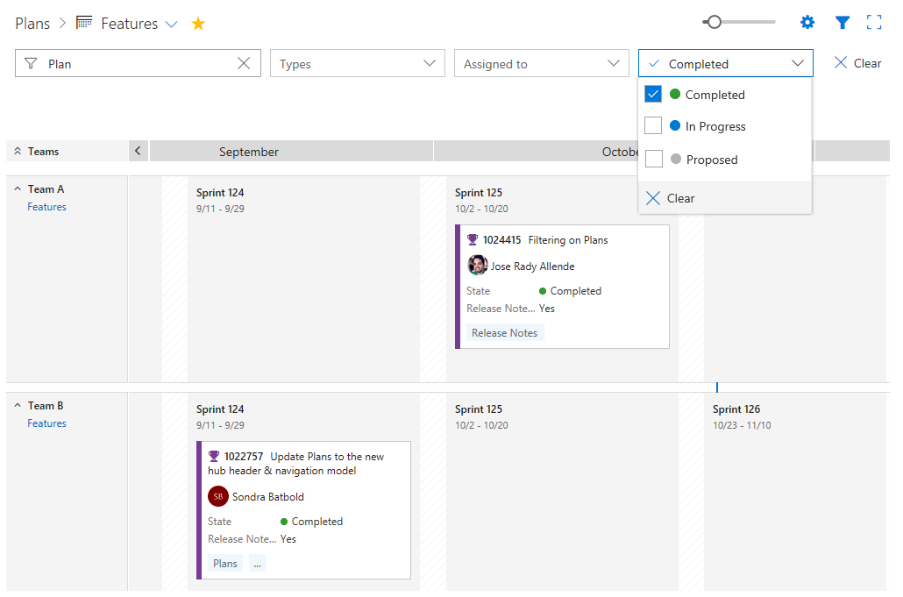
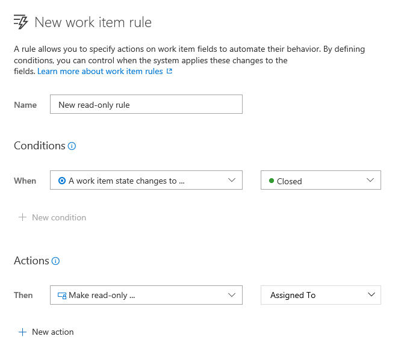
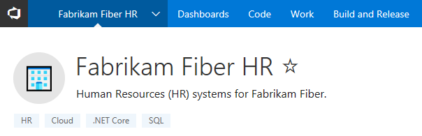

# Query editing improvements and revamped create release experience – VSTS Sprint 125 Update

In the **Sprint 125 Update** of Visual Studio Team Services (VSTS), you’ll see several query editing and experience consistency improvements as well as a revamped create release dialog. Read more about the [create release experience](#revamped-create-release-experience) below.

Other key feature highlights include:

* [Circle avatars](#circle-avatars) - Out with the squares... in with the circles.
* [Modernized column options](#modernized-column-options) and [Added support for Not In query operator](#added-support-for-not-in-query-operator) - Create more useful queries with ease.
* [Mention a pull request](#mention-a-pull-request) - Discuss pull requests with a bang`!`
* Consistent filtering in [Plans](#filtering-on-plans) and [Package](#filtering-in-package-management) - Find what you’re looking for fast no matter where you are in VSTS.

## What’s new in VSTS

> [!VIDEO https://www.youtube.com/embed/82fid741cXE?rel=0]

## Work

### Modernized column options

The **Column options** dialog used to configure the columns of the work item grid in the **Backlog**, **Queries**, and **Test** hubs has been updated to use a new panel design. Search to find a field, drag and drop to reorder columns, or remove existing columns you no longer want.

> [!div class="mx-imgBorder"]
> 

### Added support for Not In query operator

Fields that support the “In” [query operator](/azure/devops/work/track/query-operators-variables#query-operators) now support “Not In”. Write queries for work items “Not In” a list of IDs, “Not In” a list of states, and much more, all without having to create many nested “Or” clauses. This feature was prioritized based on a [customer suggestion](http://visualstudio.uservoice.com/forums/330519-visual-studio-team-services/suggestions/2772233--not-in-operator-for-work-item-queries). Keep submitting those ideas and voting up those most important to you.

> [!div class="mx-imgBorder"]
> 

### Filtering on Plans

The [**Delivery Plans**](https://marketplace.visualstudio.com/items?itemName=ms.vss-plans) extension now makes use of our common filtering component, and is consistent with our grid filtering experiences for work items and **Boards**. This filtering control brings improved usability and a consistent interface to all members of your team.

> [!div class="mx-imgBorder"]
> 

### Read-only work item rules

Earlier this year, we introduced [customizable work item rules](/azure/devops/release-notes/2017/aug-28-team-services#customizable-work-item-rules) to VSTS. With this current update, we are excited to provide even more options by introducing the read-only action to work item rules. Below are some examples of rules you can create that leverage this new capability.

* When a work item state is **Resolved**, then make **Remaining Work** read-only
* When a work item state is **Closed**, then make **Assigned To** read-only
* When the value of **Approved** is true, then make **Reviewed By** read-only

> [!div class="mx-imgBorder"]
> 

## Code

### Mention a pull request

You can now mention pull requests in PR comments and work item discussions. The experience for mentioning a PR is similar to that of a work item, but uses an exclamation point `!` instead of a hash mark `#`.

Whenever you want to mention a PR, enter a `!`, and you’ll see an interactive experience for picking a PR from your list of recent PRs. Enter keywords to filter the list of suggestions, or enter the ID of the PR you want to mention.  Once a PR is mentioned, it will be rendered inline with the ID and the full title, plus it will link to the PR details page.

> [!div class="mx-imgBorder"]
> 

### Toggle word wrap and white space in diff views

Two new features are available in the file diff viewer: **Toggle Word Wrap** and **Toggle White Space**. The first allows the word wrap setting to be applied while in a diff view. This is particularly useful for reviewing PRs that contain files without frequent line breaks - markdown files are a good example. The option to toggle white space is helpful when only whitespace has changed in a line or file. Toggling this setting will both display and highlight the whitespace characters (dots for spaces, arrows for tabs, etc.) in the diff.

To toggle these settings, use the **F1** key to access the command palette. Then select the setting to toggle.

> [!div class="mx-imgBorder"]
> 

## Package

### Filtering in Package Management

The **Packages** page has been updated to use our standard page layout, command bar control, and the new standard filter bar.

> [!div class="mx-imgBorder"]
> 

## Release

### Revamped create release experience

The new **Create new release** experience will help you visualize a pipeline before creation. Additionally, for automatically triggered environments, you can switch the trigger from automatic to manual by clicking on the environment and quickly see the impact on your pipeline.

> [!div class="mx-imgBorder"]
> 

### Inline GitHub connection as a release artifact source

When adding artifacts to a release definition you can now create a new **GitHub** connection directly from the artifacts selection panel. Choose from either the OAuth or PAT token authentication mechanism; similar to the experience we have in the build definition editor.

> [!div class="mx-imgBorder"]
> 

### Azure Resource Group task - Deployment outputs as variables

Azure Resource Manager templates allow defining outputs, which need to be returned after an Azure deployment. We have enhanced the **Azure Resource Group Deployment** task to expose the output JSON section of the deployment object as a task output parameter: `<Task Reference name>.DeploymentOutputs`. You can further parse the JSON object (and access the individual output values) for consumption in subsequent tasks of the release environment.

> [!div class="mx-imgBorder"]
> 

## General

### Circle avatars

Circle avatars are here! All profile pictures in the service will now display in a circle shape, rather than a square. As an example, here is the actual pull request for this change (note the circular, non-square avatars).

> [!div class="mx-imgBorder"]
> 

### Project tags

You can now adorn projects with important keywords (tags). Tags are easily added and deleted directly from the project home page (by administrators) allowing users to quickly understand more about the purpose and scope of the project. We’ve got more planned for how project tags can be leveraged, so stay tuned for more news here.

> [!div class="mx-imgBorder"]
> 

## Next steps and Feedback

> [!div class="nextstepaction"]
> [Go to VSTS](http://go.microsoft.com/fwlink/?LinkId=307137&campaign=o~msft~docs~product-vsts~release-notes)

We would love to hear what you think about these features. Report a problem or provide a suggestion if you have ideas on things you’d like to see us prioritize, through the feedback menu.

> [!div class="mx-imgBorder"]
> 

You can also get advice and your questions answered by the community on [Stack Overflow](https://stackoverflow.com/questions/tagged/vsts).

Thanks,

Aaron Bjork