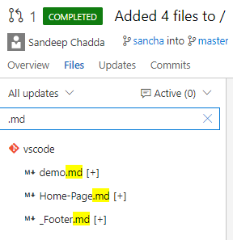
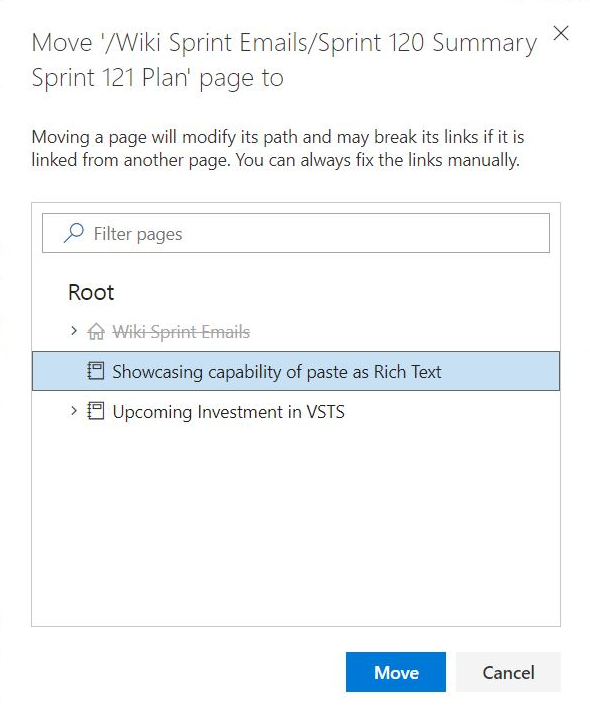
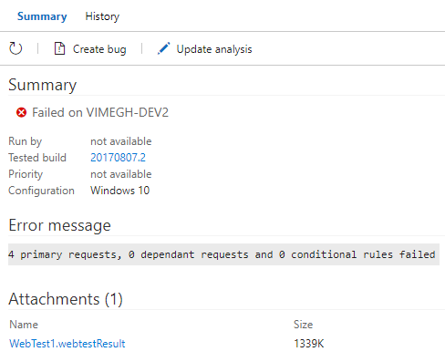
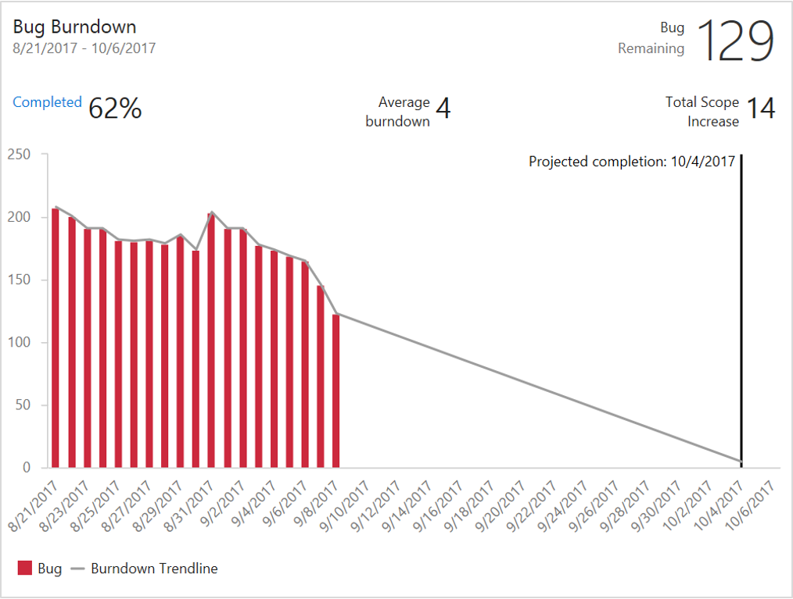

# Multi-phase builds – VSTS Sprint 123 Update

In the **Sprint 123 Update** of Visual Studio Team Services (VSTS) we’re announcing the availability of multi-phase builds to build multiple kinds of apps as part of a single build. Read more about [Multi-phase builds](#multi-phase-builds) below.

Some of the other key feature highlights include:

* [New Queries experience](#new-queries-experience) - Use favorites and a simplified directory to get to the queries that are important to you.
* [Personalized notifications for releases](#personalized-notifications-for-releases) - Keep the release pipeline moving with automated notifications for interventions.
* [Run webtests using the VSTest task](#run-webtests-using-the-vstest-task) - Include webtests in your CI/CD pipeline.
* [Gulp, Yarn, and more authenticated feed support](#gulp-yarn-and-more-authenticated-feed-support) - Use authenticated feeds in subsequent build tasks.
* [Burndown and Burnup widgets](#burndown-and-burnup-widgets) - Answer the question: Will we complete this project on time?
* [Deep linking](#wiki-page-deep-linking), [preview content side-by-side](#preview-content-as-you-edit-wiki-pages), and [paste rich HTML content](#paste-rich-content-as-html) in Wiki.

## Work

### New Queries experience

> [!TIP]
> To use this capability you must have the **New Queries Experience** [preview feature](/azure/devops/project/navigation/preview-features) enabled on your profile.

The **Queries** hub has a new look and feel, changes in navigation, and some exciting new features such as the ability to search for queries.

You’ll first notice that the left pane has been removed. To quickly navigate between your favorite queries, use the dropdown in the query title.

> [!div class="mx-imgBorder"]

Alternatively, browse all your personal and shared queries in the new directory pages and favorite what is important to you and your team. You can get to the query directory using the **Queries** breadcrumb.

> [!div class="mx-imgBorder"]

The directory pages highlight new metadata for each query, including:

* The type of query
* The path within the hierarchy
* Who last modified it
* When it was last modified

The pages also include a filter bar that lets you quickly search for any query you care about.

> [!div class="mx-imgBorder"]

We’ve also made the following improvements:

* Create and edit followed work item queries with the @Follows macro
* Query for work items you were mentioned in with the @Mentions macro
* **Save as** now copies charts to the new query
* Simplified command bars for **Results** and **Editor**
* Expanded filter capabilities in the result grid

### Keyboard shortcuts in the work item form

Assign a work item to yourself (Alt + i), jump to discussion (Ctrl + Alt + d), and copy a quick link to the work item (Shift + Alt + c) using keyboard shortcuts. For the full list of new shortcuts, type “?” with a work item form open or see the table below.

> [!div class="mx-imgBorder"]

### Contextual actions in the Work Items hub

From within the **Work Items** hub, you can now make use of contextual actions that change based on the selection of items. Copy to clipboard (Ctrl + C), Email, Delete (Delete), and Open selected items in **Queries** are now supported and accessible via mouse selection. Alternatively you can use Shift or Ctrl to streamline the selection of multiple items.

> [!div class="mx-imgBorder"]

> [!div class="mx-imgBorder"]

### HTML tags stripped in work item grids

Based on customer feedback, we have updated the behavior of multi-line text fields in work item query results views in the web, Excel, and Visual Studio IDE to remove HTML formatting. When added as a column to the query, multi-line text fields will now display as plain text. Here is an example of a feature with HTML in the description.

> [!div class="mx-imgBorder"]

In the past, the query results would have rendered something like `
<b><u>Customer Value</u>...`

### Filtering to the Process and Fields pages in the Process admin

The list of process and fields in the **Process** admin pages can be quite long. To quicker find the process or field you are looking for we have added a text filter to these pages.

> [!div class="mx-imgBorder"]

## Code

### Create a folder in a repository using web

You can now create folders via the web in your Git and TFVC repositories. This replaces the [Folder Management extension](https://marketplace.visualstudio.com/items?itemName=ms-devlabs.FolderManagement), which will now undergo the process of deprecation.

To create a folder, click **New > Folder** in either the command bar or context menu:

> [!div class="mx-imgBorder"]

For TFVC, you’ll specify a folder name and then check it in. For Git, because empty folders aren’t permitted, you’ll also have to specify a file name, optionally edit the file, then commit it.

Additionally, for Git, The **New file** dialog has been enhanced to accept slashes to create subfolders.

> [!div class="mx-imgBorder"]

### Get a permanent link to code

When viewing a file, you usually see the version at the tip of the selected branch. The version of a file at the tip may change with new commits. If you copy a link from this view, your links can become stale because the URL only includes the branch name, not the commit SHA. You can now easily switch the **Files** view to update the URL to refer to the commit rather than the branch. If you press the “y” key, your view will switch to the tip commit of the current branch. You can then copy permanent links.

### Filter text highlighting

Filtering the navigation pane in **Wiki** shows the entire page hierarchy. For example, if you filter a page titled “foobar” the filtered navigation pane would show all parent pages as well. This can cause confusion as to why pages not titled “foobar” are showing up in filtered set of results. Now, filtering content in **Wiki** will highlight the text being searched to give a clear picture of the titles that are filtered and those that are not.

> [!div class="mx-imgBorder"]

You will observe similar behavior in all code navigation panes as well. For example, the file navigation pane in pull requests, commits, changesets, and shelvesets.

> [!div class="mx-imgBorder"]

### Wiki page deep linking

**Wiki** now supports deep linking sections within a page and across pages, which is really useful for creating a table of contents. You can reference a heading in the same page or another page by using the following syntax:

* Same page: `[text to display](#section-name)`
* Another page: `[text to display](/page-name#section-name)`

See the [documentation for Markdown syntax guidance](/azure/devops/reference/markdown-guidance#links) for more information.

### Move page in Wiki using keyboard

Earlier in **Wiki**, users could not reorder or re-parent pages using keyboard and this would impact users who prefer with keyboard operations. Now you can reorder pages by using Ctrl + Up or Ctrl + Down commands. You can also re-parent pages by clicking **Move page** in the context menu of a page and select the new parent page to move.

> [!div class="mx-imgBorder"]

> [!div class="mx-imgBorder"]

### Preview content as you edit Wiki pages

Data shows that users almost always **Preview** a wiki page multiple times while editing content. For each page edit, users click on **Preview** 1-2 times on average. This results in a slow and sub-optimal edit experience and can be particularly time consuming for those new to markdown. Now you can see the preview of your page while editing.

> [!div class="mx-imgBorder"]

### Paste rich content as HTML

You can now paste rich text in the markdown editor of **Wiki** from any browser-based applications such as Confluence, OneNote, SharePoint, and mediawiki. This is particularly useful for those who have created rich content such as complex tables and want to show it in **Wiki**. Simply copy content and paste it as HTML.

> [!div class="mx-imgBorder"]

## Build

### Multi-phase builds

Modern multi-tier apps often must be built with different sets of tasks, on different sets of agents with varying capabilities, sometimes even on different platforms. Until now, in VSTS you had to create a separate build for each aspect of these kinds of apps. Today we’re announcing the first set of features to enable multi-phase builds.

> [!div class="mx-imgBorder"]

You can configure each phase with the tasks you need, and specify different demands for each phase. Each phase can run multiple jobs in parallel using multipliers. You can publish artifacts in one phase, and then download those artifacts to use them in a subsequent phase.

When this feature reaches your account, you’ll notice that all your current build definitions have been upgraded to have a single phase. Some of the configuration options such as demands and multi-configuration will be moved to each phase.

We’re still working on a few features, including:

* Ability to select a different queue in each phase.
* Ability to consume output variables from one phase in a subsequent phase.
* Ability to run phases in parallel. (For now, all the phases you define run sequentially).

## Release

### Personalized notifications for releases

Release notifications are now integrated with the VSTS notification settings experience. Those managing releases are now automatically notified of pending actions (approvals or manual interventions) and important deployment failures.
You can turn off these notifications by navigating to the **Notification** settings under the profile menu and switching off **Release Subscriptions**. You can also subscribe to additional notifications by creating custom subscriptions.
Admins can control subscriptions for teams and groups from the **Notification** settings under **Team** and **Account** settings.

Release definition authors will no longer have to manually send emails for approvals and deployment completions.

This is especially useful for large accounts that have multiple stakeholders for releases, and those other than approver, release creator and environment owner that might want to be notified.

> [!div class="mx-imgBorder"]

See the [post for managing release notifications](https://blogs.msdn.microsoft.com/devops/2017/09/04/managing-release-notifications/) for more information.

### Manage variables using the List and Grid views in the new release definition editor

You can now easily manage all your release and environment variables using the two views - **List** view and **Grid** view. Use the **List** view to quickly add release or environment variables, and the **Grid** view to compare and edit variables across scopes. Additionally, you can use the filter and keyword search to manage the set of variables to work with in both the views.

> [!div class="mx-imgBorder"]

> [!div class="mx-imgBorder"]

### Branch filters in environment triggers

In the new release definition editor, you can now specify artifact conditions for a particular environment. Using these artifact conditions, you will have more granular control on which artifacts should be deployed to a specific environment. For example, for a production environment you may want to make sure that builds generated only from the master branch are deployed. This filter needs to be set for all artifacts that you think should meet this criteria.

You can also add multiple filters for each artifact that is linked to the release definition. Deployment will be triggered to this environment only if all the artifact conditions are successfully met.

> [!div class="mx-imgBorder"]

### Improved Deployment Groups UI

Continuing our journey of refreshing the **Build** and **Release** experiences, we have now re-imagined our deployment groups pages to make it a more clean and intuitive experience. From the landing page you can view the health of the targets in the deployment group. You can also manage security for an individual deployment group, or set default permissions across deployment groups.

> [!div class="mx-imgBorder"]

For a target within a deployment group, you can view a summary, recent deployments, and the target’s capabilities. You can set tags on the target, and control what is run on each target. We will be adding filter support for deployment groups in upcoming releases.

> [!div class="mx-imgBorder"]

## Test

### Run webtests using the VSTest task

Using the Visual Studio test task, webtests can now be run in the CI/CD pipeline. Webtests can be run by specifying the tests to run in the task assembly input. Any test case work item that has an “associated automation” linked to a webtest, can also be run by selecting the test plan/test suite in the task.

> [!div class="mx-imgBorder"]

Webtest results will be available as an attachment to the test result. This can be downloaded for offline analysis in Visual Studio.

> [!div class="mx-imgBorder"]

This capability is dependent on changes in the Visual Studio test platform and requires that Visual Studio 2017 Update 4 be installed on the build / release agent. Webtests cannot be run using prior versions of Visual Studio.

Similarly, webtests can be run using the **Run Functional Test** task. This capability is dependent on changes in the Test Agent, that will be available with the Visual Studio 2017 Update 5.

See the [Load test your app in the cloud using Visual Studio and VSTS quickstart](/azure/devops/load-test/getting-started-with-performance-testing) as an example of how you can use this together with load testing.

### Chart widget for test plans and test suites

Previously, you could create charts for test plans and suites in **Test** hub and pin them to dashboard. We have now added a widget that enables creating charts for test plans and suites from the widget catalog on the dashboard. You can create charts for test authoring status or test execution status. Moreover, adding charts from the widget allows you to create larger charts when you have more data to be shown on a chart.

> [!div class="mx-imgBorder"]

### Preview improvements and support for different log types generated by Visual Studio Test task

We enhanced the VSTest task to publish logs generated by different kind of logging statements corresponding to standard output and standard error for failed tests. We have also improved the preview experience to support viewing text and log file formats, with capability to search in the log files.

## Package

### Gulp, Yarn, and more authenticated feed support

The npm task today works seamlessly with authenticated npm feeds (in **Package Management** or external registries like **npm Enterprise** and **Artifactory**), but until now it’s been challenging to use a task runner like **Gulp** or an alternate npm client like **Yarn** unless that task also supported authenticated feeds. With this update, we’ve added a new **npm Authenticate** build task that will add credentials to your .npmrc so that subsequent tasks can use authenticated feeds successfully.

> [!div class="mx-imgBorder"]

### Package feed default permissions now include Project Administrators

In the past, creating a feed sets the creating user as the only feed owner, which can cause administration challenges in large organizations if that user switches teams or leaves the organization. To remove this single point of failure, creating a feed now uses the user’s current project context to get the **Project Administrators** group and make it an owner of the feed as well. As with any permission, you can remove this group and further customize feed permissions using the feed settings dialog.

## Reporting

### Burndown and Burnup widgets

The **Burndown** and **Burnup** widgets are now available for those who have installed the [Analytics Extension](https://marketplace.visualstudio.com/items?itemName=ms.vss-analytics) on their accounts.

The **Burndown** widget lets you display a burndown across multiple teams and multiple sprints. You can use it to create a release burndown, a bug burndown, or a burndown on just about any scope of work over any time period. You can even create a burndown that spans team projects!

The **Burndown** widget helps you answer the question: Will we complete this project on time?

To help you answer that question, it provides these features:

* Displays percentage complete
* Computes average burndown
* Shows you when you have items not estimated with story points
* Tracks your scope increase over the course of the project
* Projects your project’s completion date based on historical burndown and scope increase trends

You can burndown on any work item type based on count of work items or by the sum of a specific field (e.g.: Story Points). You can burndown using daily/weekly/monthly intervals or based on an iteration schedule. You can even add additional filter criteria to fine tune the exact scope of work you are burning down.

The widget is highly configurable allowing you use it for a wide variety of scenarios. We expect our customers will find amazing ways to use these two widgets.

> [!div class="mx-imgBorder"]

> [!div class="mx-imgBorder"]

The **Burnup** widget is just like the **Burndown** widget, except that it plots the work you have completed, rather than the work you have remaining.

> [!div class="mx-imgBorder"]

## Login

### Refreshed error page and seamless tenant switching hint

Users who had an MSA and AAD identity with the same sign in address would receive a disambiguation prompt during login asking which identity they would like to sign in with. For many users, this choice was confusing because they either did not realize they had an MSA and an AAD identity or they were unsure of which had access to the account. This new feature allows users to who have selected the incorrect identity when prompted to see an error page which indicates that their other identity actually had access and in the future to select the other identity and a button to sign in directly with the correct identity.

## Marketplace

### Marketplace moves to new markdown-it parser

Marketplace is moving to markdown-it parser, which is based on the CommonMark specification and will be used for all new extensions published going forward. Publishers of existing VSTS extensions can test their markdown content using the **try it** experience on the extension page and move to the new parser by making the manifest changes. Starting December 1, 2017 Marketplace will be leveraging only the new parser for both new and existing extensions.

See the [documentation](https://aka.ms/vsmarketplace_parser) for more information.

> [!div class="mx-imgBorder"]

## Feedback

We would love to hear what you think about these features. Report a problem or provide a suggestion if you have ideas on things you’d like to see us prioritize through the new feedback menu.

> [!div class="mx-imgBorder"]

You can also get advice and your questions answers by the community on [Stack Overflow](https://stackoverflow.com/questions/tagged/vsts).

Thanks,

Jamie Cool