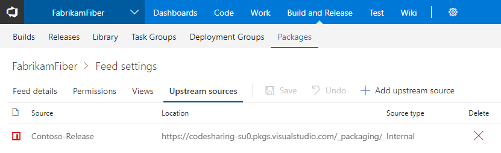

# Deployment Groups and Build completion trigger – VSTS Sprint 132 Update

The **Sprint 132 Update** of Visual Studio Team Services (VSTS) brings a few key features to help you scale your build and release pipeline. In **Build**, use the new [build completion trigger to chain together related builds](#chain-related-builds-together-using-build-completion-triggers) that may be owned by different teams. Over in **Release**, we are announcing the general availability of [Deployment Groups](#scale-deployments-to-vms-using-deployment-groups), which you can use to scale deployments across multiple virtual machines with high availability, including production environments.

Other highlights include:

- [Integrate Power BI with VSTS Analytics using views](#integrate-power-bi-with-vsts-analytics-using-views)
- [Publish markdown files from a Git repository as a Wiki](#publish-markdown-files-from-a-git-repository-as-a-wiki)

## What’s new in VSTS

> [!VIDEO https://www.youtube.com/embed/0y7NO_5mEYM?rel=0]

## Features

### Code

- [Quickly describe pull requests using commit messages](#quickly-describe-pull-requests-using-commit-messages)
- [Perform TFVC commands right from Windows Explorer](#perform-tfvc-commands-right-from-windows-explorer)

### Build and Release

- [Chain related builds together using build completion triggers](#chain-related-builds-together-using-build-completion-triggers)
- [Scale deployments to VMs using Deployment Groups](#scale-deployments-to-vms-using-deployment-groups)
- [Build applications written in Go](#build-applications-written-in-go)
- [Extend release gates with task extensions](#extend-release-gates-with-task-extensions)

### Package

- [Use upstream npm packages from elsewhere in VSTS](#use-upstream-npm-packages-from-elsewhere-in-vsts)
- [Maintain feed query speed with retention policies](#maintain-feed-query-speed-with-retention-policies)

### Wiki

- [Publish markdown files from a Git repository as a Wiki](#publish-markdown-files-from-a-git-repository-as-a-wiki)
- [Retain special characters in Wiki page titles](#retain-special-characters-in-wiki-page-titles)
- [Extend Wiki using REST APIs](#extend-wiki-using-rest-apis)

### Reporting

- [Integrate Power BI with VSTS Analytics using views](#integrate-power-bi-with-vsts-analytics-using-views)

## Code

### Quickly describe pull requests using commit messages

Writing descriptive commit messages adds value to the history of any Git repository. To encourage quality commit messages, new pull requests (PR) that have multiple commits will require contributors to enter a title manually.

Pull request descriptions will continue to be empty by default, but a new feature will make it easier to incorporate the commit messages from the PR commits into the PR description. To add the commit messages, simply click **Add commit messages** to append the commit messages to the end of the PR description text.

> [!div class="mx-imgBorder"]
> 

### Perform TFVC commands right from Windows Explorer

The TFVC Windows Shell Extension, which gives a lightweight version control experience integrated into Windows File Explorer, now supports VSTS and TFS 2018. This tool gives convenient access to many TFVC commands right in the Windows Explorer context menu.

Formerly part of the TFS Power tools, the tool has been released as a [standalone tool on the Visual Studio Marketplace](https://marketplace.visualstudio.com/items?itemName=ms-vscs-vcw.TfsShellExtention).

> [!div class="mx-imgBorder"]
> 

## Build and Release

### Chain related builds together using build completion triggers

Large products have several components that are dependent on each other. These components are often independently built. When an upstream component (a library, for example) changes, the downstream dependencies have to be rebuilt and revalidated. Teams typically manage these dependencies manually.

Now you can trigger a build upon the successful completion of another build. Artifacts produced by an upstream build can be downloaded and used in the later build, and you can also get data from these variables: Build.TriggeredBy.BuildId, Build.TriggeredBy.DefinitionId, Build.TriggeredBy.BuildDefinitionName. See the [build triggers](/azure/devops/pipelines/build/triggers#BuildCompletion) documentation for more information.

This feature was prioritized based on what is currently the #2 highest voted [suggestion](https://visualstudio.uservoice.com/forums/330519-visual-studio-team-services/suggestions/2165043-provide-build-configuration-dependencies-in-tfs-bu) with 1,129 votes.

> [!div class="mx-imgBorder"]
> 

Keep in mind that in some cases, a single [multi-phase build](/azure/devops/pipelines/process/phases) could meet your needs. However, a build completion trigger is useful if your requirements include different configuration settings, options, or a different team to own the dependent process.

### Scale deployments to VMs using Deployment Groups

Deployment Groups, which gives robust, out-of-the-box multi-machine deployment, is now generally available. With Deployment Groups, you can orchestrate deployments across multiple servers and perform rolling updates, while ensuring high availability of your application throughout. You can also deploy to servers on-premises or virtual machines on Azure or any cloud, plus have end-to-end traceability of deployed artifact versions down to the server level.

The agent-based deployment capability relies on the same build and deployment agents that are already available. You can use the full task catalog on your target machines in the Deployment Group phase. From an extensibility perspective, you can also use the REST APIs for [deployment groups](/rest/api/vsts/distributedtask/deploymentgroups) and [targets](/rest/api/vsts/distributedtask/targets) for programmatic access.

#### Shared deployment targets

If you are using the same server to host multiple applications, you can share the server (also known as the deployment target) across team projects using deployment pools.

> [!div class="mx-imgBorder"]
> 

#### New templates

Deploying to multiple targets is now a breeze with the new release definition templates. Multiple templates for IIS web site, IIS web site with database, and multiple deployment templates for SQL DB are available out of the box.

> [!div class="mx-imgBorder"]
> 

#### Provisioning VMs

Use the enhanced **Azure Resource Group** task to dynamically bootstrap agents on the newly provisioned or pre-existing Virtual Machines on Azure.

> [!div class="mx-imgBorder"]
> 

When we launched deployment groups in last May, we shipped a simple user interface targeted at a few key scenarios. You’ll now find a more consistent interface that feels like the rest of the product.

See the [Deployment Groups](/azure/devops/pipelines/release/deployment-groups/) documentation for more information about getting started.

### Build applications written in Go

Now you can build your Go applications in VSTS!

Use the **Go Tool Installer** task to install one or more versions of Go Tool on the fly. This task acquires a specific version of Go Tool needed by your project and adds it to the PATH of the build agent. If the targeted Go Tool version is already installed on the agent, this task will skip the process of downloading and installing it again.

The **Go** task helps you download dependencies, build, or test your application. You can also use this task to run a custom Go command of your choice.

### Extend release gates with task extensions

[Release gates](/azure/devops/pipelines/release/approvals/gates) bring health signals information right into your release pipeline. A gate collects a set of health signals repeatedly, prior to or after a deployment, to determine whether the release should proceed to the next stage or not. A set of built-in gates are provided, and the **Invoke Azure Function** option has been the recommended one for integrating other services thus far.

Now, gates can come in the form of an extension, which makes it easier for you&#8212;or extension authors&#8212;to integrate new or custom services and configure the gate.

See the [authoring gate tasks](https://github.com/Microsoft/vsts-tasks/blob/master/docs/authoring/gates.md) documentation for more information.

## Package

### Use upstream npm packages from elsewhere in VSTS

We continue to invest in upstream sources, which enable you to centralize all your package dependencies in a single feed and keep saved copies of all the packages you use. If you have multiple VSTS feeds with npm packages, now you can add one as an upstream source of the other within the same VSTS account. Because npm mostly limits you to a single feed/registry in your project’s configuration, upstream sources give you the flexibility you need to use multiple npm feeds, such as one for each team or product.

We’re also working to enable upstream sources for VSTS NuGet feeds soon. See the [upstream sources](/azure/devops/artifacts/concepts/upstream-sources) documentation for more information.

> [!div class="mx-imgBorder"]
> 

### Maintain feed query speed with retention policies

Over time the number of package versions can get extensive, with older versions going unused. For frequent package publishers, this could result in slower feed queries in the NuGet Package Manager and other clients until some versions were manually deleted.

Now you can enable retention policies on feeds. Retention policies will automatically delete the oldest version of a package once the retention threshold is met. Packages promoted to views are retained indefinitely, giving you the ability to protect versions that are used in production or used widely across your organization.

To enable retention policies, edit your feed and enter a value in the **Maximum number of versions per package** in the **Retention policies** section.

> [!div class="mx-imgBorder"]
> 

## Wiki

### Publish markdown files from a Git repository as a Wiki

Developers create documentation for “APIs”, “SDKs”, and “help docs explaining code” in code repositories. Readers then need to sift through code to find the right documentation. Now you can simply publish markdown files from code repositories and host them in Wiki.

> [!div class="mx-imgBorder"]
> 

From within Wiki, start by clicking **Publish code as wiki**. Next, you can specify a folder in a Git repository that should be promoted.

> [!div class="mx-imgBorder"]
> 

Once you click on **Publish**, all the markdown files under the selected folder will be published as a wiki. This will also map the head of the branch to the wiki so that any changes you make to the Git repo will be reflected immediately.

In case you have multiple versions of your product and you want to easily skim through the documentation of these versions, you can also publish new version of the documentation to the wiki using different branches.

> [!div class="mx-imgBorder"]
> 

Once the markdown files are published, the pages will also be searchable in the Wiki search hub.

> [!div class="mx-imgBorder"]
> 

If you published the wrong repository, simply unpublish the wiki, which leaves the underlying repository unchanged.

You can also change the ordering of the pages from the repository or even transform a folder to look like a wiki page.

See the [product documentation blog post](https://go.microsoft.com/fwlink/?linkid=866310) for more information. This feature was prioritized based on a [suggestion](https://visualstudio.uservoice.com/forums/330519-visual-studio-team-services/suggestions/20483269-wiki-viewing-and-editing-for-code-documentation-m).

### Retain special characters in Wiki page titles

You can now create wiki pages with special characters such as `: < > * ? | -`. Now pages with titles like “FAQ?” or “Set-up guide” can be created in Wiki. The following characters are translated to their UTF-8 encoded strings:

|Character|Encoded String|
|-------------|--------------------|
|         :        |      %3A            |
|         <       |       %3C           |
|         >       |         %3E          |
|        *        |          %2A         |
|        ?         |          %3F        |
|        \|         |        %7C          |
|        -           |        %2D        |

This feature was prioritized based on a [suggestion](https://visualstudio.uservoice.com/forums/330519-visual-studio-team-services/suggestions/31745275-allow-all-characters-in-wiki-page-title).

### Extend Wiki using REST APIs

Wiki REST APIs are now public. See the [Wiki functions](/rest/api/vsts/wiki/wikis/create) and [Wiki search](/rest/api/vsts/search/wiki%20search%20results/fetch%20wiki%20search%20results) documentation for more information.

## Reporting

### Integrate Power BI with VSTS Analytics using views

Analytics Views work with our VSTS Power BI Data Connector. Together they give an easy way to get your VSTS data into Power BI so you can start creating custom reports.

When you install the [VSTS Analytics](https://marketplace.visualstudio.com/items?itemName=ms.vss-analytics) extension we create a set of [default Analytics Views](https://go.microsoft.com/fwlink/?linkid=870159) that you can start using in Power BI. Now you can edit your default views and [create new views](https://go.microsoft.com/fwlink/?linkid=870160) to fine-tune the records, fields, and history returned to Power BI.

## Next steps and Feedback

> [!div class="nextstepaction"]
> [Go to VSTS](http://go.microsoft.com/fwlink/?LinkId=307137&campaign=o~msft~docs~product-vsts~release-notes)

> [!div class="nextstepaction"]
> [Subscribe to Updates](https://visualstudio.microsoft.com/team-services/release-notes-feed/?feed=release-notes-feed)

We would love to hear what you think about these features. Report a problem or provide a suggestion if you have ideas on things you’d like to see us prioritize, through the feedback menu.

> [!div class="mx-imgBorder"]
> 

You can also get advice and your questions answered by the community on [Stack Overflow](https://stackoverflow.com/questions/tagged/vsts).

Thanks,

Gopinath Chigakkagari
