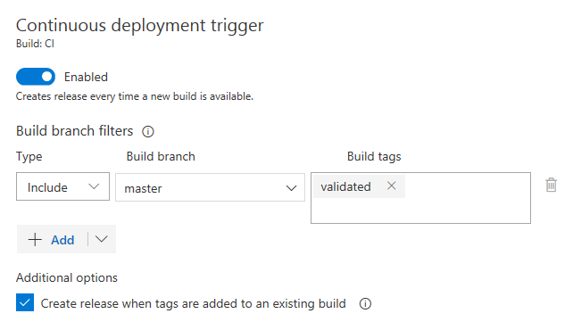
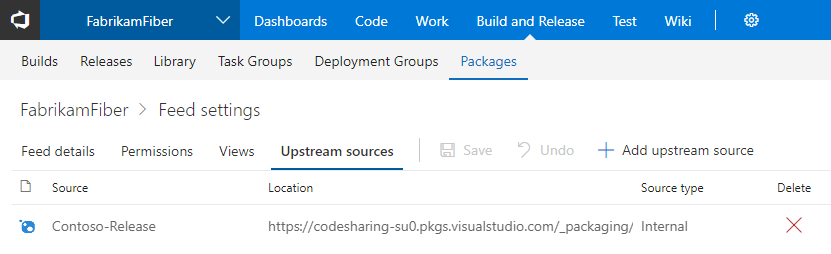

# Deployment for Azure Database for MySQL, Kubernetes with Helm, and Ruby on Rails – VSTS Sprint 133 Update

In the **Sprint 133 Update** of Visual Studio Team Services (VSTS), we continue to expand on the languages and platforms we support for build and release. Whether your application uses [Azure Database for MySQL](#continuously-deploy-to-azure-database-for-mysql), [Kubernetes](#streamline-deployment-to-kubernetes-using-helm), or [Ruby on Rails](#deploy-ruby-on-rails-applications), we’ve got you covered. The list keeps growing in Azure DevOps Projects as well. Now it’s never been easier to get started on a [Go or Ruby application](#configure-go-and-ruby-applications-using-azure-devops-projects) in Azure.

A new [notification type](#subscribe-to-package-update-notifications) and better support for [NuGet upstream sources](#use-upstream-nuget-packages-from-elsewhere-in-vsts) is also available now in [Package Management](https://marketplace.visualstudio.com/items?itemName=ms.feed).

## What’s new in VSTS

> [!VIDEO https://www.youtube.com/embed/8OknoSF9w5A?rel=0]

## Features

### Code

- [Find phrases and code with special characters faster](#find-phrases-and-code-with-special-characters-faster)

### Work

- [Query work in the Area Paths of a Team with the new @TeamAreas macro](#query-work-in-the-area-paths-of-a-team-with-the-new-teamareas-macro)

### Build and Release

- [Trigger CI builds from YAML](#trigger-ci-builds-from-yaml)
- [Continuously deploy to Azure Database for MySQL](#continuously-deploy-to-azure-database-for-mysql)
- [Streamline deployment to Kubernetes using Helm](#streamline-deployment-to-kubernetes-using-helm)
- [Deploy Ruby on Rails applications](#deploy-ruby-on-rails-applications)
- [Configure Go and Ruby applications using Azure DevOps Projects](#configure-go-and-ruby-applications-using-azure-devops-projects)
- [Continuously deploy builds tagged by post-build processing](#continuously-deploy-builds-tagged-by-post-build-processing)
- [Filter branches for GitHub Enterprise or external Git artifacts](#filter-branches-for-github-enterprise-or-external-git-artifacts)

### Package

- [Subscribe to package update notifications](#subscribe-to-package-update-notifications)
- [Use upstream NuGet packages from elsewhere in VSTS](#use-upstream-nuget-packages-from-elsewhere-in-vsts)
- [Enable nuget.org upstream sources in more feeds](#enable-nugetorg-upstream-sources-in-more-feeds)

### Wiki

- [Quickly link to other wiki pages using suggestions](#quickly-link-to-other-wiki-pages-using-suggestions)
- [Filter search results by Wiki name](#filter-search-results-by-wiki-name)

### Administration

- [Move a VSTS account between Azure subscription or resource group](#move-a-vsts-account-between-azure-subscription-or-resource-group)

## Code

### Find phrases and code with special characters faster

We have recently been looking at ways to make search results more accurate, especially when a search includes special characters.

In this Update, your searches that include special (non-alphanumeric) characters are more likely to help you find what you’re looking for. For example, previously if you searched for `A+B`, your results could contain `A+B`, `A-B`, `A*B`, `A$B`, `A/B`, etc. Now you will only see `A+B` in the results, without the false positives.

Phrases are also recognized better. For example, previously a search for `new List<string>()` would have returned this partial match, without the `>()` ending.

> [!div class="mx-imgBorder"]


However, with this Update, the full phrase is returned and highlighted.

> [!div class="mx-imgBorder"]


## Work

### Query work in the Area Paths of a Team with the new @TeamAreas macro

In the settings for a Team, you can associate one or more Area Paths, which helps you focus **Backlogs**, **Boards**, **Plans**, even **Dashboards** to just the work for that Team. If you wanted to write a query for a Team though, you had to list out the specific Area Paths for that team in the query clauses. Now, a new **@TeamAreas** macro is available for you to easily reference the Area Paths owned for the specified Team. This feature was prioritized based on a [suggestion](https://visualstudio.uservoice.com/forums/330519-visual-studio-team-services/suggestions/10189299-add-a-defaultteamarea-and-or-teamareas-token-var).

> [!div class="mx-imgBorder"]


## Build and Release

### Trigger CI builds from YAML

You can now define your continuous integration (CI) trigger settings as part of your YAML build definition file. By default, when you push a new `.vsts-ci.yml` file to your Git repository, CI will be configured automatically for all branches.

To limit the branches that you want triggered, simply add the following to your file to trigger builds on pushes to master or any branch matching the releases/* pattern.

```YAML
trigger:
- master
- releases/*
```

If you want to disable the trigger or override the trigger settings in the YAML files you can do so on the definition.

See the [YAML build triggers](https://github.com/Microsoft/vsts-agent/blob/master/docs/preview/yamlgettingstarted-triggers.md) documentation for more information.

> [!div class="mx-imgBorder"]


### Continuously deploy to Azure Database for MySQL

You can now continuously deploy to [Azure Database for MySQL](https://azure.microsoft.com/services/mysql/) - Azure’s MySQL database as a service. Manage your MySQL script files in version control and continuously deploy as part of a release pipeline using a native task rather than PowerShell scripts.

### Streamline deployment to Kubernetes using Helm

[Helm](https://github.com/kubernetes/helm/) is a tool that streamlines installing and managing Kubernetes applications. It has also gained a lot of popularity and community support in the last year. A Helm task in **Release** is now available for packaging and deploying Helm charts to [Azure Container Service (AKS)](https://azure.microsoft.com/services/container-service/) or any other Kubernetes cluster.

VSTS already has support for Kubernetes and Docker containers. With the addition of this Helm task, now you can set up a Helm based CI/CD pipeline for delivering containers into a Kubernetes cluster. See the [Deploy using Kubernetes to Azure Container Service](/azure/devops/pipelines/apps/cd/azure/deploy-container-kubernetes?view=azure-devops) documentation for more information.

> [!div class="mx-imgBorder"]


### Deploy Ruby on Rails applications

A new **Azure App Service** release definition template now includes the tasks needed for deploying Ruby on Rails applications to **Azure WebApp on Linux**. When this release definition template is used, the **App Service Deploy** task gets pre-populated with an inline deployment script that makes bundler (dependency manager) install the applications dependencies.

### Configure Go and Ruby applications using Azure DevOps Projects

Azure DevOps Projects makes it easy to get started on Azure. It helps you launch an application on the Azure service of your choice in just a few steps. DevOps Projects sets up everything you need for developing, deploying, and monitoring your app. Now you can setup an entire DevOps pipeline for Go and Ruby applications too. See the [Deploy to Azure](/azure/devops/deploy-azure) documentation for more information.

### Continuously deploy builds tagged by post-build processing

Continuous deployment triggers create a release on build completion. However, sometimes builds are post-processed and the build should only be released after that processing completes. Now you can leverage build tags, which would be assigned during post-processing, in the trigger filters of the release.

> [!div class="mx-imgBorder"]


### Filter branches for GitHub Enterprise or external Git artifacts

When releasing from GitHub Enterprise or external Git repos, now you can configure the specific branches that will be released. For example, you may want to deploy only builds coming from a specific branch to production.

> [!div class="mx-imgBorder"]


## Package

### Subscribe to package update notifications

Previously, the only way to know about new versions of packages you use was through your package client (such as Visual Studio, NuGet, or npm). Now, you can now configure email notifications about the packages you care about. You can get notifications about new versions of a specific package or of all packages in a feed. You can also be notified when packages are promoted or deleted.

To set this up, hover on your profile picture in the upper right corner, choose **Notification settings**, and then click New subscription. In the dialog that appears, select the **Package** category.

This feature was prioritized based on a [suggestion](https://visualstudio.uservoice.com/forums/330519-visual-studio-team-services/suggestions/11447610-allow-me-to-contact-the-consumers-of-my-package-fe).

### Use upstream NuGet packages from elsewhere in VSTS

We continue to invest in upstream sources, which enable you to centralize all your package dependencies in a single feed and keep saved copies of all the packages you use. If you have multiple feeds with NuGet packages, now you can add one as an upstream source of the other within the same account. This allows you to only have a single feed in your [nuget.config file](/nuget/consume-packages/configuring-nuget-behavior), which gives you benefits like deterministic restore. See the [upstream sources](/azure/devops/artifacts/concepts/upstream-sources?view=azure-devops#benefits-of-upstream-sources) documentation for more information.

> [!div class="mx-imgBorder"]


### Enable nuget.org upstream sources in more feeds

Previously, only feeds created after the [Sprint 130 Update](/azure/devops/release-notes/2018/feb-14-vsts#package) could use the nuget.org upstream source. Now, most Package Management feeds created before that Update can use it too. If your feed is ready, you’ll see a banner above your packages letting you know that you can enable the nuget.org upstream source.

Upstream sources to public package feeds like nuget.org and npmjs.com keep a saved copy of every package you use, so you’re protected against outages. See the [upstream sources](/azure/devops/artifacts/concepts/upstream-sources?view=azure-devops#saving-packages-from-upstream-sources-continuity) documentation for more information.

## Wiki

### Quickly link to other wiki pages using suggestions

When you want to create a link to another wiki page, you can just type the standard markdown syntax for adding links `[link name](/` and you will get an enlistment of all pages in the current wiki. Earlier you were able to click and drag a wiki page to the markdown editor to create links, but this makes creating links in pages even simpler.

> [!div class="mx-imgBorder"]


This feature was prioritized based on a [suggestion](http://visualstudio.uservoice.com/forums/330519-visual-studio-team-services/suggestions/19042909-enable-free-linking-in-the-wiki).

### Filter search results by Wiki name

Publishing markdown files from a Git repository as a Wiki, which we [released last Update](/azure/devops/release-notes/2018/apr-03-vsts#publish-markdown-files-from-a-git-repository-as-a-wiki), will mean you’ll start seeing multiple wikis in the same project. When searching, it may be difficult to wade through similar documents and find what you’re looking for. Now, when you search for your wiki page you will be able to scope down your results by applying the **Wiki** name filter on the search results pages to help you find your content faster.

> [!div class="mx-imgBorder"]


## Administration

### Move a VSTS account between Azure subscription or resource group

Now you’ll be able to move your VSTS account between Azure subscriptions or resources groups in the Azure portal, just as you can with most other Azure resources. See the [move resources](/azure/azure-resource-manager/resource-group-move-resources) documentation for more information.

## Next steps and Feedback

> [!div class="nextstepaction"]
> [Go to VSTS](http://go.microsoft.com/fwlink/?LinkId=307137&campaign=o~msft~docs~product-vsts~release-notes)

> [!div class="nextstepaction"]
> [Subscribe to Updates](https://visualstudio.microsoft.com/team-services/release-notes-feed/?feed=release-notes-feed)

We would love to hear what you think about these features. Report a problem or provide a suggestion if you have ideas on things you’d like to see us prioritize, through the feedback menu.

> [!div class="mx-imgBorder"]


You can also get advice and your questions answered by the community on [Stack Overflow](https://stackoverflow.com/questions/tagged/vsts).

Thanks,

Henry Dixon