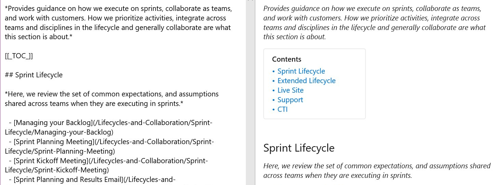
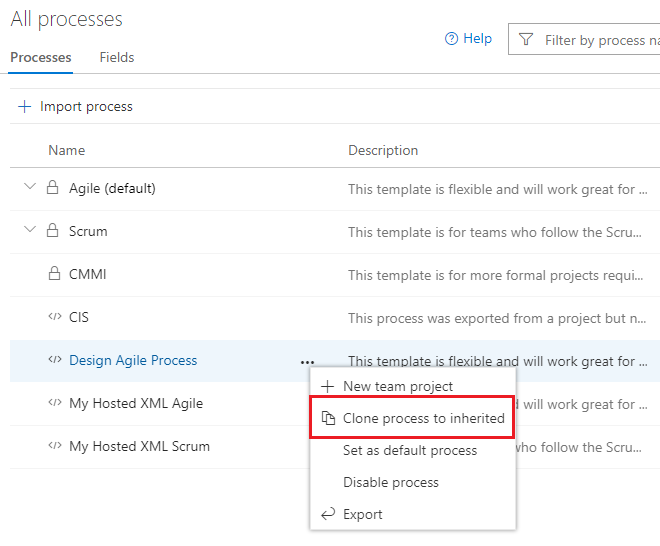
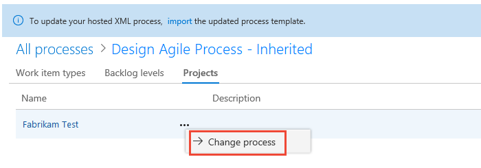
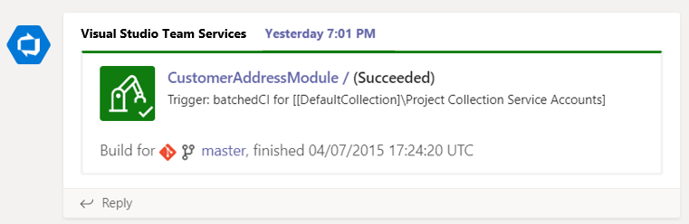
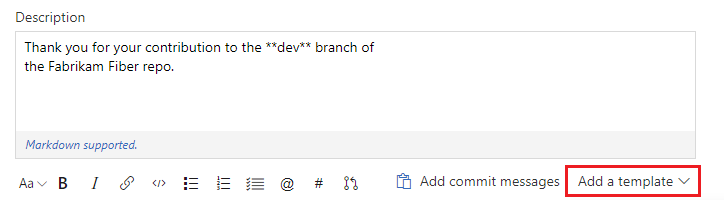
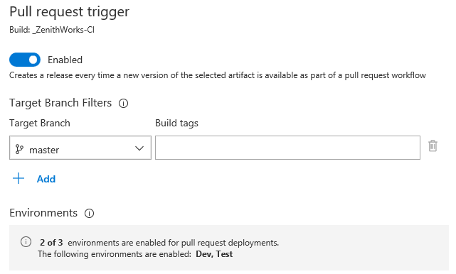

# Ease customization by migrating projects to the Inheritance process model – VSTS Sprint 139 Update

In the **Sprint 139 Update** of Visual Studio Team Services (VSTS), you can now [migrate Hosted XML projects to the Inheritance process model](#ease-customization-by-migrating-projects-to-the-inheritance-process-model) to ease customization. Plus, your [releases can now be triggered by a PR](#perform-additional-testing-using-a-pull-request-release-trigger) to help you execute additional testing before a merge.

Check out the [Features](#features) list below for more.

## Next steps

Read about the new features below and head over to VSTS to try them for yourself.

> [!div class="nextstepaction"]
> [Go to VSTS](http://go.microsoft.com/fwlink/?LinkId=307137&campaign=o~msft~docs~product-vsts~release-notes)

## Features

Wiki:

- [Create table of contents for wiki pages](#create-table-of-contents-for-wiki-pages)

Work:

- [Ease customization by migrating projects to the Inheritance process model](#ease-customization-by-migrating-projects-to-the-inheritance-process-model)
- [Chat about the latest status using the improved Microsoft Teams integration](#chat-about-the-latest-status-using-the-improved-microsoft-teams-integration)

Code:

- [Standardize pull request descriptions using templates](#standardize-pull-request-descriptions-using-templates)

Build and release:

- [Perform additional testing using a pull request release trigger](#perform-additional-testing-using-a-pull-request-release-trigger)
- [Deploy Go apps to Azure Kubernetes Service (AKS) using Azure DevOps Projects](#deploy-go-apps-to-azure-kubernetes-service-aks-using-azure-devops-projects)

## Wiki

### Create table of contents for wiki pages

Sometimes wiki pages can get long, with content organized into several headings. Now you can add a table of contents to any page that has at least one heading using the `[[_TOC_]]` syntax. See the [markdown guidance](/azure/devops/project/wiki/markdown-guidance) documentation for more information about using markdown in VSTS. This feature was prioritized based on a [suggestion from UserVoice](https://visualstudio.uservoice.com/forums/330519-visual-studio-team-services/suggestions/32366560-wiki-table-contents).

> [!div class="mx-imgBorder"]

## Work

### Ease customization by migrating projects to the Inheritance process model

Migrating a Hosted XML process model to an Inherited process provides the convenience of customizing your work tracking system through the user interface. If you are using the Hosted XML process model in any of your projects you can now migrate them. Changing the process model for a project can be done in two steps. First, clone the Hosted XML process into the Inheritance model. This adds your customizations, such as work item types, fields, and states, into a newly created Inherited process.

> [!div class="mx-imgBorder"]

After you validate the process, you can then change projects to use the newly created process.

> [!div class="mx-imgBorder"]

See the [Clone a Hosted XML process to Inheritance](/azure/devops/organizations/settings/work/upgrade-hosted-to-inherited?view=azure-devops&tabs=new-nav) documentation for more information.

### Chat about the latest status using the improved Microsoft Teams integration

In the latest improvement to our [Microsoft Teams integration](https://marketplace.visualstudio.com/items?itemName=ms-vsts.vss-services-teams), you'll now quickly see the status of an activity with clear icons and colors and start chatting to keep things moving. If a pull request is waiting for author, it shows up in yellow and with a timer icon. If a build succeeded, it shows up in green and with a check-mark icon.

> [!div class="mx-imgBorder"]

## Code

### Standardize pull request descriptions using templates

Writing good pull request descriptions is a great way to help reviewers know what to expect when reviewing code. They're also a great way to help track things that should be done for every change, such as testing, adding unit tests, and updating documentation (no one ever forgets to update the docs). Many of you have been [requesting](https://visualstudio.uservoice.com/forums/330519-visual-studio-team-services/suggestions/18132127-support-pull-request-template-in-vs-online-for-pr) that we add pull request templates to make it easier for teams to write great descriptions, and we've now added that feature.

In addition to supporting a default PR description template, teams can add multiple templates, which are presented to you in a menu on the create PR page. Simply click the **Add a template** button to choose from any template in the repository to append it to the PR description.

> [!div class="mx-imgBorder"]

Branch-specific templates are also supported if you want to apply a different template for a PR into a specific branch, or branch folder. For example, if you want to have a template specific to all branches that begin with "hotfix/" you can add a template that will be used for all PRs into those branches.  

See the [pull request templates](/azure/devops/repos/git/pull-request-templates) documentation to learn more about how to create and use templates.

## Build and release

### Perform additional testing using a pull request release trigger

You've been able to trigger a build based on a pull request (PR) and get that quick feedback before a merge for a while. Now you can configure a PR trigger for a release as well. The status of the release will be posted back to the code repository and can be directly seen in the PR page. This is helpful if you want to perform additional functional or manual testing as part of your PR workflow.

> [!div class="mx-imgBorder"]

### Deploy Go apps to Azure Kubernetes Service (AKS) using Azure DevOps Projects

[DevOps Projects](https://azure.microsoft.com/features/devops-projects/) makes it easy to get started in Azure. It helps you launch an application, on the Azure service of your choice, in a few steps. DevOps Projects provides everything you need for developing, deploying, and monitoring your app.

We have now added support for Azure Kubernetes Service (AKS) targeting Go Language on DevOps Projects. See the tutorial documentation for [AKS](/azure/devops-project/azure-devops-project-aks) for more information.

### The build status reported to GitHub is more succinct

When VSTS posts the status of a build to GitHub, the status text appears on the associated commit, branch, and pull request check. Until now, each build pipeline's name in the text was prefaced with `VSTS:`. We removed this preface from the status text so that the name of the build pipeline would be easier to see with a glance and not cause confusion about `VSTS:` being in a build pipeline's official name. Unfortunately, this change affects GitHub branch protection rules where GitHub still expects pipeline names to begin with `VSTS:`. This may cause GitHub pull requests to be blocked until repository settings are updated. To resolve this, after running the build at least once, update your repository's branch protection rules under repository Settings > Branches > Branch protection rules.

## Feedback

We would love to hear what you think about these features. Use the feedback menu to report a problem or provide a suggestion.

> [!div class="mx-imgBorder"]

You can also get advice and your questions answered by the community on [Stack Overflow](https://stackoverflow.com/questions/tagged/vsts).

Thanks,

Gopinath Chigakkagari