# Package upstream sources and symbol server generally available – VSTS Sprint 130 Update

In the **Sprint 130 Update** of Visual Studio Team Services (VSTS), we continue to improve our integration with tools and services that help you establish a full DevOps pipeline. [Manage packages from upstream sources](#seamlessly-use-public-packages-using-upstream-sources) to take control of your dependencies and [use VSTS as a symbol server](#use-vsts-as-a-symbol-server) to simplify debugging. You can also bring work items into your team conversation with the [VSTS messaging extension for Microsoft Teams](#discuss-work-items-in-microsoft-teams-using-the-vsts-messaging-extension).

Other highlights include:

* [Mention a group in work item and pull request discussions](#mention-a-group-in-work-item-and-pull-request-discussions)
* [Release automatically from Azure Container Registry and Docker Hub](#release-automatically-from-azure-container-registry-and-docker-hub) and [only certain branches of builds from GitHub](#filter-branches-for-github-artifacts)
* Leverage what you may have in Jenkins with [finer control](#specify-a-default-version-for-jenkins-artifacts) and [efficiency using Azure Storage](#propagate-jenkins-artifacts-to-azure-storage)
* [Manage access and extensions for large numbers of users using groups](#manage-access-and-extensions-for-large-numbers-of-users-using-groups)

## What’s new in VSTS

> [!VIDEO https://www.youtube.com/embed/jttSjT460PI?rel=0]

## Code

### Recover a recently-deleted repository via API

Sometimes mistakes can be made when cleaning up old repositories in source control. If a Git repository has been deleted within the last 30 days, it can be recovered through the REST API. Soon we’ll also enable this option in the Web UI. See the documentation for the [list](/rest/api/vsts/git/repositories/get%20recycle%20bin%20repositories) and [recover](/rest/api/vsts/git/repositories/restore%20repository%20from%20recycle%20bin) operations for more information.

## Work

### Discuss work items in Microsoft Teams using the VSTS messaging extension

Microsoft Teams has become the hub for teamwork within many engineering teams. We have expanded our Microsoft Teams integration with the new VSTS messaging extension to enable you to find and discuss specific work items alongside your other content and tools. See the [Microsoft Teams Integration](https://marketplace.visualstudio.com/items?itemName=ms-vsts.vss-services-teams) extension in the Marketplace for more information.

> [!div class="mx-imgBorder"]
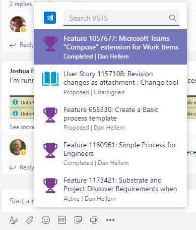

### Mention a group in work item and pull request discussions

When discussions about work items or pull requests include several people&#8212;or everyone on a particular team&#8212;it takes time to @mention everyone you want to notify. Now you can simply @mention a team or security group in discussions. If you are a member of a group that gets mentioned in either a work item or a pull request, you will get an email notification. If you are a member of a group that gets mentioned in a work item, that work item will be displayed in your **Mentioned** pivot in the **Work Items** hub too.

> [!div class="mx-imgBorder"]
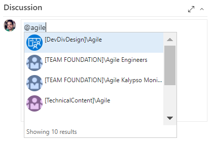

## Build and Release

### Use VSTS as a symbol server

VSTS Symbol Server, which enables you to host and share symbols with your organization, is now generally available. Symbols provide additional information that makes it easier to debug executables, especially those written in native languages like C and C++. See the [documentation for publishing symbols for debugging](/azure/devops/pipelines/symbols/) for more information.

This feature was prioritized based on a top [suggestion](http://visualstudio.uservoice.com/forums/330519-visual-studio-team-services/suggestions/2564053-treat-tfs-as-an-enterprise-symbol-server).

### Filter branches for GitHub artifacts

Now you can configure branch filters for GitHub repositories as well. For example, you may want to deploy only builds coming from the master/* branch.

> [!div class="mx-imgBorder"]
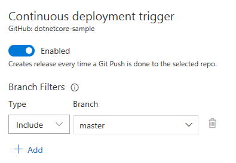

### Filter branches using include and exclude

So far you have been able to specify branches and tags that should trigger a release. We received clear feedback that this was limited and required frequent updates to release definitions. As in **Build**, you can now specify branches that should not trigger a release. For example, you may want to trigger a release for all the **dev/*** branches but not for the **dev/featureX** branch.

> [!div class="mx-imgBorder"]
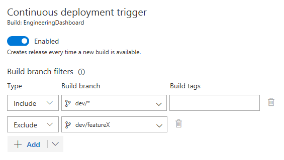

### Release automatically from Azure Container Registry and Docker Hub

When deploying containerized apps, the container image is first pushed to a container registry. After the push is complete, the container image can be deployed to a Web App for Containers or a Kubernetes cluster. You can now enable automatic creation of releases on updates to the images stored in **Docker Hub** or **Azure Container Registry** by adding them as an artifact source.

> [!div class="mx-imgBorder"]
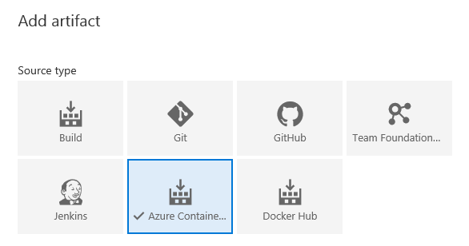

### Propagate Jenkins artifacts to Azure Storage

Artifacts generated by Jenkins builds are commonly propagated to storage repositories for archiving and sharing. [Azure blob storage](/azure/storage/common/storage-java-jenkins-continuous-integration-solution#overview) is one of the supported repositories for artifacts created by a Jenkins build. Now, you can consume Jenkins projects that publish to Azure storage as artifact sources in a release definition.

Details of the Azure blob storage where artifacts are published are required when adding the artifacts to a definition. Deployments then download the artifacts automatically from Azure to the agents. With this configuration, the agent can be disconnected from the Jenkins server. Hosted agents can be used without exposing the server to internet.

> [!div class="mx-imgBorder"]
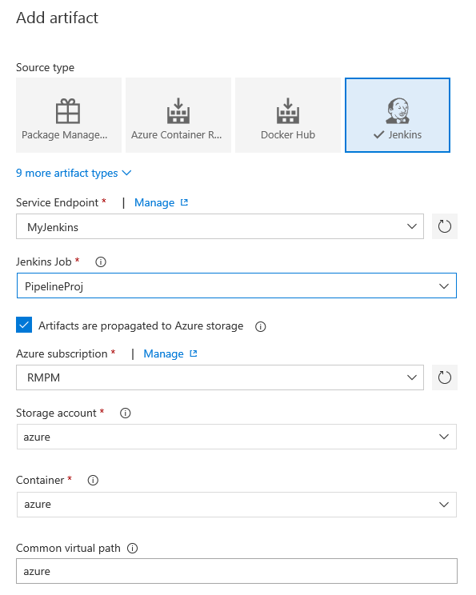

### Specify a default version for Jenkins artifacts

When a release with multiple artifacts is auto-triggered, default versions saved in the release definition are picked up for all artifacts. Previously, Jenkins artifacts did not have a default version setting, and so you couldn’t set a continuous deployment trigger on a release using Jenkins as the secondary artifact.

Now, you can specify a default version for Jenkins artifacts, with the options you’re familiar with:

- Latest
- Specify at the time of release creation
- Specific version

> [!div class="mx-imgBorder"]
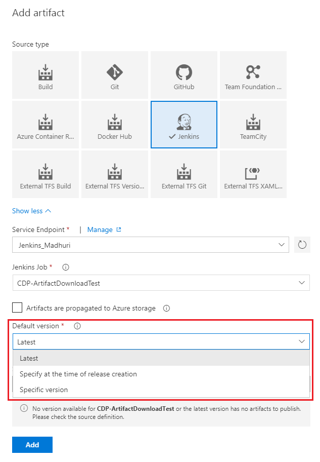

### Scope a variable group to specific environments

Previously, when a variable group was added to a release definition, the variables it contained were available to all the environments in the release. Now, you have the flexibility to scope the variable groups to specific environment(s) instead, which makes them available to one environment but not other environments of the same release. This is great when you have an external service, such as an SMTP email service, which is different between environments.

> [!div class="mx-imgBorder"]
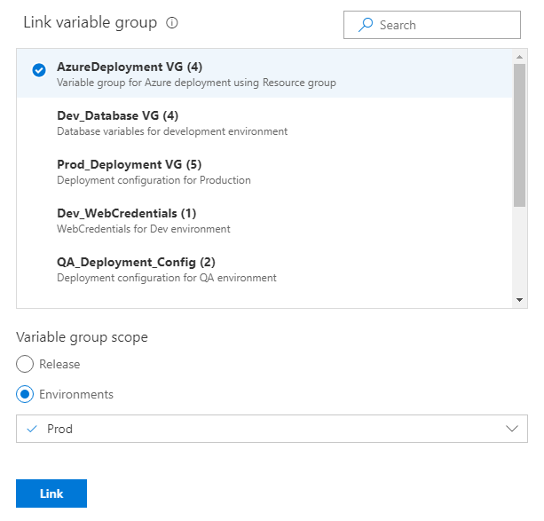

### Install tasks from the Marketplace directly from the build or release definition

Searching for a task in the build or release definition editor now lists relevant task extensions from the **[Marketplace](https://marketplace.visualstudio.com)** in addition to those already installed or built-in. You can acquire the extension by clicking **Get it free** and completing the workflow in **Marketplace**. After you have the new task, simply refresh the task list on the definition editor to see the newly installed tasks, ready to add to your definition.

> [!div class="mx-imgBorder"]
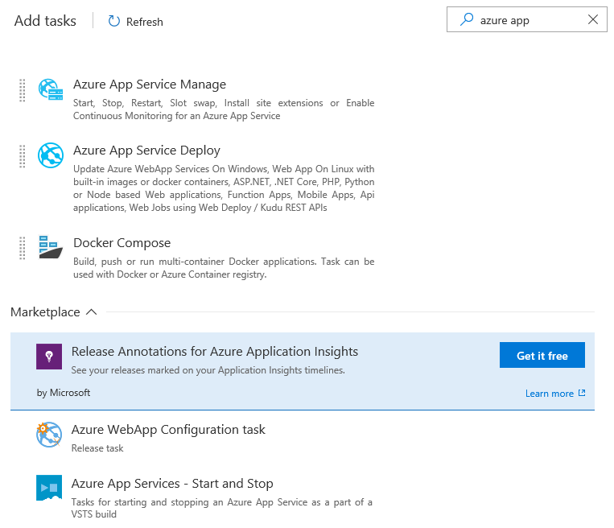

## Package

### Seamlessly use public packages using upstream sources

Upstream sources for [nuget.org](http://nuget.org) and [npmjs.com](https://npmjs.com) are now generally available. Benefits include the ability to manage (unlist, deprecate, unpublish, delete, etc.) packages saved from upstream sources as well as guaranteed saving of every upstream package you use.

For now, these benefits apply only to feeds created after this announcement, unless you previously enabled the upstream sources preview toggle in your **Preview features** panel. If you enabled the preview toggle, any feed created after you enabled the toggle can use these benefits. In a later Update, you’ll be able to upgrade older feeds to take advantage of these improvements.

> [!div class="mx-imgBorder"]
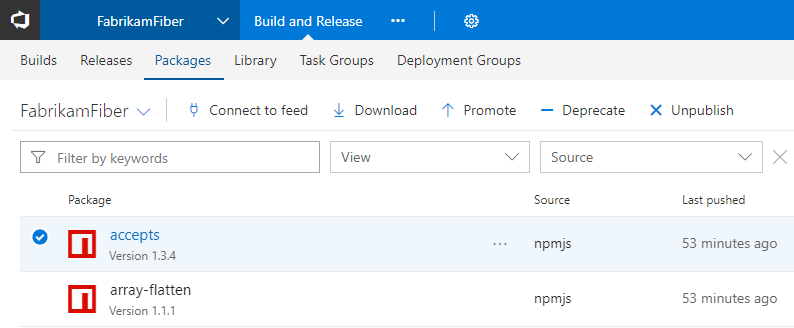

### View quality of a package version in the package list

On the package list, you can now see the view(s) of each package version to quickly determine their quality. See the [release views](/azure/devops/artifacts/concepts/views) documentation for more information.

> [!div class="mx-imgBorder"]
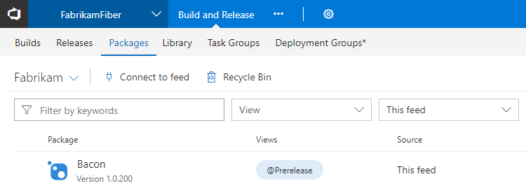

### Link to packages from anywhere

Although you could share the URL to a package found in the **Packages** hub in the past, it was often difficult to use because you needed to include a project in the URL, which may or may not apply to those using the link. With this Update, you can now share packages using an account-level URL that will automatically select a project the recipient has access to. The URL format is: `https://<account>.visualstudio.com/_packaging?feed=<feed>&package=<package>&version=<version>&protocolType=<NuGet|Npm|Maven>&_a=package` All parameters except `<account>` are optional, but if you provide a package, you must provide the protocol type.

### Share your packages using a badge

In the open source community, it’s common to use a badge that links to the latest version of your package in your repository’s README. With this Update, you can now create badges for packages in your VSTS feeds. Just check the **Enable package badges** option in feed settings, select a package, then click **Create badge**. You can copy the badge URL directly or copy pre-generated Markdown that links the badge back to your package’s details page.

> [!div class="mx-imgBorder"]
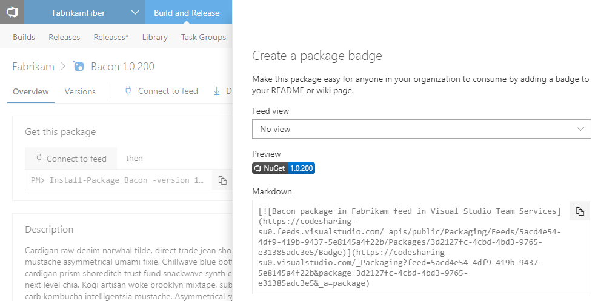

### Recycle and restore packages

Deleting unused packages can help keep the package list clean but sometimes it can be done by mistake. Now you can restore deleted packages from the **Recycle Bin**. Deleted packages are retained in the Recycle Bin for 30 days, giving you ample time to restore if you need to.

> [!div class="mx-imgBorder"]
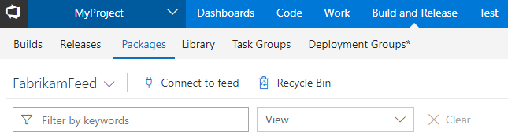

## Administration

### Manage access and extensions for large numbers of users using groups

We’ve made it easy for administrators to manage large groups of users by enabling you to assign access levels and extensions to AAD or VSTS groups. After setting up the appropriate rules, adding someone to the group will automatically grant them the correct access levels and extensions when they access the VSTS account. As a result, access levels and extensions will no longer have to be managed on an individual basis.

> [!div class="mx-imgBorder"]
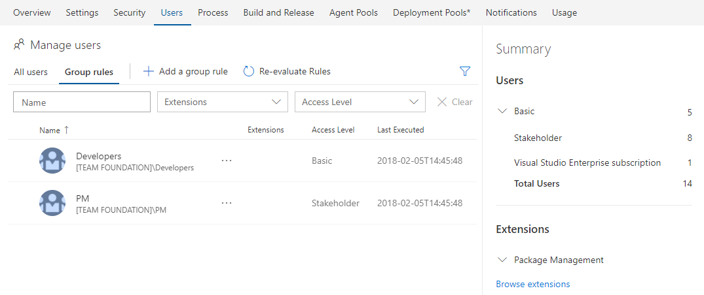

See the [large account user management roadmap post](https://blogs.msdn.microsoft.com/devops/2017/04/04/team-services-large-account-user-management-roadmap-april-2017/) on the Microsoft DevOps Blog from last year and the [Assign access levels and extensions to users by group membership](/azure/devops/accounts/assign-access-levels-and-extensions-by-group-membership) documentation for more information.

### Reduced latency for AAD group membership changes

If you are managing permissions through Azure Active Directory (Azure AD) group memberships, any membership changes in AAD in the past may have taken 24 to 48 hours to be recognized by VSTS. This latency is now down to 1 hour, enabling you to get new team members up and running quicker.

### Manage users with Graph REST APIs Public Preview

The Graph REST API resources allow developers to write applications that manage users, groups, and group memberships. The set of APIs cover key user management scenarios including adding a Microsoft Account (MSA) or Azure Active Directory (Azure AD) user to VSTS, creating a VSTS group, and adding/removing members from a VSTS group. See the Graph REST API [documentation](https://visualstudio.microsoft.com/docs/integrate/api/graph/overview) and [samples](https://github.com/Microsoft/vsts-dotnet-samples) for more information.

### Leave account

In the past, only account owners or administrators could remove users from an account. Now you can leave an account that you are no longer involved in on your own. To leave an account, navigate to your profile page and locate the account you wish to leave within your account list. Underneath the account actions section, there is now an option to leave the account. This feature was prioritized based on a [suggestion](http://visualstudio.uservoice.com/forums/330519-visual-studio-team-services/suggestions/9581676-allow-a-user-to-remove-them-self-from-a-visual-stu).

> [!div class="mx-imgBorder"]
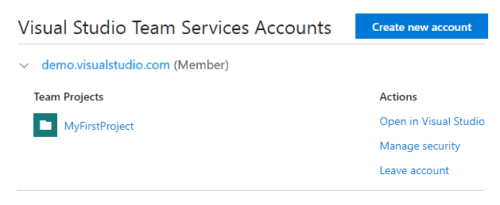

## Next steps and Feedback

> [!div class="nextstepaction"]
> [Go to VSTS](http://go.microsoft.com/fwlink/?LinkId=307137&campaign=o~msft~docs~product-vsts~release-notes)

> [!div class="nextstepaction"]
> [Subscribe to Updates](https://visualstudio.microsoft.com/team-services/release-notes-feed/?feed=release-notes-feed)

We would love to hear what you think about these features. Report a problem or provide a suggestion if you have ideas on things you’d like to see us prioritize, through the feedback menu.

> [!div class="mx-imgBorder"]

You can also get advice and your questions answered by the community on [Stack Overflow](https://stackoverflow.com/questions/tagged/vsts).

Thanks,

Henry Dixon and Aaron Bjork