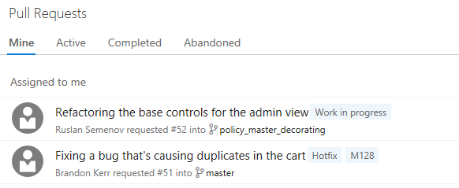
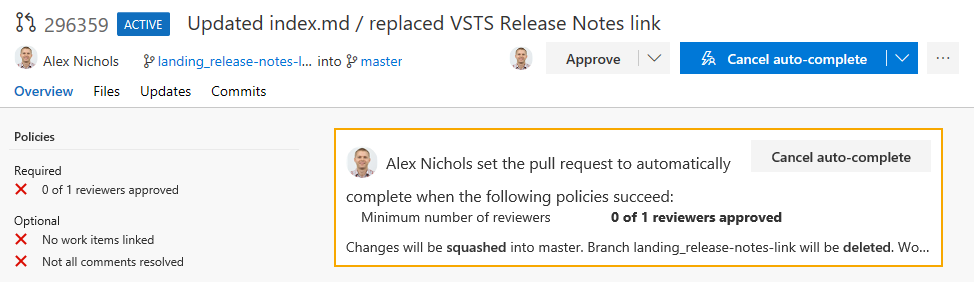
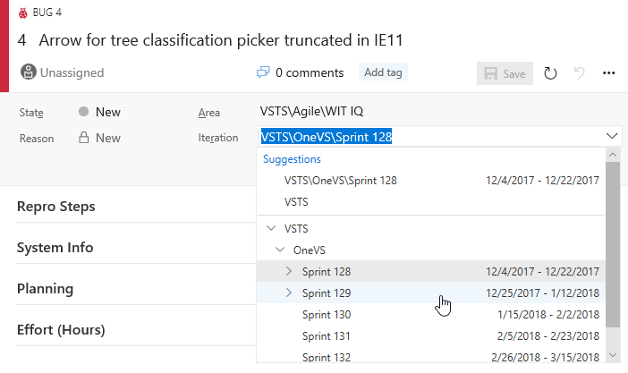
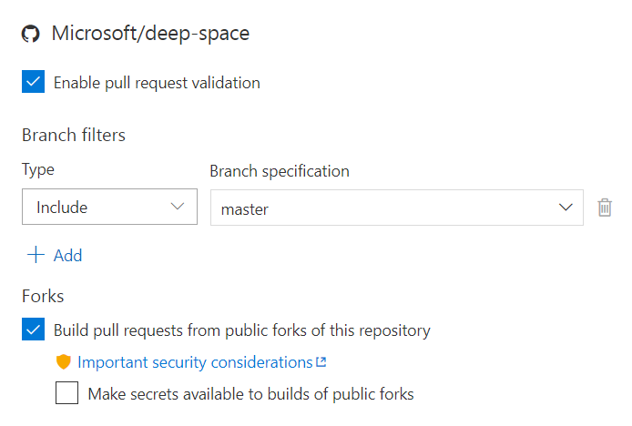
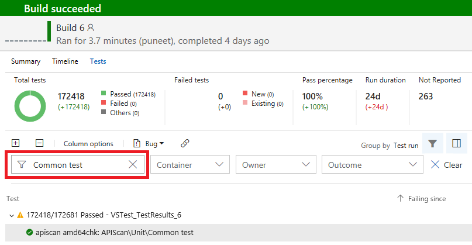
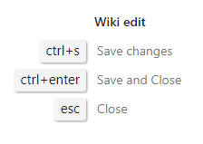
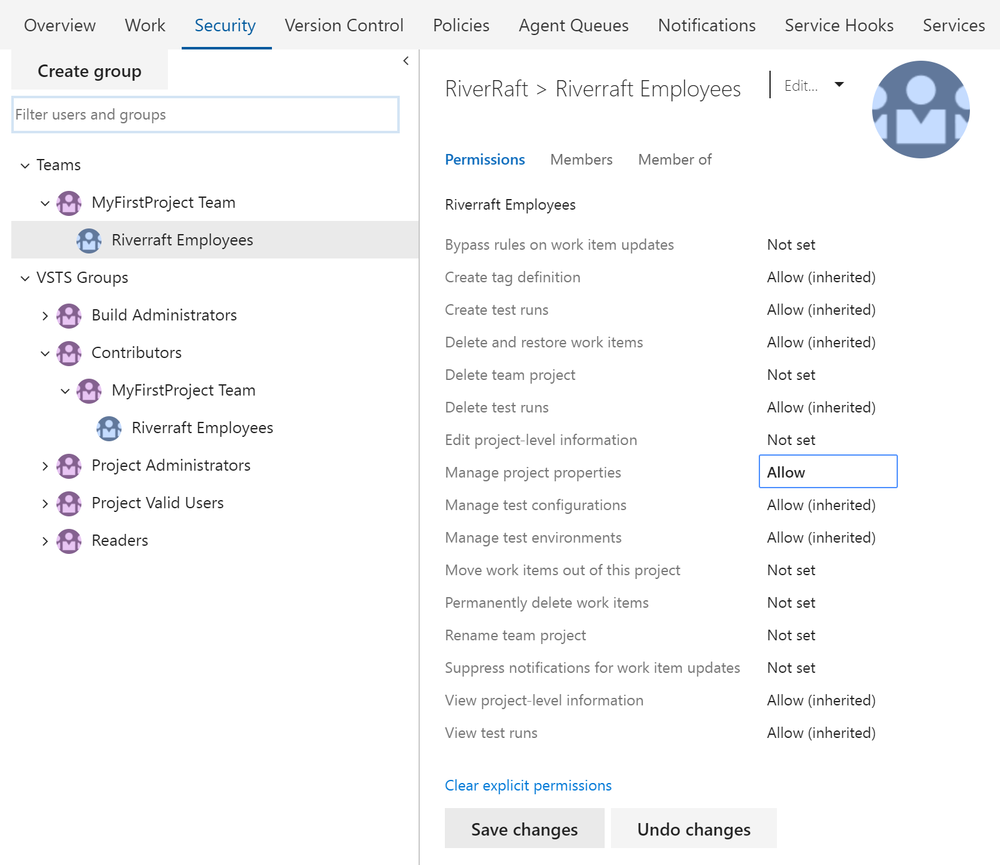

# Improved GitHub builds and suggested work item paths – VSTS Sprint 129 Update

Since we skipped the deployment of an update over the recent holidays, we now return with features from both Sprint 128 and 129. In the **Sprint 129 Update** of Visual Studio Team Services (VSTS), you’ll notice several enhancements that should delight those from across your team. Most notably, we strengthen our integration with GitHub by enabling you to [build pull requests from repository forks on GitHub.com](#build-github-pull-requests-from-repository-forks) and [continuously integrate from GitHub Enterprise through an official build source](#build-with-continuous-integration-from-github-enterprise).

Other feature highlights include:

* [View Analytics Widgets as a Stakeholder](#view-analytics-widgets-as-a-stakeholder) - Bring Stakeholders into the analytics conversation.
* [View pull request merge commit](#view-pull-request-merge-commit) - See exactly what the merged commit would look like in the PR.
* [Move work using suggested Areas and Iterations](#move-work-using-suggested-areas-and-iterations) - Get work to the proper area and iteration. Fast.
* [Wiki Search is now Generally Available](#wiki-search-now-generally-available) and [printable](#print-wiki-pages) - With search and print, Wiki is ready to help you retain your team’s knowledge.
* [Manage permissions directly on Azure AD groups](#manage-permissions-directly-on-azure-ad-groups) - Simplify your permissions using existing groups from Azure AD.

## What’s new in VSTS

> [!VIDEO https://www.youtube.com/embed/vTouJu6aR6U?rel=0]

## Dashboards and Analytics

### View Analytics Widgets as a Stakeholder

Installing the [Analytics extension](https://marketplace.visualstudio.com/items?itemName=ms.vss-analytics) adds 6 powerful widgets to your widget catalog: Cumulative Flow Diagram, Lead Time, Cycle Time, Velocity, Burndown, and Burnup. Now, those with the free [Stakeholder license](/azure/devops/organizations/security/get-started-stakeholder#related-notes) can view all the Analytics widgets too!

To use the [Analytics OData endpoint](/azure/devops/report/extend-analytics/index) or [Power BI to connect to Analytics](/azure/devops/report/powerbi/index), a [Basic license](https://visualstudio.microsoft.com/team-services/compare-features/) is still required.

### Integrate Power BI with VSTS Analytics using new views

The default views in the **VSTS Power BI Desktop Connector** help you get started on working with VSTS data right away. We’ve added additional views with common historical definitions to allow you to more easily perform trending and bug analysis. Refer to our guidance on [connecting to VSTS with Power BI Data Connector](/azure/devops/report/powerbi/data-connector-connect) for more information.

> [!div class="mx-imgBorder"]

In the upcoming February release of [**Power BI Desktop**](https://powerbi.microsoft.com/desktop/), we will introduce the ability to create your own views, which will make working with the specific data you need in Power BI even easier.

## Code

### View pull request merge commit

Pull request diff views are great at highlighting the changes introduced in the source branch. However, changes to the target branch may cause the diff view to look different than expected. A new command is now available to view the diff of the “preview” merge commit for the pull request - **View merge commit**. This merge commit is created to check for merge conflicts and to use with a pull request build, and it reflects what the merge commit will look like when the pull request is eventually completed. When the target branch has changes not reflected in the diff, the merge commit diff can be useful for seeing the latest changes in both the source and target branches.

> [!div class="mx-imgBorder"]

Another command that’s useful in conjunction with the **View merge commit** command is **Restart merge** (available on the same command menu). If the target branch has changed since the pull request was initially created, running this command will create a new preview merge commit, updating the merge commit diff view.

### Help reviewers using pull request labels

Sometimes it’s important to communicate extra information about a pull request to the reviewers. Maybe the pull request is still a work in progress, or it’s a hotfix for an upcoming release - so you append some extra text in the title, perhaps a “[WIP]” prefix or “DO NOT MERGE”. Labels now provide a way to tag pull requests with extra information that can be used to communicate important details and help organize pull requests.

> [!div class="mx-imgBorder"]

In a future release, we’ll make labels even more useful by making it easier to filter pull requests using labels.

### View remaining policy criteria for pull request auto-complete

Auto-complete is a useful feature for teams using branch policies, but when using optional policies, it can be unclear exactly what is blocking a pull request from being completed. Now, when setting auto-complete for a pull request, the exact list of policy criteria that are holding up completion are clearly listed in the callout box. As each requirement is met, items are removed from the list until there are no remaining requirements and the pull request is merged.

> [!div class="mx-imgBorder"]

### Discuss math in pull requests

Need to include an equation or mathematical expression in your pull request comments? You can now include TeX functions in your comments, using both inline and block commenting. See the list of [supported functions](https://khan.github.io/KaTeX/function-support.html) for more information.

> [!div class="mx-imgBorder"]

### Control who can contribute to pull requests

Previously, anyone who could view a Git repository could work with its pull requests. We’ve added a new permission called **Contribute to pull requests** that controls access to creating and commenting on pull requests. All users and groups that previously held the **Read** permission will also be granted this new permission by default. The introduction of this new permission gives administrators additional flexibility and control. If you require your **Readers** group to be truly read-only, you can deny the **Contribute to pull requests** permission.

See the [quickstart documentation for setting repository permissions](/azure/devops/organizations/security/set-git-tfvc-repository-permissions#set-git-repository-permissions) for more information.

### Integrate using the pull request status API and branch policy

Branch policies enable teams to maintain high quality branches and follow best practices during the pull request workflow. Now, you can use the pull request status API and branch policy to integrate custom tooling into pull request workflows. Whether it’s integrating with a 3rd party CI/CD solution, or enforcing your own internal process requirements, the status API can help. Check out our [code](https://go.microsoft.com/fwlink/?linkid=854108), [samples](https://go.microsoft.com/fwlink/?linkid=866529), and [documentation](https://go.microsoft.com/fwlink/?linkid=866532) for more information.

## Work

### Move work using suggested Areas and Iterations

It can be common to work in the same area or iteration and repeatedly browse through the hierarchies when moving work items around. The **Area** and **Iteration** path controls now include a list of recently used values as **Suggestions**, giving you quick access to set and move on.

> [!div class="mx-imgBorder"]

In addition, **Iteration** dates are included to the right of the name so that you can quickly judge when a work item should be delivered.

> [!div class="mx-imgBorder"]

## Build and Release

### Build GitHub pull requests from repository forks

GitHub pull requests from repository forks can now be automatically built by VSTS. This ensures that changes successfully build and tests pass before they are merged. By default, secrets associated with your build definition are unavailable to builds of pull requests from forks. See the [security considerations](/azure/devops/pipelines/build/ci-public) documentation for more information.

> [!div class="mx-imgBorder"]

### Build with continuous integration from GitHub Enterprise

You now have better integration with VSTS for performing continuous integration (CI) builds if you use **GitHub Enterprise** for version control. Previously, you were limited to polling for code changes using the **External Git** connector, which may have increased the load on your servers and caused delays before builds were triggered. Now, with official **GitHub Enterprise** support in VSTS, team CI builds are immediately triggered. In addition, the connection can be configured using various authentication methods, such as LDAP or built-in accounts.

> [!div class="mx-imgBorder"]

### Build with the appropriate agent by default

When you use one of our templates to create a new build definition, we now select a hosted agent queue for you by default. For example, the Ant and Maven templates default to the **Hosted Linux** queue. Xcode and Xamarin.iOS templates default to **Hosted macOS Preview**. The ASP.NET Core template defaults to **Hosted VS2017**. Of course, you can still change the queue to your preference, but this default saves some time when defining a new build process and otherwise avoids having to re-set the appropriate agent queue.

> [!div class="mx-imgBorder"]

## Test

### Screenshot desktop apps through the Chrome browser

The [Test & Feedback extension](https://marketplace.visualstudio.com/items?itemName=ms.vss-exploratorytesting-web) now has support for capturing screenshots of desktop applications through the Chrome browser. With the browser extension installed, select the application you are testing, take screenshots, annotate, and create bugs or tasks.

> [!div class="mx-imgBorder"]

### Filter large test results by Test Name

Over time, test assets accrue. For large applications, they can easily grow to tens of thousands of tests. In our earlier sprint we added two new filters under **Tests** tab in **Build and Release** - **Container** (DLLs) and **Owner** (Container Owner). To enrich this experience further, we have added a new filter based on **Test Name**, which allows you to quickly search for the test you are interested in. The various filters continue to be cumulative.

> [!div class="mx-imgBorder"]

### Run Functional Tests and Deploy Test Agent tasks are now deprecated

Last year, we started on the journey to [unify agents across build, release, and test](https://blogs.msdn.microsoft.com/devops/2017/03/26/vstest-task-dons-a-new-avatar-testing-with-unified-agents-and-phases/).
This was intended to address various pain points associated with using WinRM based **Deploy Test Agent** and **Run Functional Tests** tasks. It also enables you to use the **Visual Studio Test** (VSTest) task for all your testing needs, including:

* Unit tests
* Functional (UI/non-UI) tests
* MSTest based tests
* 3rd party framework-based tests
* Assembly-based test specification or running tests with Test Plan/Test Suite
* Single agent test execution as well as distributing tests over multiple agents

The unified agents approach also allows admins to manage all machines being used for CI/CD in a uniform manner.

> [!div class="mx-imgBorder"]

Over the course of the last several sprints, we delivered several crucial pieces to enable this capability, including:

* Agents can be [configured for UI testing](/azure/devops/pipelines/agents/agents#account)
* [Visual Studio Test Platform Installer](/azure/devops/release-notes/2017/nov-28-vsts#test) allows VSTest task to run without needing Visual Studio pre-installed
* Both Build and Release definitions can be created with [multiple phases and have the ability to use different agent queues](/azure/devops/release-notes/2017/dec-11-vsts#enhancements-to-multi-phase-builds) for each phase
* Automated test cases can be [run from the Test hub](/azure/devops/pipelines/test/run-automated-tests-from-test-hub) using the VSTest task

With all the above now in place, we are ready to deprecate these two tasks. While existing definitions that use the deprecated tasks will continue to work, we encourage you to move to using VSTest to take advantage of continued enhancement over time.

### Delete Test Plans / Test suites
Users can now delete Test Plans / Test suites if they the following permissions 
* Test suite delete: View test runs + Delete test runs + Manage test suites
* Test plan delete: View test runs + Delete test runs + Manage plan suites

## Wiki

### Wiki Search now Generally Available

After a [public preview of Wiki search in December](https://blogs.msdn.microsoft.com/devops/2017/12/01/announcing-public-preview-of-wiki-search/), we are now making it generally available. You can search for your favorite wiki pages by title or content right alongside code and work items.

### Print Wiki pages

**Wiki** can be used for a variety of content. Sometimes it can be useful to print content from **Wiki** to read in your spare time, add comments using pen and paper, or even share an offline PDF copy with those outside of your VSTS project. Now, simply click on the context menu of a page and select **Print page**. This feature was prioritized based on a [suggestion](https://visualstudio.uservoice.com/forums/330519-visual-studio-team-services/suggestions/20051455-print-or-export-document-from-wiki-functionality).

> [!div class="mx-imgBorder"]

Currently this feature is [not supported on Firefox](http://kb.mozillazine.org/Problems_printing_web_pages).

### Contribute to Wiki pages with ease using keyboard shortcuts

You can now use shortcuts to perform common edit and view actions in **Wiki** even faster using only your keyboard.

While viewing a page, you can add, edit, or create a subpage, for example.

> [!div class="mx-imgBorder"]

While editing a page, you can quickly save, save and close, or just close.

> [!div class="mx-imgBorder"]

These are in addition to standard editing shortcuts such as Ctrl+B for **bold**, Ctrl+I for *italics*, Ctrl+K for `[linking](#)` etc. See the [full list of keyboard shortcuts](/azure/devops/project/navigation/keyboard-shortcuts) for more information.

## Marketplace

### Calculate price without leaving the extension page

All paid VSTS extensions and VS subscriptions in the [**Marketplace**](https://marketplace.visualstudio.com) now feature a calculator on the **Pricing** tab. You can now figure out the price corresponding to the selected quantity in your currency, without leaving the extension page.

> [!div class="mx-imgBorder"]

Note: The final pricing will be determined based on the Azure subscription used for a purchase.

## Administration

### Manage permissions directly on Azure AD groups

To avoid extra layers of groups in VSTS, you can now manage permissions directly on Azure Active Directory groups. This bring our support for Azure AD groups on par with VSTS groups.

> [!div class="mx-imgBorder"]

See the [about permissions and groups](/azure/devops/organizations/security/about-permissions) documentation for more information.

### Connect or disconnect a VSTS account to Azure Active Directory via new Azure portal

With the [retirement of the classic Azure portal](/information-protection/deploy-use/migrate-portal) (manage.windowsazure.com), you can now connect or disconnect your VSTS account from Azure Active Directory via the new Azure portal (portal.azure.com) using the **Connect** control on the account blade. See the [documentation for connecting to Azure AD](/azure/devops/accounts/connect-account-to-aad) for more information.

> [!div class="mx-imgBorder"]

### Warning for accounts with a single Project Collection Administrator

For Microsoft Account (MSA)-backed VSTS accounts, a warning has been added in the **Security** tab if we detect that the account has multiple users but is administered by a single Project Collection Administrator. It is recommended to have more than one administrator to avoid the account becoming locked out if the current administrator leaves the company. This message is only a recommendation and will not impact any of your existing settings.

> [!div class="mx-imgBorder"]

## Next steps and Feedback

> [!div class="nextstepaction"]
> [Go to VSTS](http://go.microsoft.com/fwlink/?LinkId=307137&campaign=o~msft~docs~product-vsts~release-notes)

We would love to hear what you think about these features. Report a problem or provide a suggestion if you have ideas on things you’d like to see us prioritize, through the feedback menu.

> [!div class="mx-imgBorder"]

You can also get advice and your questions answered by the community on [Stack Overflow](https://stackoverflow.com/questions/tagged/vsts).

Thanks,

Jamie Cool