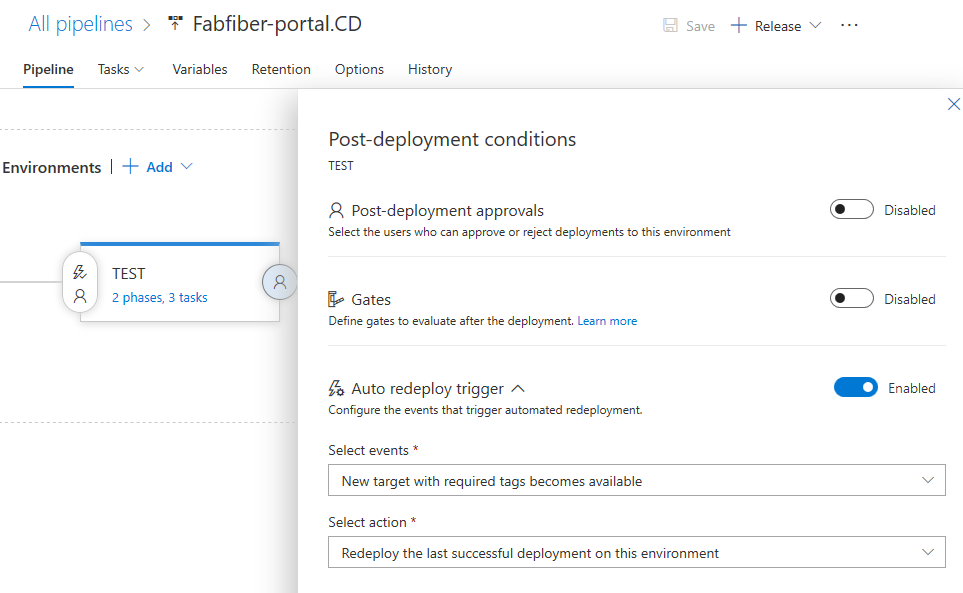
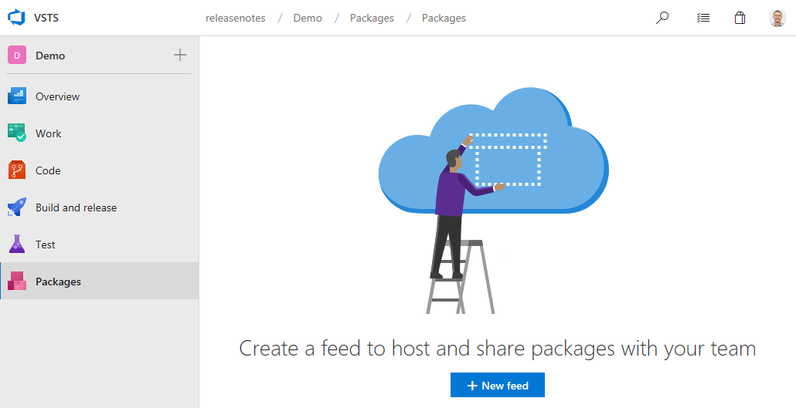

# Microsoft-hosted Linux and macOS agents generally available – VSTS Sprint 137 Update

In the **Sprint 137 Update** of Visual Studio Team Services (VSTS), we remove the "Preview" moniker from our Linux and macOS Microsoft-hosted CI/CD agents and [make them generally available](#build-and-release-with-microsoft-hosted-linux-and-macos-agents). Along with our Microsoft-hosted Windows agent, you now have a trusted and scalable platform for production builds and releases, no matter what your platform.

There are a number of other features across Code, Wiki, Package, and Administration. Check out the [Features](#features) list below for more.

## Next steps

Read about the new features below and head over to VSTS to try them for yourself.

> [!div class="nextstepaction"]
> [Go to VSTS](http://go.microsoft.com/fwlink/?LinkId=307137&campaign=o~msft~docs~product-vsts~release-notes)

## What’s new in VSTS

> [!VIDEO https://www.youtube.com/embed/6PH5i_f3ErA?rel=0]

## Features

Code:

- [Create pull requests without a default team as reviewer](#create-pull-requests-without-a-default-team-as-reviewer)
- [Allow bypassing branch policies without giving up push protection](#allow-bypassing-branch-policies-without-giving-up-push-protection)

Wiki:

- [Link to headings within a page](#link-to-headings-within-a-page)
- [View broken links](#view-broken-links)
- [Attach files and images in folders](#attach-files-and-images-in-folders)
- [Open page in new tab](#open-page-in-new-tab)

Build and release:

- [Build and release with Microsoft-hosted Linux and macOS agents](#build-and-release-with-microsoft-hosted-linux-and-macos-agents)
- [Automatically deploy to new targets in a deployment group](#automatically-deploy-to-new-targets-in-a-deployment-group)
- [Hold deployments until gates succeed consistently](#hold-deployments-until-gates-succeed-consistently)
- [Azure DevOps Projects now generally available](#azure-devops-projects-now-generally-available)

Package:

- [Get started with pre-installed Package Management](#get-started-with-pre-installed-package-management)

Admin:

- [Connect or disconnect Azure Active Directory as a Project Collection Admin](#connect-or-disconnect-azure-active-directory-as-a-project-collection-admin)
- [Public projects available in preview for all organizations](#public-projects-available-in-preview-for-all-organizations)
- [Adopt the word "organization" when referring to a collection of projects in VSTS](#adopt-the-word-organization-when-referring-to-a-collection-of-projects-in-vsts)

## Code

### Create pull requests without a default team as reviewer

> [!IMPORTANT]
> To use this capability, you must have the **New Navigation** [preview feature](/azure/devops/project/navigation/preview-features) enabled on your profile or organization.

When we first launched the pull request (PR) experience, we thought it would make sense to assign all PRs to the team context that you had selected when creating the PR. This behavior has been a frustration point, since many people did not notice the connection between the team context and the PR assignment. In fact, this has been one of our top [UserVoice suggestions](https://visualstudio.uservoice.com/forums/330519-visual-studio-team-services/suggestions/18780553-dont-add-the-default-team-as-reviewer-when-doing-a).
​
As part of the [new navigation](/azure/devops/release-notes/2018/jun-19-vsts#preview-our-new-navigation) changes, we took the opportunity to change this default association with teams. You'll notice two changes:​
​
1. When creating a PR, no reviewers are added by default. The reviewers list does have a feature to make it easier to add individuals and groups that were added to PRs recently. The [required reviewers policy](/azure/devops/git/branch-policies?view=azure-devops#automatically-include-code-reviewers) can also help teams that want to ensure that specific reviewers are added to review their code.​
1. The **Pull Requests** hub has a new customizable section. By default, this section shows PRs "Assigned to my teams", providing equivalent functionality as the old section. However, if you belong to multiple teams, this section will show PRs assigned to any of your teams. The section is also customizable - just click on the "Customize this view" action near the section header.

### Allow bypassing branch policies without giving up push protection

There are many scenarios where you have the occasional need to bypass a branch policy - reverting a change that caused a build break, applying a hotfix in the middle of the night, etc. Previously, we offered a permission ("Exempt from policy enforcement") to help teams manage which users were granted the ability to bypass branch policies when completing a pull request. However, that permission also granted the ability to push directly to the branch, bypassing the PR process entirely.​
​
To improve this experience, we've split the old permission to offer more control to teams that are granting bypass permissions. There are two new permissions to replace the old one:​
​
1. **Bypass policies when completing pull requests.** Users with this permission will be able to use the "Override" experience for pull requests.
1. **Bypass policies when pushing.** Users with this permission will be able to push directly to branches that have required policies configured.​

By granting the first permission and denying the second, a user will be able to use the bypass option when necessary, but will still have the protection from accidentally pushing to a branch with policies.
​
> [!NOTE]
> This change does not introduce any behavior changes. Users that were formerly granted **Allow** for "Exempt from policy enforcement" will be granted **Allow** for both new permissions, so they will be able to both override completion on PRs and push directly to branches with policies.

See the [Set branch permissions](/azure/devops/git/branch-permissions?view=azure-devops) documentation for more information.

## Wiki

### Link to headings within a page

Now you can click the link icon next to any section heading in a wiki page to generate a URL directly to that section. You can then copy that URL and share it with team members to link them directly to that section. This feature was prioritized based on a [suggestion](https://visualstudio.uservoice.com/forums/330519-visual-studio-team-services/suggestions/33012745-wiki-link-to-headings).

> [!div class="mx-imgBorder"]

### View broken links

All links in a wiki that are not linked properly will appear in a distinct red color and broken link icon, giving you a visual clue of all broken links in a wiki page. 

> [!div class="mx-imgBorder"]

### Attach files and images in folders

While editing wiki pages offline it can be easier to add file attachments and images in the same directory as the wiki page. Now, you can add an attachment or an image in any folder in the wiki and link it to your page. This feature was prioritized based on a [suggestion](https://visualstudio.uservoice.com/forums/330519-visual-studio-team-services/suggestions/33308998-allow-attachments-in-folders-of-wiki).

> [!div class="mx-imgBorder"]

### Open page in new tab

Now you can right click on a wiki page and open it in new tab or simply press CTRL + left click on a wiki page to open it in a new tab.

> [!div class="mx-imgBorder"]

## Build and Release

### Build and release with Microsoft-hosted Linux and macOS agents

The Microsoft-hosted Linux and macOS agents are now out of preview and generally available. After several months in preview, listening to feedback, and tuning the infrastructure to provide a consistent service, we're excited to offer these now in GA. See the [Microsoft-hosted agents](/azure/devops/pipelines/agents/hosted?view=azure-devops) documentation for more information.

> [!IMPORTANT]
> Due to the way the hosted pools were implemented in preview, the agent pools in existing organizations will continue to have the "Preview" moniker (in name only). Pools marked "Preview" have reached general availability and will be equivalent to corresponding, newly-named pools that will soon roll out.

### Automatically deploy to new targets in a deployment group

Previously, when new targets were added to a deployment group, a manual deployment was required to ensure all targets have the same release. You can now configure the environment to automatically deploy the last successful release to the new targets. We plan to add additional trigger events and actions to the auto redeploy configuration in coming sprints. See the [Deployment Groups](/azure/devops/pipelines/release/deployment-groups/) documentation for more information.

> [!div class="mx-imgBorder"]

### Hold deployments until gates succeed consistently

Release gates enable automatic evaluation of health criteria before a release is promoted to the next environment. By default, the release progresses after one successful sample for all gates has been received. Even if a gate is erratic and the successful sample received is noise, the release progresses. To avoid these types of issues, you can now configure the release to verify consistency of the health for a minimum duration before progressing. At run time, the release would ensure consecutive evaluations of the gates are successful before allowing the promotion. The total time for evaluation depends on "time between reevaluation" and would typically be more than the configured minimum duration. See the [Release deployment control using gates](/azure/devops/pipelines/release/approvals/gates?view=azure-devops) documentation for more information.

> [!div class="mx-imgBorder"]

### Azure DevOps Projects now generally available

Back in [November](/azure/devops/release-notes/2017/nov-28-vsts#azure-devops-project-release-tagimgrelease-notes-tagreleasepng) we introduced DevOps Projects, which helps ou get up and running with a full DevOps pipeline on Azure, from code through monitoring, in just a few minutes. We've added services along the way and incorporated a lot of your feedback. We'll now continue moving forward with it in generally availability to help you go even further on your journey with DevOps. See the [Azure DevOps Projects general availability post](https://blogs.msdn.microsoft.com/devops/2018/07/12/azure-devops-project-general-availability/) on the Microsoft DevOps Blog for more information.

## Package

### Get started with pre-installed Package Management

The Package Management extension is pre-installed into all organizations. If you're using the new navigation preview, look for it at the bottom of the list of services. If you're still on the current navigation, look for the **Packages** hub in the **Build and release** hub group. Each organization comes with 5 free Package Management users, and additional users can be purchased from [the Marketplace](https://marketplace.visualstudio.com/items?itemName=ms.feed). Soon you'll also be able to toggle the visibility of this service in your organization using the Services admin page within the new navigation as you can with the others.

> [!div class="mx-imgBorder"]

## Administration

### Connect or disconnect Azure Active Directory as a Project Collection Admin

A Project Collection Administrator (PCA) can now [connect or disconnect their organization from Azure Active Directory](/azure/devops/organizations/accounts/connect-organization-to-aad?view=azure-devops). Previously this had to be done by an organization owner.

### Public projects available in preview for all organizations

> [!IMPORTANT]
> To use this capability, an organization administrator must [enable public projects](/azure/devops/organizations/public/create-public-project?view=azure-devops&tabs=horizontal#enable-anonymous-access-to-projects-for-your-organization) from the **Settings** page. 

As we [announced back in April](https://blogs.msdn.microsoft.com/devops/2018/04/27/vsts-public-projects-limited-preview/), we're bringing [public projects](/azure/devops/organizations/public/index?view=azure-devops) to VSTS. For the first time, you'll be able to mark a VSTS Team Project as public. This will enable anonymous (un-authenticated) users to be able to view the contents of that project, including work items, code, and build results. Although the feature is still in preview, as of this sprint you will no longer need to be invited to join the private preview.

> [!IMPORTANT]
> If you're using a public project to build a repository hosted on GitHub, note that while pull requests (PRs) from branches within your repository will build fine, PRs opened from forks of your repository will not build right now.

### Adopt the word "organization" when referring to a collection of projects in VSTS

We've made a change to our terminology when it comes to referring to a collection of projects in VSTS. Previously we used the term "account" but have found that this has caused a lot of confusion for the broader developer and open source community. We've chosen to replace the term "account" with "organization". You'll start seeing this change rollout in documentation and in-product with this Update. See the [Adopting the word “organization” post](https://blogs.msdn.microsoft.com/devops/2018/07/19/adopting-the-word-organization/) on the Microsoft DevOps Blog for more information.

## Feedback

We would love to hear what you think about these features. Use the feedback menu to report a problem or provide a suggestion.

> [!div class="mx-imgBorder"]

You can also get advice and your questions answered by the community on [Stack Overflow](https://stackoverflow.com/questions/tagged/vsts).

Thanks,

Biju Venugopal
