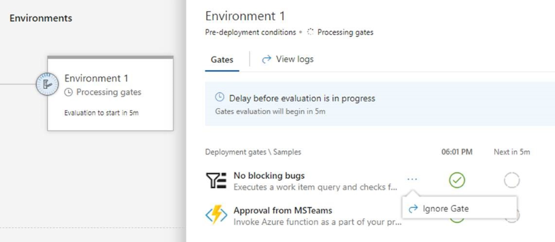
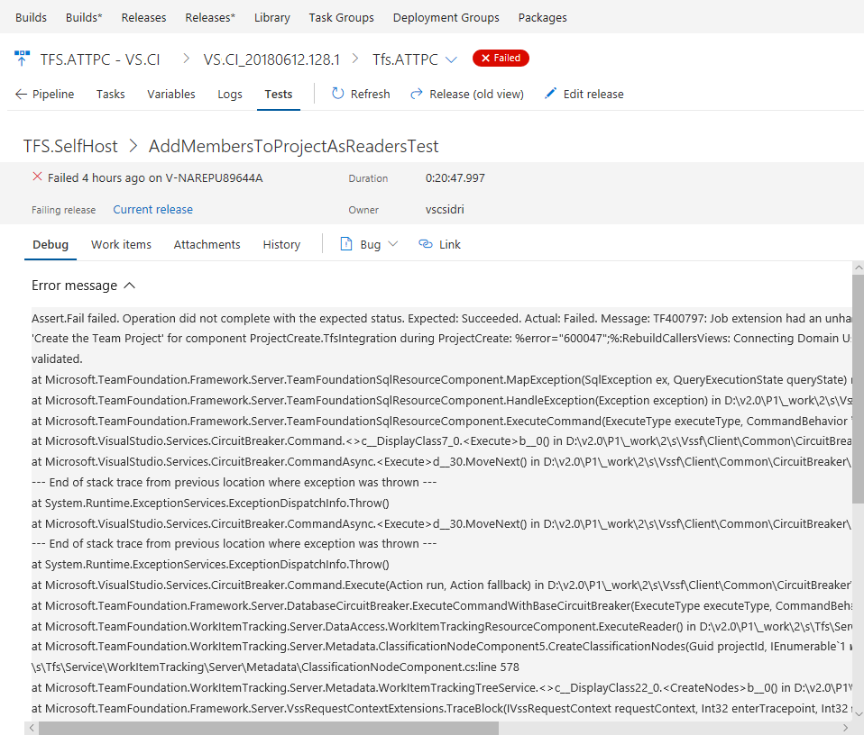
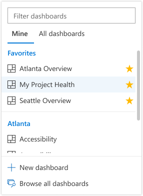

# Modernizing the UI – VSTS Sprint 136 Update

In the **Sprint 136 Update** of Visual Studio Team Services (VSTS), we are introducing some new and exciting design changes. You can preview a new experience in the [Build hub](#new-build-results-page) and [Test tab](#improved-experiences-in-the-test-tab). The [Queries hub](#queries-hub-generally-available) is now generally available. Also, you can try a preview of the [new navigation experience](#preview-our-new-navigation) with the [new Work hubs](#new-work-hubs).

There are a number of other features across Work, Build, Release, Test, and Reporting. Check out the [Features](#features) list below for more.

## Next steps

Read about the new features below and head over to VSTS to try them for yourself.

> [!div class="nextstepaction"]
> [Go to VSTS](http://go.microsoft.com/fwlink/?LinkId=307137&campaign=o~msft~docs~product-vsts~release-notes)

## What’s new in VSTS

> [!VIDEO https://www.youtube.com/embed/JJib0almy9U?rel=0]

## Features

### Navigation

- [Preview our new navigation](#preview-our-new-navigation)

### Work

- [New Work hubs](#new-work-hubs)
- [Queries hub generally available](#queries-hub-generally-available)
- [Easily find existing work items in linking and mention experiences](#easily-find-existing-work-items-in-linking-and-mention-experiences)

### Build and Release

- [New build results page](#new-build-results-page)
- [Pass environment variables to tasks](#pass-environment-variables-to-tasks)
- [Ignore a release gate for a deployment](#ignore-a-release-gate-for-a-deployment)
- [Set a variable at release time](#set-a-variable-at-release-time)
- [Organize your release definitions in folders](#organize-your-release-definitions-in-folders)
- [Use improved Windows remote PowerShell based tasks](#use-improved-windows-remote-powershell-based-tasks)
- [GitHub artifacts show associated commits deployed in a release](#github-artifacts-show-associated-commits-deployed-in-a-release)

### Package

- [Use upstream sources in legacy feeds](#use-upstream-sources-in-legacy-feeds)
- [Use arbitrary public npm feeds as upstream sources](#use-arbitrary-public-npm-feeds-as-upstream-sources)

### Test

- [Improved experiences in the Test tab](#improved-experiences-in-the-test-tab)

### Reporting

- [Exclude items completed before a certain date in analytics views](#exclude-items-completed-before-a-certain-date-in-analytics-views)
- [Easily navigate to dashboards](#easily-navigate-to-dashboards)

### Authentication

- [Get notified for PAT expirations](#get-notified-for-pat-expirations)

## Navigation

### Preview our new navigation

> [!VIDEO https://www.youtube.com/embed/uMkHegKLrcA?rel=0]

> [!IMPORTANT]
> To use this capability, you must have the **New Navigation** [preview feature](/azure/devops/project/navigation/preview-features) enabled on your profile or account.

Over the next couple weeks, the public preview of our new navigation will be rolling out and available to everyone that uses VSTS. Once it’s available in your account, a feature announcement banner will show and you can turn it on for any project using the Preview Features panel. Read our [blog post](https://aka.ms/vstsnewnav) for more details about the design refresh and why we’re doing it.

> [!div class="mx-imgBorder"]

## Work

### New Work hubs

> [!VIDEO https://www.youtube.com/embed/-NjzRMcjqis?rel=0]

> [!IMPORTANT]
> To use this capability, you must have the **New Navigation** [preview feature](/azure/devops/project/navigation/preview-features) enabled on your profile or account.

Along with the public preview of our new navigation, we’re also introducing the new Work hubs. Here, you’ll find favorites and quick search support for all your boards, backlogs, and sprints as well as new features such as Sprint Planning. See the [New Work Hubs post](https://blogs.msdn.microsoft.com/devops/2018/06/22/new-work-hubs/) on the Microsoft DevOps Blog for more information.

> [!div class="mx-imgBorder"]

### Queries hub generally available

While the new **Queries** hub was in preview, we worked to respond to your feedback. We are now excited for the experience to become available for everyone. The hub streamlines many of the existing queries features from the old hub with a more modern look and feel as well as provides new capabilities to make it easier to get to the queries that are important to you. Some highlights of the new experience include:

- Directory pages with last modified by information and the ability to search for queries
- Breadcrumb with unique URLs for folders to bookmark important groups of queries
- Quick access to your favorite queries from the results page

Read more about these exciting updates on our [DevOps blog](https://blogs.msdn.microsoft.com/devops/2018/06/18/queries-hub-updates-generally-available).

### Easily find existing work items in linking and mention experiences

When you want to link two existing work items together, you can now easily find the item that is important to you using our new work item search control. The query selector has been replaced with inline suggestions based on your recently accessed work items, as well as an entry point to search for a specific work item by ID or title.

> [!div class="mx-imgBorder"]

## Build and Release

### New build results page

> [!IMPORTANT]
> To use this capability, you must have the **New build result page** [preview feature](/azure/devops/project/navigation/preview-features) enabled on your profile or account.

In TFS 2015 we rolled out a new build system, enabling you to drag and drop scripts and a growing library of open-sourced tasks. We've gradually improved the editor experience, and today we're refreshing the experience for viewing a build.

When you go to your build results, you’ll have clearer insight into the logs, issues, commits, and work items that make up your build. This is the first step in our design update so send us your thoughts.

> [!div class="mx-imgBorder"]

### Pass environment variables to tasks

CI/CD task authors can set a new property, [**showEnvironmentVariables**](https://github.com/Microsoft/vsts-tasks/blob/master/Tasks/CmdLineV2/task.json#L23), in the task.json to pass environment variables to tasks. When you do so, an extra control is rendered on the task in the build editor. This is available for the **Powershell**, **Cmd**, and **Bash** tasks.

> [!div class="mx-imgBorder"]

This enables two scenarios:

- A task requires an environment variable with case-preserved in the variable name. For instance, in the above example, the environment variable passed along to the task would be “foo” and not “FOO”.
- It allows secrets values to be passed in a safe manner to the scripts. This is preferred to passing the secrets as arguments to the scripts since the operating system on the agent may log invocation of processes including their arguments.

### Ignore a release gate for a deployment

> [!IMPORTANT]
> To use this capability, you must have the **New release progress views** [preview feature](/azure/devops/project/navigation/preview-features) enabled on your profile or account.

Release gates enable automatic evaluation of health criteria before a release is promoted to the next environment. By default, the release pipeline progresses only when all gates are healthy at the same time. In certain situations, such as when expediting a release or after manually checking health, an approver may want to ignore a gate and allow the release to progress even if that gate has yet to evaluate as healthy. The [release gates](/azure/devops/pipelines/release/approvals/gates) documentation for more information.

> [!div class="mx-imgBorder"]

### Set a variable at release time

In a release definition, you can now choose the variables you would like to set when you create the release.

> [!div class="mx-imgBorder"]

The value provided for the variable when the release is created is only used for that release. This feature will help you avoid multiple steps for Create-in-Draft, update the variables in draft, and trigger the release with the variable.

> [!div class="mx-imgBorder"]

### Organize your release definitions in folders

> [!IMPORTANT]
> To use this capability, you must have the **New Releases Hub** [preview feature](/azure/devops/project/navigation/preview-features) enabled on your profile or account.

Organizing your release definitions just got simpler and easier. You can now create folders and move your definitions within them. Security can be also be managed directly at the folder level. Folders can be viewed in the **Releases*** hub (it will show up next to the **Releases** hub when you opt-in).

> [!div class="mx-imgBorder"]

### Use improved Windows remote PowerShell based tasks

New and improved Windows remote PowerShell based tasks are available. These improvements include several performance fixes and support live logs and console output commands, such as Write-Host and Write-Output.

**PowerShell on Target task (version: 3.*)**: You can add inline script, modify PSSession options, control "ErrorActionPreference", and fail on standard error.

**Azure File Copy task (version: 2.*)**: Ships with the latest AzCopy (v7.1.0) that addresses a [GitHub issue](https://github.com/Microsoft/vsts-tasks/issues/5590).

### GitHub artifacts show associated commits deployed in a release

In order to enhance end-to-end traceability, you can see all the commits that were deployed to an environment for GitHub repositories, as a part of a specific release.

> [!div class="mx-imgBorder"]

## Package

### Use upstream sources in legacy feeds

Until now, [legacy feeds](/azure/devops/artifacts/reference/feed-upgrade-learn-more?view=azure-devops) could not use the nuget.org upstream source or take advantage of improvements made to the npmjs.com upstream source. With this update, you can upgrade a legacy feed and use those features. Look for the banner above your feed’s packages for more information, including behavior changes you should be aware of before upgrading.

### Use arbitrary public npm feeds as upstream sources

Previously, you had been able to use npmjs.com, and other VSTS feeds, as npm upstream sources. With this update, you can also use arbitrary public feeds (e.g. a MyGet feed) as npm upstream sources.

## Test

### Improved experiences in the Test tab

> [!IMPORTANT]
> Enable the **New build hub** and **New release progress views**
[preview features](/azure/devops/project/navigation/preview-features?view=azure-devops) to use these new capabilities.

Along with the new **Builds** hub and new [Release](/azure/devops/release-notes/2018/may-30-vsts#visualize-release-progress) progress views, a modern experience for the **Test** tab is now available. This gives you rich in-context test information for **Builds** and **Release**. The new experience provides an in-progress test view, full page debugging experience, in context test history, reporting aborted test execution, and run level summary.

> [!div class="mx-imgBorder"]

#### View execution of in-progress tests

Tests, such as integration and functional tests, can run for a long time so it’s important to see test execution at any given time. With the In-Progress Test View, you no longer have to wait for test execution to complete to know the test outcome. Results are available in near real-time as they are run, helping you to take actions faster. You can debug a failure or abort, file a bug or abort the pipeline. The feature is currently available for both build and release pipeline using **VS Test Task** in Multi Agent phase, using **Publish Test Results Task** or publishing test results using API(s). In the future we plan to extend this experience for test execution using Single Agent.

The view below shows the In-Progress Test summary in the new release progress view, reporting total test count and number of test failures at a given point in time.

> [!div class="mx-imgBorder"]

By clicking the In-Progress Test summary above, you can view the detailed test summary along with failed or aborted test information in the **Test** tab. The test summary refreshes at a periodic interval with the ability to refresh the detail view on demand, based on the availability of new results.

> [!div class="mx-imgBorder"]

#### View test run debugging details in full page

Error messages and stack traces are lengthy in nature and need enough real estate to view the details during debugging. To have an immersive debugging experience, you can now expand the test or test run view to full page view, while still being able to perform the required in context operations like bug creation or requirement association for the current test result.

> [!div class="mx-imgBorder"]

#### View test history in-context

Historically, teams would have to go to **Runs** hub to view the history of a test result. With the new experience, we bring the test history right in context within the **Test** tab for build and release. The test history information is provided in a progressive manner starting with the current build definition or environment for the selected test, followed by other branches and environments for the build and release respectively.

> [!div class="mx-imgBorder"]

#### View aborted tests

Test execution can abort due to multiple reasons such as bad test code, source under test, and environmental issues. Irrespective of the reason for the abort, it is important for you to diagnose the behavior and identify the root cause. You can now view the aborted tests and test runs, alongside the completed runs in the **Test** tab. The feature is currently available for both build and release pipeline using **VS Test Task** in Multi Agent phase or publishing test results using API(s). In the future we plan to extend this experience for test execution using Single Agent.

> [!div class="mx-imgBorder"]

## Reporting

### Exclude items completed before a certain date in analytics views

The [Analytics service](/azure/devops/report/analytics/what-is-analytics?view=azure-devops) stores all work item history, including work items that are closed. Customers often don’t want to report on older, closed work items. We have updated [Analytics views](/azure/devops/report/analytics/what-are-analytics-views?view=azure-devops) to let you exclude work items that were completed before a specific date. This greatly decreases the amount of data loaded into Power BI. It also makes advanced calculations, like [time in state](/azure/devops/report/powerbi/create-timeinstate-report?view=azure-devops), much more performant. You set this option on the **History** tab.

> [!div class="mx-imgBorder"]

### Easily navigate to dashboards

You can now easily navigate to other dashboards that belong to your team! While the new dashboard experience was in preview, we worked to respond to your biggest piece of feedback around losing the ability to quickly switch between the dashboards. The dashboard picker has now been updated to make it easier to get to the dashboards you care about. The updated picker now contains two pivots: **Mine** and **All**. The **Mine** pivot makes it easy to find the teams that you belong to and their corresponding dashboards, as well as showing you the dashboards that you have favorited. The **All** pivot, continues to show you all of the dashboards within the project.

Favorites are at the top.

> [!div class="mx-imgBorder"]

Scroll down to see your team’s dashboards.

> [!div class="mx-imgBorder"]

See all dashboards in the project.

> [!div class="mx-imgBorder"]

## Authentication

### Get notified for PAT expirations

When a Personal Access Token (PAT) is nearing expiration, you’ll get an email notification giving you the ability to immediately take action and extend the lifetime of the PAT so that your tools and processes will go on uninterrupted.

> [!div class="mx-imgBorder"]

## Feedback

We would love to hear what you think about these features. Use the feedback menu to report a problem or provide a suggestion.

> [!div class="mx-imgBorder"]

You can also get advice and your questions answered by the community on [Stack Overflow](https://stackoverflow.com/questions/tagged/vsts).

Thanks,

Jeremy Epling
