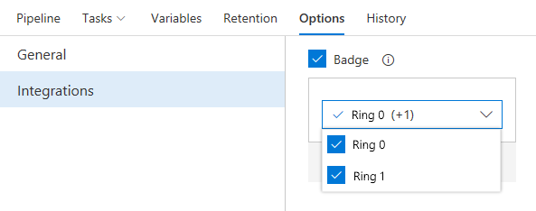

# Work Items hub and VM-based Azure DevOps Project – VSTS Sprint 131 Update

In the **Sprint 131 Update** of Visual Studio Team Services (VSTS), there are a few features that have received a large amount of feedback and activity on UserVoice. One is the [Work Items hub](#focus-on-important-work-using-the-work-items-hub), which now becomes generally available to bring important work to the forefront of your daily workflow. We also added [virtual machine](#retain-more-control-of-your-app-by-deploying-your-azure-devops-project-to-a-virtual-machine) as an option for configuring [Azure DevOps Projects](https://azure.microsoft.com/features/devops-projects/) since we know that retaining lower-level control over web applications is important for some.

Other highlights include:

- [Query work across the iteration schedule with +/- @CurrentIteration](#query-work-across-the-iteration-schedule-with---currentiteration)
- [Improve release times by partially downloading artifacts](#improve-release-times-by-partially-downloading-artifacts)

## What’s new in VSTS

> [!VIDEO https://www.youtube.com/embed/ph2yNok4-QY?rel=0]

## Code

### Avoid overwrites and protect performance using repository settings

In this Update, you’ll find two new [repository settings](/azure/devops/git/concepts/repository-settings) to help keep Git running smoothly.

**Case enforcement** switches the server from its default case-sensitive mode, where “File.txt” and “file.txt” are distinct, to a Windows and macOS-friendly mode where “File.txt” and “file.txt” are the same file. This setting affects files, folders, branches, and tags. It also prevents contributors from accidentally introducing [case-only differences](/azure/devops/git/concepts/case-sensitivity). Enabling case enforcement is recommended when most of your contributors are running Windows or macOS.

**Limit file sizes** allows you to prevent new or updated files from exceeding a size limit you set. The greater number of large files that exist in a Git repository’s history, the worse clone and fetch operation performance will be. This setting prevents accidental introduction of these files.

## Work

### Focus on important work using the Work Items hub

While queries, backlogs, and boards give you a number of ways to see your work, we want the work that is most important to you to be right at your fingertips. After a 6-month preview of the **Work Items** hub, it’s now available to everyone. We have iterated on the hub a lot since the start of [preview](/azure/devops/release-notes/2017/aug-28-team-services#work-items-hub), and below includes a few of the changes we’ve made.

The **Work Items** Hub now has 4 person-centric pivots to allow you to focus on what is important to you, as well as 3 project-centric views to get a better idea of your project’s work.

- **Assigned to me** - all work items assigned to you in the project in the order they’re last updated
- **Following** - all work items you’re [following](/azure/devops/boards/work-items/follow-work-items)
- **Mentioned** - all work items you’ve been mentioned in, in the last 30 days
- **My activity** - all work items that you have recently viewed or updated
- **Recently updated** - all work items in your project that have been most recently updated
- **Recently completed** - all work items in your project that have been recently completed
- **Recently created** - all work items recently created in the project

> [!div class="mx-imgBorder"]
> 

Any project pivot can now be sorted based on a variety of options, including title, area path, or created date. You can also choose to see these work items in ascending or descending order.

> [!div class="mx-imgBorder"]
> 

### Query work across the iteration schedule with +/- @CurrentIteration

The @CurrentIteration macro that helps your team track work based on your iteration schedule now supports integer offset. Easily keep tabs on the work that didn’t get closed with @CurrentIteration - 1, or look ahead at the work planned for future iterations with @CurrentIteration + 1. See the [@CurrentIteration post](https://blogs.msdn.microsoft.com/devops/2018/03/01/currentiteration-team-parameter-offset) on the Microsoft DevOps Blog for more information. This feature was prioritized based on what is currently the #12 highest voted [suggestion](https://visualstudio.uservoice.com/forums/330519-visual-studio-team-services/suggestions/13314216-vso-support-currentiteration-1-for-next-or-past) with 456 votes.

### Clarify query iteration schedules with the @CurrentIteration Team parameter

If you have been using the @CurrentIteration macro in queries in the past you may have noticed that results may vary if the Team context changes across Teams with different iteration schedules. Now, when you create or modify a query with the @CurrentIteration macro, you will be required to also select the Team with the iteration schedule that is relevant to the query. With the Team parameter, you can use the @CurrentIteration macro in the same query but across teams. One example may be a query for work items in two different team projects using different iteration names and even schedules. This means no more having to update queries as sprints change! See the [@CurrentIteration post](https://blogs.msdn.microsoft.com/devops/2018/03/01/currentiteration-team-parameter-offset) on the Microsoft DevOps Blog for more information. This feature was prioritized based on a [suggestion](https://visualstudio.uservoice.com/forums/330519-visual-studio-team-services/suggestions/4675453-allow-multiple-current-iterations-for-multiple-i).

> [!div class="mx-imgBorder"]
> 

## Build and Release

### Retain more control of your app by deploying your Azure DevOps Project to a virtual machine

The Azure DevOps Project enables you to setup a fully configured CI/CD pipeline in just a few steps. While we started with Azure Web Apps, now you can deploy to an Azure virtual machine running Windows if you prefer. When getting started with an ASP.NET or ASP.NET Core application simply select the **Virtual machine** option.

> [!div class="mx-imgBorder"]
> 

### Improve release times by partially downloading artifacts

Previously, as part of a deployment phase, you could choose to either download all the artifacts or skip them all. Now you can choose the artifacts that need to be downloaded. This can save time by ensuring the agent only has to download what it needs. See the [release artifacts](/azure/devops/pipelines/release/artifacts#download) documentation for more information. This feature was prioritized based on a [suggestion](https://visualstudio.uservoice.com/forums/330519-visual-studio-team-services/suggestions/13396200-only-download-artifacts-required-for-task-executio).

> [!div class="mx-imgBorder"]
> 

### Improve code quality with the latest extensions from SonarSource

SonarSource recently released an updated [SonarQube extension](https://marketplace.visualstudio.com/items?itemName=SonarSource.sonarqube) and a new [SonarCloud extension](https://marketplace.visualstudio.com/items?itemName=SonarSource.sonarcloud), which enable static code analysis for numerous languages. The VSTS Gradle and Maven tasks take advantage of these extensions for Java builds in particular. Just enable **Run SonarQube or SonarCloud Analysis** on version 2.* of the Gradle or Maven task, then add the **Prepare** and **Publish** SonarQube/SonarCloud tasks as shown below. See the [Analyzing with SonarQube](https://docs.sonarqube.org/display/SCAN/Analyzing+with+SonarQube+Extension+for+VSTS-TFS) documentation for more information.

> [!div class="mx-imgBorder"]
> 

### Trace GitHub sources to builds using build tags

Builds from GitHub or GitHub Enterprise already link to the relevant commit. It’s equally important to be able to trace a commit to the builds that built it. That’s now possible by enabling source tagging in VSTS. While choosing your GitHub repository in a build definition, select the types of builds you want to tag, along with the tag format.

> [!div class="mx-imgBorder"]
> 

Then watch build tags appear on your GitHub or GitHub Enterprise repository.

> [!div class="mx-imgBorder"]
> 

### Isolate Azure Resource Manager service endpoints to Resource Groups

By default, the Azure Resource Manager service endpoints that are automatically configured in VSTS get **Contributor** role on the subscription. Now you have the option to create an endpoint and restrict the scope to a specific resource group within the subscription, which provides some isolation to ensure the endpoint only interacts with what it should. Select **Advanced options** when prompted to **Authorize** the Azure subscription.

> [!div class="mx-imgBorder"]
> 

### Manage entity-specific security

Previously in role based security, when the security access roles were set, they were set for a user or group at hub level for Deployment groups, Variable groups, Agent queues, and Service endpoints. Now you can turn on and off inheritance for a particular entity so you can configure security just the way you want to.

> [!div class="mx-imgBorder"]
> 

### Share deployment status using a badge

As in **Build**, now you can configure badges in **Release** that show the status of the last completed deployment to an environment. These badges are publicly accessible through a URL, which can be embedded in any repository to give more transparency to your consumers and contributors.

> [!div class="mx-imgBorder"]
> 

Once enabled by an authorized member of the project, anyone with the access to badge URL can see the status of deployment to selected environments.

> [!div class="mx-imgBorder"]
> 

### Deploy selectively based on the artifact triggering a release

Multiple artifact sources can be added to a release definition and configured to trigger a release. A new release is created when a new build is available for either of the sources. The same deployment process is executed regardless of which source triggered the release. You can now customize the deployment process based on the triggering source. For auto-triggered releases, the release variable **Release.TriggeringArtifact.Alias** is now populated to identify the artifact source that triggered the release. This can be used in task conditions, phase conditions, and task parameters to dynamically adjust the process. For example, if you only need to deploy the artifacts that changed through environments.

## Subscriptions

### Leverage your existing subscription using an AAD-based alternate email account

In the past, if a Visual Studio subscription is assigned to an Azure Active Directory (Azure AD) email address, you had to be added using the same email address in VSTS to be recognized as a Visual Studio subscriber. For subscriptions assigned to a Microsoft Account (MSA) however, you could add an alternate Azure AD email account in the **My Visual Studio** portal and use that Azure AD email to access VSTS.

This feature has been expanded to allow AAD-based Visual Studio subscribers to be able to add another AAD email account in the **My Visual Studio** portal. This will allow you to be able to use a different AAD email in VSTS than what the subscription is assigned to.

> [!div class="mx-imgBorder"]
> 

Steps to add the alternate account to your subscription can be found in the [My Visual Studio FAQ](https://go.microsoft.com/fwlink/?linkid=869137). See the [VS Subscriptions and linking your VSTS account to AzureAD post](https://blogs.msdn.microsoft.com/devops/2018/01/29/vs-subscriptions-and-linking-your-vsts-account-to-azuread/) on the Microsoft DevOps Blog for more information.

## Next steps and Feedback

> [!div class="nextstepaction"]
> [Go to VSTS](http://go.microsoft.com/fwlink/?LinkId=307137&campaign=o~msft~docs~product-vsts~release-notes)

> [!div class="nextstepaction"]
> [Subscribe to Updates](https://visualstudio.microsoft.com/team-services/release-notes-feed/?feed=release-notes-feed)

We would love to hear what you think about these features. Report a problem or provide a suggestion if you have ideas on things you’d like to see us prioritize, through the feedback menu.

> [!div class="mx-imgBorder"]
> 

You can also get advice and your questions answered by the community on [Stack Overflow](https://stackoverflow.com/questions/tagged/vsts).

Thanks,

Jamie Cool
