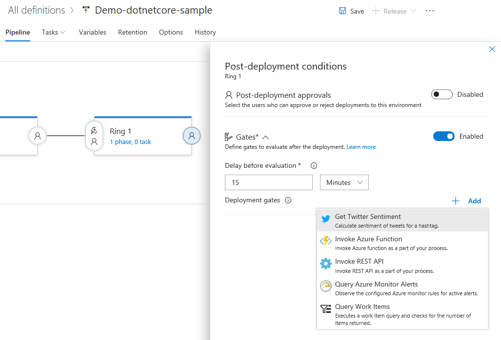
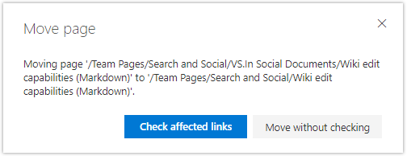

# Deploy to Azure Kubernetes Service (AKS) using DevOps Projects – VSTS Sprint 134 Update

The **Sprint 134 Update** of Visual Studio Team Services (VSTS) brings better support for Ruby, Python, and Java languages in **Build** and even more deployment options to **Release**. One of those options is the addition of [Azure Kubernetes Service (AKS) in Azure DevOps Projects](#deploy-to-azure-kubernetes-service-aks-and-azure-service-fabric-using-azure-devops-projects) to help you get started with containerized applications that are ready for scale. We are also announcing that [release gates](#progressively-expose-and-phase-deployments-using-release-gates-now-generally-available), which has been in preview for the last few months, now becomes generally available to help you automate the control of progressive deployments across environments of a release.

A new version of the [VSTS Demo Generator](#vsts-demo-generator) is also available to make it easy to demo and learn VSTS using a rich set of sample data and configuration.

## What’s new in VSTS

> [!VIDEO https://www.youtube.com/embed/PdK20jBqaPM?rel=0]

## Features

### Work

- [Query for empty rich text fields](#query-for-empty-rich-text-fields)

### Build

- [Build Ruby apps based on a variety of Ruby versions](#build-ruby-apps-based-on-a-variety-of-ruby-versions)
- [Build, test, and publish Python apps based on a variety of Python versions](#build-test-and-publish-python-apps-based-on-a-variety-of-python-versions)
- [Build Java apps on hosted agents with Java 10](#build-java-apps-on-hosted-agents-with-java-10)
- [Leverage improved Xcode build and test output from xcpretty](#leverage-improved-xcode-build-and-test-output-from-xcpretty)

### Release

- [Progressively expose and phase deployments using release gates, now generally available](#progressively-expose-and-phase-deployments-using-release-gates-now-generally-available)
- [Deploy to Azure Kubernetes Service (AKS) and Azure Service Fabric using Azure DevOps Projects](#deploy-to-azure-kubernetes-service-aks-and-azure-service-fabric-using-azure-devops-projects)
- [Deploy to Azure SQL Database using Azure DevOps Projects](#deploy-to-azure-sql-database-using-azure-devops-projects)
- [Release hybrid applications to Azure Stack](#release-hybrid-applications-to-azure-stack)
- [Control Helm version used in Release](#control-helm-version-used-in-release)

### Package

- [Follow packages](#follow-packages)
- [Control who can pull packages from upstream sources](#control-who-can-pull-packages-from-upstream-sources)
- [Change feed settings without having to manually save](#change-feed-settings-without-having-to-manually-save)

### Test

- [Manage test plans using the new Test Plans hub](#manage-test-plans-using-the-new-test-plans-hub)

### Wiki

- [Fix broken links when moving pages](#fix-broken-links-when-moving-pages)

## Work

### Query for empty rich text fields

Find work items that have an empty rich text field, such as Description, using the new **IsEmpty** query operator. This feature was prioritized based on a [suggestion](http://visualstudio.uservoice.com/forums/330519-team-services/suggestions/3080939-introduce-is-empty-operator-in-tfs-wiql-for-rich).

## Build

### Build Ruby apps based on a variety of Ruby versions

Ruby versions 2.3.7, 2.4.4, and 2.5.1 have been added to hosted agents. Set the version of Ruby used by your pipeline by adding the **Use Ruby Version** task to your build steps. The version of Ruby that you specify will be installed from the agent’s tool cache and optionally added to your build’s PATH environment variable. You can even set a range for the version number, such as `>= 2.4`.

> [!div class="mx-imgBorder"]

### Build, test, and publish Python apps based on a variety of Python versions

Python versions 2.7.14, 3.3.7, 3.4.8, 3.5.5, 3.6.4, and 3.7.0-b2 are now available on hosted agents. Set the version of Python used by your pipeline by adding the **Use Python Version** task to your build steps. The version of Python that you specify will be installed from the agent’s tool cache and optionally added to your build’s PATH environment variable. You can even set a range for the version number, such as `>= 3.3`.

> [!div class="mx-imgBorder"]

For the common scenario of testing a Python package on multiple versions of Python, choose the **Python Package** template when creating your build pipeline. It will give you an initial set of steps for running tests on a matrix of Python versions and optionally publishing your package.

> [!div class="mx-imgBorder"]

### Build Java apps on hosted agents with Java 10

The hosted agent machines running Linux, macOS, and Windows now have Java 10 pre-installed. The Ant, Gradle, and Maven build tasks simplify selection of Java 10 and its architecture for your build.

> [!div class="mx-imgBorder"]

### Leverage improved Xcode build and test output from xcpretty

[xcpretty](https://github.com/supermarin/xcpretty) enhances the readability of xcodebuild output and generates test results in JUnit format. The Xcode build task now automatically uses xcpretty when it is available on the agent machine, as it is on hosted macOS agents. Though xcpretty output can be different and less verbose than xcodebuild output, VSTS still makes the full xcodebuild logs available with each build.

## Release

### Progressively expose and phase deployments using release gates, now generally available

Release gates, which enable data-driven approval of deployments, now becomes generally available! Using release gates, you can specify application health criteria that must be met before a release is promoted to the next environment. All the specified gates are periodically evaluated prior to or after any deployment, until they are all successful. Four types of gates are available out of the box and you can add more gates from the [Marketplace](https://marketplace.visualstudio.com/search?term=tag%3AReleaseGates&target=VSTS&category=All%20categories&sortBy=Relevance). You will be able to audit that all the necessary criteria for a deployment were met. See the [documentation for release gates](/azure/devops/pipelines/release/approvals/gates) for more information.

> [!div class="mx-imgBorder"]

### Deploy to Azure Kubernetes Service (AKS) and Azure Service Fabric using Azure DevOps Projects

[Azure Kubernetes Service (AKS)](https://azure.microsoft.com/services/container-service/), a fully managed Kubernetes service in Azure, can now be targeted when starting a new Node.js, .NET Core, or Java-based app in [DevOps Projects](https://azure.microsoft.com/features/devops-projects/). You can also start with your existing application by bringing your own code. Simply select an application language, a runtime, and then AKS. The DevOps Project will create the AKS cluster and set up a continuous delivery pipeline using Helm Charts.

You can also target [Azure Service Fabric](https://azure.microsoft.com/services/service-fabric/) for new .NET Core apps in DevOps Projects. This gives you yet another option to get started on a new project that includes a full DevOps pipeline, whether you want to retain the control of a VM, keep the simplicity of a web app, or optimize for high scale. See the tutorial documentation for [AKS](/azure/devops-project/azure-devops-project-aks) and [Service Fabric](/azure/devops-project/azure-devops-project-service-fabric) documentation for more information.

> [!div class="mx-imgBorder"]

### Deploy to Azure SQL Database using Azure DevOps Projects

[Azure SQL Database](https://azure.microsoft.com/services/sql-database/), a fully managed relational cloud database, can now be targeted in [DevOps Projects](https://azure.microsoft.com/features/devops-projects/), when starting a new .NET app and selecting ASP.NET as runtime. You can add the SQL Database to your .NET app by simply selecting **Add a database**. The DevOps Project will create a sample two-tier, connected application, including a continuous delivery pipeline for both the tiers. See the [tutorial](/azure/devops-project/azure-devops-project-sql-database) documentation for more information.

> [!div class="mx-imgBorder"]

### Release hybrid applications to Azure Stack

Support for **Azure Stack** is out of private preview and now generally available! [Azure Stack](https://azure.microsoft.com/overview/azure-stack/) is an integrated system of software and validated hardware that extends Azure services and capabilities on-premises. You can now have an even more consistent DevOps process that encompasses all elements build, deploy, and test whether you’re running cloud, on-premises, or hybrid applications. No code changes are required&#8212;simply [connect to Azure Stack](/azure/devops/pipelines/library/service-endpoints?view=azure-devops#sep-azure-rm) using the same tools and features as you do for any other deployment target. You’ll now see the **AzureStack** option in the **Environment** field on the **Add Azure Resource Manager Service Endpoint** dialog when adding a new **Service** from project admin settings or a build or release definition. See the [Deploy apps to Azure Stack](/azure/devops/pipelines/targets/azure-stack?view=azure-devops) documentation for more information.

> [!div class="mx-imgBorder"]

### Control Helm version used in Release

The **Helm Tool Installer** task acquires a specific version of Helm from the internet or the tools cache and adds it to the PATH of the agent (hosted or private). Use this task to change the version of Helm used in subsequent tasks such as the **.NET Core cli** task. Adding this task before the **Helm Deploy** task in a build or release definition ensures you are packaging and deploying your app with the right Helm version. This task also helps in optionally installing **kubectl** tool, which is a prerequisite for Helm to work.

## Package

### Follow packages

[Last Update](/azure/devops/release-notes/2018/apr-16-vsts#subscribe-to-package-update-notifications) we released a new package notification type, which allows you to get updates about packages and feeds you care about by setting up a new subscription in the **Notifications** settings. Now, we’ve made it even easier to set up notifications with a new **Follow** button directly on every package. The **Follow** button is also compatible with release views. If you follow a package while looking at it through a view, you’ll only get updates for new versions that are promoted to that view.

### Control who can pull packages from upstream sources

With the new upstream sources feature that was released [last update](/azure/devops/release-notes/2018/apr-16-vsts#use-upstream-nuget-packages-from-elsewhere-in-vsts), you’re now able to use NuGet and npm packages from other teams’ feeds through your feed. As we listened to your feedback, we heard that the current permissions for upstream sources, which require you to be a Contributor to save packages from an upstream, weren’t granular enough in some situations.

This Update we’ve introduced a new role in Package Management called **Collaborator**. A Collaborator can save packages from an upstream source but cannot publish packages directly into the feed (for example, by using `nuget push`). This enables you to restrict package publish to those you trust or to the build system, while allowing your engineers to use new packages from your upstream sources.

### Change feed settings without having to manually save

A few of the interactions on the feed settings page have been improved. Now, changes you make, such as adding an upstream or a permission, are saved immediately. This means you don’t have to worry about losing changes when you switch between settings pivots.

## Test

### Manage test plans using the new Test Plans hub

> [!IMPORTANT]
> To use this capability, you must have the **New Test Plan Experience** [preview feature](/azure/devops/project/navigation/preview-features) enabled on your profile or account.

Introducing the new hub for **Test Plans**! Not only can you add, edit, and delete plans from this page but also find and favorite plans across your team and the project. We pioneered this type of experience in **Dashboards**, **Queries**, and **Plans**. This is another step to bring this consistency across the product.

> [!div class="mx-imgBorder"]

## Wiki

### Fix broken links when moving pages

Broken page links are one of the leading causes of poor page quality in any documentation solution. Previously in **Wiki**, when you moved a page within the tree structure or renamed a page, it could potentially break links to the page from other pages and work items. Now, you can check for and fix links before they get broken.

> [!IMPORTANT]
> Remember to use the `` markdown syntax for links in pages and the **Wiki page** link type in work items to allow **Wiki** to find and fix these potentially broken links. Plain text URLs and hyperlinks in work items won’t get picked up by this feature.

When you rename or move a page, you’ll be prompted to check for affected absolute or relative links.

> [!div class="mx-imgBorder"]

You’ll then be shown a list of the **Page links** and **Work items** affected before you take action.

> [!div class="mx-imgBorder"]

## VSTS Demo Generator

The [Demo Generator](https://azuredevopsdemogenerator.azurewebsites.net/) helps you create projects on your VSTS account with pre-populated sample content, including source code, work items, iterations, service endpoints, plus build and release definitions based on a template you choose. These projects can be used to follow hands-on-labs, demos, and other educational materials.

The latest version offers a simple sign-in, automated installation of extensions, new templates, and support for TFS.

Check out the [documentation](/azure/devops/demo-gen) for step-by-step instructions for using the Generator.

## Next steps and Feedback

> [!div class="nextstepaction"]
> [Go to VSTS](http://go.microsoft.com/fwlink/?LinkId=307137&campaign=o~msft~docs~product-vsts~release-notes)

> [!div class="nextstepaction"]
> [Subscribe to Updates](https://visualstudio.microsoft.com/team-services/release-notes-feed/?feed=release-notes-feed)

We would love to hear what you think about these features. Report a problem or provide a suggestion if you have ideas on things you’d like to see us prioritize, through the feedback menu.

> [!div class="mx-imgBorder"]

You can also get advice and your questions answered by the community on [Stack Overflow](https://stackoverflow.com/questions/tagged/vsts).

Thanks,

Jamie Cool