# Visualize release progress – VSTS Sprint 135 Update

In the **Sprint 135 Update** of Visual Studio Team Services (VSTS), we bring a new way to visualize all your release activity. The new [release progress view](#visualize-release-progress) takes the [graphical release definition editor](/azure/devops/release-notes/2017/jul-14-team-services#new-release-definition-editor-preview) developed last year and lights it up with progress and status so that you can track a release and take actions in full context.

There are a number of other features across Work, Code, Build, Release, and even a few related to authentication. Read about the new features below and head over to VSTS to try them for yourself.

> [!div class="nextstepaction"]
> [Go to VSTS](http://go.microsoft.com/fwlink/?LinkId=307137&campaign=o~msft~docs~product-vsts~release-notes)

## What’s new in VSTS

> [!VIDEO https://www.youtube.com/embed/FDzl0akqCoY?rel=0]

## Features

### Work

- [Import and export Inherited Processes](#import-and-export-inherited-processes)
- [Customize column options in the Work Items hub](#customize-column-options-in-the-work-items-hub)

### Code

- [Receive notifications when pull request policies are bypassed](#receive-notifications-when-pull-request-policies-are-bypassed)
- [Favorite a branch from within a pull request](#favorite-a-branch-from-within-a-pull-request)

### Build and Release

- [Visualize release progress](#visualize-release-progress)
- [Run inline or file-based Python scripts in your pipeline](#run-inline-or-file-based-python-scripts-in-your-pipeline)
- [Use Anaconda tools for data science in your pipeline](#use-anaconda-tools-for-data-science-in-your-pipeline)
- [Simplify definitions with multiple agentless tasks](#simplify-definitions-with-multiple-agentless-tasks)
- [Manage limits on self-hosted, concurrent CI/CD jobs](#manage-limits-on-self-hosted-concurrent-cicd-jobs)
- [Streamline authentication from agent VMs in Azure to Azure Resource Manager](#streamline-authentication-from-agent-vms-in-azure-to-azure-resource-manager)

### Authentication

- [Guard your user account using alternate authentication notifications](#guard-your-user-account-using-alternate-authentication-notifications)

## Work

### Import and export Inherited Processes

A new tool to help you import and export an **Inherited Process** is [now available on GitHub](https://github.com/Microsoft/process-migrator). You can now more easily share configurations with others and gain confidence when making more complicated changes by staging them in a test account before making them in your primary account. We decided to open source this tool, which was developed out of one of our Agile teams, because it serves as an example for how to implement some of our newer APIs plus we want to see how it could be extended to better integrate into real workflows. See the [inheritance process model](/azure/devops/work/customize/inheritance-process-model?view=azure-devops) documentation for more information.

### Customize column options in the Work Items hub

Column Options, like those in Queries, are now available in the Work Items hub to make organizing your most important work items even more personal. This also enables multi-column sorting if you’d like to sort on more than one column. See the [Work Items hub](/azure/devops/work/work-items/view-add-work-items?view=azure-devops) documentation for more information.

> [!div class="mx-imgBorder"]
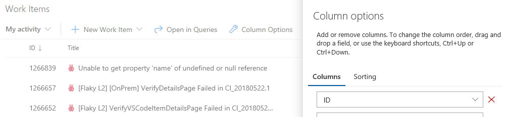

## Code

### Receive notifications when pull request policies are bypassed

For teams that use pull requests (PRs) and [branch policies](/azure/devops/git/branch-policies), there may be occasions when people need to override and bypass those policies - for example, when deploying a hotfix to a production issue in the middle of the night. It makes sense to trust developers to do the right thing and to use the override capability sparingly. At the same time, teams need a way to verify that those policy overrides are being used in the right situations. To support this, we’ve added a new notification filter to allow users and teams to receive email alerts any time a policy is bypassed. Begin with the **A pull request is created or updated** template and select **Policy Bypass** from the list of filters. Select **Policies were bypassed** as the value and you’ll be notified any time a PR is completed, and policies are bypassed.

> [!div class="mx-imgBorder"]
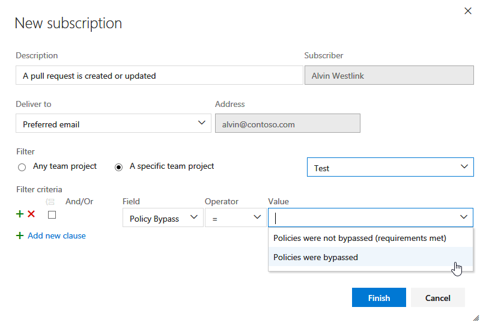

### Favorite a branch from within a pull request

When a viewing a pull request, it’s now easy to mark the source branch as a favorite. Simply click on the star to add it to your list of favorite branches. The branch will then appear under **Mine** on the pull requests screen, saving you the time of searching through the list of **All** branches. See the [manage your branches](/azure/devops/git/manage-your-branches?view=azure-devops) documentation for more information.

## Build and Release

### Visualize release progress

> [!IMPORTANT]
> To use this capability, you must have the **New release progress views** [preview feature](/azure/devops/project/navigation/preview-features) enabled on your profile or account.

A [new release progress view](https://go.microsoft.com/fwlink/?linkid=874485) is now available, which gives you with live updates of deployment progress and one-click access to further details. The new view visualizes the release pipeline, making it easier to understand what’s happening and surfaces appropriate details and actions at different stages of the release.

> [!div class="mx-imgBorder"]
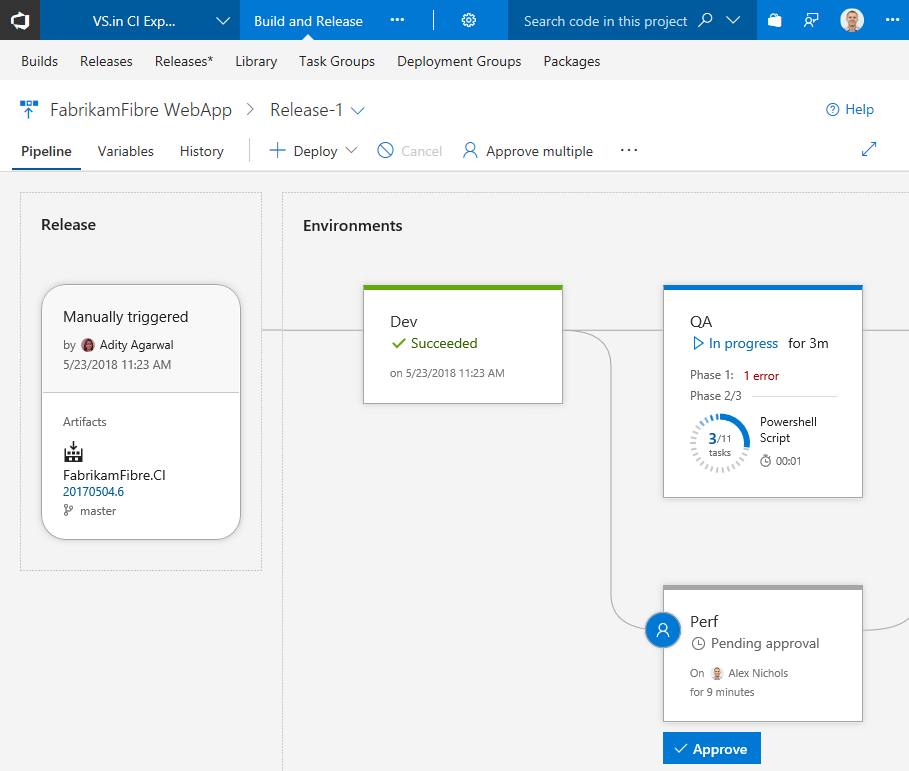

#### Pipeline, release details, and environments

The **Pipeline** view shows the artifacts of the release and the environments where they will be deployed. The **Release** area provides release details such as the release trigger, artifact versions, and tags.

Environments are modeled in a way to help understand their status, along with detailed progress. At any point, you can get to the logs by clicking on the status link within the environment.

> [!div class="mx-imgBorder"]
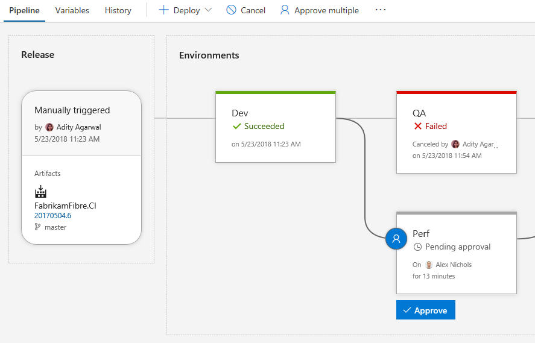

#### Pre-deployment and post-deployment

If pre-deployment or post-deployment conditions have been set for an environment, it is indicated on the environment with the presence of the approvals and gates. The progress of approvals and gates show up in the status of the environment as well. You can take action or view further details by clicking on the environment’s condition icon hanging off the right or left side of the environment.

> [!div class="mx-imgBorder"]
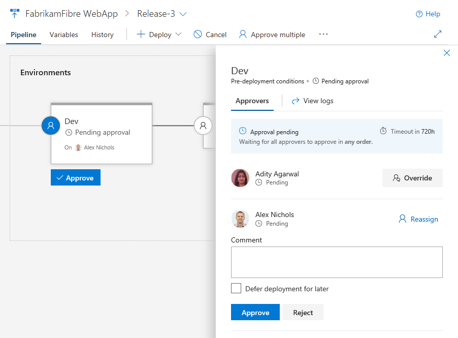

Graphical views of the gates and a quick action to view logs helps to keep releases moving.

> [!div class="mx-imgBorder"]
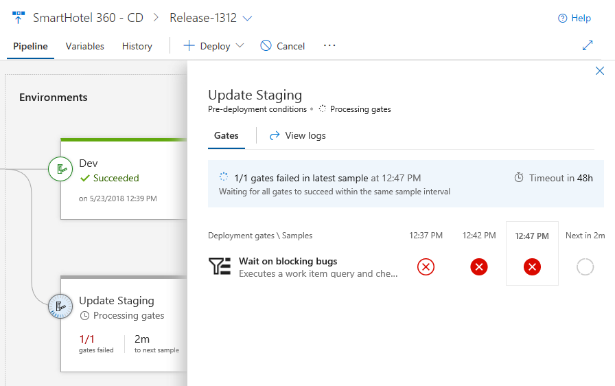

#### Commits and work items

With each new release, you can see the list of associated commits and work items for each environment separately by clicking on the environment. If the list is long, use filters to find a commit or work item you’re interested in.

> [!div class="mx-imgBorder"]
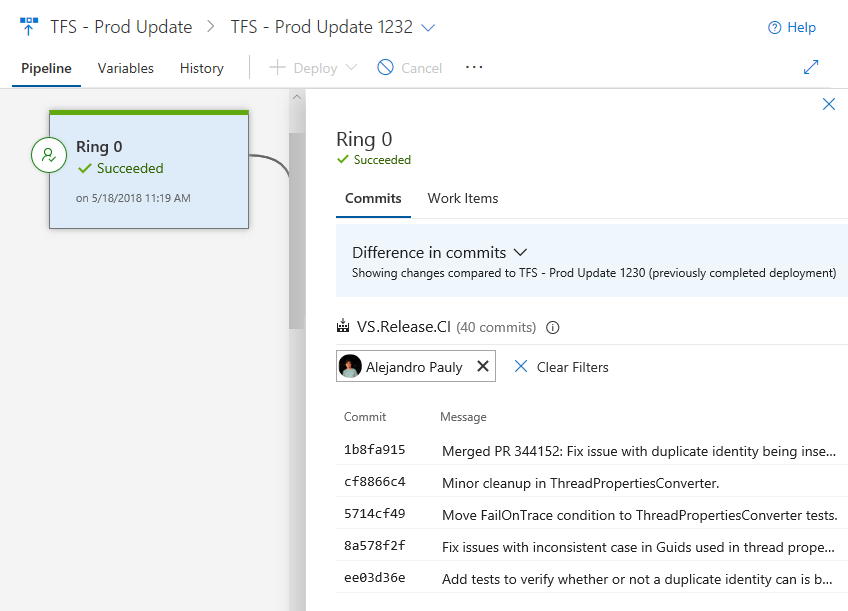

#### Deployment progress and logs

The environments show live updates for in-progress deployments, including how many phases and tasks are complete and the running time. Clicking the environment status opens a view containing the logs, with focus on the what’s currently active.

> [!div class="mx-imgBorder"]
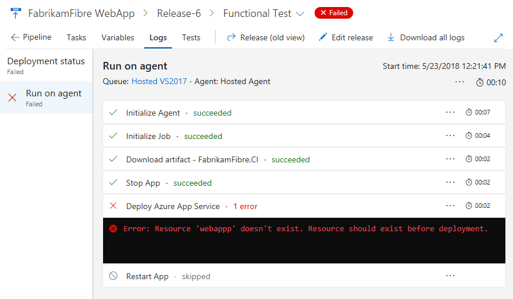

Plus you can click into the logs to enter a focused view, which also will be coming to build and test views soon.

> [!div class="mx-imgBorder"]
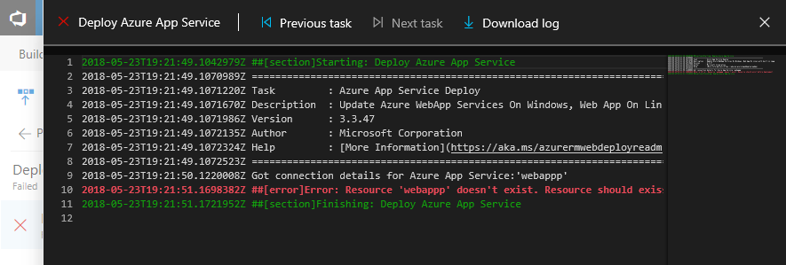

#### Test results and extensibility

Results from test execution are also surfaced for each environment. Clicking on the test results opens a view containing test details including results from other extensions that contribute to the process.

> [!div class="mx-imgBorder"]
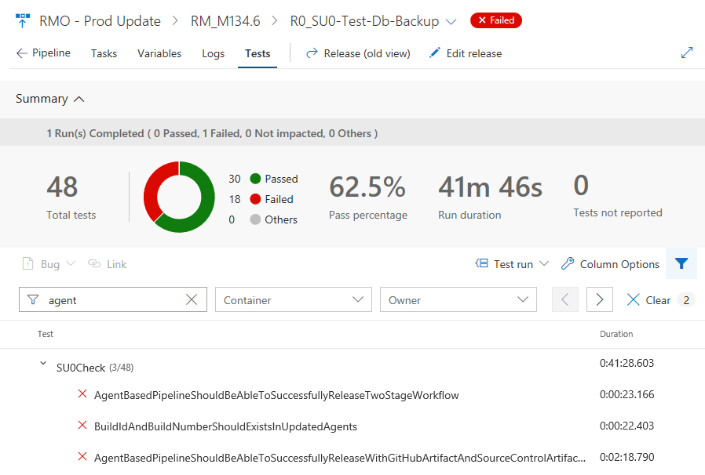

Existing extensions work in this new view, plus there are new extensibility points to allow extensions develops to surface even more information for an environment. See the [contributions and extensions](https://go.microsoft.com/fwlink/?linkid=874486) documentation for more information.

### Run inline or file-based Python scripts in your pipeline

A new [Python Script](/azure/devops/pipelines/tasks#utility) task simplifies running Python scripts in your pipeline. The task will run a script from a Python file (.py) in your repository, or you can manually enter a script in the task’s settings, to save as part of your pipeline. The task will use the version of Python in the path, or you can specify an absolute path to a Python interpreter to use.

### Use Anaconda tools for data science in your pipeline

Miniconda is now available on Microsoft-hosted agents. The [conda](https://www.anaconda.com/distribution/) package and virtual environment manager makes it easy to install, run, and upgrade complex data science and machine learning environments like the SciPy stack, scikit-learn, CNTK, and TensorFlow. It will also install the version of Python that is needed by your pipeline.

The new, built-in [Conda Environment](/azure/devops/pipelines/tasks/package/conda-environment) task also helps you create a conda environment. It activates the environment for subsequent pipeline steps, installs package dependencies, adds conda to the path, and optionally upgrades the agent to the latest version of conda.

### Simplify definitions with multiple agentless tasks

Tasks in an agentless phase are orchestrated by and executed on the server. Agentless phases do not require an agent or any target computers. Unlike agent phases, only one task could be added to each agentless phase in the definitions. This meant multiple phases had to be added when there were more than one agentless task in the process, making the definition bulky. We have relaxed this restriction, which allows you to maintain multiple tasks in an agentless phases. The tasks in the same phase would execute sequentially, just as they do for agent phases. See the [server phases](/azure/devops/pipelines/process/server-phases?view=azure-devops&tabs=yaml) documentation for more information.

### Manage limits on self-hosted, concurrent CI/CD jobs

> [!IMPORTANT]
> If you use self-hosted CI/CD, check your concurrency limits and plan ahead to avoid unexpected build and release wait times.

The pricing model for CI/CD in VSTS is based on the number of concurrent jobs on both self-hosted (private) or Microsoft-hosted agents. Each VSTS account is given a certain free quota of concurrency. Beyond that, you can get additional concurrency through Visual Studio Enterprise subscriptions or the Visual Studio Marketplace.

For the last several months, we have disabled concurrency checks for jobs that you run on self-hosted agents as we redesigned that portion of the service to address customer reported issues. As a result, you were able to run as many jobs concurrently as your self-hosted agents allowed you to.

Starting in June, we will gradually re-enable the concurrency checks for self-hosted jobs. Consequently, your builds and deployments may wait longer in the queue if those slots are occupied by other running jobs. The log page in a build or release will indicate this when you are waiting for other jobs to finish.

You can learn more about concurrency limits in the [CI/CD Concurrent Jobs in Team Services](/azure/devops/pipelines/licensing/concurrent-jobs-vsts) documentation. You can check your concurrency limits in the VSTS by going to Account Settings -> Build and Release -> Resource limits.

### Streamline authentication from agent VMs in Azure to Azure Resource Manager

There are multiple ways to run build and release agents. Running them yourself in Azure just got easier and more secure. Now you can configure Azure Virtual Machines (VM)-based agents with an Azure Managed Service Identity in Azure Active Directory (Azure AD). By giving the Azure VM an assigned identity, you can use its Service Principal information to grant the VM access to any Azure resource that supports Azure AD, such as Key Vault, instead of persisting credentials in VSTS for the endpoint.

For example, if your code needs to call Azure Resource Manager, then you would simply assign the VM’s Service Principal the appropriate role using Role-Based Access Control (RBAC) in Azure AD. See the [build and release agents](/azure/devops/pipelines/agents/agents) and [Azure Managed Service Identity](/azure/active-directory/managed-service-identity/overview) documentation for more information.

> [!div class="mx-imgBorder"]
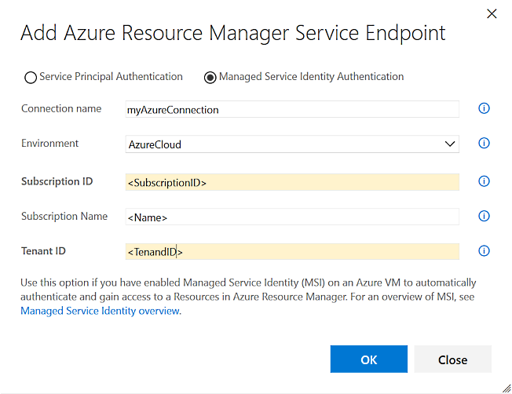

## Notifications

### Guard your user account using alternate authentication notifications

When alternative authentication is setup for your user account, you'll now receive a notification that confirms the change. This can be helpful to double-check that you've made the change correctly, but it can also serve as an early signal that your user account may have been compromised if you didn't make the change. In that case, you can take action to regain control over your user account and remove any suspect alternative authentication configurations. There are 3 scenarios where notifications are sent:

1. Creation of a personal access token (PAT)
2. Registering an SSH key
3. Enabling basic authentication

See the [authentication](/azure/devops/organizations/security/about-security-identity?view=azure-devops#authentication) documentation for more information.

> [!div class="mx-imgBorder"]
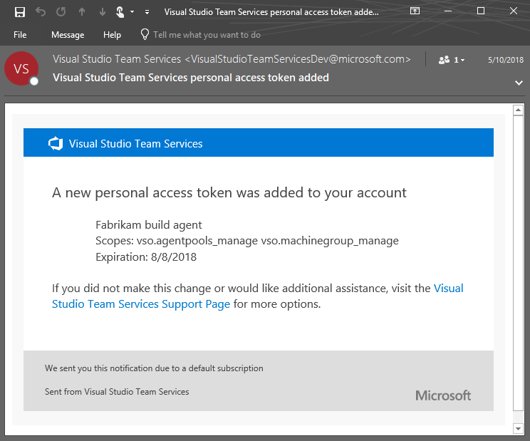

## Feedback

We would love to hear what you think about these features. Report a problem or provide a suggestion if you have ideas on things you’d like to see us prioritize, through the feedback menu.

> [!div class="mx-imgBorder"]

You can also get advice and your questions answered by the community on [Stack Overflow](https://stackoverflow.com/questions/tagged/vsts).

Thanks,

Jamie Cool