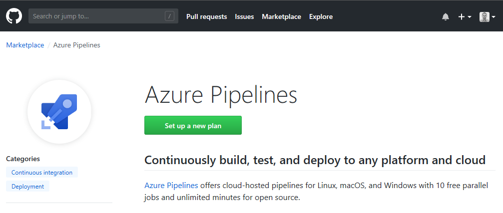
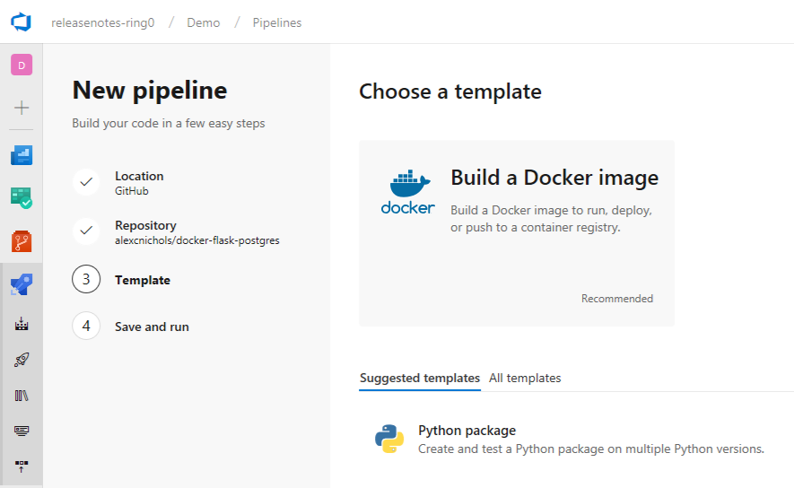
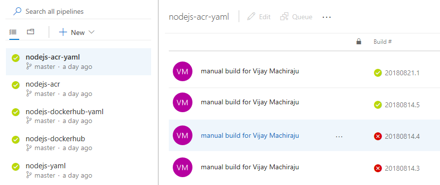
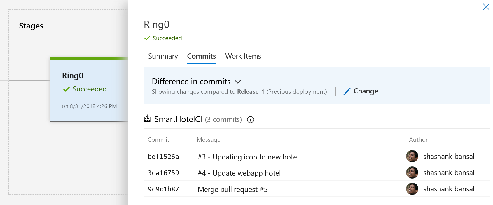
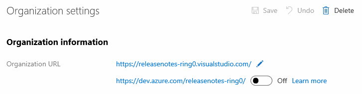
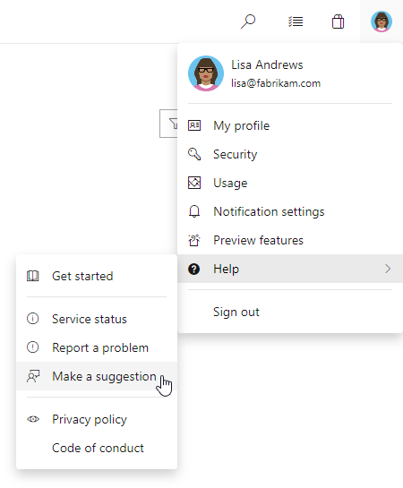

# Introducing Azure DevOps

The single service that was Visual Studio Team Services (VSTS) is now becoming our new set of [Azure DevOps](https://azure.microsoft.com/services/devops/) services. Throughout our documentation, websites, and in-product you'll start to notice new icons and names for Azure DevOps all up and each of our services within Azure DevOps.

- [**Azure Pipelines**](https://azure.microsoft.com/services/devops/pipelines/) to continuously build, test, and deploy to any platform and cloud.
- [**Azure Boards**](https://azure.microsoft.com/services/devops/boards/) for powerful work management.
- [**Azure Artifacts**](https://azure.microsoft.com/services/devops/artifacts/) for Maven, npm, and NuGet package feeds.
- [**Azure Repos**](https://azure.microsoft.com/services/devops/repos/) for unlimited cloud-hosted private Git repos.
- [**Azure Test Plans**](https://azure.microsoft.com/services/devops/test-plans/) for planned and exploratory testing.

With the launch of Azure Pipelines, we've introduced a [new app to the GitHub Marketplace](#add-azure-pipelines-from-the-github-marketplace), refreshed a number of the experiences to help you get started, and offers [unlimited CI/CD minutes and 10 parallel jobs](#build-open-source-projects-with-azure-pipelines-for-free) for open source projects.

Check out the [Features](#features) list below for more.

## Features

Azure Pipelines:

- [Add Azure Pipelines from the GitHub Marketplace](#add-azure-pipelines-from-the-github-marketplace)
- [Build open source projects with Azure Pipelines for free](#build-open-source-projects-with-azure-pipelines-for-free)
- [Configure builds using YAML](#configure-builds-using-yaml)
- [Create YAML build pipelines using the new wizard](#create-yaml-build-pipelines-using-the-new-wizard)
- [Manage build pipelines using the new Builds page](#manage-build-pipelines-using-the-new-builds-page)
- [Rebuild GitHub pull request builds](#rebuild-github-pull-request-builds)
- [New build status badge URL](#new-build-status-badge-url)
- [Leverage even more tools on Microsoft-hosted Linux agents](#leverage-even-more-tools-on-microsoft-hosted-linux-agents)
- [Track GitHub commits and associated issues in releases](#track-github-commits-and-associated-issues-in-releases)
- [Manage build and deployment completion emails better using improved formatting](#manage-build-and-deployment-completion-emails-better-using-improved-formatting)
- [Follow the new unified Azure Pipelines terminology](#follow-the-new-unified-azure-pipelines-terminology)

Marketplace:

- [Leverage the latest extension categories](#leverage-the-latest-extension-categories)

Administration:

- [Switch existing organizations to use the new domain name URL](#switch-existing-organizations-to-use-the-new-domain-name-url)
- [Add Stakeholder users to save on Azure Pipelines license costs](#add-stakeholder-users-to-save-on-azure-pipelines-license-costs)

## Next steps

> [!NOTE]
> These features will be rolling out over the next couple of days.

Read about the new features below and head over to Azure DevOps Services to try them for yourself.

> [!div class="nextstepaction"]
> [Go to Azure DevOps Services](http://go.microsoft.com/fwlink/?LinkId=307137&campaign=o~msft~docs~product-vsts~release-notes)

## Azure Pipelines

### Add Azure Pipelines from the GitHub Marketplace

A new **Azure Pipelines** app [in the GitHub Marketplace](https://github.com/marketplace/azure-pipelines/) expands integration with GitHub repositories and streamlines parallel job purchases.

Previously, you could enable continuous integration with GitHub repositories through OAuth authentication. Using OAuth, Azure Pipelines uses __an individual's GitHub identity__ to fetch code and update build status on GitHub. However, since the members of your team may change over time, it can be less-desirable to use an individual’s GitHub identity and permissions. By installing the Azure Pipelines app, you can authorize **the app** to perform actions instead.

Also, when you use the app, build results are made available in GitHub’s new [Checks](https://blog.github.com/2018-05-07-introducing-checks-api/) feature with a detailed view of build, test, and code coverage results.

To get started, install the app [from the GitHub Marketplace](https://github.com/marketplace/azure-pipelines/) into your GitHub account or organization. You can also purchase additional parallel jobs with an existing GitHub payment account instead of a separate Azure account. Pricing is the same either way.

> [!div class="mx-imgBorder"]

### Build open source projects with Azure Pipelines for free

Azure Pipelines provides cloud-hosted pipelines for Linux, macOS, and Windows with unlimited minutes and 10 free parallel jobs for open source.

See the [build public repositories](/azure/devops/pipelines/build/ci-public?toc=%2Fvsts%2Forganizations%2Fpublic%2Ftoc.json&bc=%2Fvsts%2Forganizations%2Fpublic%2Fbreadcrumb%2Ftoc.json&view=azure-devops&tabs=github) and [parallel jobs](/azure/devops/pipelines/licensing/concurrent-jobs-vsts?view=azure-devops) documentation for more information.

### Configure builds using YAML

> [!IMPORTANT]
> To use this capability, you must have the **Build YAML pipelines** [preview feature](/azure/devops/project/navigation/preview-features) enabled on your organization.

YAML-based build pipelines are now broadly available. Automate your continuous integration pipeline using a [YAML file checked into the repository](/azure/devops/pipelines/get-started-yaml?view=azure-devops) alongside the rest of your code. It's easy to get started with a single-job build. As your needs grow, easily scale out using [multiple jobs](/azure/devops/pipelines/process/multiple-phases?tabs=yaml&view=azure-devops), [external templates](/azure/devops/pipelines/yaml-schema?view=azure-devops#step-template), and [matrix execution](/azure/devops/pipelines/process/phases?view=azure-devops&tabs=yaml#multi-configuration).

### Create YAML build pipelines using the new wizard

> [!IMPORTANT]
> To use this capability, you must have the **New YAML pipeline creation experience** [preview feature](/azure/devops/project/navigation/preview-features) enabled on your profile or organization.

A new wizard simplifies this process of creating YAML-based build pipelines with GitHub and Azure Repos. Once you choose a repository to build, a pipeline will automatically be created if it contains a YAML file. Otherwise, Azure Pipelines will analyze your repository and recommend a YAML-based template for building your project. Just click **Save and run** to create a pull request for the suggested YAML and run the first build. Continuous integration and pull request triggers will be enabled automatically.

> [!div class="mx-imgBorder"]

### Manage build pipelines using the new Builds page

> [!IMPORTANT]
> To use this capability, you must have the **New builds hub** [preview feature](/azure/devops/project/navigation/preview-features) enabled on your profile or organization.

We are making several improvements and rolling out a new version of the **Builds** page. This new version combines the directory of all your build pipelines and the list of current builds so that you can quickly navigate across your project's builds to see their status. It also includes a preview of test analytics for the selected pipeline.

> [!div class="mx-imgBorder"]

### Rebuild GitHub pull request builds

When you submit a pull request to your GitHub repository, the pull request build could fail due to an intermittent failure, such as a package registry being unavailable or a flaky test. In these cases, you would want to run the build one more time. Currently, this requires you to push another artificial update to the pull request. Now, in the [new **Builds** page](#manage-build-pipelines-using-the-new-builds-page) you can simply select the failed build and queue another one.

This gesture to rebuild will only be available for pull request builds to start with. We are looking into making a similar feature available for all failed builds.

### New build status badge URL

Build badges embedded into the homepage of a repository are a common way to show the health of the repository. We added new URLs to help you construct build badges. The new URLs allow users to publish a per-branch status and can take users to the latest build of the selected branch. You can get the Markdown for the new status badge URL by selecting the **Status badge** menu action in the [new **Builds** page](#manage-build-pipelines-using-the-new-builds-page). For backward compatibility, we will continue to honor the older build badge URLs.

### Leverage even more tools on Microsoft-hosted Linux agents

In this update, several build, test, and deployment tools have been added to the [Microsoft-hosted Linux agents](/azure/devops/pipelines/agents/hosted?view=azure-devops#software), which removes the need to install them yourself during a build or release.

- Erlang/OTP
- Firefox
- Haskell
- Heroku CLI
- ImageMagick
- Mercurial
- Microsoft SQL Server Client Tools
- MySQL Server
- PhantomJS
- Pollinate
- PyPy2 and PyPy3
- rebar
- rsync
- ShellCheck
- Sphinx
- Terraform
- Xvfb

### Track GitHub commits and associated issues in releases

Knowing the changes that are getting deployed with a release is important to track improvements to the app. Now you can get the list of commits made in GitHub repos and the associated GitHub issues that are being deployed with a release.

> [!div class="mx-imgBorder"]

### Manage build and deployment completion emails better using improved formatting

Build and deployment completion emails have been updated to be more filterable by email rules. Now the subject line includes more relevant information at a glance, the body contains more details, and their styling has been refreshed with the latest brand.

Elements of the new format are:

- `[Build result] [pipeline name] - [repository:branch] - [project name] - [commit]`
- `[Deployment result] [pipeline name] > [release name] : [stage name]`

Here are a few examples:

- `[Build succeeded] IdentityService.CI - MyRepo:master - MyProject - d3b90b80`
- `[Deployment succeeded] New release pipeline > NotificationSpecialRelease-1 : Stage 1`

### Follow the new unified Azure Pipelines terminology

Throughout builds and releases, different terms have been used historically for similar concepts. In other cases, meanings of terms were vague. For example, telling the difference between an **agent pool** and an **agent queue**.

Terminology has been unified in Azure Pipelines to clarify its concepts. You'll now see the following unified terms:

Previous term | Unified term | Meaning
--------------- | -------------- | ----------
Hosted agent | Microsoft-hosted agent | A build/release agent that runs on cloud-hosted infrastructure managed by Microsoft.
Private agent | Self-hosted agent | A build/release agent that runs on a machine provided and managed by you.
Agent pool | Agent pool | An organization-level set of agent machines that can run builds or releases.
Agent queue | Agent pool | A project-level set of agent machines that can run builds or releases. It is linked to an organization-level agent pool.
Build definition | Build pipeline | An end-to-end set of build steps for an application.
Build | Build | An instance of a build pipeline that is running or has run.
Phase | Job | A series of tasks that run sequentially or in parallel on an agent. A build or release pipeline can contain one job or a graph of multiple jobs.
Release definition | Release pipeline | An end-to-end set of release steps for an application to be deployed across various stages.
Release | Release | An instance of a release pipeline that is running or has run.
Environment | Stage | A logical and independent entity that represents where you want to deploy a release generated from a release pipeline.
Concurrent job/pipeline | Parallel job |  A parallel job gives you the ability to run a single build or release job at a time in your organization. With more parallel jobs available, you can run more build and release jobs at the same time.
Service endpoint | Service connection | A group of settings, such as credentials, used to connect to external services to execute tasks in a build or release.

See the [Concepts](/azure/devops/pipelines/?view=azure-devops#concepts) documentation for more information.

## Marketplace

### Leverage the latest extension categories

As an extension contributor you will notice that extension categories have been aligned to match the renamed Azure DevOps services in the [Marketplace](https://marketplace.visualstudio.com/vsts). Although the previous categories have been automatically mapped to the new ones, we recommend switching to the new categories by updating your extension's manifest. See the [Manifest](/azure/devops/extend/develop/manifest?view=azure-devops#required-attributes) documentation for more information.

## Administration

### Switch existing organizations to use the new domain name URL

Although we've moved to the new `dev.azure.com` domain name as the URL for new organizations, you'll be able to continue accessing your organization using the `visualstudio.com` domain, as usual. If you'd like to change your URL to be based on `dev.azure.com`, an organization administrator (Project Collection Administrator) can change this from the organization settings page. Although adopting the new domain name won't redirect every request, any request to the root URL of the organization and links from many email and web-based links will change.

> [!div class="mx-imgBorder"]

We will make the move to the new URL gradually based on customer feedback. It will start as opt-in, then later we will make it the default for organizations. We have yet to set a timeline for deliberately moving organizations away from the `visualstudio.com` domain.

> [!IMPORTANT]
> To ensure your organization works with any existing firewall or IP restrictions, ensure that the appropriate domain names and IP addresses are allowed. See this [agent Q&A section](/azure/devops/pipelines/agents/v2-linux?view=azure-devops#im-running-a-firewall-and-my-code-is-in-azure-repos-what-urls-does-the-agent-need-to-communicate-with) for more information.

### Add Stakeholder users to save on Azure Pipelines license costs

> [!IMPORTANT]
> To use this capability, you must have the **Free access to Pipelines for Stakeholders** [preview feature](/azure/devops/project/navigation/preview-features) enabled on your organization.

Good news! If you are only using the Azure Pipelines service, you do not have to pay for users anymore through Basic licenses. All features of Azure Pipelines are available for free to all users. As you add more users to your project, let them remain as Stakeholders for free, and they will be able to create, view, update, and approve pipelines, provided they have the appropriate permissions. Here are some additional notes on this licensing change:

- You only pay for additional parallel jobs in Azure Pipelines. Users are unlimited.
- All access to Azure Pipelines features is still governed through a security and permissions model.
- If you use other Azure DevOps services, you still have to pay a per-user license for those services after the free limits.
- In existing organizations, Stakeholders do not get the free Azure Pipelines benefit by default. Your organization administrator (Project Collection Administrator) has to explicitly enable this preview feature. Enabling this preview feature will change the behavior of what Stakeholders can do. Currently, they cannot manage builds or releases. But, once the preview feature is enabled, there is no difference between Basic users and Stakeholders in Azure Pipelines. It is for this reason that the choice of allowing Stakeholders to be treated as free Azure Pipelines users is left to your administrator.

See the [Provide Stakeholders access to edit build and release pipelines](/azure/devops/organizations/security/provide-stakeholder-pipeline-access) documentation for more information.

## Feedback

We would love to hear what you think about these features. Use the feedback menu to report a problem or provide a suggestion.

> [!div class="mx-imgBorder"]

You can also get advice and your questions answered by the community on [Stack Overflow](https://stackoverflow.com/questions/tagged/vsts).

Thanks,

Jeremy Epling