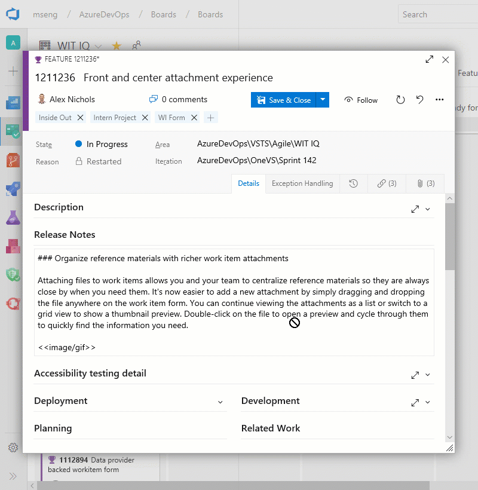
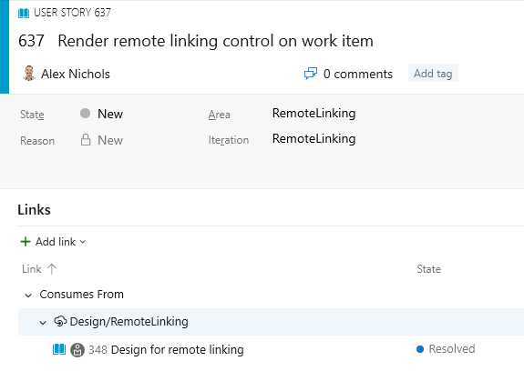
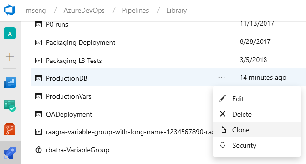
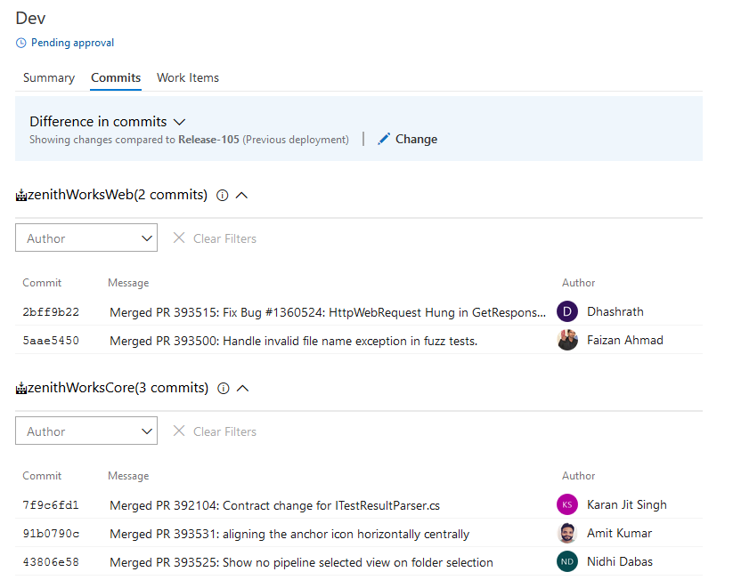
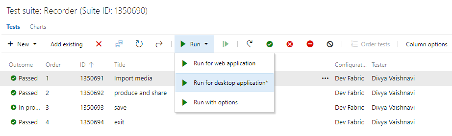
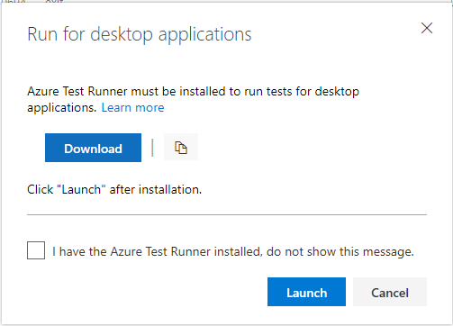

# YAML improvements in Azure Pipelines - Sprint 142 Update

In the **Sprint 142 Update** of Azure DevOps, there have been several improvements to YAML, such as [adding custom counters to your builds](#add-custom-build-counters-to-your-builds), [specifying branches to build for pull requests](#use-yaml-to-specify-branches-to-build-for-pull-requests), and [using templates inline](#use-yaml-template-expressions-inline). We have also [turned on the new navigation for all users](#new-navigation-is-on-for-all-users), introduced a [dark theme](#dark-theme), and improved the [linking](#manage-dependencies-by-linking-work-items-across-your-organizations) and [attachments](#organize-reference-materials-with-richer-work-item-attachments) experiences in Azure Boards.

Check out the [Features](#features) list below for more.

## Features

General:

- [New navigation is on for all users](#new-navigation-is-on-for-all-users)
- [Dark Theme](#dark-theme)

Azure Boards:

- [Organize reference materials with richer work item attachments](#organize-reference-materials-with-richer-work-item-attachments)
- [Manage dependencies by linking work items across your organizations](#manage-dependencies-by-linking-work-items-across-your-organizations)
- [Open work items from search](#open-work-items-from-search)

Azure Repos:

- [Extension authors can query context about the current repo](#extension-authors-can-query-context-about-the-current-repo)

Azure Pipelines:

- [Add custom build counters to your builds](#add-custom-build-counters-to-your-builds)
- [Use YAML to specify branches to build for pull requests](#use-yaml-to-specify-branches-to-build-for-pull-requests)
- [Use YAML template expressions inline](#use-yaml-template-expressions-inline)
- [Improve troubleshooting with the pipeline initialization log](#improve-troubleshooting-with-the-pipeline-initialization-log)
- [Default retention for YAML pipelines](#default-retention-for-yaml-pipelines)
- [Build on Linux/ARM and Windows 32-bit platforms](#build-on-linuxarm-and-windows-32-bit-platforms)
- [Clone variable groups](#clone-variable-groups)
- [See commits and work items for all linked sources](#see-commits-and-work-items-for-all-linked-sources)
- [Run from Package supported in Azure App Service deployments](#run-from-package-supported-in-azure-app-service-deployments)
- [Deploy Linux containers with the App Server Deploy task](#deploy-linux-containers-with-the-app-server-deploy-task)

Azure Test Plans:

- [Azure Test Runner client to run manual tests for desktop applications](#azure-test-runner-client-to-run-manual-tests-for-desktop-applications)

Azure Artifacts:

- [Public preview of Pipeline Artifacts](#public-preview-of-pipeline-artifacts)

Wiki:

- [Publish code as wiki with Contribute permissions](#publish-code-as-wiki-with-contribute-permissions)

Administration:

- [PATs enforce CAP](#pats-enforce-cap)

## General

### New navigation is on for all users

We've turned our new navigation on for all users! This is a major milestone in rolling out our new product design. While we are moving everyone to the new navigation model with this release, users will still be able to opt out and use the old navigation until January 16, 2019. You can opt out by selecting **Preview features** from the menu underneath your avatar in the top right of every page.

See the [Navigation Update](https://aka.ms/vstsnewnav) blog post for more information.

### Dark Theme

One of our long-standing feature requests has been to offer a dark theme. We're happy to let you know that this is now available as part of the new navigation. You can turn on dark theme by selecting **Theme** from the menu underneath your avatar in the top right of every page.

> [!div class="mx-imgBorder"]


## Azure Boards

### Organize reference materials with richer work item attachments

Attaching files to work items allows you and your team to centralize reference materials so they are always close by when you need them. It's now easier to add a new attachment by simply dragging and dropping the file anywhere on the work item form. You can continue viewing the attachments as a list or switch to a grid view to show a thumbnail preview. Double-click on the file to open a preview and cycle through them to quickly find the information you need.

> [!div class="mx-imgBorder"]


### Manage dependencies by linking work items across your organizations

Linking related or dependent work gives you broader context into the work you're tracking and helps you manage dependencies with other teams. With links for remote work, now you can keep track of work across organizations within your company. Simply copy the URL of an existing work item, go to another work item, and create a link using one of the three new link types: Consumes From, Produces For, and Remote Related. See the [work item linking](/azure/devops/boards/queries/link-work-items-support-traceability?view=azure-devops&tabs=new-web-form) documentation for more information about traceability in Azure Boards.

> [!NOTE] 
> Permissions are respected across both Azure DevOps organizations, which must both be backed by the same Azure AD tenant.

> [!div class="mx-imgBorder"]


As you begin to manage several dependencies, use the new **Remote Link Count** field in **Queries** to list the work items that have remote dependencies in your project, or consider installing the [Dependency Tracker](https://marketplace.visualstudio.com/items?itemName=ms-eswm.dependencytracker) extension. This extension, which was created by the Windows group at Microsoft to meet their scale needs, builds upon remote links to display a rich hierarchy and graphical representation of your dependencies.
​
### Open work items from search

Previously, a work item couldn't be opened from the search results page if the work item preview pane was turned off. This would make it difficult to dig into your search results. Now you can click on the work item title to open the work items in a modal window. This feature was prioritized from [UserVoice](https://visualstudio.uservoice.com/forums/330519-azure-devops-formerly-visual-studio-team-services/suggestions/33988486-open-item-from-search).

## Azure Repos

### Extension authors can query context about the current repo

One of the challenges for an author of a version control extension is to get the context of the repository being displayed to the user, such as the name, ID and URL. To help with this, we added the VersionControlRepositoryService as an extension-accessible service. Using this, an extension author can query for information about the current Git repository context within the Web UI. It currently has one method, getCurrentGitRepository().
* If a Git repository is selected, a GitRepository object is returned with basic data about the repository (name, ID, and URL)
* If a TFVC repository is selected or the service is accessed outside the Azure Repos pages, null will be returned.

Here is a [sample extension](https://github.com/eldarerathis/vsts-extension-samples/commit/e9935324046846c23973fca284661d2b767985a3) that uses this service.

## Azure Pipelines

### Add custom build counters to your builds

Build counters provide a way to uniquely number and label builds. Previously, you could use the $(rev:r) special variable to accomplish this. Now you can define your own counter variables in your build definition that are auto-incremented every time you run a build. You do this on the variables tab of a definition. This new feature gives you more power in the following ways:

* You can define a custom counter and set its seed value. For instance you can start your counter at 100. $(rev:r) always starts at 0.
* You can use your own custom logic to reset a counter. $(rev:r) is tied to build number generation, and it is auto-reset whenever there is a new prefix in the build number.
* You can define multiple counters per definition.
* You can query for the value of a counter outside of a build. For instance, you can count the number of builds that have run since last reset using a counter.

See the documentation on [User-defined variables](https://docs.microsoft.com/azure/devops/pipelines/process/variables?view=azure-devops&tabs=yaml%2Cbatch#user-defined-variables) for more information about build counters.

### Use YAML to specify branches to build for pull requests

YAML pipelines can specify which branches to build for PRs (pull requests). You can choose branches to include and exclude. This ability was previously available in the web UI. By moving it to the YAML file, it becomes part of your config-as-code workflow.

An example of using PR triggers might look like:

```yaml
pr:
  branches:
    include:
    - features/*
    exclude:
    - features/experimental/*
  paths:
    include:
    - **/*.cs

steps:
- script: echo My PR build!
```

### Use YAML template expressions inline

YAML templates are a powerful way to reuse parts of pipelines. In addition to factoring out common code, template expressions let you change values and control what YAML is included. Until now, a template expression had to occupy the entire value in a YAML expression. This example would work because the expression is the entire value of the **solution** property.

```yaml
- task: msbuild@1
  inputs:
    solution: ${{ parameters.solution }}
```

We've now relaxed the restriction and allow inline templates like you see in the example below.

```yaml
- script: echo The solution file is ${{ parameters.solution }}
```

### Improve troubleshooting with the pipeline initialization log

When a pipeline runs, Azure Pipelines has to ensure the pipeline definition is correct, decide what jobs to schedule, request agents to run the jobs, and more. Until now, this process was completely opaque, so when things went wrong, it was almost impossible for a customer to troubleshoot the problem. We're introducing a new kind of log, called the pipeline initialization log, which makes these details visible. You can access the pipeline initialization log by choosing the **Download all logs** option on a completed build.

### Default retention for YAML pipelines

We are working on a way for users to configure retention policies for YAML pipelines. Until this new feature is available, we have increased the default retention for all YAML builds to 30 days since many users want to keep their builds around for longer than our previous 10 day default retention. We removed the retention tab in the editor for YAML pipelines until the new model is in place.

### Build on Linux/ARM and Windows 32-bit platforms

The Azure Pipelines [open source, cross-platform agent](https://github.com/Microsoft/azure-pipelines-agent) has always been supported on 64-bit (x64) Windows, macOS, and Linux. This sprint, we’re introducing two new supported platforms: [Linux/ARM and Windows/32-bit](https://github.com/Microsoft/azure-pipelines-agent/releases/tag/v2.141.0). These new platforms give you the ability to build on less-common, but no less important, platforms such as the Raspberry Pi, a Linux/ARM machine.

### Clone variable groups

We have added support for cloning variable groups. Whenever you want to replicate a variable group and just update few of the variables, you don't need to go through the tedious process of adding variables one by one. You can now quickly make a copy of your variable group, update the values appropriately, and save it as a new variable group. 

> [!div class="mx-imgBorder"]


> [!NOTE] 
> The secret variable values are not copied over when you clone a variable group. You need to update the encrypted variables and then save the cloned variable group.

### See commits and work items for all linked sources

Continuing our commitment towards improved traceability, we are happy to announce that customers can now see the commit and work items details for all the artifacts linked to the pipeline. By default, the commit and work item is compared with the last deployment to the same stage. However, you can compare with any other previous deployment if needed.

> [!div class="mx-imgBorder"]


### Run from Package supported in Azure App Service deployments

The Azure App Service Deploy task (4.*) version now supports [RunFromPackage](https://docs.microsoft.com/azure/azure-functions/run-functions-from-deployment-package) (previously called [RunFromZip](https://github.com/Azure/app-service-announcements/issues/110).

App Service supports a number of different techniques to deploy your files such as msdeploy (aka WebDeploy), git, ARM and more. But all these techniques have a limitation. Your files are deployed under your wwwroot folder (specifically d:\home\site\wwwroot) and the runtime then runs the files from there. 

With Run From Package, there is no longer a deployment step which copies the individual files to wwwroot. Instead, you just point it to a zip file, and the zip gets mounted on wwwroot as a read-only file system. This has several benefits:
* Reduces the risk of file copy locking issues.
* Can be deployed to a production app (with restart).
* You can be certain of the files that are running in your app.
* Improves the performance of Azure App Service deployments.
* May reduce cold-start times, particularly for JavaScript functions with large npm package trees.

### Deploy Linux containers with the App Server Deploy task

The 4.* version of the Azure App Service Deploy task now supports deploying your own custom container to [Azure Functions on Linux](https://blogs.msdn.microsoft.com/appserviceteam/2017/11/15/functions-on-linux-preview/). 

The Linux hosting model for Azure Functions is based on Docker containers which bring greater flexibility in terms of packaging and leveraging app specific dependencies. Functions on Linux can be hosted in 2 different modes:

1. **Built-in container image:** You bring the Function App code and Azure provides and manages the container (built-in image mode), so no specific Docker related knowledge is required. This is supported in the existing version of App Service Deploy task.
2. **Custom container image:** We have enhanced the App Service Deploy task to support deploying custom container images to Azure Functions on Linux. When your functions need a specific language version or require a specific dependency or configuration that isn't provided within the built-in image, you can build and deploy a custom image to Azure Function on Linux by using Azure Pipelines.

## Azure Test Plans

### Azure Test Runner client to run manual tests for desktop applications

You can now use the Azure Test Runner (ATR) client to run manual tests for desktop applications. This will help you move from Microsoft Test Manager to Azure Test Plans. Please refer to our guidance [here](/azure/devops/test/mtm/guidance-mtm-usage?view=azure-devops). Using the ATR client, you can run your manual tests and record the test results for each test step. You also have data collection capabilities such as screenshot, image action log, and audio video recording. If you find an issue when testing, use Test Runner to create a bug with test steps, screenshots, and comments automatically included in the bug.  

ATR requires a one-time download and install of the runner. Select **Run for desktop application** as shown below. 

> [!div class="mx-imgBorder"]


> [!div class="mx-imgBorder"]


## Azure Artifacts

### Public preview of Pipeline Artifacts

We are releasing a public preview of Pipeline Artifacts, a new highly scalable artifact type designed for use with Azure Pipelines. Pipeline Artifacts is based on the same technology used by the recently announced [Universal Packages](https://docs.microsoft.com/azure/devops/release-notes/2018/sprint-140-update#store-artifacts-using-universal-packages) feature and can dramatically reduce the time it takes to store build outputs for large enterprise class builds.

## Wiki

### Publish code as wiki with Contribute permissions

Earlier, only users having **Create Repository** permission on a git repository were able to publish code as wiki. This made the repository administrators or creators a bottleneck for any requests to publish markdown files hosted in git repos as wikis. Now, you can **Publish code as wiki** if you just have **Contribute permission** on the code repository.

## Administration

### PATs enforce CAP

In February 2017, we announced [support for Azure Active Directory Conditional Access Policy (CAP)](https://docs.microsoft.com/vsts/release-notes/2017/feb-15-team-services#support-for-aad-conditional-access), but there was a limitation that alternate authentication mechanisms, such as personal access tokens, would not enforce CAP. We are happy to announce that we have filled this gap and Azure DevOps will now honor CAP IP fencing policies when using PATs, SSH keys, alternate authentication credentials and OAuth. Administrators don't need to do anything to take advantage of this feature. It will automatically be applied for all existing policies.

## Next steps

> [!NOTE]
> These features will be rolling out over the next two to three weeks.

Read about the new features below and head over to Azure DevOps to try them for yourself.

> [!div class="nextstepaction"]
> [Go to Azure DevOps](http://go.microsoft.com/fwlink/?LinkId=307137&campaign=o~msft~docs~product-vsts~release-notes)

## Feedback

We would love to hear what you think about these features. Use the feedback menu to report a problem or provide a suggestion.

> [!div class="mx-imgBorder"]


You can also get advice and your questions answered by the community on [Stack Overflow](https://stackoverflow.com/questions/tagged/vsts).

Thanks,

Aaron Bjork

