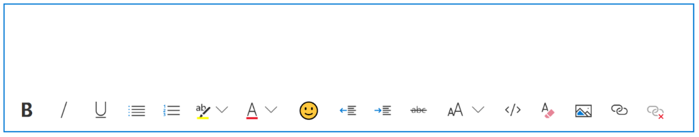
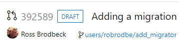
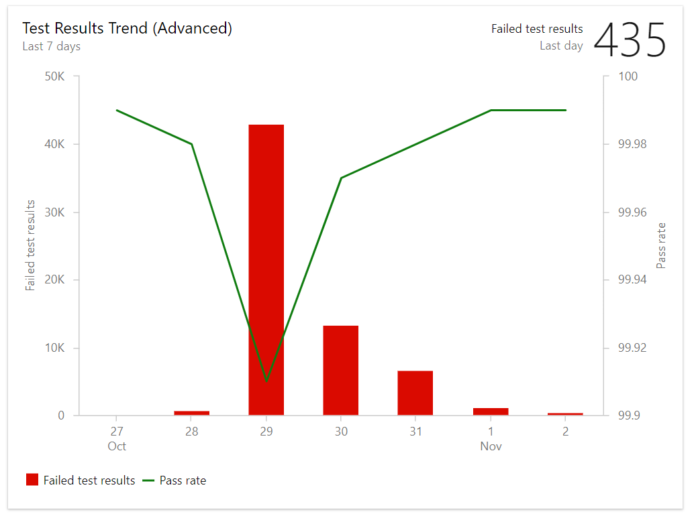

# Draft pull requests and new work item text editor - Sprint 143 Update

In the **Sprint 143 Update** of Azure DevOps, we are introducing a [new work item text editor](#new-work-item-text-editor) that is much more powerful and easier to use. This is part of our effort to modernize and improve the experience across the product. In Azure Repos, [draft pull requests](#draft-pull-requests) allow you to create a pull request that you are not yet ready to complete, so they can't be completed accidentally. We are also releasing some new features in Azure Artifacts, including the ability to [exclude files in artifact uploads](#exclude-files-in-artifact-uploads) and get [provenance information on packages](#provenance-information-on-packages).

Check out the [Features](#features) list below for more.

## Features

General:

- [REST API version 5.0](#rest-api-version-50)

Azure Boards:

- [New work item text editor](#new-work-item-text-editor)

Azure Repos:

- [Improved branch picker](#improved-branch-picker)
- [Draft pull requests](#draft-pull-requests)

Azure Pipelines:

- [Trigger YAML pipelines with tags](#trigger-yaml-pipelines-with-tags)
- [Setting to auto cancel an existing pipeline when a pull requests is updated](#setting-to-auto-cancel-an-existing-pipeline-when-a-pull-requests-is-updated)
- [Declare container resources inline](#declare-container-resources-inline)
- [Changes to default permissions for new projects](#changes-to-default-permissions-for-new-projects)
- [Deploy to failed targets in a Deployment Group](#deploy-to-failed-targets-in-a-deployment-group)
- [Automatically redeploy on failure](#automatically-redeploy-on-failure)
- [Support for Infrastructure as Code](#support-for-infrastructure-as-code)

Azure Artifacts:

- [Exclude files in artifact uploads](#exclude-files-in-artifact-uploads)
- [Provenance information on packages](#provenance-information-on-packages)
- [Azure Artifacts REST API documentation updates](#azure-artifacts-rest-api-documentation-updates)

Reporting:

- [Test result trend widget](#changes-to-default-permissions-for-new-projects)

## General

### REST API version 5.0

Every API request should include an api-version. However, if you are making a REST request to a previously released endpoint without an api-version, the default version of that request will switch from 4.1 to 5.0 with this deployment. For more information on REST and api-versions, please see [Azure DevOps Services REST API Reference](https://aka.ms/azure-devops-rest-50).

## Azure Boards

### New work item text editor

We're excited to announce the general availability of the new text editor on the work item form. Our text editor has been outdated for a while, and this new experience will be a huge improvement. The new editor is more modern and powerful, bringing in new capabilities including resizing of images, code snippets, keyboard shortcuts for both Mac and Windows, and a full emoji library. 

You can use this control in any text field on the work item form, including in your discussions. Here is the new experience that you can expect to see:

> [!div class="mx-imgBorder"]


Below, you can see the code snippet experience. With this addition, you can easily and clearly discuss code in the work item form.

> [!div class="mx-imgBorder"]


We really want to start making the work item a more social experience. Our first step in that journey is bringing emoji support to your text fields and discussions on the work item. Using emojis, you will be able to bring your descriptions and comments to life and give them a bit more personality!

The work done for this editor is open source, so please feel free to check out the roosterjs repo on GitHub at https://github.com/Microsoft/roosterjs.

## Azure Repos

### Improved branch picker

Most of the experiences in **Azure Repos** require you to select a repo and then a branch in that repo. To improve this experience for organizations with large number of branches, we are rolling out a new branch picker. The picker now allows you to select your favorite branches or quickly search for a branch.

> [!div class="mx-imgBorder"]


### Draft pull requests

In order to prevent pull requests from being completed before they're ready and to make it easy to create work in progress that may not involve everyone, we now support draft pull requests.

Draft pull requests can be created by selecting **Create as draft** from the **Create** button drop down when creating a pull request.

> [!div class="mx-imgBorder"]


Once you have created a draft pull request, you will see a badge indicating its status next to the title. 

> [!div class="mx-imgBorder"]


Draft pull requests do not include reviewers or run builds by default but allow you to manually add reviewers and run builds. To promote the pull request to a normal pull request, simply click the **Publish** button from the pull request detail page.

## Azure Pipelines

### Trigger YAML pipelines with tags

YAML pipelines can be triggered when tags are added to a commit. This is valuable for teams whose workflows include tags. For instance, you can kick off a process when a commit is tagged as the "last known good".

You can specify which tags to include and exclude. For example:

```yaml
trigger:
  tags:
    include:
    - releases/*
    exclude:
    - releases/old*
```

### Setting to auto cancel an existing pipeline when a pull requests is updated

By default, pipelines triggered by pull requests (PRs) will be canceled if a new commit is pushed to the same PR. This is desirable in most cases since usually you don't want to continue running a pipeline on out-of-date code. If you don't want this behavior, you can add **autoCancel: false** to your PR trigger.

```yaml
pr:
  branches:
    include:
    - master
    - releases/*
  autoCancel: false
```

### Declare container resources inline

Previously, we required you to declare your container resources in YAML pipelines, then reference them by name. We now offer an inline syntax for cases where you aren't going to refer to the container multiple times.

```yaml
jobs:
- job: my-container-job
  container:
    image: microsoft/dotnet:latest
```

### Changes to default permissions for new projects

Up until now, project contributors could not create pipelines unless they are explicitly given **Create build definition** permission. Now, for new projects, all team members can readily create and update pipelines. This change will reduce the friction for new customers that are on-boarding to **Azure Pipelines**. You can always update the default permissions on the **Contributors** group and restrict their access.

### Deploy to failed targets in a Deployment Group

By default, **Azure Pipelines** used to re-run all jobs when you redeploy a previously failed run. Now, you can override this behavior by configuring the **Deployment Option** when deploying. By selecting the **All jobs and limit to failed targets in a deployment group** option, the re-run will run all the jobs and skip the deployments to the targets that are already upto date.  

> [!div class="mx-imgBorder"]


### Automatically redeploy on failure

When a deployment to a stage fails, **Azure Pipelines** can now automatically redeploy the last successful deployment. You can configure the stage to automatically deploy the last successful release by configuring the **Auto-redeploy trigger** in the **Post-deployment conditions**. We plan to add additional triggered events and actions to the auto redeploy configuration in a future sprint. See the [Deployment groups](https://docs.microsoft.com/en-us/azure/devops/pipelines/release/deployment-groups/) documentation for more information.

> [!div class="mx-imgBorder"]


### Support for Infrastructure as Code

We are adding support of Infrastructure as Code (IaC) to our [Azure DevOps projects](https://azure.microsoft.com/en-in/features/devops-projects/). IaC is a process of managing and provisioning computing infrastructure with some declarative approach, while setting their configuration using definition files instead of traditional interactive configuration tools. This will enable you to work with the resources in your solution as a group. You can deploy, update, or delete all the resources for your solution using a template for deployment. This template can be used for different environments such as testing, staging, and production.

## Azure Artifacts

### Exclude files in artifact uploads

Previously, in order to exclude files from published artifacts, you would have to copy the files to a staging directory, remove the files to be excluded, and then upload. Now, both Universal Packages and Pipeline Artifacts will look for a file called [.artifactignore](https://docs.microsoft.com/en-us/azure/devops/artifacts/reference/artifactignore?view=vsts) in the directory being uploaded to and automatically exclude those files, removing the need for a staging directory. 

### Provenance information on packages

With this update, we've made it a bit easier to understand the provenance of your packages, including who or what published them and what source code commit they came from. This information is populated automatically for all packages published using the [NuGet](https://docs.microsoft.com/en-us/azure/devops/pipelines/targets/nuget?toc=/azure/devops/artifacts/toc.json&view=vsts&tabs=yaml), [npm](https://docs.microsoft.com/en-us/azure/devops/pipelines/targets/npm?toc=/azure/devops/artifacts/toc.json&view=vsts&tabs=yaml), and [Maven](https://docs.microsoft.com/en-us/azure/devops/pipelines/packages/maven?toc=/azure/devops/artifacts/toc.json&view=vsts) tasks in **Azure Pipelines**.

> [!div class="mx-imgBorder"]


### Azure Artifacts REST API documentation updates

With this sprint's update, we're rolling out substantial updates to the documentation of the Azure Artifacts REST APIs, which should make it easier to develop against them in your own applications.

## Reporting

### Test result trend widget

The **Test result trend widget** is now available for those who have installed the [Analytics Extension](https://marketplace.visualstudio.com/items?itemName=ms.vss-analytics) on their Azure DevOps organization. It provides near real-time visibility into your test data for multiple builds and releases. The **Test results trend widget** displays a trend of your test results for your pipelines. You can use it to track the daily count of test, pass rate, and test duration. Tracking test quality over time and improving test collateral is key to maintaining a healthy DevOps pipeline. 

> [!div class="mx-imgBorder"]


The **Test result trend widget** helps you to find outliers in your test results and answer questions like what tests are taking longer to run than usual or what micro services are affecting my pass rate? 
To help you answer these questions, the widget provides these features:
* Displays a trend of pass rate, and count of test results or test duration 
* Presents test results based on multiple build pipelines or release pipelines 
* Uses combined charting options to display two metrics over the same trend 
* Filters the test count over time by test outcome 
* Filters all your test results by branch or test 
* Stacks your metrics by test attributes such as **Priority** or **Environment**

The widget is highly configurable allowing you to use it for a wide variety of scenarios.

## Next steps

> [!NOTE]
> These features will be rolling out over the next two to three weeks.

Read about the new features below and head over to Azure DevOps to try them for yourself.

> [!div class="nextstepaction"]
> [Go to Azure DevOps](http://go.microsoft.com/fwlink/?LinkId=307137&campaign=o~msft~docs~product-vsts~release-notes)

## Feedback

We would love to hear what you think about these features. Use the feedback menu to report a problem or provide a suggestion.

> [!div class="mx-imgBorder"]


You can also get advice and your questions answered by the community on [Stack Overflow](https://stackoverflow.com/questions/tagged/vsts).

Thanks,

Jeremy Epling
