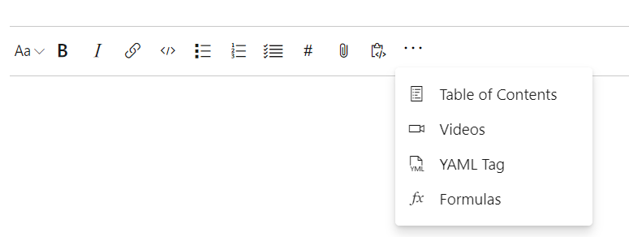

# Link GitHub commits and pull requests to Azure Boards work items - Sprint 144 Update

In the **Sprint 144 Update** of Azure DevOps, we continue to expand the integration with GitHub. Now you will be able to link GitHub commits and pull requests to Azure Boards work items. By connecting GitHub and Azure Boards, you can get rich project management capabilities with access to features like backlogs, boards, sprint planning tools and multiple work item types.

Check out the [Features](#features) list below for more.

## Features

Azure Boards:

- [Link GitHub commits and pull requests to Azure Boards work items](#link-github-commits-and-pull-requests-to-azure-boards-work-items)
- [Acquire Azure Boards as a service](#acquire-azure-boards-as-a-service)

Azure Repos:

- [Rerun expired build for auto-complete pull requests](#rerun-expired-build-for-auto-complete-pull-requests)

Azure Pipelines:

- [Manage GitHub releases using pipelines](#manage-github-releases-using-pipelines)
- [VS Code extension for YAML based pipelines](#vs-code-extension-for-yaml-based-pipelines)
- [Web editor with IntelliSense for YAML pipelines](#web-editor-with-intellisense-for-yaml-pipelines)
- [ServiceNow Change Management integration](#servicenow-change-management-integration)
- [Links to specific lines in a build log](#links-to-specific-lines-in-a-build-log)
- [Specify multi-platform pipeline in a single file](#specify-multi-platform-pipeline-in-a-single-file)
- [Automatically redeploy on failure](#automatically-redeploy-on-failure)

Azure Artifacts:

- [Python Package Index (PyPI) public preview](#pypi-public-preview)

General:

- [Service health portal](#service-health-portal)

Wiki:

- [Markdown templates for formulas and videos](#markdown-templates-for-formulas-and-videos)

Administration:

- [Restore deleted projects](#restore-deleted-projects)

## Azure Boards

### Link GitHub commits and pull requests to Azure Boards work items

Teams that use GitHub for code and want rich project management capabilities can now integrate their repositories with Azure Boards. By [connecting GitHub and Azure Boards](https://aka.ms/azureboardsgithub), you can get all of the features like backlogs, boards, sprint planning tools, multiple work item types and still have a workflow that integrates with developer workflows in GitHub.

Linking commits and pull requests to work items is easy. Mention the work item using the following syntax:​

```
AB#{work item ID}
```

Mention a work item in a commit message, pull request title, or pull request description, and Azure Boards will create a link to that artifact. For example, consider a commit message like this:​

```
Adds support for deleting connections. Fixes AB#20.
```

This will create a link from the work item #20 to the commit in GitHub, which will appear in the work item's Development section.  ​
​
> [!div class="mx-imgBorder"]


If the words "fix", "fixes", or "fixed" precede the work item mention (as shown above), the work item will be moved to the completed state when the commit is merged to the default branch.

Teams that are using Azure Pipelines to build code in GitHub will also see the work items linked to their GitHub commits in the build summary.​​

### Acquire Azure Boards as a service
Azure Boards can now be easily acquired and used as its own service. Whether your code is in Azure Repos or GitHub, you can quickly get started by going to www.azure.com/boards and clicking on **'Get started with Azure Boards'**. New users will get a project that only has Azure Boards, and an introduction to help them hit the ground running.

> [!div class="mx-imgBorder"]


## Azure Repos

### Rerun expired build for auto-complete pull requests

Azure Repos will now automatically queue expired builds that have been triggered by a pull request policy. This applies to pull requests that have passed all other policies and are set to auto-complete.
Previously, when pull requests had policies like required reviewers, the approval process could take too long and an associated build could expire before a reviewer approved the pull request. If the pull request was set to auto-complete it would remain blocked until a user manually queued the expired build. With this change the build will be queued automatically so that the pull request can auto-complete after a successful build.

> [!NOTE]
This automation will only queue up to five expired builds per pull request and will only attempt to re-queue each build once.

## Azure Pipelines

### Manage GitHub releases using pipelines

GitHub releases are a great way to package and provide software to users. We are happy to announce that you can now automate it using GitHub Release task in Azure Pipelines. Using the task you can create a new release, modify existing draft/published releases or discard older ones. It supports features like uploading multiple assets, marking a release as pre-release, saving a release as draft and many more. This task also helps you create release notes. It also can automatically compute the changes(commits and associated issues) that were made in this release and add them to the release notes in a user friendly format.

Here is the simple YAML for the task:

```yaml
task: GithubRelease@0 
displayName: 'Create GitHub Release'      
inputs:
  githubConnection: zenithworks
  repositoryName: zenithworks/pipelines-java
  assets: $(build.artifactstagingdirectory)/*.jar
```

> [!div class="mx-imgBorder"]


A sample GitHub release created using this task:

> [!div class="mx-imgBorder"]


### VS Code extension for YAML based pipelines

To speed the coding process, we added a [VS Code extension](https://marketplace.visualstudio.com/items?itemName=ms-azure-devops.azure-pipelines) for YAML pipelines. The extension supports syntax highlighting and IntelliSense (code completion) to validate that the file is structured correctly and that it uses valid keywords. In addition, it also supports built-in tasks and can validate their required input.

The extension is an [open source project on GitHub](https://github.com/Microsoft/azure-pipelines-vscode), and we welcome feedback, bug reports, and contributions from the community.

### Web editor with IntelliSense for YAML pipelines

If you use YAML to define your pipelines, you can now take advantage of the new editor features introduced with this release. Whether you are creating a new YAML pipeline or editing an existing YAML pipeline, you will be able to edit the YAML file within the pipeline web editor. Use Ctrl+Space for IntelliSense support as you edit the YAML file. You will see the syntax errors highlighted and also get help on correcting those errors.

> [!div class="mx-imgBorder"]


### ServiceNow Change Management integration

Eliminate the delays in production deployments with seamless integration with ServiceNow. Azure Pipelines in partnership with ServiceNow announce public availability of the [ServiceNow Change Management extension](https://marketplace.visualstudio.com/items?itemName=ms-vscs-rm.vss-services-servicenowchangerequestmanagement), making release pipelines aware of the change management process in ServiceNow.

Using the ServiceNow Change Management as a release gate, you can initiate a change management process in ServiceNow and hold the pipeline between two stages until the change is ready for implementation.

> [!div class="mx-imgBorder"]


You can also update the ServiceNow change request task in the deployment process, and the ServiceNow change request will be updated with the status and result of the deployment. This will give you full bi-directional integration between ServiceNow and Azure Pipelines.

> [!div class="mx-imgBorder"]


### Links to specific lines in a build log

You can now share a link to specific lines in the build log. This will help you when collaborating with other team members in diagnosing build failures. Simply select the lines of a log from the results view to get a link icon.

> [!div class="mx-imgBorder"]


### Specify multi-platform pipeline in a single file

Azure Pipelines offer hosted pools for Linux, macOS, and Windows agents. Previously, to re-use the same pipeline steps across all three hosted pools, you had to specify your steps in a separate template file. We removed that requirement to allow you to specify a multi-platform pipeline and a matrix strategy in a single file:

```yaml
strategy:
  matrix:
    win:
      vm: vs2017-win2016
    mac:
      vm: macos-10.13
    linux:
      vm: ubuntu-16.04

pool:
  vmImage: $(vm)

steps:
- script: npm install
- script: npm run test
```

### Automatically redeploy on failure

When a deployment to a stage fails, **Azure Pipelines** can now automatically redeploy the last successful deployment. You can configure the stage to automatically deploy the last successful release by configuring the **Auto-redeploy trigger** in the **Post-deployment conditions**. We plan to add additional triggered events and actions to the auto redeploy configuration in a future sprint. See the [Deployment groups](https://docs.microsoft.com/azure/devops/pipelines/release/deployment-groups/) documentation for more information.

> [!div class="mx-imgBorder"]


## Azure Artifacts

### PyPI public preview

Azure Artifacts can now host Python packages. This includes packages that you produce and upstream packages saved from the public PyPI. For more details, see the [announcement blog post](https://azure.microsoft.com/en-us/blog/python-package-pypi-support-for-azure-artifacts-now-in-preview/) and the [documentation](https://docs.microsoft.com/azure/devops/artifacts/quickstarts/python-packages?view=azure-devops&tabs=new-nav).

Now, you can host all of your NuGet, npm, Maven, Python, and Universal packages in the same feed.

> [!div class="mx-imgBorder"]


## General

### Service health portal

We added a new Azure DevOps Service Status Portal that will provide a better experience for following the health of our services. If you experience a problem with any of our services, you can check the service health [here](https://status.dev.azure.com/).

> [!div class="mx-imgBorder"]


For more details, see the [announcement blog post](https://blogs.msdn.microsoft.com/vsoservice/?p=17995) and the [documentation](https://docs.microsoft.com/azure/devops/articles/service-status-info?view=azure-devops).

## Wiki

### Markdown templates for formulas and videos

There is no longer a need to remember markdown syntax for adding [formulas](https://docs.microsoft.com/azure/devops/project/wiki/markdown-guidance?view=azure-devops#mathematical-notation-and-characters), [videos](https://docs.microsoft.com/azure/devops/project/wiki/markdown-guidance?view=azure-devops#embed-videos-in-a-wiki-page) and [YAML tags](https://docs.microsoft.com/azure/devops/release-notes/2018/aug-03-vsts#wiki) when editing a Wiki. You can now click on the context menu in the toolbar and select the option of your choice.

> [!div class="mx-imgBorder"]


## Administration

### Restore deleted projects

With this release we added the ability to restore deleted projects. As of today, users with the delete project permission can restore deleted projects via our REST APIs. To do this, create an update project request with **{ "state" : "wellFormed" }**. In a future release, we will be adding a UI that can be accessed from the organization overview page. For more information on the REST API see the documentation [here](https://docs.microsoft.com/rest/api/azure/devops/core/projects/update?view=azure-devops-rest-5.1).  

To get a list of deleted projects use the following request
```
GET https://dev.azure.com/{organization}/_apis/projects?stateFilter=deleted&api-version=5.0-preview.3
```

To restore a deleted project use the following request
```
PATCH https://dev.azure.com/{organization}/_apis/projects/{projectId}?api-version=5.0-preview.3
```

Request Body
```
{
    "state" : "wellFormed"
}
```
> [!NOTE]
> You will only have up to 28 days to restore a deleted project. After 28 days, the project will be **permanently** deleted.

## Next steps

> [!NOTE]
> These features will be rolling out over the next two to three weeks.

Read about the new features below and head over to Azure DevOps to try them for yourself.

> [!div class="nextstepaction"]
> [Go to Azure DevOps](http://go.microsoft.com/fwlink/?LinkId=307137&campaign=o~msft~docs~product-vsts~release-notes)

## Feedback

We would love to hear what you think about these features. Use the feedback menu to report a problem or provide a suggestion.

> [!div class="mx-imgBorder"]


You can also get advice and your questions answered by the community on [Stack Overflow](https://stackoverflow.com/questions/tagged/vsts).

Thanks, 

Aaron Bjork
