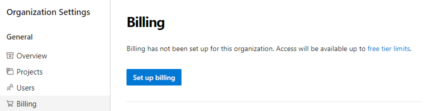

### Manage billing for your organization from Azure DevOps

We are happy to announce that you can now manage your organization's billing from the Azure DevOps portal. Administrators no longer need to set up billing via the Azure portal. To manage the billing settings, go to your **Organization Settings** and select **Billing**.

Below is a list of settings that you can manage from the **Billing** tab.

1. You can choose an Azure subscription to use for billing.

    > [!div class="mx-imgBorder"]
    > 

2. You can change the Azure subscription your organization uses for billing by selecting a different subscription. Previously, you had to remove billing and then carefully repurchase the same level for each of your paid resources (Basic users, Package Management users, MS Hosted pipelines, etc...). This process was tedious and prone to error. You can now change the Azure subscription your organization uses for billing by selecting a different subscription and clicking save.

    > [!div class="mx-imgBorder"]
    > 

3. There is no longer a need to go to the Visual Studio Marketplace to manage billing setup. We've added the ability to pay for additional Basic, Test Manager, and Package Management (Azure Artifacts) users. You can increase or decrease the count of users your organization is paying from the new **Billing** tab.

    > [!div class="mx-imgBorder"]
    > 
