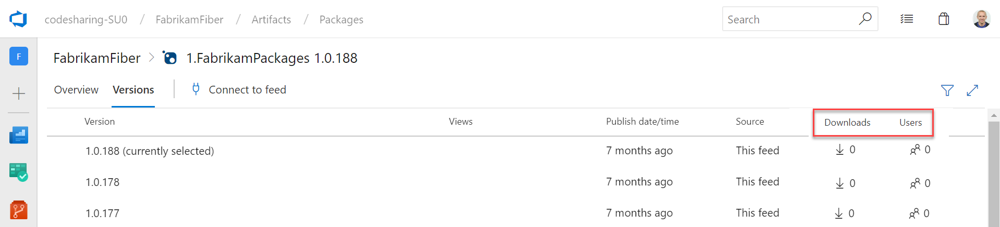

### Package usage stats

Until now, Azure Artifacts didn’t provide a way to gauge the usage or popularity of packages. With this update, we added a count of **Downloads** and **Users** to both the package list and package details pages. You can see the stats on the right side of either page.

> [!div class="mx-imgBorder"]
> 